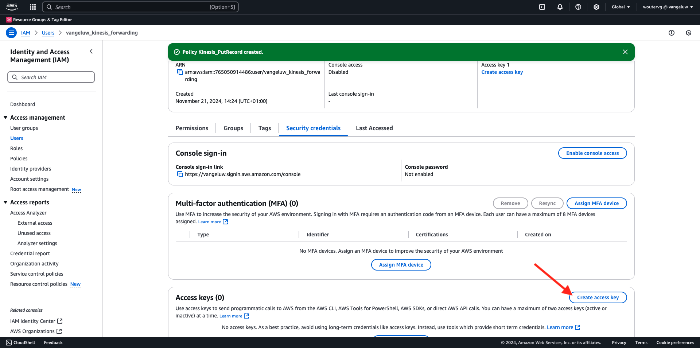

# 2.5.5 Vidarebefordra event till AWS Kinesis &amp; AWS S3

>[!IMPORTANT]
>
>Det är valfritt att slutföra övningen och det kostar inte att använda AWS Kinesis. AWS erbjuder ett kostnadsfritt nivåkonto där du kan testa och konfigurera många tjänster utan kostnad, men AWS Kinesis ingår inte i det kostnadsfria nivåkontot. För att genomföra och testa denna övning kommer det att kosta att använda AWS Kinesis.

## Bra att veta

Adobe Experience Platform har stöd för olika Amazon-tjänster som mål.
Kinesis och S3 är båda [profilexportmål](https://experienceleague.adobe.com/docs/experience-platform/destinations/destination-types.html?lang=en) och kan användas som en del av Adobe Experience Platform Real-Time CDP.
Du kan enkelt mata in värdefulla segmenthändelser och tillhörande profilattribut i valfritt system.

I den här övningen får du lära dig hur du konfigurerar en egen Amazon Kinesis-ström för att strömma händelsedata från Adobe Experience Platform Edge-ekosystemet till en molnlagringsplats, som Amazon S3. Detta är användbart om du vill samla in upplevelsehändelser från webb- och mobilsajter och överföra dem till datalagret för analys och operativ rapportering. I allmänhet importeras data batchvis med stora dagliga filimporter, men de visar inte offentliga http-slutpunkter som kan användas i samband med händelsevidarebefordran.

Stöd för ovanstående användningsfall innebär att strömmande data måste buffras eller placeras i en kö innan de skrivs till en fil. Man måste se till att inte öppna filen för skrivåtkomst i flera processer. Att delegera denna uppgift till ett dedikerat system är idealiskt för att skalas fint samtidigt som man säkerställer en hög servicenivå. Det är här Kinesis kommer till undsättningen.

Amazon Kinesis dataströmmar fokuserar på inmatning och lagring av dataströmmar. Kinesis Data Firehose fokuserar på att leverera dataströmmar till utvalda destinationer, till exempel S3-bucket.

Som en del av den här övningen..

- Utför en grundläggande konfiguration av en dataström från Kinesis
- Skapa en Firehows leveransström och använd S3-bucket som mål
- Konfigurera Amazon API-gateway som en rest API-slutpunkt för att ta emot händelsedata
- Vidarebefordra råa händelsedata från Adobe Edge till din Kinesis-ström

## Konfigurera din AWS S3-bucket

Gå till [https://console.aws.amazon.com](https://console.aws.amazon.com) och logga in med ditt Amazon-konto.

När du har loggat in omdirigeras du till **AWS Management Console**.

Sök efter **s3** på menyn **Hitta tjänster**. Klicka på det första sökresultatet: **S3 - Skalbar lagring i molnet**.

Därefter visas startsidan för **Amazon S3**. Klicka på **Skapa pyts**.

På skärmen **Skapa pyts** måste du konfigurera två saker:

- Namn: använd namnet `eventforwarding---aepUserLdap--`.

Låt alla andra standardinställningar vara som de är. Bläddra nedåt och klicka på **Skapa hink**.

Då ser du att din bucket skapas och kommer att omdirigeras till Amazon S3-hemsida.

## Konfigurera AWS Kinesis dataström

Sök efter **kines** på menyn **Hitta tjänster**. Klicka på det första sökresultatet: **Kinesis - Arbeta med data för realtidsströmning**.

Välj **Kinesis-dataströmmar**. Klicka på **Skapa dataström**.

Använd `--aepUserLdap---datastream` för **dataströmsnamnet**.

Du behöver inte ändra några andra inställningar. Bläddra nedåt och klicka på **Skapa dataström**.

Då ser du det här. När dataströmmen har skapats kan du gå vidare till nästa övning.

## Konfigurera AWS Firehose Delivery Stream

Sök efter **kines** på menyn **Hitta tjänster**. Klicka på **Kinesis Data Firehose**.

Klicka på **Skapa Firefose-ström**.

För **Source** väljer du **Amazon Kinesis-dataströmmar**. För **Mål** väljer du **Amazon S3**. Klicka på **Bläddra** för att välja dataström.

Välj dataström. Klicka på **Välj**.

Då ser du det här. Kom ihåg **Firehose-strömmens namn** som du behöver det senare.

Bläddra nedåt tills du ser **målinställningar**. Klicka på **Bläddra** för att välja S3-bucket.

Välj S3-bucket och klicka på **Välj**.

Då ser du något sådant här. Uppdatera följande inställningar:

- Ny radavgränsare: inställd på **Aktiverad**
- Dynamisk partitionering: inställd på **Inte aktiverad**

Bläddra lite till och klicka på **Skapa Firehose-ström**

Efter några minuter skapas din Firefose-ström och **Aktiv**.

## Skapa IAM-användare

Klicka på **Användare** på den vänstra AWS IAM-menyn. Sedan visas skärmen **Användare**. Klicka på **Skapa användare**.

Konfigurera sedan användaren:

- Användarnamn: använd `--aepUserLdap--_kinesis_forwarding`

Klicka på **Nästa**.

Då visas den här behörighetsskärmen. Klicka på **Koppla profiler direkt**.

Ange söktermen **kinesbrandhose** om du vill visa alla relaterade principer. Välj principen **AmazonKinesisFirehoseFullAccess**. Bläddra nedåt och klicka på **Nästa**.

Granska konfigurationen. Klicka på **Skapa användare**.

Då ser du det här. Klicka på **Visa användare**.

Klicka på **Lägg till behörigheter** och klicka på **Skapa infogad profil**.

Då ser du det här. Välj tjänsten **Kinesis**.

Gå till **Skriv** och markera kryssrutan för **PutRecord**.

Bläddra ned till **Resurser** och välj **Alla**. Klicka på **Nästa**.

Namnge din princip så här: **Kinesis_PutRecord** och klicka på **Skapa princip**.

Då ser du det här. Klicka på **Säkerhetsuppgifter**.

Klicka på **Skapa åtkomstnyckel**.

Välj **Program som körs utanför AWS**. Bläddra nedåt och klicka på **Nästa**.

Klicka på **Skapa åtkomstnyckel**

Då ser du det här. Klicka på **Visa** för att visa din hemliga åtkomstnyckel:

Din **hemliga åtkomstnyckel** visas nu.

>[!IMPORTANT]
>
>Lagra dina inloggningsuppgifter i en textfil på datorn.
>
> - Åtkomstnyckel-ID: ...
> - Hemlig åtkomstnyckel: ...
>
> När du klickar på **Klar** visas aldrig dina autentiseringsuppgifter igen!

Klicka på **Klar**.

Du har nu skapat en IAM-användare med rätt behörigheter, som du måste ange när du konfigurerar AWS-tillägget i egenskapen för händelsevidarebefordran.

## Uppdatera egenskapen för händelsevidarebefordran: Tillägg

När du har konfigurerat sekretess och dataelement kan du nu konfigurera tillägget för Google Cloud-plattformen i din händelsevidarebefordringsegenskap.

Gå till [https://experience.adobe.com/#/data-collection/](https://experience.adobe.com/#/data-collection/), gå till **Händelsevidarebefordran** och öppna egenskapen för händelsevidarebefordran.

Gå sedan till **Tillägg** och till **Katalog**. Klicka på tillägget **AWS** och klicka på **Installera**.

Ange de IAM-användarautentiseringsuppgifter som du skapade i föregående övning. Klicka på **Spara**.

Därefter måste du konfigurera en regel som börjar vidarebefordra händelsedata till Kinesis.

## Uppdatera händelsevidarebefordringsegenskapen: Regel

Gå till **Regler** på den vänstra menyn. Klicka för att öppna regeln **Alla sidor** som du skapade i någon av de tidigare övningarna.

Då ser du det här. Klicka på ikonen **+** för att lägga till en ny åtgärd.

Då ser du det här. Gör följande val:

- Välj **tillägget**: **AWS**
- Välj **åtgärdstyp**: **Skicka data till Kinesis-dataström**
- Namn: **AWS - Skicka data till Kinesis dataström**

Nu bör du se det här:

Konfigurera sedan följande:

- Strömnamn: `--aepUserLdap---datastream`
- AWS Region: kontrollera region i AWS Data Stream Setup
- Partitionsnyckel: **0**

Här ser du AWS:

Du borde ha den här nu. Klicka sedan på dataelementikonen för fältet **Data**.

Välj **XDM-händelse** och klicka på **Markera**.

Du får den här då. Klicka på **Behåll ändringar**.

Då ser du det här. Klicka på **Spara**.

Gå till **Publiceringsflöde** om du vill publicera ändringarna.
Öppna utvecklingsbiblioteket genom att klicka på **Main**.

Klicka på knappen **Lägg till alla ändrade resurser** , varefter du ser ändringarna av regeln och dataelementet visas i det här biblioteket. Klicka sedan på **Spara och bygg för utveckling**. Ändringarna distribueras nu.

Efter några minuter ser du att distributionen är klar och klar att testas.

## Testa konfigurationen

Gå till [https://dsn.adobe.com](https://dsn.adobe.com). När du har loggat in med din Adobe ID ser du det här. Klicka på de tre punkterna **..** i webbplatsprojektet och klicka sedan på **Kör** för att öppna det.

Du kommer då att se din demowebbplats öppnas. Markera URL-adressen och kopiera den till Urklipp.

Öppna ett nytt inkognito-webbläsarfönster.

Klistra in webbadressen till demowebbplatsen, som du kopierade i föregående steg. Du ombeds sedan logga in med din Adobe ID.

Välj kontotyp och slutför inloggningsprocessen.

Därefter visas webbplatsen i ett inkognitivt webbläsarfönster. För varje övning måste du använda ett nytt, inkognitivt webbläsarfönster för att läsa in webbadressen till demowebbplatsen.

Byt vy till **AWS**. Genom att öppna dataströmmen och gå in på fliken **Övervakning** ser du nu inkommande trafik.

När du sedan öppnar dataströmmen för Firefose och går till fliken **Övervakning** visas även inkommande trafik.

När du har tittat på S3-bucket kommer du nu att märka att filer skapas där som en följd av att du har lagt in data.

När du laddar ned en sådan fil och öppnar den med en textredigerare ser du att den innehåller XDM-nyttolasten från de händelser som vidarebefordrats.

>[!IMPORTANT]
>
>När konfigurationen fungerar som väntat ska du inte glömma bort att stänga av dataströmmen och datafältet i AWS Kinesis för att undvika att debiteras!

Nästa steg: [Sammanfattning och förmåner](./summary.md)

[Gå tillbaka till modul 2.5](./aep-data-collection-ssf.md)

[Gå tillbaka till Alla moduler](./../../../overview.md)

