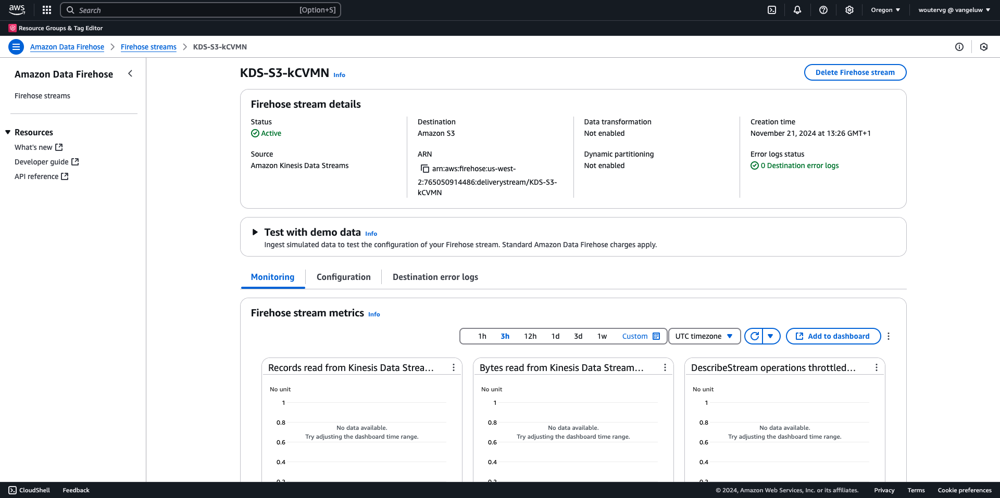
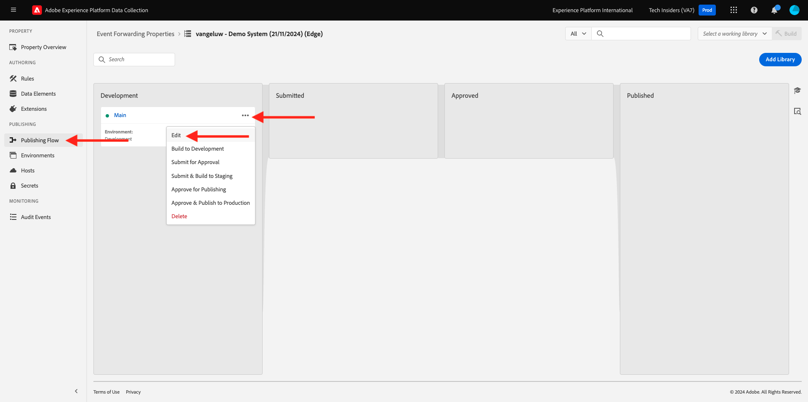
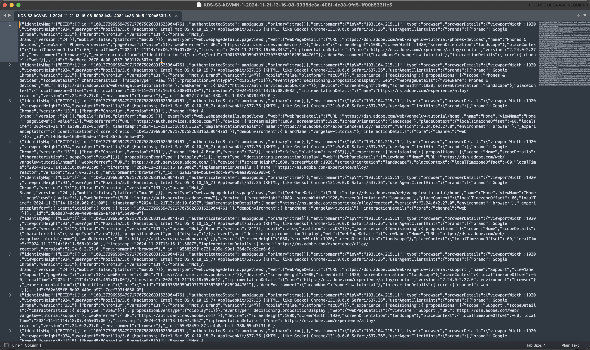

# 2.5.5 Framåtriktade evenemang mot AWS ekosystem

>[!IMPORTANT]
>
>Det är valfritt att slutföra övningen och det kostar inte att använda AWS Kinesis. AWS erbjuder ett kostnadsfritt nivåkonto där du kan testa och konfigurera många tjänster utan kostnad, men AWS Kinesis ingår inte i det kostnadsfria nivåkontot. För att genomföra och testa denna övning kommer det att kosta att använda AWS Kinesis.

## Bra att veta

Adobe Experience Platform har stöd för olika Amazon-tjänster som mål.
Kinesis och S3 är båda [profilexportmål](https://experienceleague.adobe.com/docs/experience-platform/destinations/destination-types.html?lang=en) och kan användas som en del av Adobe Experience Platform Real-Time CDP.
Du kan enkelt mata in värdefulla segmenthändelser och tillhörande profilattribut i valfritt system.

I den här artikeln får du lära dig hur du konfigurerar en egen Amazon Kinesis-ström för att strömma händelsedata från Adobe Experience Platform Edge-ekosystemet till ett molnlagringsmål, som Amazon S3. Detta är användbart om du vill samla in upplevelsehändelser från webb- och mobilsajter och överföra dem till datalagret för analys och operativ rapportering. I allmänhet importeras data batchvis med stora dagliga filimporter, men de visar inte offentliga http-slutpunkter som kan användas i samband med händelsevidarebefordran.

Stöd för ovanstående användningsfall innebär att strömmande data måste buffras eller placeras i en kö innan de skrivs till en fil. Man måste se till att inte öppna filen för skrivåtkomst i flera processer. Att delegera denna uppgift till ett dedikerat system är idealiskt för att skalas fint samtidigt som man säkerställer en hög servicenivå. Det är här Kinesis kommer till undsättningen.

Amazon Kinesis dataströmmar fokuserar på inmatning och lagring av dataströmmar. Kinesis Data Firehose fokuserar på att leverera dataströmmar till utvalda destinationer, till exempel S3-bucket.

Som en del av den här övningen..

- Utför en grundläggande konfiguration av en dataström från Kinesis
- Skapa en Firehows leveransström och använd S3-bucket som mål
- Konfigurera Amazon API-gateway som en rest API-slutpunkt för att ta emot händelsedata
- Vidarebefordra råa händelsedata från Adobe Edge till din Kinesis-ström

## 2.5.5.1 Konfigurera din AWS S3-bucket

Gå till [https://console.aws.amazon.com](https://console.aws.amazon.com) och logga in med det Amazon-konto du skapade tidigare.


När du har loggat in omdirigeras du till **AWS Management Console**.


Sök efter **s3** på menyn **Hitta tjänster**. Klicka på det första sökresultatet: **S3 - Skalbar lagring i molnet**.


Därefter visas startsidan för **Amazon S3**. Klicka på **Skapa pyts**.


På skärmen **Skapa pyts** måste du konfigurera två saker:

- Namn: använd namnet `eventforwarding---aepUserLdap--`. I den här övningen är till exempel bucket-namnet **aepmodulertcdpvangeluw**
- Regionen **EU (Frankfurt) eu-central-1**


Låt alla andra standardinställningar vara som de är. Bläddra nedåt och klicka på **Skapa hink**.


Då ser du att din bucket skapas och kommer att omdirigeras till Amazon S3-hemsida.


## 2.5.5.2 Konfigurera AWS Kinesis dataström

Sök efter **kines** på menyn **Hitta tjänster**. Klicka på det första sökresultatet: **Kinesis - Arbeta med data för realtidsströmning**.


Välj **Kinesis-dataströmmar**. Klicka på **Skapa dataström**.


Använd `--aepUserLdap---datastream` för **dataströmsnamnet**.


Du behöver inte ändra några andra inställningar. Bläddra nedåt och klicka på **Skapa dataström**.


Då ser du det här. När dataströmmen har skapats kan du gå vidare till nästa övning.


## 2.5.5.3 Konfigurera AWS Firehose Delivery Stream

Sök efter **kines** på menyn **Hitta tjänster**. Klicka på **Kinesis Data Firehose**.


Klicka på **Skapa leveransström**.


För **Source** väljer du **Amazon Kinesis-dataströmmar**. För **Mål** väljer du **Amazon S3**. Klicka på **Bläddra** för att välja dataström.


Välj dataström. Klicka på **Välj**.


Då ser du det här. Kom ihåg **leveransströmmens namn** när du behöver det senare.


Bläddra nedåt tills du ser **målinställningar**. Klicka på **Bläddra** för att välja S3-bucket.


Välj S3-bucket och klicka på **Välj**.


Då ser du något sådant här. Uppdatera följande inställningar:

- Dynamisk partitionering: inställd på **Aktiverad**
- Deaggregering av flera poster: inställd på **Inaktiverad**
- Ny radavgränsare: inställd på **Aktiverad**
- Inline parsing for JSON: set to **Enabled**


Bläddra ned en bit så ser du det här. Uppdatera följande inställningar:

- Dynamiska partitioneringsnycklar
   - Nyckelnamn: **dynamicPartitioningKey**
   - JQ-uttryck: **.dynamicPartitioningKey**
- S3-bucket-prefix: lägg till följande kod:

```bash
!{partitionKeyFromQuery:dynamicPartitioningKey}/!{timestamp:yyyy}/!{timestamp:MM}/!{timestamp:dd}/!{timestamp:HH}/}
```

- Utdataprefix för S3-bucket-fel: inställt på **error**


Rulla ned lite till och klicka sedan på **Skapa leveransström**


Efter några minuter kommer din leveransström inte att skapas och **Aktiv** kommer att aktiveras.



## 2.5.5.4 Konfigurera din AWS IAM-roll

Sök efter **iam** på menyn **Hitta tjänster**. Klicka på **API-gateway**.


Klicka på **Roller**.


Sök efter din **KinesisFirehose**-roll. Klicka för att öppna den.


Klicka på ditt namn för behörighetsprincip för att öppna det.


Klicka på **Redigera princip** på den nya skärmen som öppnas.


Under **Kinesis** - **Åtgärder** kontrollerar du att behörigheterna **Skriv** för **PutRecord** är aktiverade. Klicka på **Granska princip**.


Klicka på **Spara ändringar**.


Du kommer då tillbaka hit. Klicka på **Roller**.


Sök efter din **KinesisFirehose**-roll. Klicka för att öppna den.


Gå till **Pålitliga relationer** och klicka på **Redigera förtroendeprincip**.


Skriv över den aktuella förtroendeprincipen genom att klistra in den här koden för att ersätta den befintliga koden:

```json
{
	"Version": "2012-10-17",
	"Statement": [
		{
			"Effect": "Allow",
			"Principal": {
				"Service": [
                    "firehose.amazonaws.com",
                    "kinesis.amazonaws.com",
                    "apigateway.amazonaws.com"
                ]
			},
			"Action": "sts:AssumeRole"
		}
	]
}
```

Klicka på **Uppdatera princip**


Då ser du det här. Du måste ange **ARN** för den här rollen i nästa steg.


## 2.5.5.5 Konfigurera din AWS API Gateway

Amazon API Gateway är en AWS-tjänst som du kan använda för att skapa, publicera, underhålla, övervaka och skydda REST-, HTTP- och WebSocket-API:er i alla skalor. API-utvecklare kan skapa API:er som har åtkomst till AWS eller andra webbtjänster, samt data som lagras i AWS Cloud.

Du kommer nu att visa Kinesis dataström för Internet via en HTTPS-slutpunkt som sedan kan användas direkt av Adobes tjänster, som till exempel händelsevidarebefordran.

Sök efter **api gateway** på menyn **Hitta tjänster**. Klicka på **API-gateway**.


Då ser du något sådant här. Klicka på **Skapa API**.


Klicka på **Build** på **REST API**-kortet.


Då ser du det här. Fyll i inställningarna så här:

- Välj protokoll: välj **REST**
- Skapa nytt API: välj **Nytt API**
- Inställningar:
   - API-namn: använd `--aepUserLdap---eventforwarding`
   - Slutpunktstyp: välj **Regional**

Klicka på **Skapa API**.


Då ser du det här. Klicka på **Åtgärder** och sedan på **Skapa resurs**.


Då ser du det här. Ange **Resursnamn** till **ström**. Klicka på **Skapa resurs**.


Då ser du det här. Klicka på **Åtgärder** och sedan på **Skapa metod**.


I listrutan väljer du **POST** och klickar på knappen **v**.


Då ser du det här. Fyll i inställningarna så här:

- Integrationstyp: **AWS Service**
- AWS-region: välj den region som används av Kinesis dataström, i det här fallet: **us-west-2**
- AWS-tjänst: välj **Kinesis**
- AWS-underdomän: lämna tomt
- HTTP-metod: välj **POST**
- Åtgärdstyp: välj **Använd åtgärdsnamn**
- Åtgärd: ange **PutRecord**
- Körningsroll: klistra in **ARN** för körningsrollen som används av Kinesis Data Firehose, enligt instruktionerna i föregående övning
- Innehållshantering: välj **Genomgång**
- Använd standardtimeout: aktivera kryssrutan

Klicka på **Spara**.


Då ser du det här. Klicka på **Integreringsbegäran**.


Klicka på **HTTP-huvuden**.


Bläddra nedåt en bit och klicka på **Lägg till rubrik**.


Ange **Namn** till **Innehållstyp**, ange **Mappat från** till `'application/x-amz-json-1.1'`. Klicka på ikonen **v** för att spara ändringarna.


Då ser du det här. För **Begär brödtextgenomgång** väljer du **När det inte finns några definierade mallar (rekommenderas)**. Klicka sedan på **Lägg till mappningsmall**.


Ange **application/json** under **Content-Type**. Klicka på ikonen **v** för att spara ändringarna.


Bläddra ned för att hitta ett kodredigeringsfönster. Klistra in nedanstående kod där:

```json
{
  "StreamName": "$input.path('StreamName')",
  "Data": "$util.base64Encode($input.json('$.Data'))",
  "PartitionKey": "$input.path('$.PartitionKey')"
}
```

Klicka på **Spara**.


Bläddra sedan uppåt och klicka på **&lt;- Metodkörning** för att gå tillbaka.


Klicka på **TEST**.


Bläddra nedåt och klistra in koden under **Begär brödtext**. Klicka på **Testa**.

```json
{
  "Data": {
    "message": "Hello World",
    "dynamicPartitioningKey": "v2"
  },
  "PartitionKey": "1",
  "StreamName": "--aepUserLdap---datastream"
}
```


Då ser du ett liknande resultat:


Då ser du det här. Klicka på **Åtgärder** och sedan på **Distribuera API**.


Välj **Ny scen** för **distributionsfasen**. Ange **prod** som **scennamn**. Klicka på **Distribuera**.


Då ser du det här. Klicka på **Spara ändringar**. Obs! URL:en i bilden är den URL som ska användas för att skicka data till (i det här exemplet: https://vv1i5vwg2k.execute-api.us-west-2.amazonaws.com/prod).


Du kan testa konfigurationen med hjälp av cURL-begäran nedan. Allt du behöver göra är att ersätta nedanstående URL med din, `https://vv1i5vwg2k.execute-api.us-west-2.amazonaws.com/prod` i det här exemplet och lägga till `/stream` i slutet av URL:en.

```json
curl --location --request POST 'https://vv1i5vwg2k.execute-api.us-west-2.amazonaws.com/prod/stream' \
--header 'Content-Type: application/json' \
--data-raw '{
    "Data": {
        "userid": "--aepUserLdap--@adobe.com",
        "firstName":"--aepUserLdap--",
        "offerName":"10% off on outdoor gears",
        "offerCode": "10OFF-SPRING",
        "dynamicPartitioningKey": "campaign"
    },
    "PartitionKey": "1",
    "StreamName": "--aepUserLdap---datastream"
}'
```

Klistra in ovanstående uppdaterade kod i ett terminalfönster och tryck på Retur. Du kommer då att se det här svaret, som det svar du kunde se när du testade ovan.


## 2.5.5.6 Uppdatera egenskapen för händelsevidarebefordran

Nu kan du aktivera till dataströmmen för AWS Kinesis via AWS API Gateway, så att du kan skicka dina raw-upplevelsehändelser till AWS ekosystem. Med Real-Time CDP Connections och Event Forwarding kan du nu enkelt aktivera vidarebefordran av händelser till din nya AWS API Gateway-slutpunkt.

### 2.5.5.6.1 Uppdatera egenskapen för händelsevidarebefordran: Skapa ett dataelement

Gå till [https://experience.adobe.com/#/data-collection/](https://experience.adobe.com/#/data-collection/) och gå till **Händelsevidarebefordran**. Sök i egenskapen för vidarebefordran av händelser och klicka på den för att öppna den.


Gå till **Dataelement** på den vänstra menyn. Klicka på **Lägg till dataelement**.


Sedan visas ett nytt dataelement att konfigurera.


Gör följande val:

- Ange **awsDataObject** som **Name**.
- Som **tillägg** väljer du **kärna**.
- Som **dataelementtyp** väljer du **Egen kod**.

Du kommer nu att ha den här. Klicka på **&lt;/> Öppna redigeraren**.


Klistra in följande kod på rad 3 i Editor. Klicka på **Spara**.

```javascript
const newObj = {...arc.event.xdm, dynamicPartitioningKey: "event_forwarding"}
return JSON.stringify(newObj);
```


>[!NOTE]
>
>I ovanstående sökväg görs en referens till **arc**. **arc** står för Adobe Resource Context och **arc** står alltid för det högsta tillgängliga objektet som är tillgängligt i Server Side-kontexten. Anrikningar och omvandlingar kan läggas till i det **arc**-objektet med Adobe Experience Platform Data Collection Server-funktioner.
>
>I ovanstående sökväg görs en referens till **event**. **event** står för en unik händelse och Adobe Experience Platform Data Collection Server utvärderar alltid varje enskild händelse. Ibland kan du se en referens till **händelser** i nyttolasten som skickas av Web SDK-klientsidan, men i händelsevidarebefordran av Adobe Experience Platform datainsamling utvärderas varje händelse individuellt.

Du kommer då tillbaka hit. Klicka på **Spara** eller **Spara i bibliotek**.


### 2.5.5.6.2 Uppdatera din Adobe Experience Platform Data Collection Server-egenskap: Uppdatera din regel

Gå till **Regler** på den vänstra menyn. Klicka för att öppna regeln **Alla sidor** som du skapade i någon av de tidigare övningarna.


Då ser du det här. Klicka på ikonen **+** för att lägga till en ny åtgärd.


Då ser du det här. Gör följande val:

- Välj **tillägget**: **Adobe Cloud Connector**.
- Välj **åtgärdstyp**: **Ring upp hämtning**.

Det bör ge dig det här **namnet**: **Adobe Cloud Connector - ring hämtningssamtal**. Nu bör du se det här:


Konfigurera sedan följande:

- Ändra förfrågningsmetoden från GET till **POST**
- Ange URL:en för AWS API Gateway-slutpunkten som du skapade i ett av de föregående stegen, som ser ut så här: `https://vv1i5vwg2k.execute-api.us-west-2.amazonaws.com/prod/stream`

Du borde ha den här nu. Gå sedan till **Sidhuvuden**.


Under rubriker lägger du till en ny rubrik med nyckeln **Content-Type** och värdet **application/json**. Gå sedan till **Brödtext**.


Då ser du det här. Klistra in följande kod i fältet **Brödtext (Raw)**. Klicka på **Behåll ändringar**.

```json
{
    "Data":{{awsDataObject}},
    "PartitionKey": "1",
    "StreamName": "--aepUserLdap---datastream"
}
```


Du kommer då att se vara tillbaka här. Klicka på **Spara** eller **Spara i bibliotek**.


Du har nu konfigurerat din första regel i en händelsevidarebefordringsegenskap. Gå till **Publiceringsflöde** om du vill publicera ändringarna.
Öppna utvecklingsbiblioteket genom att klicka på **Main**.



Klicka på knappen **Lägg till alla ändrade resurser** , varefter du ser ändringarna av regeln och dataelementet visas i det här biblioteket. Klicka sedan på **Spara och bygg för utveckling**. Ändringarna distribueras nu.


Efter några minuter ser du att distributionen är klar och klar att testas.


## 2.5.5.7 Testa konfigurationen

Gå till [https://builder.adobedemo.com/projects](https://builder.adobedemo.com/projects). När du har loggat in med din Adobe ID ser du det här. Klicka på webbplatsprojektet för att öppna det.


Nu kan du följa nedanstående flöde för att komma åt webbplatsen. Klicka på **Integrationer**.


På sidan **Integrationer** måste du välja den datainsamlingsegenskap som skapades i övning 0.1.


Du kommer då att se din demowebbplats öppnas. Markera URL-adressen och kopiera den till Urklipp.


Öppna ett nytt inkognito-webbläsarfönster.


Klistra in webbadressen till demowebbplatsen, som du kopierade i föregående steg. Du ombeds sedan logga in med din Adobe ID.


Välj kontotyp och slutför inloggningsprocessen.


Därefter visas webbplatsen i ett inkognitivt webbläsarfönster. För varje demonstration måste du använda ett nytt, inkognitivt webbläsarfönster för att läsa in webbadressen till demowebbplatsen.


När du öppnar din webbläsarutvecklarvy kan du inspektera nätverksbegäranden enligt nedan. När du använder filtret **interact** visas nätverksbegäranden som skickas av Adobe Experience Platform Data Collection Client till Adobe Edge.


Om du väljer oformaterad nyttolast går du till [https://jsonformatter.org/json-pretty-print](https://jsonformatter.org/json-pretty-print) och klistrar in nyttolasten. Klicka på **Gör vacker**. Sedan ser du JSON-nyttolasten, **events** -objektet och **xdm** -objektet. I ett av de föregående stegen, när du definierade dataelementet, använde du referensen **arc.event.xdm**, vilket resulterar i att du tolkar **xdm** -objektet för den här nyttolasten.


Byt vy till **AWS**. Genom att öppna dataströmmen och gå in på fliken **Övervakning** ser du nu inkommande trafik.


När du sedan öppnar din leveransström och går till fliken **Övervakning** visas även inkommande trafik.


När du har tittat på S3-bucket kommer du nu att märka att filer skapas där som en följd av att du har lagt in data.


När du laddar ned en sådan fil och öppnar den med en textredigerare ser du att den innehåller XDM-nyttolasten från de händelser som vidarebefordrats.



Nästa steg: [Sammanfattning och förmåner](./summary.md)

[Gå tillbaka till modul 2.5](./aep-data-collection-ssf.md)

[Gå tillbaka till Alla moduler](./../../../overview.md)
