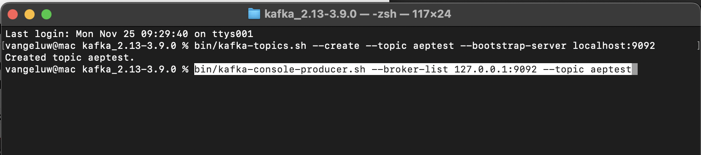

# 2.6.2 Installera och konfigurera Kafka-klustret

## Ladda ned Apache Kafka

Gå till [https://kafka.apache.org/downloads](https://kafka.apache.org/downloads) och hämta den senaste versionen. Välj den senaste binära versionen, i det här fallet **3.9.0**. Nedladdningen startar.

Skapa en mapp med namnet **Kafka_AEP** på skrivbordet och placera den hämtade filen i den katalogen.

Öppna ett **Terminal**-fönster genom att högerklicka på mappen och klicka på **Ny terminal i mappen**.

Kör det här kommandot i terminalfönstret för att dekomprimera den hämtade filen:

`tar -xvf kafka_2.13-3.9.0.tgz`

>[!NOTE]
>
>Kontrollera att ovanstående kommando matchar den version av filen som du hämtade. Om din version är nyare måste du uppdatera ovanstående kommando så att det matchar den versionen.

Då ser du det här:

När du har dekomprimerat filen har du nu en katalog som den här:

I den katalogen visas följande underkataloger:

Gå tillbaka till terminalfönstret. Ange följande kommando:

`cd kafka_2.13-3.9.0`

>[!NOTE]
>
>Kontrollera att ovanstående kommando matchar den version av filen som du hämtade. Om din version är nyare måste du uppdatera ovanstående kommando så att det matchar den versionen.

Ange sedan kommandot `bin/kafka-topics.sh`.

Du bör då se detta svar. Detta innebär att Kafka är korrekt installerat och att Java fungerar bra. (Påminnelse: du behöver Java 23 JDK installerat för att det här ska fungera! Du kan se vilken Java-version du har installerat med kommandot `java -version`.)

## Starta Kafka

För att kunna starta Kafka måste du starta Kafka Zookeeper och Kafka i den här ordningen.

Öppna ett **Terminal**-fönster genom att högerklicka på mappen **kafka_2.13-3.9.0** och klicka på **Ny terminal i mappen**.

Ange det här kommandot:

`bin/zookeeper-server-start.sh config/zookeeper.properties`

Då ser du det här:

Håll det här fönstret öppet medan du går igenom övningarna!

Öppna ett nytt **Terminal**-fönster genom att högerklicka på mappen **kafka_2.13-3.9.0** och klicka på **Ny terminal i mappen**.

Ange det här kommandot:

`bin/kafka-server-start.sh config/server.properties`

Då ser du det här:

Håll det här fönstret öppet medan du går igenom övningarna!

## Skapa ett Kafka-ämne

Öppna ett **Terminal**-fönster genom att högerklicka på mappen **kafka_2.13-3.9.0** och klicka på **Ny terminal i mappen**.

Ange det här kommandot om du vill skapa ett nytt Kafka-ämne med namnet **aeptest**. Det här avsnittet kommer att användas för testning i den här övningen.

`bin/kafka-topics.sh --create --topic aeptest --bootstrap-server localhost:9092`

Därefter visas en bekräftelse:

Ange det här kommandot om du vill skapa ett nytt Kafka-ämne med namnet **aep**. Det här avsnittet kommer att användas av Adobe Experience Platform Sink Connector som du kommer att konfigurera i nästa övningar.

`bin/kafka-topics.sh --create --topic aep --bootstrap-server localhost:9092`

En liknande bekräftelse visas:

## Skapa händelser

Gå tillbaka till terminalfönstret där du skapade ditt första Kafka-avsnitt och ange följande kommando:

`bin/kafka-console-producer.sh --broker-list 127.0.0.1:9092 --topic aeptest`

Då ser du det här. Varje ny rad som följs av att du trycker på Retur-knappen resulterar i att ett nytt meddelande skickas till ämnet **aeptest**.

Ange `Hello AEP` och tryck på Retur. Din första händelse har skickats till din lokala Kafka-instans till ämnet **aeptest**.

Ange `Hello AEP again.` och tryck på Retur.

Ange `AEP Data Collection is the best.` och tryck på Retur.

Du har nu producerat 3 händelser i ämnet **aeptest**. Dessa händelser kan nu användas av ett program som behöver dessa data.

Klicka på `Control` och `C` samtidigt på tangentbordet för att stänga din producent.

## Förbrukningshändelser

I samma terminalfönster som du använde för att skapa händelser anger du följande kommando:

`bin/kafka-console-consumer.sh --bootstrap-server 127.0.0.1:9092 --topic aeptest --from-beginning`

Du kommer då att se alla meddelanden som har producerats i föregående övning för ämnet **aeptest** visas i konsumenten. Så här fungerar Apache Kafka: en producent skapar händelser i en pipeline och en konsument konsumerar dessa händelser.

Klicka på `Control` och `C` samtidigt på tangentbordet för att stänga din producent.

I den här övningen har du gått igenom alla grunderna för att konfigurera ett lokalt Kafka-kluster, skapa ett Kafka-ämne, producera händelser och konsumera händelser.

Målet med den här modulen är att simulera vad som skulle hända om en riktig organisation redan har implementerat ett Apache Kafka-kluster och vill strömma data från sitt Kafka-kluster till Adobe Experience Platform.

För att underlätta en sådan implementering skapades en Adobe Experience Platform Sink Connector som kan implementeras med Kafka Connect. Dokumentationen för den Adobe Experience Platform Sink Connector finns här: [https://github.com/adobe/experience-platform-streaming-connect](https://github.com/adobe/experience-platform-streaming-connect).

I nästa övning kommer du att implementera allt du behöver för att använda Adobe Experience Platform Sink Connector inifrån ditt eget lokala Kafka-kluster.

Stäng terminalfönstret.

Du har gjort klart den här övningen.

Nästa steg: [2.6.3 Konfigurera HTTP API-slutpunkt i Adobe Experience Platform](./ex3.md)

[Gå tillbaka till modul 2.6](./aep-apache-kafka.md)

[Gå tillbaka till Alla moduler](../../../overview.md)
