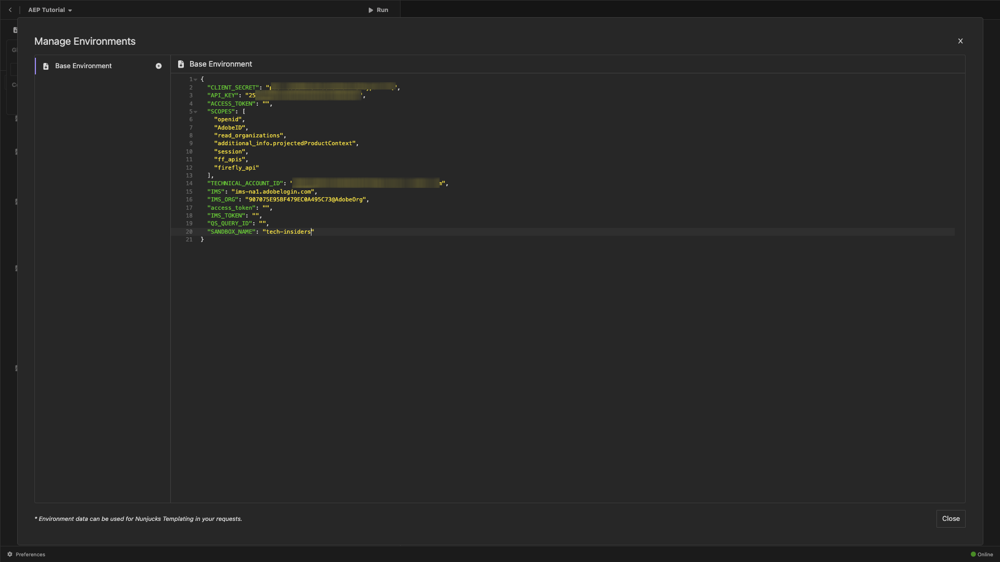

# PostBuster

>[!IMPORTANT]
>
>Instruktionerna nedan är endast avsedda för anställda i Adobe.

>[!IMPORTANT]
>
>Genom att följa instruktionerna nedan har du alla nödvändiga API-samlingar tillgängliga som kommer att användas i dessa övningar:
>
>- [2.1.3 Visa din egen kundprofil i realtid - API](./modules/rtcdp-b2c/module2.1/ex3.md)
>- [2.3.6 Destinations SDK](./modules/rtcdp-b2c/module2.3/ex6.md)
>- [3.3.6 Testa ditt beslut med API](./modules/ajo-b2c/module3.3/ex6.md)
>- [5.1.8 Query Service API](./modules/datadistiller/module5.1/ex8.md)

## Installera PostBuster

Gå till [https://adobe.service-now.com/esc?id=adb_esc_kb_article&sysparm_article=KB0020542](https://adobe.service-now.com/esc?id=adb_esc_kb_article&sysparm_article=KB0020542).

Klicka för att hämta den senaste versionen av **PostBuster**.


Hämta rätt version för ditt operativsystem.


När nedladdningen är klar och har installerats öppnar du PostBuster. Du borde se det här då. Klicka på **Importera**.


Hämta [postbuster.json.zip](./assets/postman/postbuster.json.zip) och extrahera den på skrivbordet.


Klicka på **Välj en fil**.


Välj filen **aep_tutorial.json**. Klicka på **Öppna**.


Du borde se det här då. Klicka på **Skanna**.


Klicka på **Importera**.


Du borde se det här då. Klicka för att öppna den importerade samlingen.


Nu ser du din samling. Du måste fortfarande konfigurera en miljö för vissa miljövariabler.


Klicka på **Grundmiljö** och sedan på ikonen **redigera** .


Du borde se det här då.


Kopiera miljöplatshållaren nedan och klistra in den i **basmiljön**.

```json
{
	"CLIENT_SECRET": "",
	"API_KEY": "",
	"ACCESS_TOKEN": "",
	"SCOPES": [
		"openid",
		"AdobeID",
		"read_organizations",
		"additional_info.projectedProductContext",
		"session",
		"ff_apis",
		"firefly_api"
	],
	"TECHNICAL_ACCOUNT_ID": "",
	"IMS": "ims-na1.adobelogin.com",
	"IMS_ORG": "",
	"access_token": "",
	"IMS_TOKEN": "",
	"QS_QUERY_ID": "",
	"SANDBOX_NAME": ""
}
```

Du borde ha den här då.


När du har skapat ett Adobe IO-projekt bör miljön se ut så här. Du behöver inte göra detta nu, det kommer att behandlas i ett senare skede.



>[!NOTE]
>
>{width="50px" align="left"}
>
>Om du har frågor kan du dela allmän feedback om dina förslag på framtida innehåll. Kontakta Tech Insiders direkt genom att skicka ett e-postmeddelande till **techinsiders@adobe.com**.

[Gå tillbaka till Alla moduler](./overview.md)
