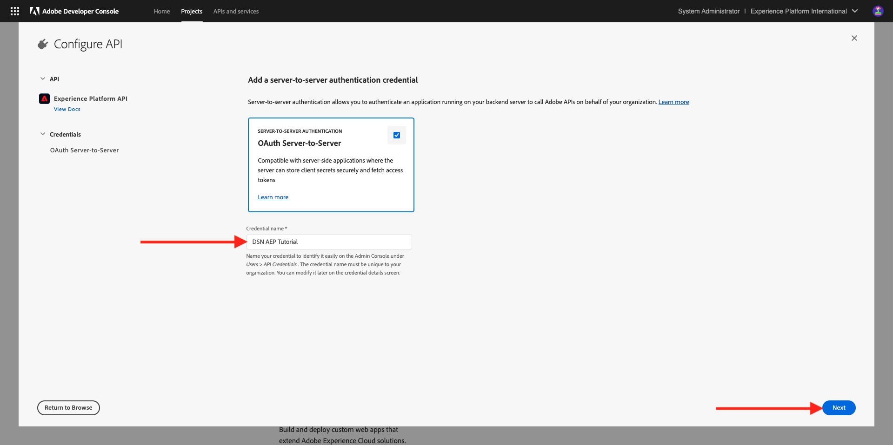
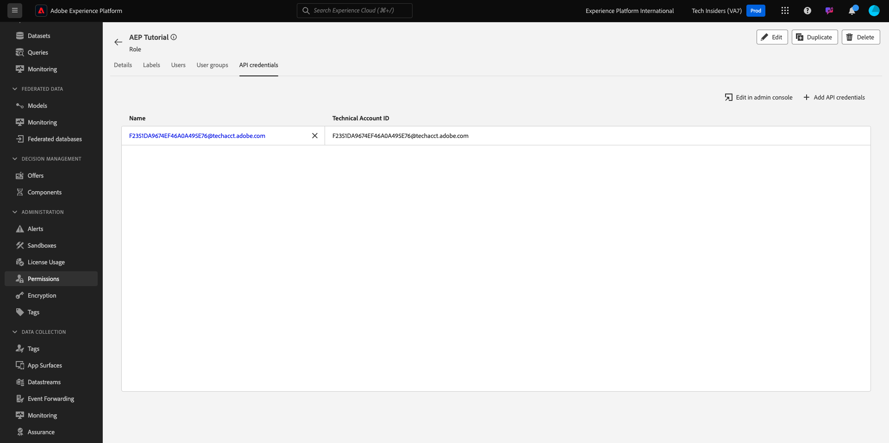

# Konfigurera din Adobe Experience Platform-instans

>[!IMPORTANT]
>
>Den här sidan är endast avsedd för systemadministratörsroller. Du behöver behörighet som systemadministratör för den specifika instansen för att kunna följa stegen nedan. Om du inte är systemadministratör i din Adobe Experience Cloud-organisation kontaktar du systemadministratören och ber om deras godkännande och hjälp innan du fortsätter med något av nedanstående steg.

## Översikt

För att kunna genomföra alla dessa självstudiekurser på ett praktiskt sätt måste följande Adobe Experience Cloud-program finnas med i din IMS-organisation:

- Adobe CDP i realtid
- Adobe Experience Platform Data Collection
- Adobe Journey Optimizer
- Customer Journey Analytics
- Data Distiller
- Federerad målgruppssammansättning

Om en specifik programtjänst inte har etablerats för din IMS-organisation kan du inte utföra den specifika övningen på ett praktiskt sätt.

## Skapa en sandlåda

Om du vill gå igenom självstudiekursen i din egen Adobe Experience Platform-instans bör du först skapa en ny utvecklingssandlåda. Om du vill skapa en ny sandlåda går du till [https://experience.adobe.com/platform](https://experience.adobe.com/platform), går till Sandlådor och sedan till **Bläddra**. Klicka på **Skapa sandlåda**.

Skapa din sandlåda så här:

- Typ: **Utveckling**
- Namn: **aep-tutorial**
- Titel: **Adobe Experience Platform självstudiekurs**

Klicka på **Skapa**.

Din sandlåda kommer nu att skapas. Efter några minuter kommer du att se det här.

## Konfigurera behörigheter

Gå till **Behörigheter** och gå sedan till **Roller**.

Klicka för att öppna den specifika **roll** som ska användas av de studerande som ska gå igenom kursen. Klicka på **Skapa roll**.

Ge din roll ett namn som **Adobe Experience Platform Tutorial**, klicka på **Bekräfta**.

I listrutan **Sandlådor** markerar du den sandlåda som du just har skapat och ser till att du tar bort alla andra sandlådor (ta även bort **Prod**).

Lägg till de olika resurserna och ange behörigheter. Se till att du inte lägger till några behörigheter för **Sandlådeadministration**.

Lägg till fler resurser enligt vad som anges och ange behörigheter.

Lägg till fler resurser enligt vad som anges och ange behörigheter. Klicka på **Spara**. Klicka sedan på **Stäng**.

## Konfigurera Adobe I/O

Gå till
[https://developer.adobe.com/console/integrations](https://developer.adobe.com/console/integrations). Kontrollera att du är i rätt instans. Klicka på **Skapa nytt projekt**.

Klicka på **Lägg till i projekt** och sedan på **API**.

Klicka på **Adobe Experience Platform** och aktivera sedan **Experience Platform API**. Klicka på **Nästa**.

Använd **DSN AEP-självstudiekurs** för **inloggningsnamnet**. Klicka på **Nästa**.

Välj en av de tillgängliga produktprofilerna. Den här produktprofilen avgör inte behörigheter för det här Adobe I/O-projektet - det görs i ett nästa steg. Klicka på **Spara konfigurerat API**.

Klicka på **Lägg till i projekt** och sedan på **API** igen.

Klicka på **Adobe Experience Platform** och aktivera sedan **Experience Platform Launch API**. Klicka på **Nästa**.

Klicka på **Nästa**.

Välj en produktprofil som gör det möjligt att skapa och hantera egenskaper för datainsamling. Klicka på **Spara konfigurerat API**.

Då ser du det här. Klicka på det aktuella **Project XXX**-namnet.

Klicka på **Redigera projekt**.

Ange en ny **projekttitel**, till exempel **DSN Adobe Experience Platform-självstudiekurs**. Klicka på **Spara**.

Ditt Adobe I/O-projekt är nu klart.

## Länka Adobe I/O-projekt till roll

Gå till **Behörigheter**, till **Roller** och klicka sedan på den nya rollen som du skapade tidigare.

Gå till **API-autentiseringsuppgifter**. Klicka på **+ Lägg till API-autentiseringsuppgifter**.

Du ser sedan de Adobe I/O-autentiseringsuppgifter som du skapade i föregående steg. Markera den och klicka på **Spara**.

Ditt Adobe I/O-projekt har nu konfigurerats med de behörigheter som krävs för att komma åt Adobe Experience Platform API:er.

>[!IMPORTANT]
>
>Du måste vänta i minst 10 minuter innan du fortsätter med nästa steg i Demo System Next.

## Konfigurera din miljö i Demo System Next

Gå till [https://dsn.adobe.com/tools/org-admin](https://dsn.adobe.com/tools/org-admin). Klicka på **+ Lägg till organisation**.

Fyll i obligatoriska fält:

- IMS-organisations-ID
- Namn
- Klient-ID (ta inte med **understreck**)
- Län

Systemadministratören bör kunna hjälpa dig med värdena för dessa fält.

Klicka på **Spara**.

Din miljö kommer nu att ingå i listan. Leta reda på den i listan och klicka på ikonen **link** .

Du måste nu ange de värden som du skapade som en del av Adobe I/O-projektets autentiseringsuppgifter. **Klient-ID**, **Klienthemlighet** och **Omfång** finns här:

**ID för tekniskt konto**:

Kopiera och klistra in dem här, klicka på **Spara**.

DSN-miljön är nu korrekt konfigurerad.

## Konfigurera din åtkomst till DSN-miljön

Gå till [https://dsn.adobe.com/tools/environment-admin](https://dsn.adobe.com/tools/environment-admin). Markera den IMS-organisation som du nyss skapade, markera användaren och klicka sedan på **+ Tilldela** under **Sandlådor**.

Ange **namnet på sandlådan** som du definierade i det första steget ovan. Det borde se ut så här:

- Namn: **aep-tutorial**

Klicka på **Bekräfta**.

Din sandlåda är nu tillgänglig för den användare du har valt.

## DSN Quick Setup

Gå till [https://dsn.adobe.com/quick-setup](https://dsn.adobe.com/quick-setup). Öppna listrutan **Miljö** och välj din IMS-organisation/sandlåda.

För **Konfiguration** väljer du **Global v2.0**.

Bläddra ned till **Bransch - Telco** och välj **Citi Signal - Avancerat**.

Bläddra uppåt och klicka på **Start**.

Ange en **titel** och klicka på **Start**.

>[!NOTE]
>
>Det kan uppstå fel om ingen standardkopplingsprofil har skapats i sandlådan. Om så är fallet kan du antingen vänta lite till så att sammanfogningsprincipen skapas automatiskt, eller manuellt gå till Adobe Experience Platform, Profiler > Sammanfogningsprinciper och skapa en ny standardsammanfogningsprincip.

Du kommer då att se förloppet för den pågående installationen, som kommer att ta några minuter.

När allt är klart är din Adobe Experience Platform-instans konfigurerad och klar att användas av eleverna.

>[!NOTE]
>
>Steget för dataimport används inte av självstudiekursen, så om det steget misslyckas behöver du inte bekymra dig. Fortsätt sedan.

Gå till [https://experience.adobe.com/platform](https://experience.adobe.com/platform), till **Datauppsättningar**. Nu bör du se en liknande lista med datauppsättningar, som alla skapades av snabbinstallationsprogrammet för DSN.

>[!NOTE]
>
>Tack för att du lägger ned din tid på att lära dig allt om Adobe Experience Platform och dess program. Om du har frågor kan du dela allmän feedback om dina förslag på framtida innehåll. Kontakta Tech Insiders direkt genom att skicka ett e-postmeddelande till **techinsiders@adobe.com**.

[Gå tillbaka till Alla moduler](./overview.md)
