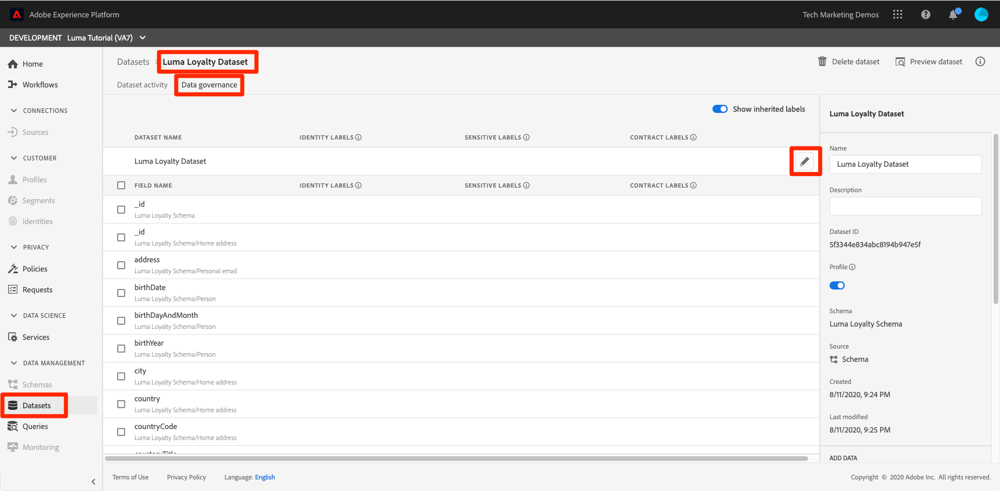

# Använd ramverket för datastyrning

<!--15min-->

I den här lektionen kommer du att använda ramverket för datastyrning på data som du har inhämtat till din sandlåda.

Med Adobe Experience Platform Data Governance kan ni hantera kunddata och säkerställa att ni följer regler, begränsningar och policyer som gäller för dataanvändning. Det spelar en viktig roll inom Experience Platform på olika nivåer, bland annat när det gäller att kontrollera användningen av data.

Titta på följande korta videor om datastyrning innan du börjar övningarna:
>[!VIDEO](https://video.tv.adobe.com/v/36653?quality=12&learn=on)

>[!VIDEO](https://video.tv.adobe.com/v/29708?quality=12&learn=on)

<!--
## Permissions required

In the [Configure Permissions](configure-permissions.md) lesson, you set up all the access controls required to complete this lesson, specifically:

* Permission items **[!UICONTROL Data Governance]** > **[!UICONTROL Manage Usage Labels]**, **[!UICONTROL Manage Data Usage Policies]** and **[!UICONTROL View Data Usage Policies]**
* Permission items **[!UICONTROL Data Management]** > **[!UICONTROL View Datasets]** and **[!UICONTROL Manage Datasets]**
* Permission item **[!UICONTROL Sandboxes]** > `Luma Tutorial`
* User-role access to the `Luma Tutorial Platform` Product Profile
-->

## Affärsscenario

Luma lovar medlemmarna i deras lojalitetsprogram att lojalitetsdata inte delas med tredje part. Vi kommer att implementera det här scenariot i resten av lektionen.

## Använd etiketter för datastyrning

Det första steget i datastyrningsprocessen är att använda styrningsetiketter på dina data. Innan vi gör det ska vi ta en snabb titt på vilka etiketter som är tillgängliga:

1. Välj **[!UICONTROL Profiler]** i den vänstra navigeringen
1. Gå till **[!UICONTROL Etiketter]** om du vill visa alla etiketter i kontot.

Det finns många färdiga etiketter, och du kan skapa egna via [!UICONTROL Skapa etikett] -knappen. Det finns tre huvudtyper: [!UICONTROL Kontraktsetiketter], [!UICONTROL Identitetsetiketter]och [!UICONTROL Känsliga etiketter] som motsvarar vanliga orsaker kan data begränsas. Var och en av etiketterna har en [!UICONTROL Eget namn] och en kort [!UICONTROL Namn] som bara är en förkortning av typen och en siffra. Till exempel [!DNL C1] label is for &quot;No third-party export&quot;, which is what we need for our Loyalty policy.

Nu är det dags att märka de data vars användning vi vill begränsa:

1. Välj **[!UICONTROL Datauppsättningar]** i den vänstra navigeringen
1. Öppna `Luma Loyalty Dataset`
1. Gå till **[!UICONTROL Datastyrning]** tab
1. Du kan antingen använda etiketter på enskilda fält eller använda dem på hela datauppsättningen. Vi kommer att tillämpa etiketten på hela datauppsättningen. Klicka på pennikonen. Om du inte ser ikonen kan du göra webbläsaren bredare eller rulla den mellersta panelen åt höger.
   
1. Utöka **[!UICONTROL Kontraktsetiketter]** -avsnittet och kontrollera **[!UICONTROL C2]** label
1. Välj **[!UICONTROL Spara ändringar]** knapp
   
1. Återgår till huvudsidan [!UICONTROL Datastyrning] skärm, med **[!UICONTROL Visa ärvda etiketter]** om du vill aktivera kan du se hur etiketten har tillämpats på alla fält i datauppsättningen.
   

<!--adding extra, unnecessary fields from field groups makes it harder to see which fields really need labels-->
<!--Are there any best practices for applying governance labels-->

## Skapa datastyrningspolicyer

Nu när våra data är märkta kan vi skapa en politik.

1. Välj **[!UICONTROL Profiler]** i den vänstra navigeringen
1. På fliken Bläddra finns det redan en användningsprincip som heter &quot;Export restriction&quot; från tredje part som kopplar C2-etiketten till marknadsföringsåtgärden [!UICONTROL Exportera till tredje part]- exakt vad vi behöver!
1. Välj profilen och aktivera den sedan via **[!UICONTROL Policystatus]** växla
   

Du kan skapa egna profiler genom att välja **[!UICONTROL Skapa princip]** -knappen. Då öppnas en guide där du kan kombinera flera etiketter och begränsningar för marknadsföringsåtgärder.

## Stärk styrningspolicyer

Verkställandet av styrningspolitik är uppenbarligen en viktig del av ramverket. Tvingande åtgärder utförs längre fram i kedjan när data aktiveras och skickas från Platform, särskilt med Real-time Customer Data Platform, som du kanske inte har någon licens för. Vilket som. Det ligger utanför kursens räckvidd. Men så att du inte blir kvar kan du lära dig mer om hur policyer tillämpas i den här videon, som jag har ställt i kö upp till den relevanta delen. Den visar också vad som händer när en policy överträds.

>[!VIDEO](https://video.tv.adobe.com/v/33631/?t=151&quality=12&learn=on)

## Ytterligare resurser

* [Dokumentation för datastyrning](https://experienceleague.adobe.com/docs/experience-platform/data-governance/home.html)
* [API-referens för datauppsättningstjänst](https://www.adobe.io/experience-platform-apis/references/dataset-service/)
* [API-referens för principtjänst för styrning](https://www.adobe.io/experience-platform-apis/references/policy-service/)

Nu går vi vidare till [frågetjänst](run-queries.md).
