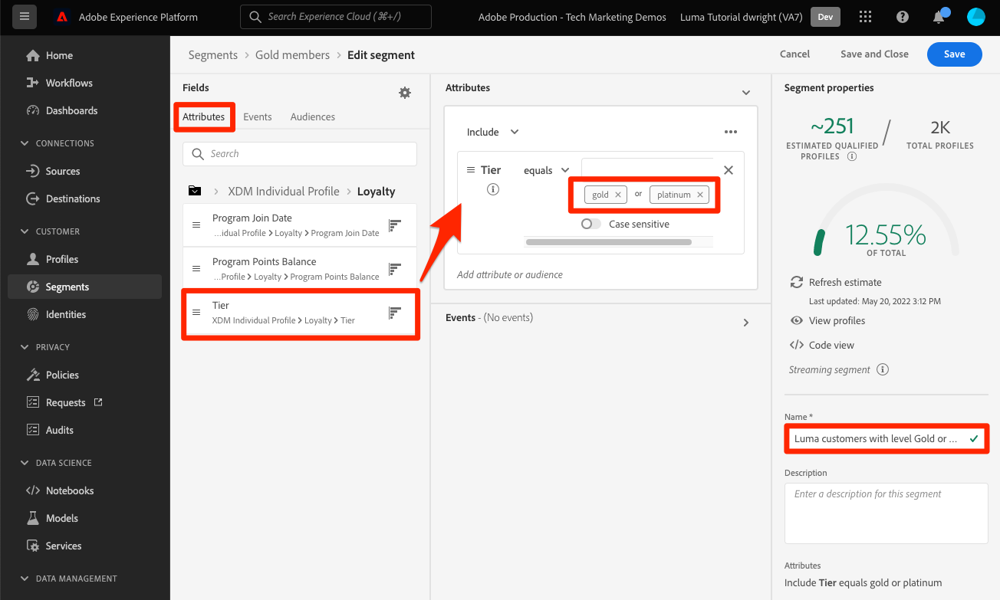
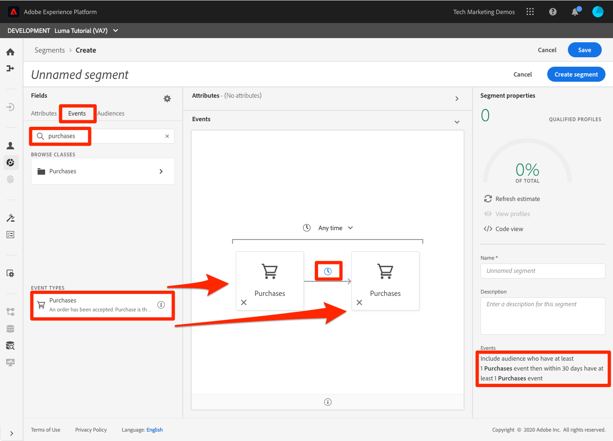
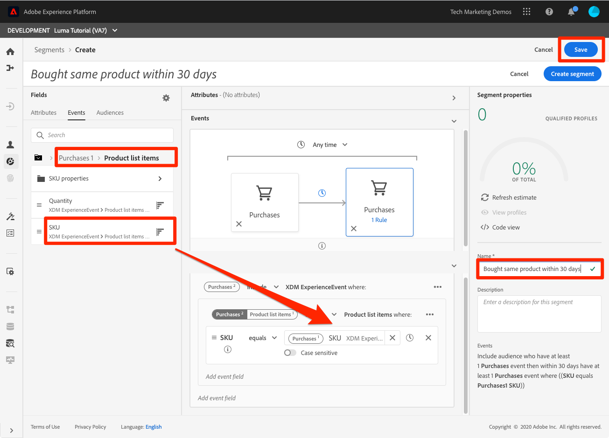

# Skapa segment

<!-- 30 min-->
I den här lektionen ska vi skapa några segment baserat på profildata som vi har inhämtat i tidigare lektioner.

När ni har kundprofiler i realtid kan ni skapa segment för individer som delar liknande egenskaper och som kan svara på liknande sätt som marknadsföringsstrategier. Byggstenarna för dessa segment är XDM-fälten som du skapade tidigare.

**Dataarkitekturer** måste skapa segment utanför den här självstudiekursen och ge sina kollegor stöd för den här uppgiften.

Innan du börjar övningarna ska du titta på den här korta videon och lära dig mer om hur du skapar segment:
>[!VIDEO](https://video.tv.adobe.com/v/27254?quality=12&learn=on)

## Behörigheter krävs

I [Konfigurera behörigheter](configure-permissions.md) I lektionen ställer du in alla åtkomstkontroller som krävs för att slutföra lektionen, närmare bestämt:

* Behörighetsobjekt **[!UICONTROL Profilhantering]** > **[!UICONTROL Hantera segment]**, **[!UICONTROL Visa segment]** och **[!UICONTROL Exportera målgruppssegment]**
* Behörighetsobjekt **[!UICONTROL Profilhantering]** > **[!UICONTROL Visa profiler]** och **[!UICONTROL Hantera profiler]**
* Behörighetsobjekt **[!UICONTROL Sandlådor]** > `Luma Tutorial`
* Användarrollåtkomst till `Luma Tutorial Platform` produktprofil
* Tillgång till `Luma Tutorial Platform` produktprofil (för API)

## Bygg ett enkelt segment

Låt oss skapa ett enkelt segment för lojalitetsprogram för kunder med Guld- eller Platinumstatus

1. Gå till **[!UICONTROL Segment]** i den vänstra navigeringen
1. Välj **[!UICONTROL Skapa segment]** knapp
1. Till vänster om schemaverktaren finns tre flikar för Attribut (postdata), Händelser (tidsseriedata) och Publiker
1. Markera kugghjulsikonen om du vill se hur segmentbyggaren som standard bara visar fält med data och låter dig ändra kopplingsprofilen
1. Gå till fliken Attribut **XDM Individuell profil > Lojalitet** (du kan också söka efter &quot;lojalitet&quot;)
1. Dra och släpp `Tier` från attributfältsmenyn till segmentbyggarbetsytan
1. Välj `Tier` är lika med `Gold` eller `Platinum`
1. Välj **[!UICONTROL Uppdatera uppskattning]** för att se hur många profiler som är kvalificerade för ert segment
1. Som **[!UICONTROL Namn]**, ange `Luma customers with level Gold or Above`
1. Välj **[!UICONTROL Spara]**
   

<!--## Build a sequential segment-->

## Bygg ett dynamiskt segment

I den här övningen kommer vi att skapa ett segment för kunder som har köpt samma produkt två gånger inom 30 dagar. Med dynamiska segment kan du skala segmenteringen genom att använda fält som variabler.

1. Gå till **[!UICONTROL Segment]** i den vänstra navigeringen
1. Välj **[!UICONTROL Skapa segment]** knapp
1. Välj **[!UICONTROL Händelser]** tab
1. Filtrera listan till `purchases`
1. Dra **[!UICONTROL Inköp]** händelsetyp på arbetsytan _två gånger_
1. Markera klockikonen mellan de två **[!UICONTROL Inköp]** och välj&quot;inom 30 dagar&quot;
1. Bekräfta att segmentdefinitionen nu är läsbar **&quot;Inkludera målgrupper som har minst en Inköpshändelse och som inom 30 dagar har minst en Inköpshändelse&quot;**

   
1. Ändra nu händelsefiltret till `sku`
1. Dra SKU-fältet till den andra köphändelsen
   
1. Rensa händelsefiltret
1. Du bör se i **[!UICONTROL Bläddra bland variabler]** finns det mappar för de två inköpshändelserna. Klicka för att utforska **[!UICONTROL Inköp 1]**\
   
1. Gå ned i **[!UICONTROL Produktlistartiklar]** väljer du **[!UICONTROL SKU]** och dra den till höger om **[!UICONTROL är lika med]** operand. När du hovrar över området släpper du det i avsnittet&quot;Lägg till för att jämföra operander&quot;
1. Namnge ditt segment `Bought same product within 30 days`
1. Bekräfta att målgruppsdefinitionen är **&quot;Inkludera målgrupper som har minst en Inköpshändelse och inom 30 dagar har minst en Inköpshändelse där ((SKU motsvarar Inköp1 SKU))&quot;**
1. Välj **[!UICONTROL Spara]** knapp

   

## Skapa ett segment med flera enheter

Kom ihåg hur vi skapade relationen mellan `Luma Offline Purchase Events Schema` och `Luma Product Catalog Schema` i tidigare lektioner? Vi gjorde det så att vi kunde använda relationen i vårt schema med segmentering av flera enheter.

Med den avancerade segmenteringsfunktionen för flera enheter kan du skapa segment med hjälp av flera XDM-klasser för att utöka dina scheman. Det innebär att segmentbyggaren kan komma åt ytterligare fält som om de vore inbyggda i profildatalagret

Du skapar nästa segment genom att använda relationen som du skapade mellan `Luma Product Catalog Schema` och `Luma Offline Purchase Events Schema`.

1. Gå till **[!UICONTROL Segment]** i den vänstra navigeringen
1. Välj **[!UICONTROL Skapa segment]** knapp
1. Välj **[!UICONTROL Händelser]** tab
1. Filtrera listan till `purchases`
1. Dra **[!UICONTROL Inköp]** händelsetyp på arbetsytan
1. Markera listrutan ovanför händelsen och välj **[!UICONTROL de senaste 30 dagarna]**
1. Filtrera **[!UICONTROL Händelser]** lista till `category` och sedan dra **[!UICONTROL Produktkategori]** fält till **[!UICONTROL Inköp]**
1. Ändra operatorn till **[!UICONTROL börjar med]** och ange `men` i textrutan
1. Som **[!UICONTROL Namn]**, ange `Purchased a Men's product in the last 30 days`
1. Bekräfta målgruppsdefinitionen `(Include audience who have at least 1 Purchases event where ((Product Category starts with men)) ) and occurs in last 30 day(s)`
1. Välj **[!UICONTROL Spara]** knapp

   

## Segmentering av grupper och strömning

Klicka på **[!UICONTROL Segment]** i den vänstra navigeringen och vi ska titta närmare på våra tre segment:

* Två av våra segment är gruppsegment och ett är ett direktuppspelningssegment.
* Som standard används direktuppspelningssegmentering när det är möjligt, vilket kvalificerar kunden för ett segment så fort de uppfyller kriterierna. När segmentdefinitioner är för komplexa för direktuppspelning, konverteras de automatiskt till batch. I det här fallet valde de två segmenten att gruppera eftersom kontrollfönstret för köphändelserna var större än sju dagar. En fullständig och aktuell lista över begränsningar för direktuppspelning finns på [dokumentationen](https://experienceleague.adobe.com/docs/experience-platform/segmentation/ui/streaming-segmentation.html).
* Batchjobben körs enligt ett dagligt schema som kan stängas av.

## Ytterligare resurser

* [Dokumentation för segmenteringstjänst](https://experienceleague.adobe.com/docs/experience-platform/segmentation/home.html)
* [API-referens för segmenteringstjänst](https://www.adobe.io/experience-platform-apis/references/segmentation/)

Det finns mer att segmentera, särskilt när det gäller att aktivera segment. Dessa ämnen kommer att behandlas i en annan självstudiekurs.

Du har klarat alla övningar! Fortsätt till [slutsats](conclusion.md).
