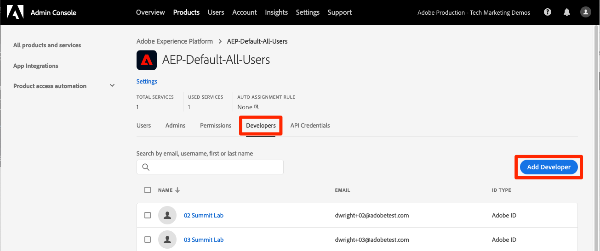

# Konfigurera behörigheter

<!--30min-->

I den här lektionen ska du konfigurera Adobe Experience Platform användarbehörigheter med [!DNL Adobe's Admin Console] och skärmen [!UICONTROL Permissions] i plattformsgränssnittet.

Åtkomstkontroll är en viktig sekretessfunktion i Experience Platform och vi rekommenderar att behörigheter begränsas till det minimum som krävs för att människor ska kunna utföra sina arbetsuppgifter. Mer information finns i [Åtkomstkontrolldokumentationen](https://experienceleague.adobe.com/docs/experience-platform/access-control/home.html?lang=sv-SE).

Dataarkitekter och datatekniker är kraftfulla användare av Adobe Experience Platform och du behöver många behörigheter för att kunna slutföra den här självstudiekursen och senare i ditt dagliga arbete. Dataarkitekter är troligen involverade i administrationen av *andra plattformsanvändare* på deras företag, till exempel marknadsförare, analytiker och datavetare. När du är klar med den här lektionen bör du tänka på hur du kan använda de här funktionerna för att hantera andra användare på ditt företag.

**Dataarkitekturer** konfigurerar ofta behörigheter för andra användare utanför den här självstudiekursen.

>[!IMPORTANT]
>
>En systemadministratör för Adobe Experience Cloud-produkter måste slutföra några av stegen i den här lektionen, som beskrivs i avsnittsrubrikerna. Om du inte är systemadministratör kontaktar du en på ditt företag och ber dem att slutföra dessa uppgifter. Det finns också en uppgift som de måste slutföra under lektionen [Konfigurera Developer Console och Postman](set-up-developer-console-and-postman.md).

## Om Admin Console

[!DNL Admin Console] är gränssnittet som används för att administrera användaråtkomst till alla Adobe Experience Cloud-produkter. För att få tillgång till Platform måste en användare eller användare läggas till i Admin Console och sedan hanteras alla deras detaljerade behörighetsobjekt på behörighetsskärmen i Adobe Experience Platform.

Här följer en snabb sammanfattning av rollerna som finns för Platform:

* **Användare** av en produktprofil kan slutföra uppgifter i plattformens användargränssnitt enligt de behörigheter som tilldelats i produktprofilen.
* **Utvecklare** kan skapa API-autentiseringsuppgifter och projekt i Adobe Developer Console för att kunna börja använda Experience Platform API
* **Produktadministratörer** kan lägga till användare och utvecklare i Adobe Experience Platform-produkten i Adobe Admin Console samt hantera detaljerad användaråtkomst på skärmen Behörigheter i plattformsgränssnittet.
* **Systemadministratörer** kan lägga till produktadministratörer och administrera i stort sett alla behörigheter för alla Adobe Experience Cloud-produkter.

## Lägg till en användare och utvecklare i produktprofilen `AEP-Default-All-Users` (kräver en systemadministratör eller produktadministratör)

I den här övningen kommer du eller en systemadministratör eller produktadministratör att lägga till dig som användare och utvecklare i Adobe Experience Platform-produkten av Adobe Admin Console.

>[!NOTE]
>
>Om du är systemadministratör och hjälper en kollega att ta den här självstudiekursen kan du lägga till din kollega som *produktadministratör* för Adobe Experience Platform. Som produktadministratör kan de slutföra dessa steg på egen hand och administrera andra Experience Platform-användare i framtiden.

Så här lägger du till den självstudiekursdeltagare som en [!UICONTROL User] och [!UICONTROL Developer]:

1. Logga in på [Adobe Admin Console](https://adminconsole.adobe.com)
1. Välj **[!UICONTROL Products]** i den övre navigeringen
1. Välj **Adobe Experience Platform**
   
1. Du kan ha flera profiler i din Experience Platform-instans redan. Välj profilen `AEP-Default-All-Users`
   

1. Gå till fliken **[!UICONTROL Users]**
1. Markera knappen **[!UICONTROL Add User]**
   
1. Slutför arbetsflödet för att lägga till självstudiekursens deltagare som en användare i produktprofilen

1. Gå till fliken **[!UICONTROL Developers]**
1. Markera knappen **[!UICONTROL Add Developer]**
   
1. Slutför arbetsflödet för att lägga till självstudiekursens deltagare som utvecklare i produktprofilen

## Lägg till en roll i Adobe Experience Platform (kräver en systemadministratör eller produktadministratör)

Detaljerade behörigheter för Experience Platform hanteras på Behörighetsskärmen i plattformsgränssnittet. Endast system- och produktadministratörer har åtkomst till den här skärmen, så om du inte har administratörsbehörighet behöver du hjälp av någon som har det.

Behörigheter hanteras i roller. Skapa en roll för kursen:

1. Logga in på [Adobe Experience Platform](https://platform.adobe.com)
1. Välj **[!UICONTROL Permissions]** i den vänstra navigeringen som tar dig till skärmen [!UICONTROL Roles]
1. Välj **[!UICONTROL Create role]**

   
1. Namnge rollen `Luma Tutorial Platform` (lägg till namnet på den självstudiekursens deltagare i slutet, om flera personer från ditt företag använder den här självstudiekursen) och välj **[!UICONTROL Confirm]**

   

1. Lägg till alla behörighetsobjekt för följande resurser med **[!UICONTROL +]** och **[!UICONTROL Add all]**:

   1. Datamodellering
   1. Datahantering
   1. Profilhantering
   1. Identity Management
   1. Sandlådeadministration
   1. Frågetjänst
   1. Datainsamling
   1. Datastyrning
   1. Kontrollpaneler
   1. Larm

      

1. Lägg till behörighetsobjekten Hantera källor och Visa källor under Datainmatning.

1. När du har lagt till alla behörighetsobjekt måste du välja knappen Spara
   

Efter lektionerna [Skapa en sandlåda](create-a-sandbox.md) och [Konfigurera Developer Console och Postman](set-up-developer-console-and-postman.md) kommer du att göra några små uppdateringar av den här rollen.

## Skapa en produktprofil för datainsamling (kräver en systemadministratör eller produktadministratör)

I den här övningen skapar du eller en systemadministratör på ditt företag en produktprofil för datainsamling (tidigare Adobe Experience Platform Launch) och lägger till dig som produktprofiladministratör.

>[!NOTE]
>
>Om du är systemadministratör och hjälper en kollega med den här självstudiekursen kan du lägga till dem som *produktadministratör* för datainsamling. Som produktadministratör kan de slutföra dessa steg på egen hand och administrera andra användare av datainsamling i framtiden.

Så här skapar du produktprofilen:

1. I [!DNL Adobe Admin Console] går du till Adobe Experience Platform Data Collection-produkten
1. Lägg till en ny profil med namnet `Luma Tutorial Data Collection` (lägg till namnet på den person som deltar i självstudiekursen om flera personer från ditt företag använder den här självstudiekursen)
1. Inaktivera inställningen **[!UICONTROL Properties]** > **[!UICONTROL Auto-include]**
1. Tilldela inga egenskaper eller behörigheter just nu
1. Lägg till självstudiekursens deltagare som administratör för den här profilen

När du har slutfört de här stegen bör du se att profilen `Luma Tutorial Data Collection` har konfigurerats med en administratör.

## Konfigurera produktprofilen för datainsamling

Nu när du är administratör för produktprofilen `Luma Tutorial Data Collection` kan du konfigurera de behörigheter och roller du behöver för att slutföra självstudiekursen.

### Lägg till behörigheter

Nu ska du lägga till de enskilda behörighetsobjekten i profilen:

1. I [Adobe Admin Console](https://adminconsole.adobe.com) går du till **[!UICONTROL Products]** > **[!UICONTROL Data Collection]**
1. Öppna profilen `Luma Tutorial Data Collection`
1. Gå till fliken **[!UICONTROL Permissions]**
1. Öppna **[!UICONTROL Platforms]**
1. Se till att alla tillgängliga plattformar är markerade (du kan se olika alternativ beroende på din licens)
1. **[!UICONTROL Save]** ändringar
   
1. Öppna **[!UICONTROL Properties]**
1. Kontrollera att växlingsknappen **[!UICONTROL Auto-Include]** är Av så att du inte har tillgång till några egenskaper (vi lägger till en senare)
1. **[!UICONTROL Save]** ändringar
   
1. Öppna **[!UICONTROL Property Rights]**
1. Välj **[!UICONTROL Add all]** om du vill lägga till alla egenskapsbehörigheter
1. **[!UICONTROL Save]**
   
1. Öppna **[!UICONTROL Company Rights]**
1. Lägg till **[!UICONTROL Manage Properties]**
1. Välj **[!UICONTROL Save]**
   

### Lägg till dig själv som användare

Lägg till dig själv som användare i datainsamlingsprofilen:

1. Gå till fliken **[!UICONTROL Users]**
1. Markera knappen **[!UICONTROL Add User]**
   
1. Slutför arbetsflödet för att lägga till dig själv som användare i produktprofilen

Du behöver inte lägga till dig själv som utvecklare för datainsamling.

Nu har du nästan alla behörigheter som krävs för att slutföra självstudiekursen! Det kommer bara att finnas ytterligare två förbättringar som du gör i [!DNL Adobe Admin Console], inklusive en efter att du [har skapat en sandlåda](create-a-sandbox.md)!!
