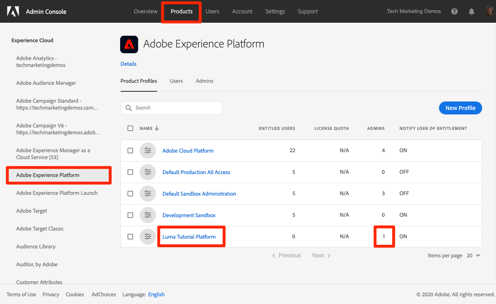

# Konfigurera behörigheter

<!--30min-->

I den här lektionen ska du konfigurera Adobe Experience Platform användarbehörigheter med [!DNL Adobe's Admin Console].

Åtkomstkontroll är en viktig sekretessfunktion i Experience Platform och vi rekommenderar att behörigheter begränsas till det minimum som krävs för att människor ska kunna utföra sina arbetsuppgifter. Se [Åtkomstkontrolldokumentation](https://experienceleague.adobe.com/docs/experience-platform/access-control/home.html) för mer information.

Dataarkitekter och datatekniker är kraftfulla användare av Adobe Experience Platform och du behöver många behörigheter för att kunna slutföra den här självstudiekursen och senare i ditt dagliga arbete. Dataarkitekter är sannolikt involverade i administrationen av *andra plattformsanvändare* på deras företag som marknadsförare, analytiker och datavetare. När du är klar med den här lektionen bör du tänka på hur du kan använda de här funktionerna för att hantera andra användare på ditt företag.

**Dataarkitekturer** konfigurerar ofta behörigheter för andra användare utanför den här självstudiekursen.

>[!IMPORTANT]
>
>En systemadministratör för Adobe Experience Cloud-produkter måste slutföra några av stegen i den här lektionen, som beskrivs i avsnittsrubrikerna. Om du inte är systemadministratör kontaktar du en på ditt företag och ber dem att slutföra dessa uppgifter.

## Om Admin Console

The [!DNL Admin Console] är gränssnittet som används för att administrera användaråtkomst till alla Adobe Experience Cloud-produkter. Se [Adobe Admin Console-dokumentation](https://helpx.adobe.com/se/enterprise/using/admin-console.html) för mer detaljerad information. Här är några nycklar [!DNL Admin Console] begrepp:

* A **produktprofil** är en kombination av behörigheter, roller och sandlådemiljöer som är kopplade till en viss Adobe-produkt. Du kan skapa flera produktprofiler för en enstaka Adobe-produkt. En&quot;marknadsförarprofil&quot; kan till exempel begränsa behörigheterna till vad en typisk marknadsförare behöver för att utföra nyckeluppgifter i produktionsplattformsmiljön, medan en&quot;dataarkitekturprofil&quot; kan användas för att ge olika behörigheter i flera plattformsmiljöer. I den här lektionen ska du skapa en&quot;Luma Tutorial&quot;-produktprofil med alla behörigheter som en dataarkitekt och datatekniker behöver för att slutföra den här självstudiekursen i en sandlådemiljö.
* An **integration** är en anslutning till en *projekt* i Adobe Developer Console. Adobe Developer Console är hjärtat i autentiseringen och konfigurationen av Adobe API:er. Du konfigurerar en integrering i Developer Console och [!DNL Postman] lektion.

Här följer en snabb sammanfattning av rollerna som finns för Platform:

* **Användare** för en produktprofil kan slutföra åtgärder i plattformens användargränssnitt enligt de behörigheter som tilldelats i produktprofilen.
* **Utvecklare** för en produktprofil kan slutföra åtgärder med hjälp av plattformens API enligt behörigheterna i produktprofilen.
* **Produktprofiladministratörer** kan redigera *den specifika profilen* behörigheter och lägg till användare, utvecklare och ytterligare profiladministratörer.
* **Produktadministratörer** kan administrera *alla produktprofiler* för Platform och lägg till nya produktprofiler.
* **Systemadministratörer** kan lägga till produktadministratörer och administrera i stort sett alla behörigheter för alla Adobe Experience Cloud-produkter.

## Skapa en produktprofil för Experience Platform (kräver en systemadministratör eller produktadministratör)

I den här övningen skapar du eller en systemadministratör på ditt företag en produktprofil för Adobe Experience Platform och lägger till dig som administratör för produktprofilen.

>[!NOTE]
>
>Om du är systemadministratör och hjälper en kollega att ta den här självstudiekursen bör du överväga att lägga till din kollega som systemadministratör *Produktadministratör* för Adobe Experience Platform. Som produktadministratör kan de slutföra dessa steg på egen hand och administrera andra Experience Platform-användare i framtiden.

Så här skapar du produktprofilen:

1. Logga in på [Adobe Admin Console](https://adminconsole.adobe.com)
1. Välj **[!UICONTROL Produkter]** i den övre navigeringen
1. Välj **[!UICONTROL Adobe Experience Platform]** till vänster (du kan behöva utöka **[!UICONTROL Experience Cloud]** )
1. Du kan ha flera profiler i din Experience Platform-instans redan. Välj **[!UICONTROL Ny profil]** knapp för att lägga till ytterligare
   
1. Namnge profilen `Luma Tutorial Platform` (lägg till namnet på den som deltar i självstudiekursen till slutet, om flera personer från ditt företag använder den här självstudiekursen) och välj **[!UICONTROL Nästa]** knapp
   
1. Beroende på vilken produktlicens du har kan du se den här andra **[!UICONTROL Tjänster]** skärm. Vi kommer inte att använda någon av dessa tjänster i den här självstudiekursen, så avmarkera **[!UICONTROL Aktivera alla tjänster]** till *ta bort* alla tjänster och välj **[!UICONTROL Spara]**.
   

Lägg nu till självstudiekursens deltagare som administratör för den nya produktprofilen. If *dig* är självstudiekursens deltagare, hoppa fram till [Konfigurera produktprofil för Experience Platform](#configure-experience-platform-product-profile):

1. Välj `Luma Tutorial Platform` produktprofil:

   

1. Välj **[!UICONTROL Administratörer]** och sedan väljer **[!UICONTROL Lägg till administratör]** knapp:

   

1. Slutför arbetsflödet för att lägga till den självstudiekursens deltagare som administratör.

När du är klar med dessa steg bör du se att `Luma Tutorial Platform` har konfigurerats med en administratör.

## Konfigurera produktprofil för Experience Platform

Nu när du är administratör för `Luma Tutorial Platform` produktprofil du kan konfigurera de behörigheter och roller du behöver för att slutföra självstudiekursen.

### Lägg till behörigheter

Nu ska du lägga till de enskilda behörighetsobjekten i profilen:

1. Öppna `Luma Tutorial Platform` produktprofil
1. Välj **[!UICONTROL Behörigheter]** tab
1. Under **[!UICONTROL Sandlådor]**, lägg till **[!UICONTROL Prod]** sandlåda till profilen. Det är nödvändigt att ha tillgång till [!DNL Prod] sandlåda för att skapa ytterligare sandlådor. När vi har lagt till självstudiekurssandlådan i nästa lektion tar vi bort [!DNL Prod] sandlåda från produktprofilen.
1. Under [!UICONTROL Dataintag], lägg till [!UICONTROL Hantera källor] och [!UICONTROL Visa källor] behörighetsobjekt.
1. Lägg till alla behörighetsobjekt för:
   1. [!UICONTROL Datamodellering]
   1. [!UICONTROL Datahantering]
   1. [!UICONTROL Profilhantering]
   1. [!UICONTROL Identity Management]
   1. [!UICONTROL Sandlådeadministration]
   1. [!UICONTROL Frågetjänst]
   1. [!UICONTROL Datainsamling]
   1. [!UICONTROL Datastyrning]
   1. [!UICONTROL Kontrollpaneler]
   1. [!UICONTROL Larm]

1. När du har lagt till alla behörighetsobjekt måste du välja **[!UICONTROL Spara]** knapp

### Lägg till dig själv som användare

Om `Luma Tutorial Platform` var din *endast* Experience Platform produktprofil kan du fortfarande inte logga in i Experience Platform användargränssnitt. För att göra det måste du vara en *användare* i produktprofilen. Som tur är, eftersom du är en *admin* av en produktprofil kan du lägga till dig själv som *användare*!

1. Gå till **[!UICONTROL Användare]** tab
1. Välj **[!UICONTROL Lägg till användare]** knapp
   
1. Slutför arbetsflödet för att lägga till dig själv som användare i produktprofilen

### Lägg till dig som utvecklare

Om du vill använda Platform API lägger du till dig själv som utvecklare:

1. Gå till **[!UICONTROL Utvecklare]** tab
1. Välj **[!UICONTROL Lägg till utvecklare]** knapp
   
1. Slutför arbetsflödet för att lägga till dig själv som utvecklare i produktprofilen

## Skapa en produktprofil för datainsamling (kräver en systemadministratör eller produktadministratör)

I den här övningen skapar du eller en systemadministratör på ditt företag en produktprofil för datainsamling (tidigare Adobe Experience Platform Launch) och lägger till dig som produktprofiladministratör.

>[!NOTE]
>
>Om du är systemadministratör och hjälper en kollega med den här självstudiekursen kan du lägga till dem som en *Produktadministratör* för datainsamling. Som produktadministratör kan de slutföra dessa steg på egen hand och administrera andra användare av datainsamling i framtiden.

Så här skapar du produktprofilen:

1. I [!DNL Adobe Admin Console] gå till Adobe Experience Platform Data Collection
1. Lägg till en ny profil med namnet `Luma Tutorial Data Collection` (lägg till namnet på den som deltar i självstudiekursen till slutet om flera personer från ditt företag använder den här självstudiekursen)
1. Stäng av **[!UICONTROL Egenskaper]** > **[!UICONTROL Ta med automatiskt]** inställning
1. Tilldela inga egenskaper eller behörigheter just nu
1. Lägg till självstudiekursens deltagare som administratör för den här profilen

När du är klar med dessa steg bör du se att `Luma Tutorial Data Collection` har konfigurerats med en administratör.

## Konfigurera produktprofilen för datainsamling

Nu när du är administratör för `Luma Tutorial Data Collection` produktprofil du kan konfigurera de behörigheter och roller du behöver för att slutföra självstudiekursen.

### Lägg till behörigheter

Nu ska du lägga till de enskilda behörighetsobjekten i profilen:

1. I [Adobe Admin Console](https://adminconsole.adobe.com), gå till **[!UICONTROL Produkter]** > **[!UICONTROL Datainsamling]**
1. Öppna `Luma Tutorial Data Collection` profil
1. Gå till **[!UICONTROL Behörigheter]** tab
1. Öppna **[!UICONTROL Plattformar]**
1. Se till att alla tillgängliga plattformar är markerade (du kan se olika alternativ beroende på din licens)
1. **[!UICONTROL Spara]** alla ändringar
   
1. Öppna **[!UICONTROL Egenskaper]**
1. Se till att **[!UICONTROL Inkludera automatiskt]** växlingsknappen är Av så att du inte har tillgång till några egenskaper (vi lägger till en senare)
1. **[!UICONTROL Spara]** alla ändringar
   
1. Öppna **[!UICONTROL Egendomsrättigheter]**
1. Välj **[!UICONTROL Lägg till alla]** för att lägga till alla egenskapsbehörigheter
1. **[!UICONTROL Spara]**
   
1. Öppna **[!UICONTROL Företagsrättigheter]**
1. Lägg till **[!UICONTROL Hantera egenskaper]**
1. Välj **[!UICONTROL Spara]**

   

### Lägg till dig själv som användare

Lägg till dig själv som användare i datainsamlingsprofilen:

1. Gå till **[!UICONTROL Användare]** tab
1. Välj **[!UICONTROL Lägg till användare]** knapp
   
1. Slutför arbetsflödet för att lägga till dig själv som användare i produktprofilen

Du behöver inte lägga till dig själv som utvecklare för datainsamling.

Nu har du nästan alla behörigheter som krävs för att slutföra självstudiekursen! Det kommer bara att finnas ytterligare två förbättringar som du kan göra i [!DNL Adobe Admin Console], inklusive en efter dig [skapa en sandlåda](create-a-sandbox.md)!
