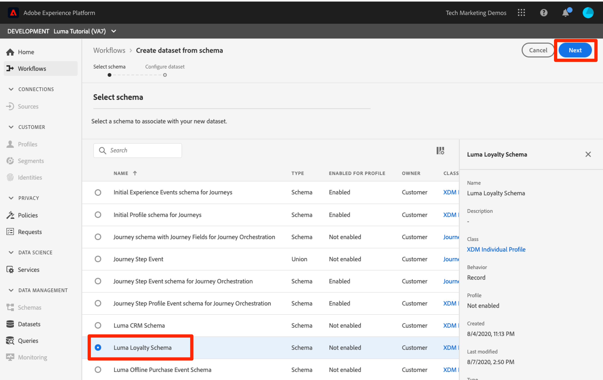
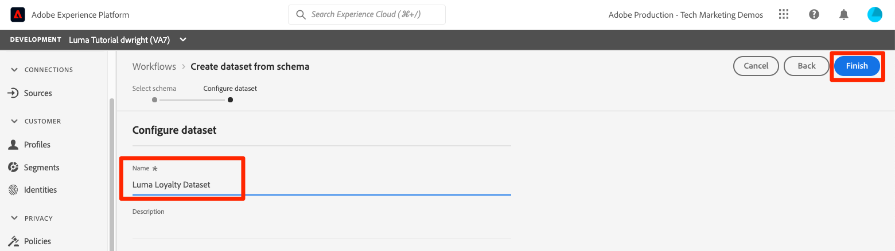

# Skapa datauppsättningar

<!--15min-->

I den här lektionen ska du skapa datauppsättningar som tar emot dina data. Det här är den kortaste lektionen i självstudiekursen!

Alla data som har inhämtats till Adobe Experience Platform lagras i datasjön som datauppsättningar. En datauppsättning är en lagrings- och hanteringskonstruktion för en datamängd, vanligtvis en tabell, som innehåller ett schema (kolumner) och fält (rader). Datauppsättningar innehåller också metadata som beskriver olika aspekter av de data som lagras.

**Dataarkitekturer** måste skapa datauppsättningar utanför den här självstudiekursen.

Innan du börjar övningarna ska du titta på den här korta videon och lära dig mer om datauppsättningar:
>[!VIDEO](https://video.tv.adobe.com/v/27269?quality=12&learn=on)

## Behörigheter krävs

I [Konfigurera behörigheter](configure-permissions.md) lektionen anger du alla åtkomstkontroller som krävs för att slutföra lektionen.

<!--
* Permission items **[!UICONTROL Data Management]** > **[!UICONTROL View Datasets]** and **[!UICONTROL Manage Datasets]**
* Permission item **[!UICONTROL Sandboxes]** > `Luma Tutorial`
* User-role access to the `Luma Tutorial Platform` product profile
* Developer-role access to the `Luma Tutorial Platform` product profile (for API)
-->

## Skapa datauppsättningar i användargränssnittet

I den här övningen kommer vi att skapa datauppsättningar i användargränssnittet. Låt oss börja med lojalitetsdata:

1. Gå till **[!UICONTROL Datauppsättningar]** till vänster i användargränssnittet
1. Välj **[!UICONTROL Skapa datauppsättning]** knapp
   

1. På nästa skärm väljer du **Skapa datauppsättning från schema**
1. På nästa skärm väljer du `Luma Loyalty Schema` och sedan väljer **[!UICONTROL Nästa]** knapp
   

1. Namnge datauppsättningen `Luma Loyalty Dataset` och väljer **[!UICONTROL Slutför]** knapp
   
1. När datauppsättningen har sparats visas en skärm som den här:
   

Så ja! Jag sa ju att det här skulle gå fort. Skapa dessa andra datauppsättningar med samma steg:

1. `Luma Offline Purchase Events Dataset` för `Luma Offline Purchase Events Schema`
1. `Luma Web Events Dataset` för `Luma Web Events Schema`
1. `Luma Product Catalog Dataset` för `Luma Product Catalog Schema`


## Skapa en datauppsättning med API

Skapa `Luma CRM Dataset` med API:t.

>[!NOTE]
>
>Om du vill hoppa över API-övningen och skapa `Luma CRM Dataset` i användargränssnittet. Ge den ett namn `Luma CRM Dataset` och använder `Luma CRM Schema`.

### Hämta ID:t för schemat som ska användas i datauppsättningen

Först måste vi skaffa `$id` i `Luma CRM Schema`:

1. Öppna [!DNL Postman]
1. Öppna begäran om du inte har någon åtkomsttoken **[!DNL OAuth: Request Access Token]** och markera **Skicka** för att begära en ny åtkomsttoken, precis som i [!DNL Postman] lektion.
1. Öppna förfrågan **[!DNL Schema Registry API > Schemas > Retrieve a list of schemas within the specified container.]**
1. Välj **Skicka** knapp
1. Du borde få 200 svar
1. Leta i svaret på `Luma CRM Schema` och kopiera `$id` value
   

### Skapa datauppsättningen

Nu kan du skapa datauppsättningen:

1. Hämta [Catalog Service API.postman_collection.json](https://raw.githubusercontent.com/adobe/experience-platform-postman-samples/master/apis/experience-platform/Catalog%20Service%20API.postman_collection.json) till `Luma Tutorial Assets` mapp.
1. Importera samlingen till [!DNL Postman]
1. Välj begäran **[!DNL Catalog Service API > Datasets > Create a new dataset.]**
1. Klistra in följande som **Brödtext** av begäran, ***ersätta id-värdet med ditt eget***:

   ```json
   {
       "name": "Luma CRM Dataset",
   
       "schemaRef": {
           "id": "REPLACE_WITH_YOUR_OWN_ID",
           "contentType": "application/vnd.adobe.xed-full+json;version=1"
       },
       "fileDescription": {
           "persisted": true,
           "containerFormat": "parquet",
           "format": "parquet"
       }
   }
   ```

1. Välj **Skicka** knapp
1. Du bör få ett svar från 2011 Created som innehåller ID:t för din nya datauppsättning!
   

>[!TIP]
>
> Vanliga fel som gör denna begäran och troliga korrigeringar:
>
> * `400: There was a problem retrieving xdm schema`. Se till att du har ersatt id:t i exemplet ovan med ditt eget id `Luma CRM Schema`
> * Ingen auth-token: Kör **OAuth: Åtkomsttoken för begäran** begäran om att generera en ny token
> * `401: Not Authorized to PUT/POST/PATCH/DELETE for this path : /global/schemas/`: Uppdatera **CONTAINER_ID** miljövariabel från `global` till `tenant`
> * `403: PALM Access Denied. POST access is denied for this resource from access control`: Verifiera dina användarbehörigheter i Admin Console


Du kan gå tillbaka till **[!UICONTROL Datauppsättningar]** i användargränssnittet för plattformen kan du verifiera att alla fem datauppsättningarna har skapats!


## Ytterligare resurser

* [Dokumentation för datauppsättningar](https://experienceleague.adobe.com/docs/experience-platform/catalog/datasets/overview.html)
* [API-referens för datauppsättningar (ingår i katalogtjänsten)](https://www.adobe.io/experience-platform-apis/references/catalog/#tag/Datasets)

Nu när alla våra scheman, identiteter och datauppsättningar finns på plats kan vi [aktivera dem för kundprofil i realtid](enable-profiles.md).
