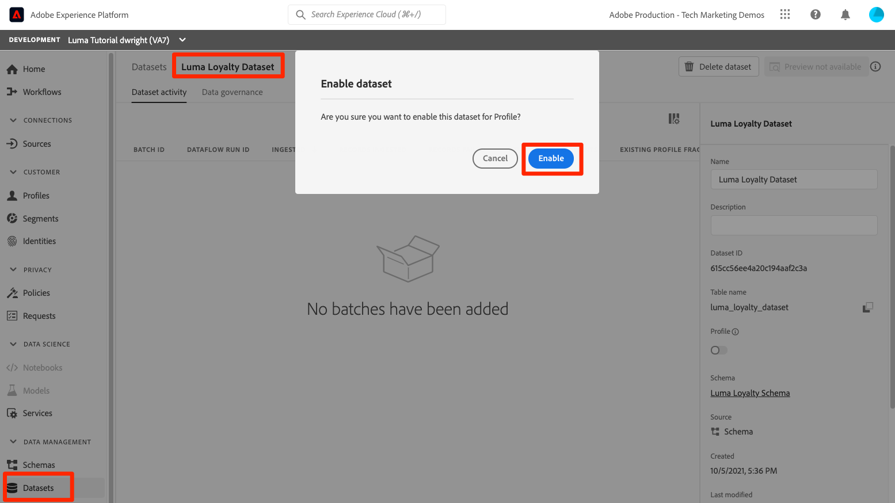

# Aktivera kundprofiler i realtid

<!-- 15min-->
I den här lektionen ska du aktivera dina scheman och datauppsättningar för kundprofiler i realtid.

Jag ljög när jag sa att dataset-lektionen var den kortaste lektionen i kursen - den här borde ta ännu mindre tid! Det enda du kommer att göra är att vända en massa glasögon. Men det som händer när du vänder på de här växlarna är _verkligen_ viktigt, så jag vill dedikera en hel sida till den.

Med kundprofilen i realtid kan ni se en helhetsbild av varje enskild kund som kombinerar data från flera kanaler, inklusive online-, offline-, CRM- och tredjepartsdata. Med hjälp av en profil kan ni sammanställa olika kunddata i en enhetlig vy som ger ett användbart, tidsstämplat konto för varje kundinteraktion.

Så fantastiskt som allt det där låter, behöver du inte aktivera *alla dina data* för profilen. Faktum är att du endast bör aktivera de data du behöver för aktiveringsändamål. Aktivera data som ni vill använda för marknadsföringsärenden, kundtjänstintegreringar och så vidare, där ni behöver snabb tillgång till en robust kundprofil. Om du bara överför data för analys bör det förmodligen inte aktiveras för profilen.

Det finns viktiga [skyddsutkast för kundprofildata i realtid](https://experienceleague.adobe.com/docs/experience-platform/profile/guardrails.html?lang=en) som du bör granska när du avgör vilken av dina egna data du bör aktivera för profilen.

<!--is this accurate. Are there other considerations to point out? -->

**Dataarkitekturer** måste aktivera kundprofil i realtid utanför den här självstudiekursen.

Innan du börjar övningarna ska du titta på den här korta videon och lära dig mer om kundprofilen i realtid:
>[!VIDEO](https://video.tv.adobe.com/v/27251?learn=on)

## Behörigheter krävs

I lektionen [Konfigurera behörigheter](configure-permissions.md) ställer du in alla åtkomstkontroller som krävs för att slutföra lektionen.


<!--* Permission items **[!UICONTROL Data Modeling]** > **[!UICONTROL View Schemas]** and **[!UICONTROL Manage Schemas]**
* Permission items **[!UICONTROL Data Management]** > **[!UICONTROL View Datasets]** and **[!UICONTROL Manage Datasets]**
* Permission item **[!UICONTROL Sandboxes]** > `Luma Tutorial`
* User-role access to the `Luma Tutorial Platform` product profile
* Developer-role access to the `Luma Tutorial Platform` product profile (for API)
-->

## Aktivera scheman för kundprofil i realtid med plattformens användargränssnitt

Låt oss börja med den enkla uppgiften att aktivera ett schema:

1. Öppna **Luma Loyalty Schema** i användargränssnittet för plattformen
1. I **[!UICONTROL Schema Properties]** växlar du till växeln **Profil**
1. Bekräfta genom att trycka på knappen **[!UICONTROL Enable]** i bekräftelsemodal
1. Klicka på knappen **[!UICONTROL Save]** om du vill spara ändringarna

   >[!IMPORTANT]
   >
   >När ett schema har aktiverats för profilen kan det inte inaktiveras eller tas bort. Det går inte heller att ta bort fält från schemat efter den här punkten. Dessa konsekvenser är viktiga att tänka på senare när du arbetar med egna data i produktionsmiljön. Du bör använda en utvecklingssandlåda i den här självstudiekursen, som du kan ta bort när som helst.
   >
   >I den kontrollerade miljön i den här självstudiekursen aktiverar du dina scheman och datauppsättningar för profilen, _innan du importerar några data_. När du arbetar med egna data rekommenderar vi att du gör saker i följande ordning:
   >
   > 1. För det första kan du importera vissa data i dina datauppsättningar.
   > 1. Åtgärda eventuella problem som uppstår under dataöverföringsprocessen (till exempel datavalidering eller mappningsproblem).
   > 1. Aktivera datauppsättningar och scheman för profil
   > 1. Återställ data


   

Lätt eller? Upprepa stegen ovan för dessa andra scheman:

1. Luma produktkatalogschema
1. Schema för offlineinköpshändelser för Luma
1. Luma Web Events-schema (markera kryssrutan &quot;Data för det här schemat kommer att innehålla en primär identitet i fältet identityMap.&quot;)

## Aktivera scheman för kundprofil i realtid med plattforms-API

Nu är det dags att aktivera `Luma CRM Schema` med API:t. Om du vill hoppa över den här övningen och bara aktivera den i användargränssnittet går du direkt.

### Hämta meta:altId för schemat

Först hämtar vi `meta:altId` för `Luma CRM Schema`:

1. Öppna [!DNL Postman]
1. Om du inte har någon åtkomsttoken öppnar du begäran **[!DNL OAuth: Request Access Token]** och väljer **Skicka** för att begära en ny åtkomsttoken, precis som i lektionen [!DNL Postman].
1. Öppna begäran **[!DNL Schema Registry API > Schemas > Retrieve a list of schemas within the specified container.]**
1. Välj knappen **Skicka**
1. Du borde få 200 svar
1. Leta i svaret för objektet `Luma CRM Schema` och kopiera värdet `meta:altId`
   

### Aktivera schemat

Nu när vi har meta:altId för schemat kan vi aktivera det för profilen:

1. Öppna begäran **[!DNL Schema Registry API > Schemas > Update one or more attributes of a custom schema specified by ID.]**
1. Klistra in `meta:altId`-värdet som `SCHEMA_ID`-parametervärdet i **Param**
1. Klistra in följande kod på fliken **Brödtext**

   ```json
   [{
       "op": "add",
       "path": "/meta:immutableTags",
       "value": ["union"]
   }]
   ```

1. Välj knappen **Skicka**
1. Du borde få 200 svar

   

Du bör kunna se i användargränssnittet att alla fem scheman är aktiverade för profilen (du kan behöva SKIFT-läsa in igen för att se att `Luma CRM Schema` är aktiverat):


## Aktivera datauppsättningar för kundprofil i realtid med hjälp av användargränssnittet i plattformen

Datauppsättningarna måste även aktiveras för profilen, och processen är ännu enklare:

1. Öppna `Luma Loyalty Dataset` i användargränssnittet för plattformen
1. Växla **[!UICONTROL Profile]**
1. Bekräfta genom att trycka på knappen **[!UICONTROL Enable]** i bekräftelsemodal

   

Upprepa stegen ovan för dessa andra datauppsättningar:

1. Luma produktkatalogsdatauppsättning
1. Datauppsättning för offlineinköpshändelser för luma
1. Luma Web Events-datauppsättning

>[!NOTE]
>
>Till skillnad från scheman kan du inaktivera datauppsättningar från profilen, men alla tidigare inmatade data finns kvar i profilen.

## Aktivera datauppsättningar för kundprofil i realtid med hjälp av plattforms-API

Nu ska du aktivera en datauppsättning för profil med API:t. Även om du vill aktivera det via användargränssnittet med metoden ovan så fungerar det bra.

### Hämta datauppsättningens ID

Först måste vi hämta `id` för `Luma CRM Dataset`:

1. Öppna [!DNL Postman]
1. Om du inte har någon åtkomsttoken öppnar du begäran **[!DNL OAuth: Request Access Token]** och väljer **Skicka** för att begära en ny åtkomsttoken, precis som i lektionen [!DNL Postman].
1. Öppna begäran **[!DNL Catalog Service API > Datasets > Retrieve a list of datasets.]**
1. Välj knappen **Skicka**
1. Du borde få 200 svar
1. Leta i svaret för objektet `Luma CRM Dataset` och kopiera ID:t:
   

### Aktivera datauppsättningen

Nu när vi har ID:t för datauppsättningen kan vi aktivera det för profilen:

1. Öppna begäran **[!DNL Catalog Service API > Datasets > Update one or more attributes of a dataset specified by ID.]**
1. I **Params** uppdaterar du värdet `DATASET_ID` till ditt eget
1. Klistra in följande kod på fliken **Brödtext**. Observera att de första två värdena är taggar som redan finns och som visas i det föregående svaret. De måste inkluderas i brödtexten, utöver de två nya taggarna som vi lägger till:

   ```json
   {
       "tags":{
           "adobe/pqs/table":["luma_crm_dataset"],
           "adobe/siphon/table/format":["parquet"],
           "unifiedProfile":["enabled:true"],
           "unifiedIdentity":["enabled:true"]
           }
   }
   ```

1. Välj knappen **Skicka**
1. Du borde få 200 svar

   

Du kan också bekräfta att användargränssnittet visar vilken datauppsättning som är aktiverad:


>[!IMPORTANT]
>
> Om du importerar data innan du aktiverar schemat och datauppsättningen för profilen måste du importera data igen efteråt.

## Ytterligare resurser

* [Kundprofildokumentation i realtid](https://experienceleague.adobe.com/docs/experience-platform/profile/home.html?lang=sv)
* [API-referens för kundprofil i realtid](https://www.adobe.io/experience-platform-apis/references/profile/)


**Datatekniker** bör fortsätta med lektionen [Prenumerera på datainmatningshändelser](subscribe-to-data-ingestion-events.md).
**Dataarkitekter** _kan hoppa över_ och gå till lektionen [gruppinhämtning](ingest-batch-data.md).
