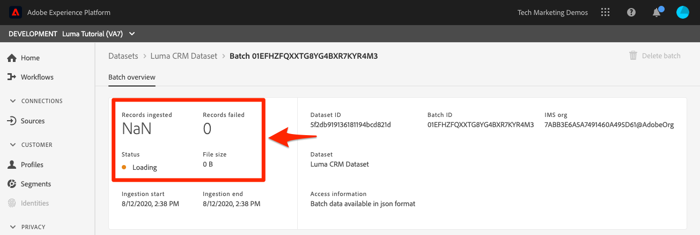
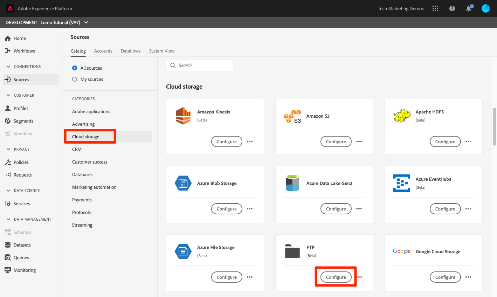

# Importera batchdata

<!-- 1hr-->
I den här lektionen ska du importera gruppdata till Experience Platform på olika sätt.

Genom att lägga in data i grupp kan du samtidigt importera en stor mängd data till Adobe Experience Platform. Du kan importera gruppdata i en enda överföring inom plattformens gränssnitt eller med API:t. Du kan också konfigurera regelbundet schemalagda batchöverföringar från tredjepartstjänster som molnlagringstjänster med hjälp av Source-anslutningar.

**Datatekniker** måste importera batchdata utanför den här självstudiekursen.

Innan du börjar övningarna ska du titta på den här korta videon för att lära dig mer om datainhämtning:

>[!VIDEO](https://video.tv.adobe.com/v/27106?learn=on&enablevpops)


## Behörigheter krävs

I lektionen [Konfigurera behörigheter](configure-permissions.md) ställer du in alla åtkomstkontroller som krävs för att slutföra lektionen.

<!--
* Permission item **[!UICONTROL Data Management]** > **[!UICONTROL View Datasets]**, **[!UICONTROL Manage Datasets]** and **[!UICONTROL Data Monitoring]**
* Permission items **[!UICONTROL Data Ingestion]** > **[!UICONTROL View Sources]** and **[!UICONTROL Manage Sources]**
* Permission item **[!UICONTROL Profile Management]** > **[!UICONTROL View Profiles]**
* Permission item **[!UICONTROL Sandboxes]** > `Luma Tutorial`
* User-role access to the `Luma Tutorial Platform` product profile
* Developer-role access to the `Luma Tutorial Platform` product profile (for API)
-->

Du måste ha tillgång till en (S)FTP-server eller molnlagringslösning för Sources-övningen. Det finns en lösning om du inte har någon.

## Samla in data gruppvis med användargränssnittet i plattformen

Data kan överföras direkt till en datauppsättning på datauppsättningsskärmen i JSON- och parquet-format. Detta är ett bra sätt att testa intag av vissa data efter att ha skapat en

### Hämta och förbereda data

Börja med att hämta exempeldata och anpassa dem för din klientorganisation:

>[!NOTE]
>
>Data i filen [luma-data.zip](assets/luma-data.zip) är fiktiva och ska endast användas i demonstrationssyfte.

1. Hämta [luma-data.zip](assets/luma-data.zip) till din **luma Tutorial Assets** -mapp.
1. Zippa upp filen och skapa en mapp med namnet `luma-data` som innehåller de fyra datafilerna som vi ska använda i lektionen
1. Öppna `luma-loyalty.json` i en textredigerare och ersätt alla förekomster av `_techmarketingdemos` med ditt eget understreck-tenant-ID, som i dina egna scheman:
   

1. Spara den uppdaterade filen

### Infoga data

1. Välj **[!UICONTROL Datasets]** i den vänstra navigeringen i plattformens användargränssnitt
1. Öppna `Luma Loyalty Dataset`
1. Bläddra nedåt tills du ser avsnittet **[!UICONTROL Add Data]** i den högra kolumnen
1. Överför filen `luma-loyalty.json`.
1. När filen har överförts visas en rad för gruppen
1. Om du läser in sidan igen efter några minuter bör du se att batchen har överförts med 1 000 poster och 1 000 profilfragment.

   
   <!--do i need to explain error diagnostics and partial ingestion-->

>[!NOTE]
>
>Det finns några alternativ, **[!UICONTROL Error diagnostics]** och **[!UICONTROL Partial ingestion]**, som du kan se på olika skärmar i den här lektionen. De här alternativen beskrivs inte i självstudiekursen. Snabb information:
>
>* Om du aktiverar feldiagnostik genereras data om inmatningen av data, som du sedan kan granska med hjälp av API:t för dataåtkomst. Läs mer om det i [dokumentationen](https://experienceleague.adobe.com/docs/experience-platform/data-access/home.html?lang=sv-SE).
>* Delvis intag gör att du kan importera data som innehåller fel, upp till ett visst tröskelvärde som du kan ange. Läs mer om det i [dokumentationen](https://experienceleague.adobe.com/docs/experience-platform/ingestion/batch/partial.html?lang=sv-SE)

### Validera data

Det finns några sätt att bekräfta att data har importerats.

#### Validera i användargränssnittet för plattformen

Så här bekräftar du att data har importerats till datauppsättningen:

1. På samma sida där du har inhämtat data markerar du knappen **[!UICONTROL Preview dataset]** överst till höger
1. Välj knappen **Förhandsgranska** så kan du se några av de inkapslade data.

   


Så här bekräftar du att data landats i profilen (det kan ta några minuter innan data landas):

1. Gå till **[!UICONTROL Profiles]** i den vänstra navigeringen
1. Markera ikonen bredvid fältet **[!UICONTROL Select identity namespace]** för att öppna det modala
1. Välj namnområde för `Luma Loyalty Id`
1. Ange sedan ett av `loyaltyId`-värdena från datauppsättningen, `5625458`
1. Välj **[!UICONTROL View]**
   

#### Validera med dataöverföringshändelser

Om du prenumererar på dataöverföringshändelser i den föregående lektionen ska du kontrollera din unika webkrok.site-URL. Du bör se tre begäranden som visas i följande ordning, med en viss tid mellan dem, med följande `eventCode`-värden:

1. `ing_load_success` - batchen är kapslad
1. `ig_load_success` - batchen skapades i identitetsdiagrammet
1. `ps_load_success` - batchen skapades i profiltjänsten


Mer information om meddelanden finns i [dokumentationen](https://experienceleague.adobe.com/docs/experience-platform/ingestion/quality/subscribe-events.html?lang=sv-SE#available-status-notification-events).

## Importera data gruppvis med Platform API

Nu ska vi ladda upp data med API:t.

>[!NOTE]
>
>Dataarkitekter kan ladda upp CRM-data via användargränssnittsmetoden.

### Hämta och förbereda data

1. Du bör redan ha hämtat och packat upp [luma-data.zip](assets/luma-data.zip) till mappen `Luma Tutorial Assets`.
2. Öppna `luma-crm.json` i en textredigerare och ersätt alla förekomster av `_techmarketingdemos` med ditt eget understreck-tenant-ID, så som du ser i dina scheman
3. Spara den uppdaterade filen

### Hämta datauppsättnings-ID

Först hämtar vi ID:t för datauppsättnings-ID:t för den datauppsättning som vi vill importera data till:

1. Öppna [!DNL Postman]
1. Om du inte har någon åtkomsttoken öppnar du begäran **[!DNL OAuth: Request Access Token]** och väljer **Skicka** för att begära en ny åtkomsttoken, precis som i lektionen [!DNL Postman].
1. Öppna dina miljövariabler och kontrollera att värdet för **CONTAINER_ID** fortfarande är `tenant`
1. Öppna förfrågan **[!DNL Catalog Service API > Datasets > Retrieve a list of datasets.]** och välj **Skicka**
1. Du bör få ett `200 OK`-svar
1. Kopiera ID för `Luma CRM Dataset` från svarstexten
   

### Skapa gruppen

Nu kan vi skapa en batch i datauppsättningen:

1. Hämta [API för datainmatning.postman_collection.json](https://raw.githubusercontent.com/adobe/experience-platform-postman-samples/master/apis/experience-platform/Data%20Ingestion%20API.postman_collection.json) till din `Luma Tutorial Assets`-mapp
1. Importera samlingen till [!DNL Postman]
1. Välj begäran **[!DNL Data Ingestion API > Batch Ingestion > Create a new batch in Catalog Service.]**
1. Klistra in följande som **Body** i begäran och ***ersätt dataId-värdet med ditt***:

   ```json
   {
       "datasetId":"REPLACE_WITH_YOUR_OWN_DATASETID",
       "inputFormat": {
           "format": "json"
       }
   }
   ```

1. Välj knappen **Skicka**
1. Du bör få ett svar från 201 Created som innehåller ID:t för din nya batch!
1. Kopiera `id` för den nya gruppen
   

### Infoga data

Nu kan vi överföra data till gruppen:

1. Välj begäran **[!DNL Data Ingestion API > Batch Ingestion > Upload a file to a dataset in a batch.]**
1. På fliken **Params** anger du datauppsättnings-ID och batch-ID i deras respektive fält
1. På fliken **Params** anger du `luma-crm.json` som **filePath**
1. Välj alternativet **binärt** på fliken **Brödtext**
1. Välj den hämtade `luma-crm.json` från din lokala `Luma Tutorial Assets`-mapp
1. Välj **Skicka** så får du ett 200 OK-svar med 1 i svarstexten

   

Om du nu tittar på din batch i användargränssnittet för plattformen ser du att den har statusen [!UICONTROL Loading]:


Eftersom API:t för batch ofta används för att överföra flera filer måste du ange för Platform när en batch är slutförd, vilket vi gör i nästa steg.

### Slutför batchen

Så här slutför du gruppen:

1. Välj begäran **[!DNL Data Ingestion API > Batch Ingestion > Finish uploading a file to a dataset in a batch.]**
1. Ange `COMPLETE` som **åtgärd** på fliken **Params**.
1. Ange ditt batch-ID på fliken **Params**. Du behöver inte bekymra dig om datauppsättnings-ID eller filePath om de finns.
1. Kontrollera att URL:en för POST är `https://platform.adobe.io/data/foundation/import/batches/:batchId?action=COMPLETE` och att det inte finns några onödiga referenser till `datasetId` eller `filePath`
1. Välj **Skicka** så får du ett 200 OK-svar med 1 i svarstexten

   

### Validera data

#### Validera i användargränssnittet för plattformen

Validera att data har landats i användargränssnittet för plattformen på samma sätt som för lojalitetsdatauppsättningen.

Bekräfta först att batchen visar att 1 000 poster har importerats:


Bekräfta sedan gruppen med datauppsättningen Preview:


Bekräfta slutligen att en av dina profiler har skapats genom att leta upp en av profilerna i namnutrymmet `Luma CRM Id`, till exempel `b642b4217b34b1e8d3bd915fc65c4452`


Det finns en intressant sak som just hände som jag vill understryka. Öppna den `Danny Wright`-profilen. Profilen har både `Lumacrmid` och `Lumaloyaltyid`. Kom ihåg att `Luma Loyalty Schema` innehöll två identitetsfält, Luma Loyalty Id och CRM Id. Nu när vi har överfört båda datauppsättningarna har de sammanfogats till en enda profil. Lojalitetsdata hade `Daniel` som förnamn och New York City som hemadress, medan CRM-data hade `Danny` som förnamn och `Portland` som hemadress för kunden med samma Lojalty-ID. Vi återkommer till varför förnamnet visas `Danny` i lektionen om sammanfogningsprinciper.

Grattis, du har just sammanfogat profiler!


#### Validera med dataöverföringshändelser

Om du prenumererar på dataöverföringshändelser i den föregående lektionen ska du kontrollera din unika webkrok.site-URL. Du bör se tre förfrågningar som kommer in, precis som med lojalitetsdata:


Mer information om meddelanden finns i [dokumentationen](https://experienceleague.adobe.com/docs/experience-platform/ingestion/quality/subscribe-events.html?lang=sv-SE#available-status-notification-events).

## Importera data med arbetsflöden

Låt oss titta på ett annat sätt att överföra data. Med arbetsflödesfunktionen kan du importera CSV-data som inte redan är modellerade i XDM.

### Hämta och förbereda data

1. Du bör redan ha hämtat och packat upp [luma-data.zip](assets/luma-data.zip) till mappen `Luma Tutorial Assets`.
1. Bekräfta att du har `luma-products.csv`

### Skapa ett arbetsflöde

Nu ska vi skapa ett arbetsflöde:

1. Gå till **[!UICONTROL Workflows]** i den vänstra navigeringen
1. Markera **[!UICONTROL Map CSV to XDM schema]** och välj knappen **[!UICONTROL Launch]**
   
1. Markera `Luma Product Catalog Dataset` och välj knappen **[!UICONTROL Next]**
   
1. Lägg till filen `luma-products.csv` som du hämtade och välj knappen **[!UICONTROL Next]**
   
1. Nu är du i mappningsgränssnittet, i vilket du kan mappa ett fält från källdata (ett av kolumnnamnen i filen `luma-products.csv`) till XDM-fält i målschemat. I det här exemplet är kolumnnamnen tillräckligt nära schemafältnamnen för att mapparen automatiskt ska kunna identifiera rätt mappning. Om mapparen inte kunde identifiera rätt fält automatiskt, skulle du markera ikonen till höger om målfältet för att välja rätt XDM-fält. Om du inte vill importera en av kolumnerna från CSV-filen kan du ta bort raden från mapparen. Du kan spela runt och ändra kolumnrubriker i `luma-products.csv` för att få reda på hur mappningen fungerar.
1. Markera knappen **[!UICONTROL Finish]**
   

### Validera data

När gruppen har överförts verifierar du överföringen genom att förhandsgranska datauppsättningen.

Eftersom `Luma Product SKU` är ett namnområde som inte är ett personnamn visas inga profiler för produktskus.

Du borde se de tre träffarna till din webkrok.

## Importera data med källor

Okej, du gjorde saker på den hårda vägen. Låt oss nu gå in i det utlovade landet för _automatiserad_ batchförtäring! När jag säger: &quot;SÄTT IN DET!&quot; &quot;GLÖM DET!&quot; &quot;SÄTT DIG!&quot; &quot;GLÖM DET!&quot; &quot;SÄTT DIG!&quot; &quot;GLÖM DET!&quot; Skämtar du bara, du skulle aldrig göra något sådant! Okej, tillbaka till jobbet. Du är nästan klar.

Gå till **[!UICONTROL Sources]** i den vänstra navigeringen för att öppna källkatalogen. Här ser du en mängd färdiga integreringar med branschledande data- och lagringsleverantörer.


Okej, vi importerar data med hjälp av en källanslutning.

Den här övningen kommer att vara din egen stil. Jag ska visa arbetsflödet med FTP-källkopplingen. Du kan antingen använda en annan anslutning till molnlagringskällan som du använder på ditt företag, eller överföra json-filen med datauppsättningens användargränssnitt på samma sätt som med lojalitetsdata.

Många av källorna har ett liknande konfigurationsarbetsflöde där du:

1. Ange din autentiseringsinformation
1. Markera de data som du vill importera
1. Välj den plattformsdatauppsättning som du vill importera den till
1. Mappa fälten till XDM-schemat
1. Välj hur ofta du vill hämta data från den platsen

>[!NOTE]
>
>De offlineinköpsdata som vi kommer att använda i den här övningen innehåller data för datetime. Datumtidsdata ska vara i antingen [ISO 8061-formaterade strängar](https://www.iso.org/iso-8601-date-and-time-format.html) (&quot;2018-07-10T15:05:59.000-08:00&quot;) eller Unix Time i millisekunder (1531263955 9000) och konverteras vid intag till mål-XDM-typen. Mer information om datakonvertering och andra begränsningar finns i [dokumentationen för API:t för gruppinmatning](https://experienceleague.adobe.com/docs/experience-platform/ingestion/batch/api-overview.html?lang=sv-SE#types).

### Hämta, förbered och överföra data till den molnlagringsleverantör du föredrar

1. Du bör redan ha hämtat och packat upp [luma-data.zip](assets/luma-data.zip) till mappen `Luma Tutorial Assets`.
1. Öppna `luma-offline-purchases.json` i en textredigerare och ersätt alla förekomster av `_techmarketingdemos` med ditt eget understreck-tenant-ID, så som du ser i dina scheman
1. Uppdatera alla tidsstämplar så att händelserna inträffar den senaste månaden (sök till exempel efter `"timestamp":"2022-06` och ersätt år och månad)
1. Välj önskad molnlagringsleverantör och kontrollera att den är tillgänglig i katalogen [!UICONTROL Sources]
1. Överför `luma-offline-purchases.json` till en plats i den molnlagringsleverantör du föredrar

### Importera data till den önskade molnlagringsplatsen

1. Filtrera katalogen [!UICONTROL Sources] till **[!UICONTROL Cloud storage]** i användargränssnittet för plattformen
1. Observera att det finns praktiska länkar till dokumentation under `...`
1. Välj knappen **[!UICONTROL Configure]** i rutan för den molnlagringsleverantör du föredrar
   
1. **[!UICONTROL Authentication]** är det första steget. Ange namnet på ditt konto, till exempel `Luma's FTP Account`, och din autentiseringsinformation. Det här steget bör vara ungefär likadant för alla molnlagringskällor, men fälten kan variera något. När du har angett autentiseringsinformationen för ett konto kan du återanvända dem för andra källanslutningar som kan skicka andra data i olika scheman från andra filer på samma konto
1. Välj **[!UICONTROL Connect to source button]**
1. När plattformen har anslutit till Source väljer du knappen **[!UICONTROL Next]**
   

1. I steget **[!UICONTROL Select data]** använder användargränssnittet dina autentiseringsuppgifter för att öppna mappen i din molnlagringslösning
1. Markera de filer som du vill importera, till exempel `luma-offline-purchases.json`
1. Som **[!UICONTROL Data format]** väljer du `XDM JSON`
1. Sedan kan du förhandsgranska JSON-strukturen och exempeldata i filen
1. Markera knappen **[!UICONTROL Next]**
   

1. I steget **[!UICONTROL Mapping]** väljer du `Luma Offline Purchase Events Dataset` och klickar på knappen **[!UICONTROL Next]**. Observera i meddelandet att eftersom de data vi samlar in är en JSON-fil finns det inget mappningssteg där vi mappar källfält till målfält. JSON-data måste redan finnas i XDM. Om du importerade en CSV-fil ser du hela mappningsgränssnittet i det här steget:
   
1. I steget **[!UICONTROL Scheduling]** väljer du hur ofta du vill hämta data från Source. Ta en stund och titta på alternativen. Vi ska bara göra en engångsinmatning, så lämna **[!UICONTROL Frequency]** på **[!UICONTROL Once]** och välj knappen **[!UICONTROL Next]**:
   
1. I steget **[!UICONTROL Dataflow detail]** kan du välja ett namn för dataflödet, ange en valfri beskrivning, aktivera feldiagnostik och partiellt intag. Låt inställningarna vara som de är och välj knappen **[!UICONTROL Next]**:
   
1. I steget **[!UICONTROL Review]** kan du granska alla dina inställningar tillsammans och antingen redigera dem eller välja knappen **[!UICONTROL Finish]**
1. När du har sparat kommer du att landa på en skärm som den här:
   

### Validera data

När gruppen har överförts verifierar du överföringen genom att förhandsgranska datauppsättningen.

Du borde se de tre träffarna till din webkrok.

Slå upp profilen med värdet `5625458` i namnområdet `loyaltyId` igen för att se om det finns några köphändelser i profilen. Du borde se ett köp. Du kan utforska information om köpet genom att välja **[!UICONTROL View JSON]**:


## ETL-verktyg

Adobe samarbetar med flera ETL-leverantörer för att stödja datainmatning i Experience Platform. På grund av de många olika tredjepartsleverantörerna ingår inte ETL i kursen, även om du gärna vill titta närmare på några av dessa resurser:

* [Utveckla ETL-integreringar för Adobe Experience Platform](https://experienceleague.adobe.com/docs/experience-platform/etl/home.html?lang=sv-SE)
* [[!DNL Snaplogic] Adobe Experience Platform Snap Pack](https://www.snaplogic.com/resources/videos/august-2020-aep)

## Ytterligare resurser

* [Dokumentation för gruppinmatning](https://experienceleague.adobe.com/docs/experience-platform/ingestion/batch/overview.html?lang=sv-SE)
* [API-referens för gruppinmatning](https://developer.adobe.com/experience-platform-apis/references/batch-ingestion/)

Låt oss nu [strömma data med Web SDK](ingest-streaming-data.md)
