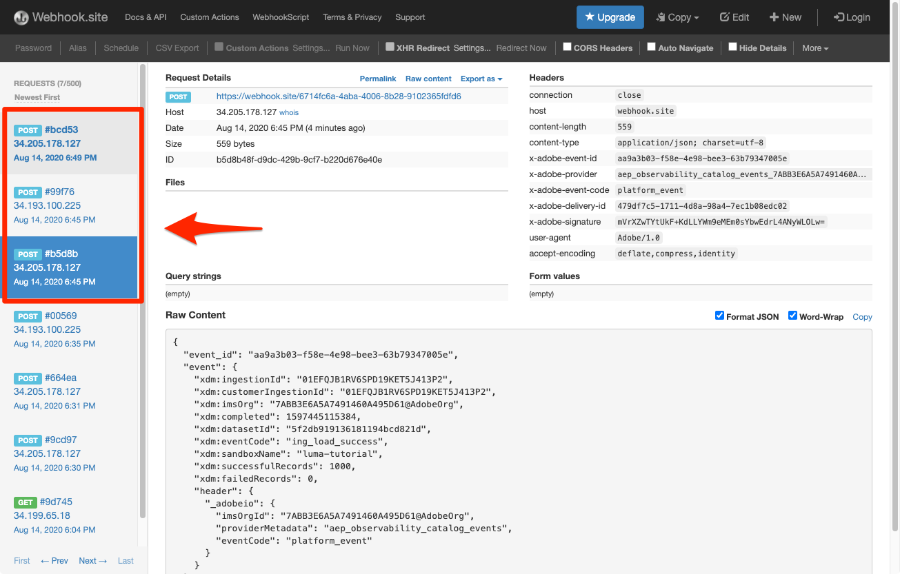

# Importera batchdata

<!-- 1hr-->
I den här lektionen ska du importera gruppdata till Experience Platform på olika sätt.

Genom att lägga in data i grupp kan du samtidigt importera en stor mängd data till Adobe Experience Platform. Du kan importera gruppdata i en enda överföring inom plattformens gränssnitt eller med API:t. Du kan också konfigurera regelbundet schemalagda batchöverföringar från tredjepartstjänster som molnlagringstjänster med hjälp av källanslutningar.

**Datatekniker** måste importera batchdata utanför den här självstudiekursen.

Innan du börjar övningarna ska du titta på den här korta videon för att lära dig mer om datainhämtning:
>[!VIDEO](https://video.tv.adobe.com/v/27106?quality=12&learn=on)


## Behörigheter krävs

I [Konfigurera behörigheter](configure-permissions.md) lektionen anger du alla åtkomstkontroller som krävs för att slutföra lektionen.

<!--
* Permission item **[!UICONTROL Data Management]** > **[!UICONTROL View Datasets]**, **[!UICONTROL Manage Datasets]** and **[!UICONTROL Data Monitoring]**
* Permission items **[!UICONTROL Data Ingestion]** > **[!UICONTROL View Sources]** and **[!UICONTROL Manage Sources]**
* Permission item **[!UICONTROL Profile Management]** > **[!UICONTROL View Profiles]**
* Permission item **[!UICONTROL Sandboxes]** > `Luma Tutorial`
* User-role access to the `Luma Tutorial Platform` product profile
* Developer-role access to the `Luma Tutorial Platform` product profile (for API)
-->

Du måste ha tillgång till en (S)FTP-server eller molnlagringslösning för Sources-övningen. Det finns en lösning om du inte har någon.

## Samla in data gruppvis med användargränssnittet i plattformen

Data kan överföras direkt till en datauppsättning på datauppsättningsskärmen i JSON- och parquet-format. Detta är ett bra sätt att testa intag av vissa data efter att ha skapat en

### Hämta och förbereda data

Börja med att hämta exempeldata och anpassa dem för din klientorganisation:

>[!NOTE]
>
>Data i [luma-data.zip](assets/luma-data.zip) filen är fiktiv och ska endast användas som exempel.

1. Hämta [luma-data.zip](assets/luma-data.zip) till **Luma - resurser för självstudiekurser** mapp.
1. Zippa upp filen och skapa en mapp med namnet `luma-data` som innehåller de fyra datafilerna som vi kommer att använda i den här lektionen
1. Öppna `luma-loyalty.json` i en textredigerare och ersätta alla förekomster av `_techmarketingdemos` med ditt eget understreck-tenant-id, som du ser i dina egna scheman:
   

1. Spara den uppdaterade filen

### Infoga data

1. Välj **[!UICONTROL Datauppsättningar]** i den vänstra navigeringen
1. Öppna `Luma Loyalty Dataset`
1. Bläddra nedåt tills du ser **[!UICONTROL Lägg till data]** i den högra kolumnen
1. Överför `luma-loyalty.json` -fil.
1. När filen har överförts visas en rad för gruppen
1. Om du läser in sidan igen efter några minuter bör du se att batchen har överförts med 1 000 poster och 1 000 profilfragment.

   
   <!--do i need to explain error diagnostics and partial ingestion-->

>[!NOTE]
>
>Det finns några alternativ, **[!UICONTROL Feldiagnostik]** och **[!UICONTROL Delvis intag]** som du kommer att se på olika skärmar i den här lektionen. De här alternativen beskrivs inte i självstudiekursen. Snabb information:
>
>* Om du aktiverar feldiagnostik genereras data om inmatningen av data, som du sedan kan granska med hjälp av API:t för dataåtkomst. Läs mer om det i [dokumentationen](https://experienceleague.adobe.com/docs/experience-platform/data-access/home.html).
>* Delvis intag gör att du kan importera data som innehåller fel, upp till ett visst tröskelvärde som du kan ange. Läs mer om det i [dokumentationen](https://experienceleague.adobe.com/docs/experience-platform/ingestion/batch/partial.html)

### Validera data

Det finns några sätt att bekräfta att data har importerats.

#### Validera i användargränssnittet för plattformen

Så här bekräftar du att data har importerats till datauppsättningen:

1. På den sida där du har inhämtat data väljer du **[!UICONTROL Förhandsgranska datauppsättning]** överst till höger
1. Välj **Förhandsgranska** så kan du se några av de inmatade data.

   


Så här bekräftar du att data landats i profilen (det kan ta några minuter innan data landas):

1. Gå till **[!UICONTROL Profiler]** i den vänstra navigeringen
1. Markera ikonen bredvid **[!UICONTROL Välj namnområde för identitet]** fält för att öppna modalt
1. Välj `Luma Loyalty Id` namespace
1. Ange sedan en av `loyaltyId` värden från datauppsättningen,  `5625458`
1. Välj **[!UICONTROL Visa]**
   

#### Validera med dataöverföringshändelser

Om du prenumererar på dataöverföringshändelser i den föregående lektionen ska du kontrollera din unika webkrok.site-URL. Tre förfrågningar visas i följande ordning, med lite tid mellan dem, med följande `eventCode` värden:

1. `ing_load_success`—batchen som den ingicks
1. `ig_load_success`—batchen har importerats till identitetsdiagrammet
1. `ps_load_success`—batchen har importerats till profiltjänsten


Se [dokumentation](https://experienceleague.adobe.com/docs/experience-platform/ingestion/quality/subscribe-events.html#available-status-notification-events) om du vill ha mer information om meddelandena.

## Importera data gruppvis med Platform API

Nu ska vi ladda upp data med API:t.

>[!NOTE]
>
>Dataarkitekter kan ladda upp CRM-data via användargränssnittsmetoden.

### Hämta och förbereda data

1. Du bör ha laddat ned och packat upp [luma-data.zip](assets/luma-data.zip) i `Luma Tutorial Assets` mapp.
2. Öppna `luma-crm.json` i en textredigerare och ersätta alla förekomster av `_techmarketingdemos` med ditt eget understreck-tenant-id, som du ser i dina scheman
3. Spara den uppdaterade filen

### Hämta datauppsättnings-ID

Först hämtar vi ID:t för datauppsättnings-ID:t för den datauppsättning som vi vill importera data till:

1. Öppna [!DNL Postman]
1. Öppna begäran om du inte har någon åtkomsttoken **[!DNL OAuth: Request Access Token]** och markera **Skicka** för att begära en ny åtkomsttoken, precis som i [!DNL Postman] lektion.
1. Öppna dina miljövariabler och kontrollera värdet för **CONTAINER_ID** är fortfarande `tenant`
1. Öppna förfrågan **[!DNL Catalog Service API > Datasets > Retrieve a list of datasets.]** och markera **Skicka**
1. Du borde skaffa en `200 OK` svar
1. Kopiera ID:t för `Luma CRM Dataset` från svarsorganet
   

### Skapa gruppen

Nu kan vi skapa en batch i datauppsättningen:

1. Hämta [API.postman_collection.json](https://raw.githubusercontent.com/adobe/experience-platform-postman-samples/master/apis/experience-platform/Data%20Ingestion%20API.postman_collection.json) till `Luma Tutorial Assets` mapp
1. Importera samlingen till [!DNL Postman]
1. Välj begäran **[!DNL Data Ingestion API > Batch Ingestion > Create a new batch in Catalog Service.]**
1. Klistra in följande som **Brödtext** av begäran, ***ersätta dataId-värdet med ditt eget***:

   ```json
   {
       "datasetId":"REPLACE_WITH_YOUR_OWN_DATASETID",
       "inputFormat": {
           "format": "json"
       }
   }
   ```

1. Välj **Skicka** knapp
1. Du bör få ett svar från 201 Created som innehåller ID:t för din nya batch!
1. Kopiera `id` den nya batchen
   

### Infoga data

Nu kan vi överföra data till gruppen:

1. Välj begäran **[!DNL Data Ingestion API > Batch Ingestion > Upload a file to a dataset in a batch.]**
1. I **Parametrar** ange datauppsättnings-id och batch-id i sina respektive fält
1. I **Parametrar** tabb, ange `luma-crm.json` som **filePath**
1. I **Brödtext** väljer du **binary** option
1. Välj den hämtade `luma-crm.json` från din lokala `Luma Tutorial Assets` mapp
1. Välj **Skicka** och du bör få 200 OK-svar med &quot;1&quot; i svarsbrödtexten

   

Om du nu tittar på gruppen i användargränssnittet för plattformen ser du att den finns i en[!UICONTROL Läser in]&quot; status:


Eftersom API:t för batch ofta används för att överföra flera filer måste du ange för Platform när en batch är slutförd, vilket vi gör i nästa steg.

### Slutför batchen

Så här slutför du gruppen:

1. Välj begäran **[!DNL Data Ingestion API > Batch Ingestion > Finish uploading a file to a dataset in a batch.]**
1. I **Parametrar** tabb, ange `COMPLETE` som **åtgärd**
1. I **Parametrar** anger du ditt batch-ID. Du behöver inte bekymra dig om datauppsättnings-ID eller filePath om de finns.
1. Kontrollera att POSTENS URL är `https://platform.adobe.io/data/foundation/import/batches/:batchId?action=COMPLETE` och att det inte finns några onödiga referenser till `datasetId` eller `filePath`
1. Välj **Skicka** och du bör få 200 OK-svar med &quot;1&quot; i svarsbrödtexten

   

### Validera data

#### Validera i användargränssnittet för plattformen

Validera att data har landats i användargränssnittet för plattformen på samma sätt som för lojalitetsdatauppsättningen.

Bekräfta först att batchen visar att 1 000 poster har importerats:


Bekräfta sedan gruppen med datauppsättningen Preview:


Bekräfta slutligen att en av dina profiler har skapats genom att leta upp en av profilerna i `Luma CRM Id` namespace, till exempel `112ca06ed53d3db37e4cea49cc45b71e`


Det finns en intressant sak som just hände som jag vill understryka. Öppna den `Danny Wright` profil. Profilen har båda en `Lumacrmid` och `Lumaloyaltyid`. Kom ihåg `Luma Loyalty Schema` innehöll två identitetsfält, Luma Loyalty Id och CRM Id. Nu när vi har överfört båda datauppsättningarna har de sammanfogats till en enda profil. Lojalitetsdata hade `Daniel` som förnamn och&quot;New York City&quot; som hemadress, medan CRM-data `Danny` som förnamn och `Portland` som hemadress till kunden med samma lojalitets-ID. Vi kommer tillbaka till varför förnamnet visas `Danny` i lektionen om sammanfogningsprinciper.

Grattis, du har just sammanfogat profiler!


#### Validera med dataöverföringshändelser

Om du prenumererar på dataöverföringshändelser i den föregående lektionen ska du kontrollera din unika webkrok.site-URL. Du bör se tre förfrågningar som kommer in, precis som med lojalitetsdata:



Se [dokumentation](https://experienceleague.adobe.com/docs/experience-platform/ingestion/quality/subscribe-events.html#available-status-notification-events) om du vill ha mer information om meddelandena.

## Importera data med arbetsflöden

Låt oss titta på ett annat sätt att överföra data. Med arbetsflödesfunktionen kan du importera CSV-data som inte redan är modellerade i XDM.

### Hämta och förbereda data

1. Du bör ha laddat ned och packat upp [luma-data.zip](assets/luma-data.zip) i `Luma Tutorial Assets` mapp.
1. Bekräfta att du har`luma-products.csv`

### Skapa ett arbetsflöde

Nu ska vi skapa ett arbetsflöde:

1. Gå till **[!UICONTROL Arbetsflöden]** i den vänstra navigeringen
1. Välj **[!UICONTROL Mappa CSV till XDM-schema]** och väljer **[!UICONTROL Starta]** knapp
   
1. Välj `Luma Product Catalog Dataset` och väljer **[!UICONTROL Nästa]** knapp
   
1. Lägg till `luma-products.csv` filen du hämtade och väljer **[!UICONTROL Nästa]** knapp
   
1. Nu är du i mappningsgränssnittet där du kan mappa ett fält från källdata (ett av kolumnnamnen i `luma-products.csv` till XDM-fält i målschemat. I det här exemplet är kolumnnamnen tillräckligt nära schemafältnamnen för att mapparen automatiskt ska kunna identifiera rätt mappning. Om mapparen inte kunde identifiera rätt fält automatiskt, skulle du markera ikonen till höger om målfältet för att välja rätt XDM-fält. Om du inte vill importera en av kolumnerna från CSV-filen kan du ta bort raden från mapparen. Du kan spela upp och ändra kolumnrubriker i `luma-products.csv` för att lära känna hur mappningen fungerar.
1. Välj **[!UICONTROL Slutför]** knapp
   

### Validera data

När gruppen har överförts verifierar du överföringen genom att förhandsgranska datauppsättningen.

Sedan `Luma Product SKU` är ett namnutrymme som inte är ett personnamn, vi kommer inte att se några profiler för produktskalan.

Du borde se de tre träffarna till din webkrok.

## Importera data med källor

Okej, du gjorde saker på den hårda vägen. Nu ska vi flytta in i det utlovade landet _automatiserad_ batchförtäring! När jag säger: &quot;SÄTT IN DET!&quot; &quot;GLÖM DET!&quot; &quot;SÄTT DIG!&quot; &quot;GLÖM DET!&quot; &quot;SÄTT DIG!&quot; &quot;GLÖM DET!&quot; Skämtar du bara, du skulle aldrig göra något sådant! Okej, tillbaka till jobbet. Du är nästan klar.

Gå till **[!UICONTROL Källor]** i den vänstra navigeringen för att öppna källkatalogen. Här ser du en mängd färdiga integreringar med branschledande data- och lagringsleverantörer.


Okej, vi importerar data med en källanslutning.

Den här övningen kommer att vara din egen stil på äventyret. Jag ska visa arbetsflödet med FTP-källkopplingen. Du kan antingen använda en annan anslutning till molnlagringskällan som du använder på ditt företag, eller överföra json-filen med datauppsättningens användargränssnitt på samma sätt som med lojalitetsdata.

Många av källorna har ett liknande konfigurationsarbetsflöde där du:

1. Ange din autentiseringsinformation
1. Markera de data som du vill importera
1. Välj den plattformsdatauppsättning som du vill importera den till
1. Mappa fälten till XDM-schemat
1. Välj hur ofta du vill hämta data från den platsen

>[!NOTE]
>
>De offlineinköpsdata som vi kommer att använda i den här övningen innehåller data för datetime. Datum/tid-data ska vara antingen [Formaterade strängar enligt ISO 8061](https://www.iso.org/iso-8601-date-and-time-format.html) (&quot;2018-07-10T15:05:59.000-08:00&quot;) eller Unix-tid i millisekunder (1531263959000) och konverteras vid importen till mål-XDM-typen. Mer information om datakonvertering och andra begränsningar finns i [API-dokumentationen för batchmatning](https://experienceleague.adobe.com/docs/experience-platform/ingestion/batch/api-overview.html#types).

### Hämta, förbered och överföra data till den molnlagringsleverantör du föredrar

1. Du bör ha laddat ned och packat upp [luma-data.zip](assets/luma-data.zip) i `Luma Tutorial Assets` mapp.
1. Öppna `luma-offline-purchases.json` i en textredigerare och ersätta alla förekomster av `_techmarketingdemos` med ditt eget understreck-tenant-id, som du ser i dina scheman
1. Uppdatera alla tidsstämplar så att händelserna inträffar den senaste månaden (t.ex. sök efter `"timestamp":"2022-06` och ersätta år och månad)
1. Välj önskad molnlagringsleverantör och kontrollera att den är tillgänglig i [!UICONTROL Källor] katalog
1. Överför `luma-offline-purchases.json` till en plats hos den molnlagringsleverantör du föredrar

### Importera data till den önskade molnlagringsplatsen

1. I användargränssnittet för Plattform filtrerar du [!UICONTROL Källor] katalog till **[!UICONTROL molnlagring]**
1. Observera att det finns praktiska länkar till dokumentation under `...`
1. I rutan med den molnlagringsleverantör du föredrar väljer du **[!UICONTROL Konfigurera]** knapp
   
1. **[!UICONTROL Autentisering]** är det första steget. Ange till exempel namnet på ditt konto `Luma's FTP Account` och din autentiseringsinformation. Det här steget bör vara ungefär likadant för alla molnlagringskällor, men fälten kan variera något. När du har angett autentiseringsinformationen för ett konto kan du återanvända dem för andra källanslutningar som kan skicka andra data i olika scheman från andra filer på samma konto
1. Välj **[!UICONTROL Knappen Anslut till källa]**
1. När plattformen har anslutit till källan väljer du **[!UICONTROL Nästa]** knapp
   

1. På **[!UICONTROL Markera data]** kommer användargränssnittet att använda dina autentiseringsuppgifter för att öppna mappen i din molnlagringslösning
1. Markera de filer som du vill importera, till exempel `luma-offline-purchases.json`
1. Som **[!UICONTROL Dataformat]**, markera `XDM JSON`
1. Du kan sedan förhandsgranska JSON-strukturen och exempeldata i filen
1. Välj **[!UICONTROL Nästa]** knapp
   

1. På **[!UICONTROL Mappning]** välj `Luma Offline Purchase Events Dataset` och väljer **[!UICONTROL Nästa]** -knappen. Observera i meddelandet att eftersom de data vi samlar in är en JSON-fil finns det inget mappningssteg där vi mappar källfält till målfält. JSON-data måste redan finnas i XDM. Om du importerade en CSV-fil ser du hela mappningsgränssnittet i det här steget:
   
1. På **[!UICONTROL Schemaläggning]** väljer du hur ofta du vill hämta data från källan. Ta en titt på alternativen. Vi ska bara göra ett engångsintag, så lämna **[!UICONTROL Frekvens]** på **[!UICONTROL En gång]** och väljer **[!UICONTROL Nästa]** knapp:
   
1. På **[!UICONTROL Dataflödesdetaljer]** kan du välja ett namn för dataflödet, ange en valfri beskrivning, aktivera feldiagnostik och partiellt intag. Låt inställningarna vara som de är och välj **[!UICONTROL Nästa]** knapp:
   
1. På **[!UICONTROL Granska]** kan du granska alla dina inställningar tillsammans och antingen redigera dem eller välja **[!UICONTROL Slutför]** knapp
1. När du har sparat kommer du att landa på en skärm som den här:
   

### Validera data

När gruppen har överförts verifierar du överföringen genom att förhandsgranska datauppsättningen.

Du borde se de tre träffarna till din webkrok.

Söka efter profilen med värde `5625458` i `loyaltyId` namnutrymme igen för att se om det finns några köphändelser i deras profil. Du borde se ett köp. Du kan utforska detaljer om köpet genom att välja **[!UICONTROL Visa JSON]**:


## ETL-verktyg

Adobe samarbetar med flera ETL-leverantörer för att stödja datainhämtning till Experience Platform. På grund av de många olika tredjepartsleverantörerna ingår inte ETL i kursen, även om du gärna vill titta närmare på några av dessa resurser:

* [Utveckla ETL-integreringar för Adobe Experience Platform](https://experienceleague.adobe.com/docs/experience-platform/etl/home.html)
* [Informatica Adobe Experience Platform Connector page on Adobe Exchange](https://exchange.adobe.com/experiencecloud.details.101570.informatica-adobe-experience-cloud-connector.html)
* [Informativ dokumentation om Adobe Experience Platform Connector](https://docs.informatica.com/integration-cloud/cloud-data-integration-connectors/current-version/adobe-experience-platform-connector/preface.html)
* [[!DNL Snaplogic] Adobe Experience Platform Snap Pack](https://www.snaplogic.com/resources/videos/august-2020-aep)

## Ytterligare resurser

* [Dokumentation för batchförbrukning](https://experienceleague.adobe.com/docs/experience-platform/ingestion/batch/overview.html)
* [API-referens för gruppinmatning](https://www.adobe.io/experience-platform-apis/references/data-ingestion/#tag/Batch-Ingestion)

Nu ska vi [strömma data med Web SDK](ingest-streaming-data.md)
