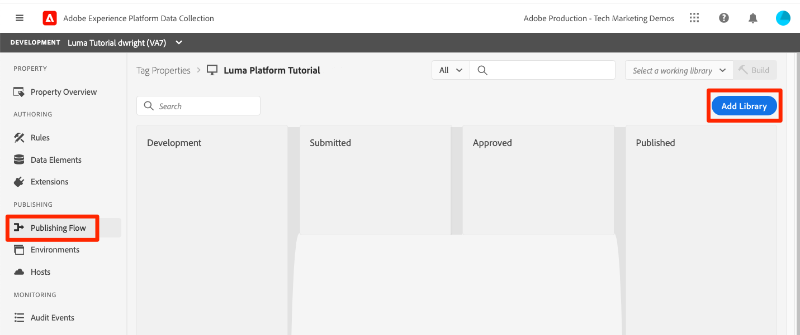
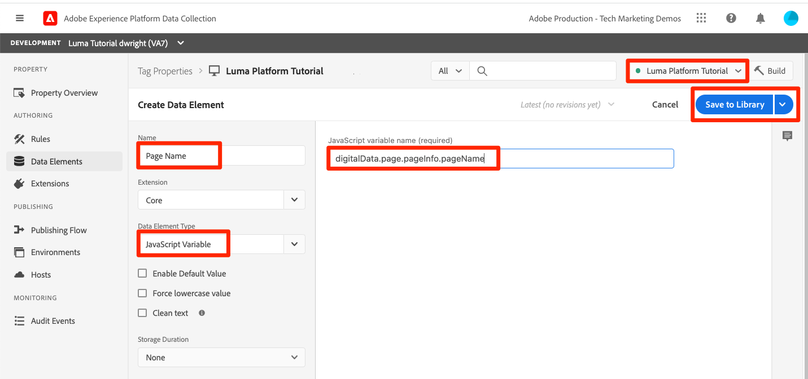

# Infoga strömmande data

<!--1hr-->

I den här lektionen strömmar du data med Adobe Experience Platform Web SDK.

Det finns två huvudsakliga uppgifter vi måste utföra i gränssnittet för datainsamling:

* Vi måste implementera Web SDK på Lumas webbplats för att skicka data om besökaraktivitet från webbplatsen till Adobe Edge-nätverket. Vi ska göra en enkel implementering med hjälp av taggar (tidigare Launch)

* Vi måste konfigurera en datastream som meddelar Edge nätverk var data ska vidarebefordras. Vi kommer att konfigurera den så att den skickar data till vår `Luma Web Events`-datauppsättning i vår plattformssandlåda.

**Datatekniker** måste importera strömmande data utanför den här självstudien. När du implementerar Adobe Experience Platform SDK för webb eller mobiler är det oftast en webb- eller mobilutvecklare som arbetar med att skapa datalager och taggegenskapskonfigurationen.

Innan du börjar övningarna ska du titta på dessa två korta videoklipp för att lära dig mer om strömmande data och Web SDK:

>[!VIDEO](https://video.tv.adobe.com/v/28425?learn=on&enablevpops)

>[!VIDEO](https://video.tv.adobe.com/v/34141?learn=on&enablevpops)

>[!NOTE]
>
>Den här självstudien fokuserar på direktuppspelad inmatning från webbplatser med Web SDK, men du kan även direktuppspela data med [Adobe Mobile SDK](https://developer.adobe.com/client-sdks/documentation/), [Apache Kafka Connect](https://github.com/adobe/experience-platform-streaming-connect) och andra mekanismer.

## Behörigheter krävs

I lektionen [Konfigurera behörigheter](configure-permissions.md) ställer du in alla åtkomstkontroller som krävs för att slutföra lektionen.

<!--
* Permission items **[!UICONTROL Launch]** > **[!UICONTROL Property Rights]** > **[!UICONTROL Approve]**, **[!UICONTROL Develop]**, **[!UICONTROL Manage Environments]**, **[!UICONTROL Manage Extensions]**, and **[!UICONTROL Publish]**
* Permission item **[!UICONTROL Launch]** > **[!UICONTROL Company Rights]** > **[!UICONTROL Manage Properties]**
* User-role access to the `Luma Tutorial Launch` product profile
* Admin-role access to the `Luma Tutorial Launch` product profile
* Permission items **[!UICONTROL Platform]** > **[!UICONTROL Data Ingestion]** > **[!UICONTROL View Sources]** and **[!UICONTROL Manage Sources]**
* Permission items **[!UICONTROL Platform]** > **[!UICONTROL Data Management]** > **[!UICONTROL View Datasets]** and **[!UICONTROL Manage Datasets]**
* Permission items **[!UICONTROL Platform]** > **[!UICONTROL Profiles]** > **[!UICONTROL View Profiles]**, **[!UICONTROL Manage Profiles]** and **[!UICONTROL Export Audience Segment]**
* Permission item **[!UICONTROL Platform]** > **[!UICONTROL Sandbox Administration]** > **[!UICONTROL View Sandboxes]**
* Permission item **[!UICONTROL Platform]** > **[!UICONTROL Sandboxes]** > `Luma Tutorial`
* User-role access to the `Luma Tutorial Platform` product profile
-->

<!--## Create a streaming source

1. Log into the [Experience Platform  user interface](https://experience.adobe.com/platform/)
1. Go to **[!UICONTROL Sources]** in the left navigation
1. Filter the list by selecting **[!UICONTROL Streaming]**
1. In the **[!UICONTROL HTTP API]** section, select the **[!UICONTROL Configure]** button
    
1. On the **[!UICONTROL Authentication]** step, enter `Luma Web Events Source` as the **[!UICONTROL Account name]** and select the **[!UICONTROL Connect to source]** button (we don't need to enable authentication since the data will be originating from website visitors)
    
1. Once connected, select the **[!UICONTROL Next]** button to proceed to the next step in the workflow
1. On the **[!UICONTROL Select data]** step, choose **[!UICONTROL Existing Dataset]**, select your `Luma Web Events Dataset`, and then select the **[!UICONTROL Next]** button
    
1. On the **[!UICONTROL Dataflow detail]** step, select the **[!UICONTROL Next]** button:
    
    <!--What is a good practice for naming the data flow vs the source-->
<!--
1. On the **[!UICONTROL Review]** step, review your source details and select the **[!UICONTROL Finish]** button:
    
-->

## Konfigurera datastream

Först konfigurerar vi datastream. En datastream talar om för Adobe Edge-nätverket var data ska skickas när de har tagits emot från SDK webbsamtal. Vill du till exempel skicka data till Experience Platform, Adobe Analytics eller Adobe Target? Datastreams hanteras i användargränssnittet för datainsamling (tidigare Launch) och är viktiga för datainsamling med Web SDK.

Så här skapar du din [!UICONTROL datastream]:

1. Logga in i [Experience Platform Data Collection-användargränssnittet](https://experience.adobe.com/launch/)
   <!--when will the edge config go live?-->

1. Välj **[!UICONTROL Datastreams]** i den vänstra navigeringen
1. Markera knappen **[!UICONTROL New Datastream]** i det övre högra hörnet

   

1. Ange `Luma Platform Tutorial` för **[!UICONTROL Friendly Name]** (lägg till ditt namn i slutet om flera personer från ditt företag använder den här självstudiekursen)
1. Markera knappen **[!UICONTROL Save]**

   

På nästa skärm anger du var du vill skicka data. Skicka data till Experience Platform:

1. Växla på **[!UICONTROL Adobe Experience Platform]** om du vill visa ytterligare fält
1. För **[!UICONTROL Sandbox]** väljer du `Luma Tutorial`
1. För **[!UICONTROL Event Dataset]** väljer du `Luma Web Events Dataset`
1. Om du använder andra Adobe-program kan du utforska de andra avsnitten och se vilken information som krävs i Edge Configuration för dessa andra lösningar. Kom ihåg att Web SDK utvecklades inte bara för att strömma data till Experience Platform utan även för att ersätta alla tidigare JavaScript-bibliotek som används av andra Adobe-program. Edge Configuration används för att ange kontoinformationen för varje program som du vill skicka data till.
1. Välj **[!UICONTROL Save]**
   

När Edge Configuration har sparats visas tre miljöer för utveckling, mellanlagring och produktion. Ytterligare utvecklingsmiljöer kan läggas till:

Alla tre miljöerna innehåller den plattformsinformation du just angav. Dessa uppgifter kan dock konfigureras på olika sätt i olika miljöer. Du kan till exempel låta varje miljö skicka data till en annan plattformssandlåda. I den här självstudiekursen kommer vi inte att göra någon ytterligare anpassning av vår datastream.

## Installera SDK-tillägget för webben

### Lägg till en egenskap

Först måste vi skapa en taggegenskap (tidigare en taggegenskap). En egenskap är en behållare för alla JavaScript, regler och andra funktioner som krävs för att samla in information från en webbsida och skicka den till olika platser.

Skapa en egenskap:

1. Gå till **[!UICONTROL Properties]** i den vänstra navigeringen
1. Markera knappen **[!UICONTROL New Property]**
   
1. Som **[!UICONTROL Name]** anger du `Luma Platform Tutorial` (lägg till ditt namn i slutet om flera personer från ditt företag använder den här självstudiekursen)
1. Ange `enablementadobe.com` som **[!UICONTROL Domains]** (förklaras senare)
1. Välj **[!UICONTROL Save]**
   

<!--
After saving the property, you might see an error message like the one below. If so, this is because you don't actually have access to the property you just created. To fix this, we need to go to the Admin Console to give yourself access:
    

To give yourself access to the property:

1. In a separate browser tab, log into the [Admin Console](https://adminconsole.adobe.com/)
1. Go to **[!UICONTROL Products]** from the top navigation
1. Select **[!UICONTROL Adobe Experience Platform Launch]** on the left navigation
1. Go to your `Luma Tutorial Launch` product profile
1. Go to the **[!UICONTROL Permissions]** tab
1. On the **[!UICONTROL Properties]** row, select **[!UICONTROL Edit]**
    
1. Select the "+" icon to move your `Luma Platform Tutorial` property to the right-hand side and select the **[!UICONTROL Save]** button to update the permissions
   
    

Now switch back to your browser tab with the Data Collection interface still open. Reload the page and the `Luma Platform Tutorial` property should display in the list. Select to open the property:

-->

## Lägg till Web SDK-tillägget

Nu när du har en egenskap kan du lägga till Web SDK med ett tillägg. Ett tillägg är ett kodpaket som utökar gränssnittet och funktionerna i datainsamlingen. Så här lägger du till tillägget:

1. Öppna taggegenskapen
1. Gå till **[!UICONTROL Extensions]** i den vänstra navigeringen
1. Gå till fliken **[!UICONTROL Catalog]**
1. Det finns många tillägg för taggar. Filtrera katalogen med termen `Web SDK`
1. Välj knappen **[!UICONTROL Install]** i tillägget **[!UICONTROL Adobe Experience Platform Web SDK]**
   
1. Det finns flera konfigurationer tillgängliga för Web SDK-tillägget, men det finns bara två som vi kommer att konfigurera för den här självstudiekursen. Uppdatera **[!UICONTROL Edge Domain]** till `data.enablementadobe.com`. Med den här inställningen kan du ange cookies från första part med din Web SDK-implementering, vilket rekommenderas. Senare i den här lektionen mappar du en webbplats på domänen `enablementadobe.com` till din taggegenskap. CNAME för domänen `enablementadobe.com` har redan konfigurerats så att `data.enablementadobe.com` kan vidarebefordra till Adobe-servrar. När du implementerar Web SDK på din egen webbplats måste du skapa en CNAME för dina egna datainsamlingssyften, till exempel `data.YOUR_DOMAIN.com`
1. I listrutan **[!UICONTROL Datastream]** väljer du `Luma Platform Tutorial`-datastream.
1. Titta gärna på de andra konfigurationsalternativen (men ändra dem inte!) och välj sedan **[!UICONTROL Save]**
   <!--is edge domain required for first party? when will it break?-->
   <!--any other fields that should be highlighted-->
   

## Skapa en regel för att skicka data

Nu ska vi skapa en regel för att skicka data till plattformen. En regel är en kombination av händelser, villkor och åtgärder som talar om för taggarna att göra något. Så här skapar du en regel:

1. Gå till **[!UICONTROL Rules]** i den vänstra navigeringen
1. Markera knappen **[!UICONTROL Create New Rule]**
   
1. Namnge regeln `All Pages - Library Loaded`
1. Under **[!UICONTROL Events]** väljer du knappen **[!UICONTROL Add]**
   
1. Använd **[!UICONTROL Core]** **[!UICONTROL Extension]** och välj **[!UICONTROL Library Loaded (Page Top)]** som **[!UICONTROL Event Type]**. Den här inställningen innebär att vår regel aktiveras när startbiblioteket läses in på en sida.
1. Välj **[!UICONTROL Keep Changes]** för att återgå till huvudregelskärmen
   
1. Lämna **[!UICONTROL Conditions]** tomt eftersom vi vill att den här regeln ska utlösas på alla sidor, enligt det namn vi gav den
1. Under **[!UICONTROL Actions]** väljer du knappen **[!UICONTROL Add]**
1. Använd **[!UICONTROL Adobe Experience Platform Web SDK]** **[!UICONTROL Extension]** och välj **[!UICONTROL Send Event]** som **[!UICONTROL Action Type]**
1. Till höger väljer du **[!UICONTROL web.webpagedetails.pageViews]** i listrutan **[!UICONTROL Type]**. Detta är ett av XDM-fälten i `Luma Web Events Schema`
1. Välj **[!UICONTROL Keep Changes]** för att återgå till huvudregelskärmen
   
1. Välj **[!UICONTROL Save]** om du vill spara regeln\
   

## Publicera regeln i ett bibliotek

Därefter ska vi publicera regeln i vår utvecklingsmiljö så att vi kan verifiera att den fungerar.

<!--
There are a few quick steps we must take in the **[!UICONTROL Publishing]** section of Launch.

### Create a host

Launch libraries can be hosted on Adobe's Content Delivery Network (CDN) or on your own servers. In this tutorial, we will use Adobe's CDN since it is faster to set up:

1. Go to **[!UICONTROL Hosts]** in the left navigation
1. Select the **[!UICONTROL Create New Host]** button
       
1. For the **[!UICONTROL Name]**, enter `Adobe CDN`
1. For the **[!UICONTROL Type]**, select **[!UICONTROL Managed by Adobe]**
1. Select the **[!UICONTROL Save]** button to complete the setup of the host
       

### Create an environment

Environments allow you to have different versions of a library in different publishing environments to accommodate your publishing workflow. For example, the fully tested version of your library can be published to a Production environment, while new changes are being created in a Development environment. You can also use different hosts for each environment. To create an environment:

1. Go to **[!UICONTROL Environments]** in the left navigation
1. Select the **[!UICONTROL Create New Environment]** button
     
1. Under **[!UICONTROL Development]** select **[!UICONTROL Select]**   
     
1. For the **[!UICONTROL Name]**, enter `Development`
1. For the **[!UICONTROL Select Host]** dropdown, select `Adobe CDN`
1. Select the **[!UICONTROL Save]** button to complete the setup of the environment
    
1. You will see a modal with URL and other implementation details of this library. These are critical for a real Launch implementation, but we don't need to worry about them for this tutorial. Select the **[!UICONTROL Close]** button to exit the modal.

### Create and publish the library

Now let's bundle the contents of our property&mdash;currently an extension and a rule&mdash;into a library. 
-->

Så här skapar du ett bibliotek:

1. Gå till **[!UICONTROL Publishing Flow]** i den vänstra navigeringen
1. Välj **[!UICONTROL Add Library]**
   
1. Ange `Luma Platform Tutorial` för **[!UICONTROL Name]**
1. För **[!UICONTROL Environment]** väljer du `Development`
1. Välj knappen **[!UICONTROL Add All Changed Resources]**. (Förutom tillägget [!UICONTROL Adobe Experience Platform Web SDK] och regeln `All Pages - Library Loaded` visas även tillägget [!UICONTROL Core] som innehåller den bas-JavaScript som krävs för alla webbegenskaper för Launch.)
1. Markera knappen **[!UICONTROL Save & Build for Development]**
   

Det kan ta några minuter att skapa biblioteket och när det är klart visas en grön punkt till vänster om biblioteksnamnet:

Som du ser på skärmen [!UICONTROL Publishing Flow] finns det mycket mer i publiceringsprocessen som ligger utanför den här självstudiekursen. Vi kommer bara att använda ett enda bibliotek i vår utvecklingsmiljö.

## Validera data i begäran

### Lägg till Adobe Experience Platform Debugger

Experience Platform Debugger är ett tillägg för Chrome- och Firefox-webbläsare som hjälper dig att se Adobe-tekniken som är implementerad på dina webbsidor. Ladda ned den version du föredrar:

* [Firefox-tillägg](https://addons.mozilla.org/sv-SE/firefox/addon/adobe-experience-platform-dbg/)
* [Chrome-tillägg](https://chrome.google.com/webstore/detail/adobe-experience-platform/bfnnokhpnncpkdmbokanobigaccjkpob)

Om du aldrig har använt Felsökning tidigare - och den här är en annan än den tidigare Adobe Experience Cloud Debugger - kan du titta på den här översiktsvideon med fem minuter:

>[!VIDEO](https://video.tv.adobe.com/v/32156?learn=on&enablevpops)

### Öppna Lumas webbplats

I den här självstudiekursen använder vi en öppen version av demonstrationswebbplatsen för Luma. Vi öppnar den och bokmärker den:

1. Öppna [Luma-webbplatsen](https://luma.enablementadobe.com/content/luma/us/en.html) på en ny flik i webbläsaren.
1. Bokmärk sidan så att den kan användas i resten av kursen

Den här värdbaserade webbplatsen är anledningen till att vi använde `enablementadobe.com` i fältet [!UICONTROL Domains] i vår ursprungliga taggegenskapskonfiguration och varför vi använde `data.enablementadobe.com` som vår förstapartsdomän i tillägget [!UICONTROL Adobe Experience Platform Web SDK]. Jag hade en plan!

### Använd Experience Platform Debugger för att mappa till taggegenskapen

Experience Platform Debugger har en cool funktion som gör att du kan ersätta en befintlig taggegenskap med en annan. Detta är användbart för validering och gör att vi kan hoppa över många implementeringssteg i den här självstudiekursen.

1. Kontrollera att Luma-webbplatsen är öppen och välj ikonen för Experience Platform Debugger-tillägget
1. Felsökaren öppnar och visar information om den hårdkodade implementeringen, som inte har med den här självstudiekursen att göra (du kan behöva läsa in Luma-webbplatsen igen när du har öppnat Felsökning)
1. Bekräfta att felsökaren är **[!UICONTROL Connected to Luma]** enligt bilden nedan och välj sedan ikonen **[!UICONTROL lock]** för att låsa felsökaren till Luma-webbplatsen.
1. Välj knappen **[!UICONTROL Sign In]** längst upp till höger för att autentisera.
1. Gå nu till **[!UICONTROL Launch]** i den vänstra navigeringen
1. Välj fliken Konfiguration
1. Öppna listrutan **[!UICONTROL Actions]** till höger om den plats där **[!UICONTROL Page Embed Codes]** visas och välj **[!UICONTROL Replace]**
   
1. Eftersom du är autentiserad kommer felsökaren att hämta in de tillgängliga egenskaperna och miljöerna för Launch. Välj din `Luma Platform Tutorial`-egenskap
1. Välj din `Development`-miljö
1. Markera knappen **[!UICONTROL Apply]**
   
1. Luma-webbplatsen kommer nu att läsa in _igen med din taggegenskap_. Hjälp, jag har blivit hackad! Skämtar bara.
   
1. Gå till **[!UICONTROL Summary]** i den vänstra navigeringen för att se information om din [!UICONTROL Launch]-egenskap
   
1. Gå nu till **[!UICONTROL AEP Web SDK]** i den vänstra navigeringen för att se **[!UICONTROL Network Requests]**
1. Öppna raden **[!UICONTROL events]**

   
1. Observera hur vi kan se händelsetypen `web.webpagedetails.pageView` som vi angav i vår [!UICONTROL Send Event] -åtgärd och andra variabler som är klara att användas enligt formatet `AEP Web SDK ExperienceEvent Mixin`
   
1. Den här typen av begärandeinformation visas också på fliken **Nätverk** i webbläsaren. Öppna den och läs in sidan igen. Filtrera efter samtal med `interact` för att hitta samtalet, markera det och titta sedan på fliken **Huvuden** i området **Begär nyttolast**.
   
1. Gå till fliken **Svar** och notera hur ECID-värdet inkluderas i svaret. Kopiera det här värdet så som du kommer att använda det för att validera profilinformationen i nästa övning.
   

## Validera data i Experience Platform

Du kan validera att data landar i Platform genom att titta på de datagrupper som kommer in i `Luma Web Events Dataset`. (Jag vet, det kallas dataöverföring men nu säger jag att det kommer i grupper! Den direktuppspelas i realtid till Profile, så den kan användas för segmentering och aktivering i realtid, men skickas gruppvis var 15:e minut till datasjön.)

Så här validerar du data:

1. Gå till **[!UICONTROL Datasets]** i den vänstra navigeringen i användargränssnittet för plattformen
1. Öppna `Luma Web Events Dataset` och bekräfta att en batch har kommit fram. Kom ihåg att de skickas var 15:e minut, så du kanske måste vänta på att gruppen ska visas.
1. Markera knappen **[!UICONTROL Preview dataset]**
   
1. Observera hur du kan markera olika fält i schemat till vänster i förhandsgranskningen för att förhandsgranska dessa specifika datapunkter:
   

Du kan också bekräfta att den nya profilen visas:

1. Gå till **[!UICONTROL Profiles]** i den vänstra navigeringen i användargränssnittet för plattformen
1. Markera namnområdet **[!UICONTROL ECID]** och sök efter ditt ECID-värde (kopiera det från svaret). Profilen kommer att ha ett eget id, som är skilt från ECID.
1. Välj **[!UICONTROL Profile ID]** för att öppna profilen
   
1. Välj fliken **[!UICONTROL Events]** för att visa de sidor du visade
   \
   <!---->

## Lägg till anpassade data till händelsen

### Skapa ett dataelement för sidnamn

1. I tagggränssnittet för datainsamling, i det övre högra hörnet av egenskapen `Luma Platform Tutorial`, öppnar du listrutan **[!UICONTROL Select a Working Library]** och väljer ditt `Luma Platform Tutorial`-bibliotek. Den här inställningen gör det enklare att publicera ytterligare uppdateringar till vårt bibliotek.
1. Gå nu till **[!UICONTROL Data Elements]** i den vänstra navigeringen
1. Markera knappen **[!UICONTROL Create New Data Element]**

   
1. Ange `Page Name` som **[!UICONTROL Name]**
1. Som **[!UICONTROL Data Element Type]** väljer du `JavaScript Variable`
1. Ange `digitalData.page.pageInfo.pageName` som **[!UICONTROL JavaScript variable name]**
1. Markera rutorna för **[!UICONTROL Force lowercase value]** och **[!UICONTROL Clean text]** om du vill standardisera värdeformatet.
1. Kontrollera att `Luma Platform Tutorial` är markerat som arbetsbibliotek
1. Välj **[!UICONTROL Save to Library]**
   

### Mappa sidnamnet till XDM-objektets dataelement

Nu ska vi mappa vårt sidnamn till Web SDK.

>[!IMPORTANT]
>
>För att kunna utföra den här uppgiften måste vi se till att din användare först har tillgång till sandlådan Prod. Om du inte redan har åtkomst till Prod-sandlådan från en annan produktprofil öppnar du snabbt din `Luma Tutorial Platform`-profil och lägger till behörighetsobjektet **[!UICONTROL Sandboxes]** > **[!UICONTROL Prod]**. När du har gjort det kan du göra en SKIFT-omläsning på dataelementsidan för att rensa cachen
>

På sidan **[!UICONTROL Data Elements]**:

1. Skapa ett nytt dataelement
1. Ange `XDM Object` som **[!UICONTROL Name]**
1. Som **[!UICONTROL Extension]** väljer du `Adobe Experience Platform Web SDK`
1. Som **[!UICONTROL Data Element Type]** väljer du `XDM object`
1. Som **[!UICONTROL Sandbox]** väljer du din `Luma Tutorial`-sandlåda
1. Som **[!UICONTROL Schema]** väljer du `Luma Web Events Schema`
1. Markera fältet `web.webPageDetails.name`
1. Som **[!UICONTROL Value]** markerar du ikonen för att öppna det modala dataelementet och väljer `Page Name` -dataelementet
1. Välj **[!UICONTROL Save to Library]**
   

Samma process används för att mappa ytterligare anpassade data på webbplatsen till XDM-fält.

### Lägg till XDM-data till åtgärden Skicka händelse

Nu när du har data mappade till XDM-fält kan du inkludera dem i åtgärden Skicka händelse:

1. Gå till skärmen **[!UICONTROL Rules]**
1. Öppna din `All Pages - Library Loaded`-regel
1. Öppna åtgärden `Adobe Experience Platform Web SDK - Send Event`
1. Som **[!UICONTROL XDM data]** markerar du ikonen för att öppna det modala dataelementet och väljer `XDM Object` -dataelementet
1. Markera knappen **[!UICONTROL Keep Changes]**
   
1. Eftersom `Luma Platform Tutorial` har valts som ditt arbetsbibliotek för de senaste övningarna har dina senaste ändringar sparats direkt i biblioteket. I stället för att behöva publicera ändringarna via skärmen Publiceringsflöde kan du bara öppna listrutan med den blå knappen och välja **[!UICONTROL Save to Library and Build]**
   

Detta börjar bygga upp ett nytt taggbibliotek med de tre ändringar du just gjorde.

### Validera XDM-data

Nu bör du kunna läsa in Lumas hemsida igen, när den mappas till taggegenskapen med hjälp av felsökaren som du lärde dig tidigare, och se att sidnamnsfältet fylls i i i begäran!

Du kan också validera de sidnamnsdata som togs emot i Platform genom att förhandsgranska datauppsättningen och profilen.

## Skicka ytterligare identiteter

Din implementering av Web SDK skickar nu händelser med Experience Cloud ID (ECID) som primär identifierare. ECID genereras automatiskt av Web SDK och är unikt per enhet och webbläsare. En enskild kund kan ha flera ECID:n beroende på vilken enhet och webbläsare de använder. Så hur får vi en enhetlig bild av den här kunden och kan länka deras onlineaktivitet till våra CRM-, Loyalty- och Offline Purchase-data? Det gör vi genom att samla in ytterligare identiteter under deras session och på ett avgörande sätt länka deras profil via identitetssammanfogning.

Om du kommer ihåg det, nämnde jag att vi skulle använda ECID och CRM-ID som identiteter för våra webbdata i lektionen [Kartidentitet](map-identities.md). Så vi samlar in CRM-ID:t med Web SDK!

### Lägg till dataelement för CRM-ID

Först lagrar vi CRM-ID:t i ett dataelement:

1. Lägg till ett dataelement med namnet `CRM Id` i tagggränssnittet
1. Som **[!UICONTROL Data Element Type]** väljer du **[!UICONTROL JavaScript Variable]**
1. Ange `digitalData.user.0.profile.0.attributes.username` som **[!UICONTROL JavaScript variable name]**
1. Välj knappen **[!UICONTROL Save to Library]** (`Luma Platform Tutorial` bör fortfarande vara ditt arbetsbibliotek)
   

### Lägg till CRM-ID i dataelementet för identitetskartan

Nu när vi har hämtat CRM-ID-värdet måste vi associera det med ett särskilt dataelement som kallas [!UICONTROL Identity Map]-dataelement:

1. Lägg till ett dataelement med namnet `Identities`
1. Som **[!UICONTROL Extension]** väljer du **[!UICONTROL Adobe Experience Platform Web SDK]**
1. Som **[!UICONTROL Data Element Type]** väljer du **[!UICONTROL Identity map]**
1. Som **[!UICONTROL Namespace]** anger du `Luma CRM Id`, det [!UICONTROL namespace] vi skapade i en tidigare lektion

   >[!WARNING]
   >
   >Med Adobe Experience Platform Web SDK-tillägget version 2.2 kan du välja namnutrymme från en ifylld listruta med de faktiska värdena i ditt plattformskonto. Tyvärr är den här funktionen inte &quot;sandlådemedveten&quot; än och därför kanske inte värdet `Luma CRM Id` visas i listrutan. Detta kan hindra dig från att slutföra den här övningen. Vi skickar en lösning när vi har bekräftat.

1. Som **[!UICONTROL ID]** markerar du ikonen för att öppna det modala dataelementet och väljer `CRM Id` -dataelementet
1. Som **[!UICONTROL Authenticated State]** väljer du **[!UICONTROL Authenticated]**
1. Kontrollera **[!UICONTROL Primary]**

   >[!TIP]
   >
   > Adobe rekommenderar att du skickar identiteter som representerar en person, till exempel `Luma CRM Id`, som [!UICONTROL primary]-identitet.
   >
   > Om identitetskartan innehåller personidentifieraren (till exempel `Luma CRM Id`) blir personidentifieraren [!UICONTROL primary]-identiteten. Annars blir `ECID` [!UICONTROL primary]-identiteten.

1. Välj knappen **[!UICONTROL Save to Library]** (`Luma Platform Tutorial` bör fortfarande vara ditt arbetsbibliotek)
   

>[!NOTE]
>
>Du kan skicka flera identifierare med datatypen [!UICONTROL Identity map].

### Lägg till datamappningsdataelementet för identitet i XDM-objektet

Det finns ytterligare ett dataelement som måste uppdateras - XDM-objektets dataelement. Det kan verka konstigt att behöva uppdatera tre separata dataelement för att skicka den här identiteten, men den här processen är utformad för att skalas för flera identiteter. Oroa dig inte, vi är nästan klara med den här lektionen!

1. Öppna XDM-objektdataelementet
1. Öppna fältet IdentityMap XDM
1. Som **[!UICONTROL Data element]** markerar du ikonen för att öppna det modala dataelementet och väljer `Identities` -dataelementet
1. Eftersom `Luma Platform Tutorial` har valts som ditt arbetsbibliotek för de senaste övningarna har dina senaste ändringar sparats direkt i biblioteket. I stället för att behöva publicera ändringarna via skärmen Publiceringsflöde kan du öppna listrutan med den blå knappen och välja **[!UICONTROL Save to Library and Build]**
   

### Validera identiteten

Så här verifierar du att CRM-ID:t nu skickas av Web SDK:

1. Öppna [Luma-webbplatsen](https://luma.enablementadobe.com/content/luma/us/en.html)
1. Mappa den till taggegenskapen med hjälp av Felsökning, enligt tidigare instruktioner
1. Välj länken **Inloggning** längst upp till höger på Luma-webbplatsen
1. Logga in med inloggningsuppgifterna `test@adobe.com`/`test`
1. Kontrollera Experience Platform Web SDK-anropet i felsökaren (**[!UICONTROL Adobe Experience Platform Web SDK]** > **[!UICONTROL Network Requests]** > **[!UICONTROL events]** för den senaste begäran) när du har autentiserats och se `lumaCrmId`:
   
1. Slå upp användarprofilen med ECID-namnutrymmet och ange ett nytt värde. I profilen visas CRM-ID:t och även lojalitets-ID:t samt profilinformation som namn och telefonnummer. Alla identiteter och data har sammanfogats till en enda kundprofil i realtid!
   

## Ytterligare resurser

* [Implementera Adobe Experience Cloud med webb-SDK](/help/tutorial-web-sdk/overview.md)
* [Dokumentation för direktuppspelad inmatning](https://experienceleague.adobe.com/docs/experience-platform/ingestion/streaming/overview.html?lang=sv)
* [API-referens för direktuppspelad inmatning](https://developer.adobe.com/experience-platform-apis/references/streaming-ingestion/)

Snyggt jobb! Det var mycket information om Web SDK och Launch. Det är mycket mer involverat i en fullfjädrad implementering, men det är grunderna som hjälper dig att komma igång och se resultaten i Platform.

>[!NOTE]
>
>Nu när du är klar med lektionen Direktuppspelningsinmatning kan du ta bort sandlådan [!UICONTROL Prod] från din `Luma Tutorial Platform`-produktprofil

Datatekniker, om du vill kan du hoppa över lektionen [kör frågor](run-queries.md).

Dataarkitekturer, du kan gå vidare till [sammanfogningsprinciper](create-merge-policies.md)!
