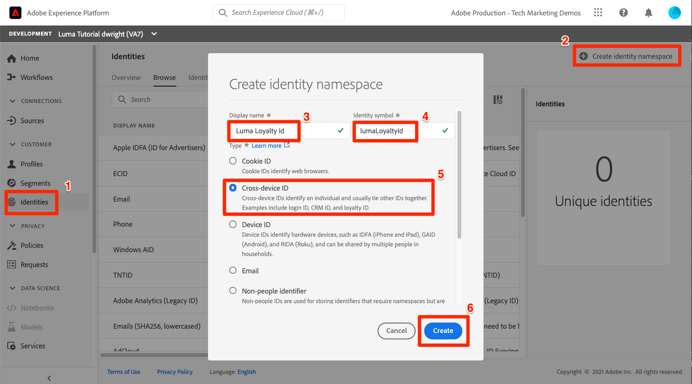

# Mappa identiteter

<!-- 30 min-->

I den här lektionen ska vi skapa identitetsnamnutrymmen och lägga till identitetsfält i våra scheman. När vi gjort det kan vi också slutföra schemarelationerna från föregående lektion.

Adobe Experience Platform identitetstjänst hjälper er att få en bättre bild av era kunder och deras beteenden genom att överbrygga identiteter mellan olika enheter och system, så att ni kan leverera slagkraftiga, personliga digitala upplevelser i realtid. Identitetsfält och namnutrymmen är den kombination som förenar olika datakällor för att skapa en 360-graders kundprofil i realtid.

**Dataarkitekter** måste mappa identiteter utanför den här självstudien.

Titta på den här korta videon om du vill veta mer om din identitet i Adobe Experience Platform innan du börjar övningarna:
>[!VIDEO](https://video.tv.adobe.com/v/27841?learn=on)

>[!NOTE]
>
>Identitetsfält krävs bara om du skapar kundprofiler i realtid. De behövs inte om du bara matar in data i sjön.

<!--explain identity maps-->
<!--explain the strategy behind the identity selection, how these identities will join all the data together-->

## Behörigheter krävs

I lektionen [Konfigurera behörigheter](configure-permissions.md) ställer du in alla åtkomstkontroller som krävs för att slutföra lektionen.

<!--
* Permission items **[!UICONTROL Identity Management]** > **[!UICONTROL View Identity Namespaces]** and **[!UICONTROL Manage Identity Namespaces]**
* Permission item **[!UICONTROL Data Modeling]** > **[!UICONTROL View Schemas]** and **[!UICONTROL Manage Schemas]**
* Permission item **[!UICONTROL Sandboxes]** > `Luma Tutorial`
* User-role access to the `Luma Tutorial Platform` product profile
* Developer-role access to the `Luma Tutorial Platform` product profile (for API)
-->

## Skapa namnområde för identitet

I den här övningen skapar vi identitetsnamnutrymmen för Lumas anpassade identitetsfält, `loyaltyId`, `crmId` och `productSku`. Identitetsnamnutrymmen spelar en viktig roll när det gäller att skapa kundprofiler i realtid, eftersom två matchande värden i samma namnutrymme gör att två datakällor kan bilda ett identitetsdiagram.


### Skapa namnutrymmen i användargränssnittet

Vi börjar med att skapa ett namnutrymme för Luma Loyalty Schema:

1. Gå till **[!UICONTROL Identities]** i den vänstra navigeringen i användargränssnittet för plattformen
1. Du kommer att märka att det finns flera färdiga ID-namnutrymmen. Markera knappen **[!UICONTROL Create identity namespace]**
1. Ange följande information:

   | Fält | Värde |
   |---------------|-----------|
   | Visningsnamn | Lojalitets-ID för Luma |
   | Identitetssymbol | lumaLoyaltyId |
   | Typ | Flera enheter |

1. Välj **[!UICONTROL Create]**

   

Konfigurera nu ett annat namnutrymme för Luma-produktkatalogschemat med följande information:

| Fält | Värde |
|---------------|-----------|
| Visningsnamn | Luma Product SKU |
| Identitetssymbol | lumaProductSKU |
| Typ | Identifierare för icke-personer |


## Skapa namnområde för identitet med API

Vi skapar CRM-namnområdet via API.

>[!NOTE]
>
>Om du föredrar att hoppa över API-övningarna kan du skapa CRM-namnutrymmet via den gränssnittsmetod du använde med följande information:
>
> 1. Använd `Luma CRM Id` som **[!UICONTROL Display name]**
> 1. Använd `lumaCrmId` som **[!UICONTROL Identity symbol]**
> 1. Som **[!UICONTROL Type]** använder du Enhetsövergripande

Låt oss skapa identitetsnamnområdet `Luma CRM Id`:

1. Hämta [identitetstjänsten.postman_collection.json](https://raw.githubusercontent.com/adobe/experience-platform-postman-samples/master/apis/experience-platform/Identity%20Service.postman_collection.json) till mappen `Luma Tutorial Assets`
1. Importera samlingen till [!DNL Postman]
1. Om du inte har någon åtkomsttoken öppnar du begäran **[!DNL OAuth: Request Access Token]** och väljer **Skicka** för att begära en ny åtkomsttoken.
1. Välj begäran **[!UICONTROL Identity Service]> [!UICONTROL Identity Namespace] > [!UICONTROL Create a new identity namespace].**
1. Klistra in följande som [!DNL Body] för begäran:

   ```json
   {
       "name": "Luma CRM Id",
       "code": "lumaCrmId",
       "idType": "Cross_device"
   }
   ```

1. Tryck på knappen **Skicka** så får du ett **200 OK**-svar:

   

Om du återgår till användargränssnittet bör du nu se dina tre nya anpassade namnutrymmen:


## Etikettera identitetsfält i scheman

Nu när vi har våra namnutrymmen är nästa steg att uppdatera våra scheman för att märka våra identitetsfält.


### Etikettera XDM-fält för primär identitet

Alla scheman som används med kundprofilen i realtid måste ha en primär identitet angiven. Och varje inskickad post måste ha ett värde för det fältet.

Låt oss lägga till en primär identitet för `Luma Loyalty Schema`:

1. Öppna `Luma Loyalty Schema`
1. Välj `Luma Identity profile field group`
1. Markera fältet `loyaltyId`
1. Markera rutan **[!UICONTROL Identity]**
1. Markera rutan **[!UICONTROL Primary Identity]** också
1. Välj namnområdet `Luma Loyalty Id` i listrutan **[!UICONTROL Identity namespaces]**
1. Välj **[!UICONTROL Apply]**
1. Välj **[!UICONTROL Save]**

   

Upprepa processen för ett annat schema:

1. I `Luma CRM Schema` anger du `crmId`-fältet som primär identitet med namnutrymmet `Luma CRM Id`
1. I `Luma Offline Purchase Events Schema` anger du `loyaltyId`-fältet som primär identitet med namnutrymmet `Luma Loyalty Id`
1. I `Luma Product Catalog Schema` anger du `productSku`-fältet som primär identitet med namnutrymmet `Luma Product SKU`

>[!NOTE]
>
>Data som samlas in med Web SDK är ett undantag från den vanliga metoden att etikettera identitetsfält i schemat. I Web SDK används identitetskartan för att etikettera identiteterna *på implementeringssidan*, och därför bestämmer vi identiteterna för `Luma Web Events Schema` när vi implementerar Web SDK på Luma-webbplatsen. I den lektionen samlar vi in Experience Cloud Visitor-ID (ECID) som primärt id och crmId som ett sekundärt id.

Med vårt urval av primära identiteter är det tydligt att se hur `Luma CRM Schema` kan ansluta till `Luma Offline Purchase Events Schema` eftersom båda använder `loyaltyId` som identifierare. Men hur kan vi koppla våra offlineköp till onlinebeteende? Hur kan vi klassificera de produkter som köpts med vår produktkatalog? Ytterligare identitetsfält och schemarelationer kommer att användas.

<!--use a visual-->

### Etikettera XDM-fält för sekundär identitet

Flera identitetsfält kan läggas till i ett schema. Icke-primära identiteter kallas ofta sekundära identiteter. Om du vill ansluta offlineköp till onlinebeteende lägger vi till crmId som en sekundär identifierare till `Luma Loyalty Schema` och senare i webbhändelsedata. Vi uppdaterar `Luma Loyalty Schema`:

1. Öppna `Luma Loyalty Schema`
1. Välj `Luma Identity Profile Field group`
1. Markera fältet `crmId`
1. Markera rutan **[!UICONTROL Identity]**
1. Välj namnområdet `Luma CRM Id` i listrutan **[!UICONTROL Identity namespaces]**
1. Markera **[!UICONTROL Apply]** och välj sedan knappen **[!UICONTROL Save]** för att spara ändringarna

   

## Slutför schemarelationerna

Nu när vi har etiketterat våra identitetsfält kan vi slutföra konfigurationen av schemarelationerna mellan Lumas produktkatalog och händelsescheman:

1. Öppna `Luma Offline Purchase Events Schema`
1. Välj fältgrupp **[!UICONTROL Commerce Details]**
1. Välj **[!UICONTROL productListItems]** > fältet **[!UICONTROL SKU]**
1. Markera rutan **[!UICONTROL Relationship]**
1. Välj `Luma Product Catalog Schema` som **[!UICONTROL Reference schema]**
1. `Luma Product SKU` ska automatiskt fyllas i som **[!UICONTROL Reference Identity namespace]**
1. Välj **[!UICONTROL Apply]**
1. Välj **[!UICONTROL Save]**

   

Upprepa den här processen om du vill skapa en relation mellan `Luma Web Events Schema` och `Luma Product Catalog Schema`.

Observera att när du har definierat relationen anges den både i avsnittet **[!UICONTROL Composition]** och **[!UICONTROL Structure]** i schemaredigeraren.


<!--need to verify that the relationship schema works-->

## Ytterligare resurser

* [Identitetstjänstens dokumentation](https://experienceleague.adobe.com/docs/experience-platform/identity/home.html?lang=sv)
* [Identitetstjänstens API](https://www.adobe.io/experience-platform-apis/references/identity-service/)

Nu när våra identiteter är på plats kan vi [skapa våra datamängder](create-datasets.md)!
