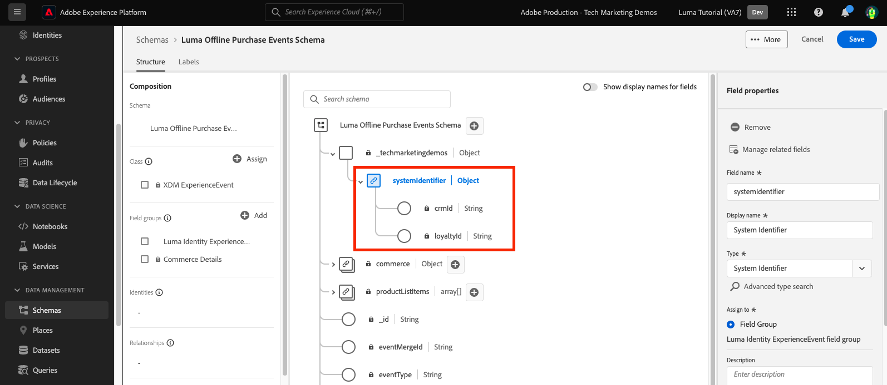

# Modelldata i scheman

<!-- 60min -->
I den här lektionen ska du modellera Lumas data i scheman. Det här är en av de längsta lektionerna i självstudiekursen, så ta ett glas vatten och slipp!

Standardisering och interoperabilitet är viktiga begrepp bakom Adobe Experience Platform. Experience Data Model (XDM) är ett försök att standardisera kundupplevelsedata och definiera scheman för kundupplevelsehantering.

XDM är en öppet dokumenterad specifikation som utformats för att förbättra möjligheterna med digitala upplevelser. Det innehåller gemensamma strukturer och definitioner för alla program som används för att kommunicera med plattformstjänster. Genom att följa XDM-standarder kan alla kundupplevelsedata införlivas i en gemensam representation som kan ge insikter på ett snabbare och mer integrerat sätt. Ni kan få värdefulla insikter från kundåtgärder, definiera kundmålgrupper genom segment och uttrycka kundattribut i personaliseringssyfte.

XDM är det grundläggande ramverk som gör att Adobe Experience Cloud, som drivs av Experience Platform, kan leverera rätt budskap till rätt person, i rätt kanal, i precis rätt ögonblick. Den metod som Experience Platform bygger på. **XDM-system** används Experience Data Model-scheman för plattformstjänster.

<!--
This seems too lengthy. The video should suffice

Key terms:

* **Schema**: a representation of your data. A schema is comprised of a class and optional field groups and is used to create datasets. A schema includes behavioral attributes, timestamp, identity, attribute definitions, and relationships.
* **XDM Profile Class**: a common schema class used to represent record data
* **XDM ExperienceEvent Class**: a common schema class used to represent time-series data
* **Field group**: allows users to extend reusable fields that contain variables defining one or more attribute intended to be included in a schema or added to a class.
* **Standard Field group**: an open-source Field group built to conform to common industry standards, used to accelerate implementation and support repeatable services operating on the data
* **Data type**: a reusable object with properties in a hierarchical representation. These can be standard types or custom-defined defined types to describe your own data in your own way (for example, a collection of fields that you use to describe your products). Unlike Field groups, data types can be used in schemas regardless of the class.
* **Field**: a field is the lowest level element of a schema. Each field has a name for referencing and a type to identify the type of data that it contains. Field types can include, integer, number, string, Boolean and schema.
-->

**Dataarkitekturer** måste skapa scheman utanför kursen, men **Datatekniker** kommer att arbeta nära med de scheman som skapas av dataarkitekten.

Innan du börjar övningarna ska du titta på den här korta videon och lära dig mer om scheman och Experience Data Model (XDM):
>[!VIDEO](https://video.tv.adobe.com/v/27105?learn=on)

>[!TIP]
>
> För en djupdykning i datamodellering i Experience Platform rekommenderar vi att du tar kursen [Modellera era kundupplevelsedata med XDM](https://experienceleague.adobe.com/?recommended=ExperiencePlatform-D-1-2021.1.xdm), kan köpas kostnadsfritt på Experience League!

## Behörigheter krävs

I [Konfigurera behörigheter](configure-permissions.md) lektionen anger du alla åtkomstkontroller som krävs för att slutföra lektionen.

<!--, specifically:

* Permission items **[!UICONTROL Data Modeling]** > **[!UICONTROL View Schemas]** and **[!UICONTROL Manage Schemas]**
* Permission item **[!UICONTROL Sandboxes]** > `Luma Tutorial`
* User-role access to the `Luma Tutorial Platform` product profile
* Developer-role access to the `Luma Tutorial Platform` product profile (for API)-->


<!--
## Luma's goals
-->

## Skapa bonusschema via användargränssnittet

I den här övningen ska vi skapa ett schema för Lumas lojalitetsdata.

1. Gå till användargränssnittet för plattformen och se till att din sandlåda är markerad.
1. Gå till **[!UICONTROL Schemas]** i den vänstra navigeringen.
1. Välj **[!UICONTROL Create schema]** överst till höger.
   

1. I arbetsflödet Skapa schema väljer du **[!UICONTROL Individual Profile]** som basklass för ditt schema, eftersom vi kommer att modellera attribut för en enskild kund (punkter, status och så vidare).
1. Välj **[!UICONTROL Next]**.
   

1. Retur `Luma Loyalty Schema` i **[!UICONTROL Schema display name]** textfält. På arbetsytan nedan kan du även granska och verifiera grundschemastrukturen som tillhandahålls av den klass du har valt.
1. Välj **[!UICONTROL Finish]** för att skapa ditt schema.
   

### Lägg till standardfältgrupper

När schemat har skapats omdirigeras du till schemaredigeraren där du kan lägga till fält i schemat. Du kan lägga till enskilda fält direkt i schemat eller använda fältgrupper. Observera att alla enskilda fält fortfarande är kopplade till en klass eller fältgrupp. Du kan välja bland en stor uppsättning standardfältgrupper från Adobe eller skapa egna. När ni börjar utforma egna data i Experience Platform är det bra att bekanta sig med de branschledande fältgrupperna från Adobe. När det är möjligt är det en god praxis att använda dem eftersom de ibland driver tjänster längre fram i kedjan, t.ex. kundens AI, Attribution AI och Adobe Analytics.

När du arbetar med egna data är det viktigt att du tar reda på vilken av dina egna data som ska samlas in i Platform och hur de ska modelleras. Det här stora ämnet diskuteras mer ingående i kursen [Modellera era kundupplevelsedata med XDM](https://experienceleague.adobe.com/?recommended=ExperiencePlatform-D-1-2021.1.xdm). I den här självstudiekursen kommer jag att vägleda dig genom implementeringen av några förbestämda scheman.

Så här lägger du till fältgrupper:

1. Välj **[!UICONTROL Add]** under **[!UICONTROL Field Groups]** rubrik.
   
1. I **[!UICONTROL Add Field groups]** modal, välj följande fältgrupper:
   1. **[!UICONTROL Demographic Details]** för grundläggande kunddata som namn och födelsedatum
   1. **[!UICONTROL Personal Contact Details]** för grundläggande kontaktinformation som e-postadress och telefonnummer
1. Du kan förhandsgranska fälten i fältgruppen genom att markera ikonen till höger om raden.
   

1. Kontrollera **[!UICONTROL Industry]** > **[!UICONTROL Retail]** för att visa branschspecifika fältgrupper.
1. Välj **[!UICONTROL Loyalty Details]** om du vill lägga till fälten för bonusprogram.
1. Välj **[!UICONTROL Add field groups]** om du vill lägga till alla tre fältgrupper i schemat.
   


Ta dig tid att utforska schemats aktuella status. Fältgrupperna har lagt till standardfält som är relaterade till en person, deras kontaktinformation och lojalitetsprogrammets status. Dessa två fältgrupper kan vara användbara när du skapar scheman för det egna företagets data. Markera en specifik fältgruppsrad eller markera kryssrutan bredvid fältgruppnamnet för att se hur visualiseringen ändras.

Om du vill spara schemat väljer du **[!UICONTROL Save]**.


>[!NOTE]
>
>Det är okej om en fältgrupp lägger till ett fält för en datapunkt som du inte samlar in. &quot;faxPhone&quot; kan till exempel vara ett fält där Luma inte samlar in data. Det är okej. Bara för att ett fält är definierat i schemat betyder det inte att data för det *måste* bli inkapslad senare. Du kan även ta bort fältet från schemat.

### Lägga till en anpassad fältgrupp

Nu ska vi skapa en anpassad fältgrupp.

Medan lojalitetsfältgruppen innehöll en `loyaltyID` Luma vill hantera alla sina systemidentifierare i en enda grupp för att säkerställa konsekvens i alla sina scheman.

Fältgrupper måste skapas i schemaarbetsflödet. Du kan antingen:

* Lägg till ett nytt anpassat fält i schemat först och skapa sedan en anpassad fältgrupp, eller
* Skapa först en anpassad fältgrupp och lägg sedan till fält i den.

I den här självstudiekursen börjar vi med att skapa en anpassad fältgrupp.

Så här skapar du fältgruppen:

1. Välj **[!UICONTROL Add]** under **[!UICONTROL Schema Field Groups]** rubrik
   
1. Välj **[!UICONTROL Create new field group]**
1. Använd `Luma Identity profile field group` som **[!UICONTROL Display name]**
1. Använd `system identifiers for XDM Individual Profile class` som **[!UICONTROL Description]**
1. Välj **[!UICONTROL Add field groups]**
   

Den nya, tomma fältgruppen läggs till i ditt schema. The **[!UICONTROL +]** -knappar kan användas för att lägga till nya fält på valfri plats i hierarkin. I det här fallet vill vi lägga till fält på rotnivå:

1. Välj **[!UICONTROL +]** bredvid schemats namn. Då läggs ett nytt fält till under ditt innehavar-id-namnutrymme för att hantera konflikter mellan dina anpassade fält och alla standardfält.
1. I **[!UICONTROL Field properties]** sidofältet lägger till information om det nya fältet:
   1. **[!UICONTROL Field name]**: `systemIdentifier`
   1. **[!UICONTROL Display name]**: `System Identifier`
   1. **[!UICONTROL Type]**: **[!UICONTROL Object]**
   1. I **[!UICONTROL Field Group]** listrutan väljer **Fältgrupp för Luma-identitetsprofil** som vi har skapat.
      
   1. Välj **[!UICONTROL Apply]**
      

Lägg nu till två fält under `systemIdentifier` objekt:

1. Första fältet
   1. **[!UICONTROL Field name]**: `loyaltyId`
   1. **[!UICONTROL Display name:]** `Loyalty Id`
   1. **[!UICONTROL Type]**: **[!UICONTROL String]**
1. Andra fältet
   1. **[!UICONTROL Field Name]**: `crmId`
   1. **[!UICONTROL Display Name]**: `CRM Id`
   1. **[!UICONTROL Type]**: **[!UICONTROL String]**

Din nya fältgrupp bör se ut så här. Välj **[!UICONTROL Save]** för att spara schemat, men lämna schemat öppet för nästa övning.


## Skapa en datatyp

Fältgrupper, till exempel din nya `Luma Identity profile field group`kan återanvändas i andra scheman, vilket gör att du kan använda standarddatadefinitioner i flera system. Men de kan bara återanvändas _i scheman som delar en klass_, i det här fallet klassen XDM Individual Profile.

Datatypen är en annan flerfältskonstruktor som kan återanvändas i scheman _över flera klasser_. Låt oss konvertera våra nya `systemIdentifier` till en datatyp:

Med `Luma Loyalty Schema` fortfarande öppen väljer du `systemIdentifier` objekt och markera  **[!UICONTROL Convert to new data type]**


Om du **[!UICONTROL Cancel]** ut ur schemat och navigera till **[!UICONTROL Data types]** kommer du att se din nya datatyp. Vi kommer att använda den här datatypen senare i lektionen.


## Skapa CRM-schema via API

Nu ska vi skapa ett schema med API:t.

>[!TIP]
>
> Om du föredrar att hoppa över API-övningen kan du skapa följande schema med metoden för användargränssnittet:
>
> 1. Använd [!UICONTROL Individual Profile] class
> 1. Ge den ett namn `Luma CRM Schema`
> 1. Använd följande fältgrupper: Demografiska uppgifter, personliga kontaktuppgifter och Luma Identity-profilgrupp

Först skapar vi det tomma schemat:

1. Öppna [!DNL Postman]
1. Öppna begäran om du inte har någon åtkomsttoken **[!DNL OAuth: Request Access Token]** och markera **Skicka** för att begära en ny åtkomsttoken.
1. Öppna dina miljövariabler och ändra värdet för **CONTAINER_ID** från `global` till `tenant`. Kom ihåg att du måste använda `tenant` när du vill interagera med egna anpassade element i plattformen, till exempel skapa ett schema.
1. Välj **Spara**
   
1. Öppna förfrågan **[!DNL Schema Registry API > Schemas > Create a new custom schema.]**
1. Öppna **Brödtext** och klistra in följande kod och markera **Skicka** för att anropa API. Det här anropet skapar ett nytt schema med samma `XDM Individual Profile` basklass:

   ```json
   {
     "type": "object",
     "title": "Luma CRM Schema",
     "description": "Schema for CRM data of Luma Retail ",
     "allOf": [{
       "$ref": "https://ns.adobe.com/xdm/context/profile"
     }]
   }
   ```

   >[!NOTE]
   >
   >Namnutrymmesreferenserna i den här och efterföljande kodexempel (till exempel `https://ns.adobe.com/xdm/context/profile`), kan hämtas med hjälp av list-API-anrop med **[!DNL CONTAINER_ID]** och acceptera sidhuvud inställt på rätt värden. Vissa är också lättåtkomliga i användargränssnittet.

1. Du borde skaffa en `201 Created` svar
1. Kopiera `meta:altId` från svarsorganet. Vi kommer att använda den senare i en annan övning.
   

1. Det nya schemat ska vara synligt i användargränssnittet, men utan fältgrupper
   

>[!NOTE]
>
> The `meta:altId` eller schema-ID kan också hämtas genom att API-begäran görs **[!DNL Schema Registry API > Schemas > Retrieve a list of schemas within the specified container.]** med **[!UICONTROL CONTAINER_ID]** ange till `tenant` och en godkännanderubrik `application/vnd.adobe.xdm+json`.

>[!TIP]
>
> Vanliga problem med detta samtal och troliga fixar:
>
> * Ingen auth-token: Kör **OAuth: Begär åtkomsttoken** begäran om att generera en ny token
> * `401: Not Authorized to PUT/POST/PATCH/DELETE for this path : /global/schemas/`: Uppdatera **CONTAINER_ID** miljövariabel från `global` till `tenant`
> * `403: PALM Access Denied. POST access is denied for this resource from access control`: Verifiera dina användarbehörigheter i Admin Console

### Lägg till standardfältgrupper

Nu är det dags att lägga till fältgrupperna i schemat:

1. I [!DNL Postman], Öppna förfrågan **[!DNL Schema Registry API > Schemas > Update one or more attributes of a custom schema specified by ID.]**
1. I **Parametrar** flik, klistra in `meta:altId` värdet från föregående svar som `SCHEMA_ID`
1. Öppna fliken Brödtext och klistra in följande kod och markera **Skicka** för att anropa API. Det här anropet lägger till standardfältgrupperna i `Luma CRM Schema`:

   ```json
   [{
       "op": "add",
       "path": "/allOf/-",
       "value": {
         "$ref": "https://ns.adobe.com/xdm/context/profile-personal-details"
       }
     },
     {
       "op": "add",
       "path": "/allOf/-",
       "value": {
         "$ref": "https://ns.adobe.com/xdm/context/profile-person-details"
       }
     }
   ]
   ```

1. Du bör få statusen 200 OK för svaret och fältgrupperna ska vara synliga som en del av ditt schema i användargränssnittet

   


### Lägg till anpassad fältgrupp

Nu lägger vi till `Luma Identity profile field group` till schemat. Först måste vi hitta ID:t för vår nya fältgrupp med hjälp av en list-API:

1. Öppna förfrågan **[!DNL Schema Registry API > Field groups > Retrieve a list of field groups within the specified container.]**
1. Välj **Skicka** för att hämta en lista över alla anpassade fältgrupper i ditt konto
1. Ta tag i `$id` värdet på `Luma Identity profile field group` (ditt eget värde skiljer sig från värdet i den här skärmbilden)
   
1. Öppna förfrågan **[!DNL Schema Registry API > Schemas > Update one or more attributes of a custom schema specified by ID.]** igen
1. The **Parametrar** ska fortfarande ha `$id` av ditt schema
1. Öppna **Brödtext** och klistra in följande kod, ersätta `$ref` värdet med `$id` på egen hand `Luma Identity profile field group`:

   ```json
   [{
     "op": "add",
     "path": "/allOf/-",
     "value": {
       "$ref": "REPLACE_WITH_YOUR_OWN_FIELD_GROUP_ID"
     }
   }]
   ```

1. Välj **Skicka**
   

Kontrollera att fältgruppen har lagts till i schemat genom att kontrollera både API-svaret och gränssnittet.

## Skapa offlineköpshändelseschema

Nu ska vi skapa ett schema baserat på **[!UICONTROL Experience Event]** klassen för Lumas inköpsdata offline. Eftersom du nu bekantar dig med användargränssnittet i schemaredigeraren kommer jag att minska antalet skärmbilder i instruktionerna:

1. Skapa ett schema med **[!UICONTROL Experience Event]** klassen.
1. Namnge ditt schema `Luma Offline Purchase Events Schema`.
1. Lägg till standardfältgruppen **[!UICONTROL Commerce Details]** om du vill hämta information om vanliga order. Tillbringa några minuter med att utforska objekten inuti.
1. Sök efter `Luma Identity profile field group`. Den är inte tillgänglig! Kom ihåg att fältgrupper är kopplade till en klass, och eftersom vi använder en annan klass för det här schemat kan vi inte använda det. Vi måste lägga till en ny fältgrupp för klassen XDM ExperienceEvent som innehåller identitetsfälten. Vår datatyp kommer att göra det väldigt enkelt!
1. Välj **[!UICONTROL Create new field group]** alternativknapp
1. Ange **[!UICONTROL Display name]** as `Luma Identity ExperienceEvent field group` och väljer **[!UICONTROL Add field groups]** knapp
1. Välj **[!UICONTROL +]** bredvid schemats namn.
1. Som **[!UICONTROL Field Name]**, ange `systemIdentifier`.
1. Som **[!UICONTROL Display Name]**, ange `System Identifier`.
1. Som **[!UICONTROL Type]**, markera **Systemidentifierare** som är den anpassade datatypen som du skapade tidigare.
1. Som **[!UICONTROL Field Group]** välj **Fältgruppen Luma Identity ExperienceEvent**.
1. Välj **[!UICONTROL Apply]** -knappen.
1. Välj **[!UICONTROL Save]** -knappen.

Observera hur datatypen lade till alla fält!



Välj även **[!UICONTROL XDM ExperienceEvent]** under **[!UICONTROL Class]** rubrik och inspektera några av fälten från den här klassen. Observera att fält för _id och tidsstämplar krävs när klassen XDM ExperienceEvent används. Dessa fält måste fyllas i för varje post som du infogar när du använder det här schemat:


## Skapa webbhändelseschema

Nu ska vi skapa ett till schema för Lumas webbplatsdata. Nu bör du vara expert på att skapa scheman! Bygg följande schema med dessa egenskaper

| Egenskap | Värde |
|---------------|-----------------|
| Klass | Experience Event |
| Schemanamn | Schema för webbhändelser i Luma |
| Fältgrupp | AEP Web SDK ExperienceEvent |
| Fältgrupp | Consumer Experience Event |

Välj **[!UICONTROL Consumer Experience Event]** fältgrupp. Den här fältgruppen innehåller objekten commerce och productListItems som också fanns i [!UICONTROL Commerce Details]. Ja [!UICONTROL Consumer Experience Event] är en kombination av flera andra standardfältgrupper som också är tillgängliga separat. [!UICONTROL AEP Web SDK ExperienceEvent] fältgruppen innehåller även andra fältgrupper, inklusive några av de i [!UICONTROL Consumer Experience Event]. Lyckligtvis smälter de ihop sömlöst.

Observera att vi inte lade till `Luma Identity ExperienceEvent field group` till detta schema. Det beror på att Web SDK har ett annat sätt att samla in identiteter. Om du väljer **[!UICONTROL XDM ExperienceEvent]** i **[!UICONTROL Composition]** i schemaredigeraren kommer du att märka att ett av fälten som läggs till som standard anropas **[!UICONTROL IdentityMap]**. [!DNL IdentityMap] används av olika Adobe-program för att länka till plattformen. Du kommer att se hur identiteter skickas till plattformen via identityMap i lektionen om direktuppspelning.


## Skapa produktkatalogschema

Genom att använda  [!UICONTROL Commerce Details] och [!UICONTROL Consumer Experience Event] fältgrupper, Luma rapporterar viss information om produktrelaterade händelser via standarddatatypen productListItems. Men de har också ytterligare produktinformationsfält som de vill skicka till Platform. I stället för att fylla i alla dessa fält i sina butiks- och e-handelssystem föredrar Luma att importera fälten direkt från sitt produktkatalogsystem. Med en &quot;schemarelation&quot; kan du definiera en relation mellan två scheman för klassificering eller sökning. Luma använder en relation för att klassificera sin produktinformation. Vi börjar processen nu och slutför den i slutet av nästa lektion.

>[!NOTE]
>
>Om du är en befintlig Analytics- eller Target-kund är klassificering av enheter med schemarelationer detsamma som SAINT-klassificeringar eller överföring av din produktkatalog för Recommendations

Först måste vi skapa ett schema för Lumas produktkatalog med en anpassad klass:

1. Välj **[!UICONTROL Create schema]** -knappen.
1. I arbetsflödet Skapa schema väljer du **[!UICONTROL Other]** alternativ.
   
1. Välj **[!UICONTROL Create class]** knapp
1. Ge den ett namn `Luma Product Catalog Class`
1. Lämna **[!UICONTROL Behavior]** as **[!UICONTROL Record]**
1. Välj **[!UICONTROL Create]** -knappen.
   
1. The **Klassen Luma Product Catalog** som du har skapat visas i tabellen Classes nedan. Kontrollera att klassen är markerad och välj sedan **[!UICONTROL Next]**.
   
1. Namnge schemat `Luma Product Catalog Schema`.
1. Skapa ett nytt [!UICONTROL field group] anropad `Luma Product Catalog field group` med följande fält:
   1. productName: Produktnamn: String
   1. productCategory: Product Category: String
   1. productColor: Produktfärg: String
   1. productSku: Product SKU: String | Obligatoriskt
   1. productSize: Produktstorlek: String
   1. productPrice: Product Price: Double
1. **[!UICONTROL Save]** schemat

Ditt nya schema bör se ut så här. Anteckna hur `productSku` -fältet visas i [!UICONTROL Required fields] avsnitt:


Nästa steg är att definiera relationen mellan de två ExperienceEvent-scheman och `Luma Product Catalog Schema`Men det finns ytterligare några steg som vi måste ta i nästa lektion innan vi kan göra det.


## Ytterligare resurser

* [Systemdokumentation för Experience Data Model (XDM)](https://experienceleague.adobe.com/docs/experience-platform/xdm/home.html?lang=sv)
* [API för schemaregister](https://www.adobe.io/experience-platform-apis/references/schema-registry/)


Nu när du har dina scheman [kartidentiteter](map-identities.md)!
