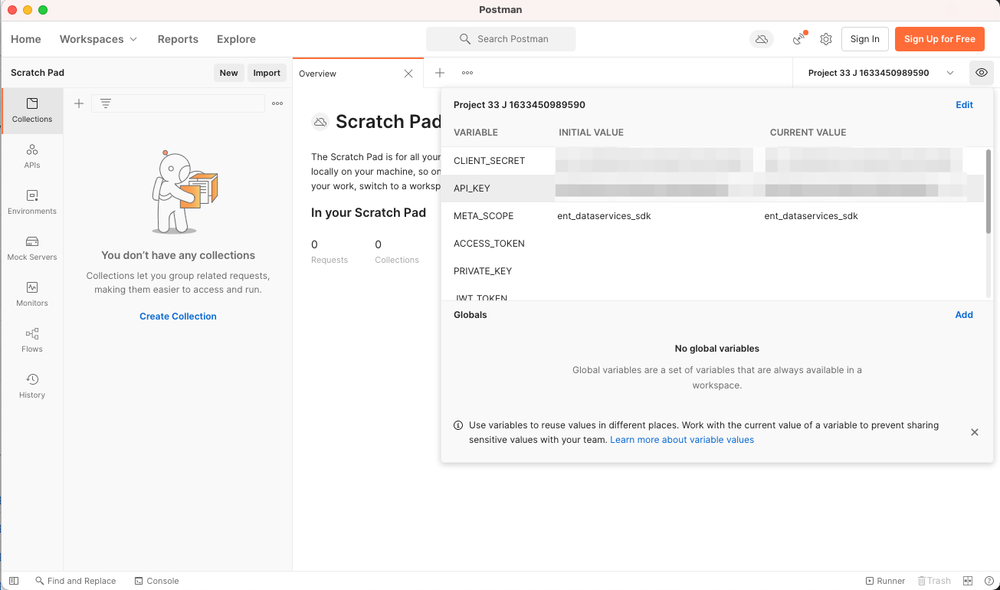
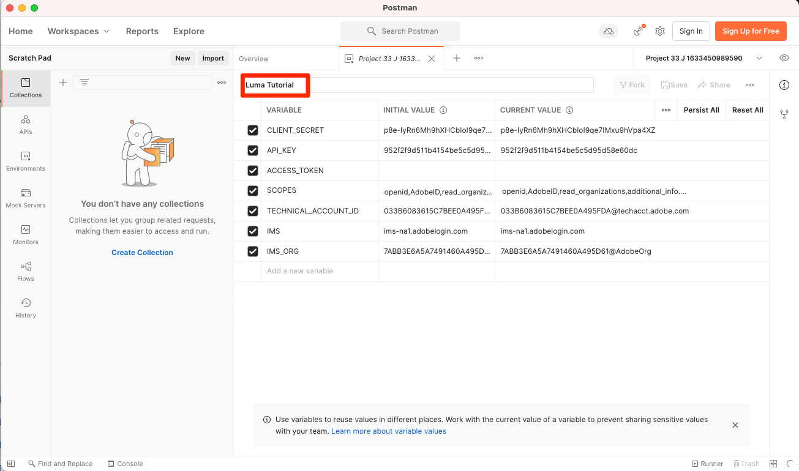
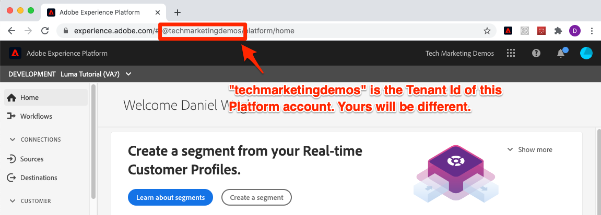

# Konfigurera Developer Console och [!DNL Postman]

<!--30min-->

I den här lektionen ska du skapa ett projekt i Adobe Developer Console och ladda ned det [!DNL Postman] samlingar så att du kan börja använda Platform API:er.

För att slutföra API-övningarna i den här självstudiekursen [hämta Postman-appen för ditt operativsystem.](https://www.postman.com/downloads/) Postman är inte nödvändigt för att kunna använda Experience Platform API:er, men underlättar API-arbetsflöden och Adobe Experience Platform tillhandahåller dussintals Postman-samlingar som hjälper dig att köra API-anrop och lära dig hur de fungerar. Resten av den här självstudiekursen bygger på en del praktiska kunskaper i Postman. Om du behöver hjälp kan du läsa [Postman-dokumentation](https://learning.postman.com/).

Plattformen är byggd för API. Även om det finns gränssnittsalternativ för alla viktiga uppgifter kan det vara bra att använda plattforms-API:t någon gång. Om du till exempel vill importera data flyttar du objekt mellan sandlådor, automatiserar rutinuppgifter eller använder nya plattformsfunktioner innan användargränssnittet har skapats.

**Dataarkitekturer** och **Datatekniker** kan behöva använda Platform API utanför den här självstudiekursen.

## Behörigheter krävs

I [Konfigurera behörigheter](configure-permissions.md) lektionen anger du alla åtkomstkontroller som krävs för att slutföra lektionen.

<!--
* Permission item Sandboxes > `Luma Tutorial`
* Developer-role access to the `Luma Tutorial Platform` product profile
-->

## Konfigurera Adobe Developer Console

Adobe Developer Console är utvecklarmålet för att få tillgång till Adobe API:er och SDK:er, lyssna på nära nog med realtidshändelser, köra funktioner i körningsmiljön eller skapa plugin-program eller App Builder-program. Du kommer att använda den för att komma åt Experience Platform API:t. Mer information finns i [Adobe Developer Console-dokumentation](https://www.adobe.io/apis/experienceplatform/console/docs.html)

1. Skapa en mapp på din lokala dator med namnet `Luma Tutorial Assets` för filer som används i självstudiekursen.

1. Öppna [Adobe Developer Console](https://console.adobe.io)

1. Logga in och bekräfta att du använder rätt Org

1. Välj **[!UICONTROL Skapa nytt projekt]** in [!UICONTROL Snabbstart] -menyn.

   

1. I det nyskapade projektet väljer du **[!UICONTROL Lägg till i projekt]** och sedan markera **[!UICONTROL API]**

   

1. Filtrera listan genom att välja **[!UICONTROL Adobe Experience Platform]**

1. I listan över tillgängliga API:er väljer du **[!UICONTROL Experience Platform API]** och markera **[!UICONTROL Nästa]**.

   

1. För autentisering från externa system som [!DNL Postman]kräver vi ett nyckelpar för offentlig/privat nyckel. Om du vill generera ett nytt nyckelpar väljer du **[!UICONTROL Alternativ 1]**  och trycker på **[!UICONTROL Generera nyckelpar]** knapp

   

1. När nycklarna är klara kan du uppmanas att hämta nycklarna till din lokala dator. Spara tangenterna som paketerats i `config.zip` till mappen `Luma Tutorial Assets`. Vi kommer att behöva dem i nästa övning.

1. När nyckeln har genererats läggs den offentliga nyckeln automatiskt till i ditt projekt enligt skärmbilden. Välj **[!UICONTROL Nästa]** -knappen.

   

1. Välj `Luma Tutorial Platform` produktprofil och välj **[!UICONTROL Spara konfigurerat API]** knapp

   

1. Nu har ditt Developer Console-projekt skapats!

1. I **[!UICONTROL Prova]** del av sidan, markera **[!UICONTROL Ladda ned för Postman]** och sedan markera **[!UICONTROL Tjänstkonto (JWT)]** för att ladda ned [!DNL Postman] JSON-fil för miljö. Spara `service.postman_environment.json` i `Luma Tutorial Assets` mapp.

   

   >[!NOTE]
   >
   >Systemadministratörer i din organisation kan se projektet som en&quot;API-referens&quot; i produktprofilen i Admin Console
   >
   >

Du kan ha lagt märke till att projektet tilldelats ett nummer, till exempel &quot;Projekt 12&quot;:

1. Välj projektnumret i sökvägen
1. Välj **[!UICONTROL Redigera projekt]** knapp
1. Ändra **[!UICONTROL Projektets titel]** till `Luma Tutorial API Project` (lägg till ditt namn i slutet om flera personer från ditt företag använder den här självstudiekursen)
1. Välj **[!UICONTROL Spara]** knapp

   

## Konfigurera Postman

>[!CAUTION]
>
>Postman gränssnitt uppdateras regelbundet. Skärmbilderna i den här självstudiekursen togs med Postman version 9.0.5 för Mac, men gränssnittsalternativen kan ha ändrats.

1. Hämta och installera [[!DNL Postman]](https://www.postman.com/downloads/)
1. Öppna [!DNL Postman] och importera den hämtade JSON-miljöfilen, `service.postman_environment.json`
   
1. I [!DNL Postman]väljer du din miljö i listrutan

   
1. Välj **ögat** -ikon för att visa miljövariabler:

   

### Uppdatera miljönamnet

Eftersom det exporterade namnet på miljön från Developer Console genereras slumpmässigt bör du ge den ett mer beskrivande namn så att du inte längre behöver blanda ihop miljöer senare när du börjar arbeta med implementeringen av din riktiga plattform:

1. När skärmen för miljövariabler fortfarande är öppen väljer du **Redigera** längst upp till höger
1. Uppdatera **Miljönamn** till `Luma Tutorial`
1. Lämna **Hantera miljöer** modal öppnad i redigeringsläge, eftersom vi kommer att redigera den ytterligare i nästa steg

   

### Lägg till den privata nyckeln

Nu är det dags att lägga till PRIVATE_KEY-värdet i Postman-miljön

1. Extrahera de hämtade filerna `config.zip` som skapades i föregående övning när du skapade Developer Console Project. Zippet innehåller två filer:
   * `private.key`
   * `certificate_pub.crt`
1. Öppna `private.key` i en textredigerare och kopiera innehållet.
1. I Postman på **Hantera miljöer** > **Redigera** modal som fortfarande är öppen från den senaste övningen, klistra in kopierade värden framför **PRIVATE_KEY** i **Startvärde** och **Aktuellt värde** kolumner.
1. Välj **Spara**

   

### Lägg till JWT- och Access-token

Adobe har en mängd [!DNL Postman] samlingar som hjälper dig att utforska Experience Platform API. Dessa samlingar finns i [Adobe Experience Platform Postman Samples GitHub repo](https://github.com/adobe/experience-platform-postman-samples). Du bör skapa ett bokmärke för det här svaret eftersom du kommer att använda det här flera gånger i den här självstudiekursen och senare när du implementerar Experience Platform för ditt eget företag.

Den första samlingen fungerar med Adobe Identity Management Service (IMS) API:er. Det är ett bekvämt sätt att fylla i JWT_TOKEN och ACCESS_TOKEN inifrån Postman *avsedda för icke-produktionsbruk* som att slutföra den här självstudiekursen i din sandlåda. Alternativt kan JWT-token genereras i Adobe Developer Console. Men eftersom den upphör att gälla regelbundet kan du använda den här samlingen för att uppdatera den utan att behöva besöka Adobe Developer Console igen när du slutför den här självstudiekursen.

>[!WARNING]
>
>Som framgår av [Adobe Identity Management Service API:er README](https://github.com/adobe/experience-platform-postman-samples/tree/master/apis/ims)är de angivna produktionsmetoderna lämpliga för icke-produktionsbruk. Lokal signering läser in ett JavaScript-bibliotek från en tredjepartsvärd och fjärrsignering skickar den privata nyckeln till en webbtjänst som ägs och drivs av Adobe. Även om Adobe inte lagrar den här privata nyckeln bör produktionsnycklar aldrig delas med någon.

Så här genererar du tokens:

1. Ladda ned [Generering av token för Developer Console-åtkomst](https://raw.githubusercontent.com/adobe/experience-platform-postman-samples/master/apis/ims/Identity%20Management%20Service.postman_collection.json) till `Luma Tutorial Assets` mapp
1. Importera samlingen till [!DNL Postman]
1. Välj begäran **IMS: JWT Generera + Auth via användartoken** och markera **Skicka**

   
1. The **JWT_TOKEN** och **ACCESS_TOKEN** automatiskt fylla i miljövariablerna i [!DNL Postman].

   

### Lägg till sandlådenamn och klient-ID

The `SANDBOX_NAME` och `TENANT_ID` och `CONTAINER_ID` variabler tas inte med i Adobe Developer Console-exporten, så vi lägger till dem manuellt:

1. I [!DNL Postman]öppnar du **Miljövariabler**
1. Välj **Redigera** länk till höger om miljönamnet
1. I **Lägg till nytt variabelfält**, ange `SANDBOX_NAME`
1. I båda värdefälten anger du `luma-tutorial`, namnet vi gav till vår sandlåda i föregående lektion. Om du har använt ett annat namn för sandlådan, till exempel luma-tutorial-igatiusjreilly, måste du använda det värdet.
1. I **Lägg till nytt variabelfält**, ange `TENANT_ID`
1. Byt till webbläsaren och leta upp företagets klient-ID genom att gå till Experience Platform gränssnitt och extrahera delen av URL:en *efter @-tecknet*. Min klient-ID är till exempel `techmarketingdemos` men din är annorlunda:

   

1. Kopiera det här värdet och gå tillbaka till [!DNL Postman] Skärmen Hantera miljöer
1. Klistra in ditt klient-ID i båda värdefälten
1. I **Lägg till nytt variabelfält**, ange `CONTAINER_ID`
1. Retur `global` till båda värdefälten

   >[!NOTE]
   >
   >`CONTAINER_ID` är ett fält vars värde vi ändrar flera gånger under självstudiekursen. När `global` används interagerar API med element som tillhandahålls av Adobe i ditt plattformskonto. När `tenant` används interagerar API:t med dina egna anpassade element.

1. Välj **Spara**

   

## Göra ett API-anrop för en plattform

Låt oss nu ringa ett Platform API-anrop för att bekräfta att vi har konfigurerat allt korrekt.

Öppna [Experience Platform [!DNL Postman] samlingar i GitHub](https://github.com/adobe/experience-platform-postman-samples/tree/master/apis/experience-platform). Det finns många samlingar på den här sidan för olika plattforms-API:er. Jag rekommenderar att du bokmärker det.

Låt oss ringa vårt första API-anrop:

1. Ladda ned [API-samling för schemaregister](https://raw.githubusercontent.com/adobe/experience-platform-postman-samples/master/apis/experience-platform/Schema%20Registry%20API.postman_collection.json) till `Luma Tutorial Assets` mapp
1. Importera det till [!DNL Postman]
1. Öppna **API för schemaregister > Klasser > Listklasser**
1. Titta på **Parametrar** och **Sidhuvuden** och notera hur de innehåller några av de miljövariabler som vi angav tidigare.
1. Observera att **Sidhuvuden > Acceptera värdefält** är inställd på `application/vnd.adobe.xed-id+json`. API:erna för schemaregister kräver något av dessa [angivna värden för Acceptera sidhuvud](https://experienceleague.adobe.com/docs/experience-platform/xdm/api/getting-started.html?lang=en#accept) som ger olika format i svaret.
1. Välj **Skicka** för att göra ditt första Platform API-anrop!

Förhoppningsvis lyckas du `200 OK` svar som innehåller en lista med tillgängliga standard-XDM-klasser i din sandlåda, enligt bilden nedan.

Om samtalet inte lyckades kan du felsöka med hjälp av felsvarsinformationen för API-anropet och granska stegen ovan. Om du fastnar ber du om hjälp i [Community-forum](https://experienceleaguecommunities.adobe.com/t5/adobe-experience-platform/ct-p/adobe-experience-platform-community) eller använd länken till höger på den här sidan för att logga ett problem.

Med plattformsbehörigheter, sandlåda och [!DNL Postman] konfigurera, du är redo att [modelldata i scheman](model-data-in-schemas.md)!
