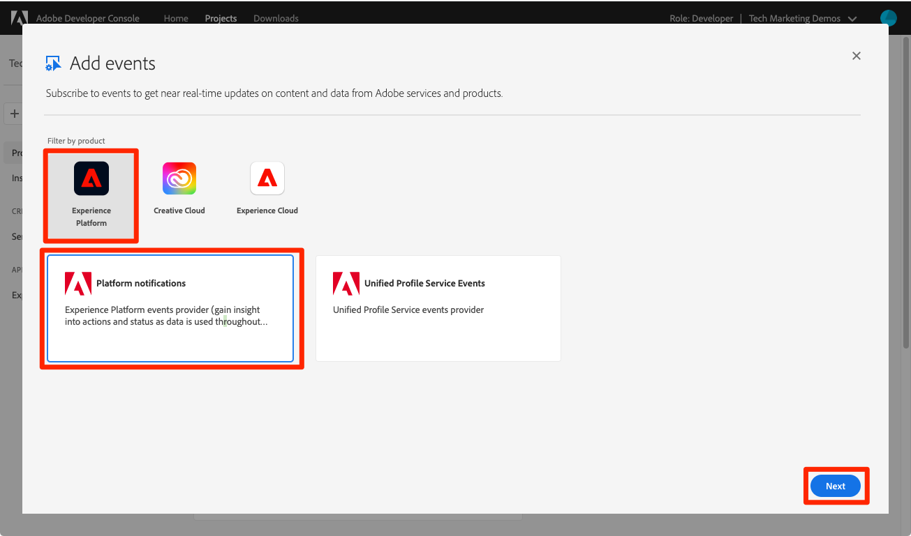

# Prenumerera på dataöverföringshändelser

<!--25min-->

I den här lektionen prenumererar du på datainmatningshändelser genom att skapa en webkrok med Adobe Developer Console och ett webbutvecklarverktyg. Du kommer att använda dessa händelser för att övervaka statusen för dina dataöverföringsjobb i efterföljande lektioner.

**Datatekniker** vill prenumerera på datainmatningshändelser utanför den här självstudiekursen.
**Dataarkitekter** _kan hoppa över den här lektionen_ och gå till [lektionen om gruppförbrukning](ingest-batch-data.md).

## Behörigheter krävs

I lektionen [Konfigurera behörigheter](configure-permissions.md) ställer du in alla åtkomstkontroller som krävs för att slutföra den här lektionen, speciellt:

<!--* Developer-role access to the `Luma Tutorial Platform` product profile (for API)
-->

>[!IMPORTANT]
>
> De här meddelandena som utlöses av dataöverföringshändelserna gäller för _alla dina sandlådor_, inte bara för `Luma Tutorial`. Du kan även se meddelanden som kommer från andra dataöverföringshändelser i ditt konto.

## Konfigurera en webkrok

I den här övningen skapar vi en webkrok med hjälp av ett onlineverktyg som kallas webkrok.site (du kan välja att ersätta något annat webbkrosutvecklingsverktyg som du föredrar):

1. Öppna webbplatsen [https://webhook.site/](https://webhook.site/) på en annan flik i webbläsaren
1. Du tilldelas en unik URL-adress som du bör skapa ett bokmärke för när du återgår till den senare i avsnittet om datafrågor:

   
1. Markera knappen **Redigera** i den övre navigeringen
1. Ange `$request.query.challenge$` som svarstext. De Adobe I/O Events-meddelanden som vi ställer in senare i den här lektionen skickar en utmaning till webbkroken och kräver att den inkluderas i svarsbrödtexten.
1. Välj knappen **Spara**

   

## Konfigurera

1. Öppna [Adobe Developer Console](https://console.adobe.io/) på en annan webbläsarflik
1. Öppna `Luma Tutorial API Project`
1. Markera knappen **[!UICONTROL Add to Project]** och välj sedan **[!UICONTROL Event]**

   
1. Filtrera listan genom att välja **[!UICONTROL Experience Platform]**
1. Välj **[!UICONTROL Platform notifications]**
1. Markera knappen **[!UICONTROL Next]**
   
1. Markera alla händelser
1. Markera knappen **[!UICONTROL Next]**
   
1. På nästa skärm för att konfigurera autentiseringsuppgifter väljer du knappen **[!UICONTROL Next]** igen
   
1. Ange `Platform notifications` som **[!UICONTROL Event registration name]**
1. Bläddra nedåt och välj för att öppna avsnittet **[!UICONTROL Webhook]**
1. Klistra in värdet från fältet **Din unika URL** från webkrok.site som **[!UICONTROL Webhook URL]**
1. Markera knappen **[!UICONTROL Save configured events]**
   
1. Vänta tills konfigurationen har sparats och du bör se till att din `Platform notifications`-händelse är aktiv med din webkrok-information och inga felmeddelanden
   
1. Växla tillbaka till din webkrok.site-flik och du bör se den första begäran till webkroken som är ett resultat av valideringen av din Developer Console-konfiguration:
   

Just nu kommer du att lära dig mer om de här meddelandena i nästa lektion när du importerar data.

## Ytterligare resurser

* [Webkrok.site](https://webhook.site/)
* [Dokumentation för meddelanden om dataöverföring](https://experienceleague.adobe.com/docs/experience-platform/ingestion/quality/subscribe-events.html)
* [Komma igång med Adobe I/O-händelsedokumentation](https://www.adobe.io/apis/experienceplatform/events/docs.html)

Okej, vi börjar till slut [inhämta data](ingest-batch-data.md)!
