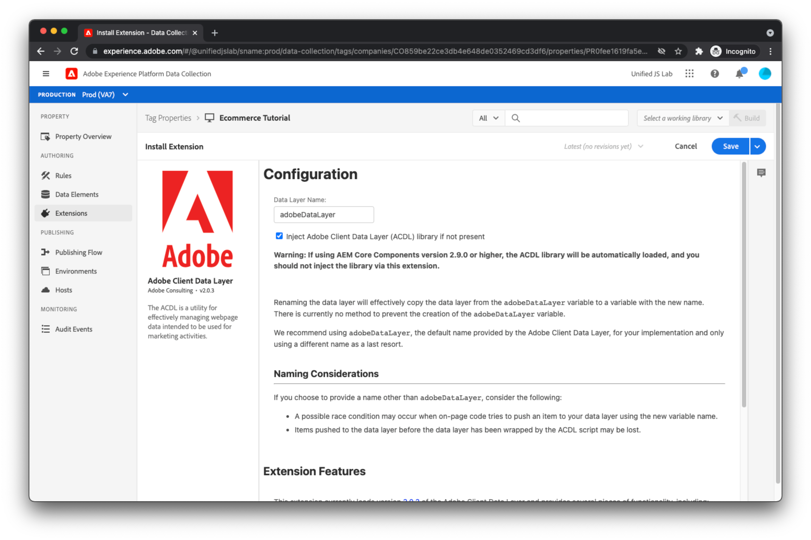

# Skapa en Adobe Experience Platform [!DNL Tags] egenskap och installera tillägg

Nu när kod på sidan för in data och händelser i datalagret är det dags för marknadsföraren att läsa data från datalagret och skicka dessa data till Adobe Experience Platform. Detta kräver vanligtvis två JavaScript-bibliotek:

* Adobe-klientdatalager: I tidigare steg skapade du en datalagerarray och överförde objekt till den. För att få tillgång till dessa data måste du läsa in JavaScript-biblioteket för klientdatalagret i Adobe. Det här biblioteket innehåller meddelanden om händelser och ändringar i datalagret samt enkel åtkomst till data.
* Adobe Experience Platform Web SDK: Det här JavaScript-biblioteket kommunicerar med [Adobe Experience Platform Edge Network](https://business.adobe.com/products/experience-platform/experience-platform-edge-network.html). SDK hanterar identitet, samtycke, datainsamling, personalisering, målgrupper med mera.

Även om du kan läsa in dessa individuella bibliotek på din webbplats och använda dem direkt, rekommenderar vi att du använder dem [Adobe Experience Platform-taggar](https://experienceleague.adobe.com/docs/experience-platform/tags/home.html?lang=sv). Med taggar kan du bädda in ett enda skript i HTML och använda användargränssnittet Tags för att distribuera både Adobe Client Data Layer och Adobe Experience Platform Web SDK. Med taggar kan du också skapa regler för att skicka data, bland annat. I den här självstudien används taggar för det här ändamålet och du förutsätts ha en grundläggande förståelse för hur taggar fungerar.

## Skapa en egenskap i taggar

1. [Skapa en egenskap i taggar](https://experienceleague.adobe.com/docs/experience-platform/tags/admin/companies-and-properties.html#create-or-configure-a-property).

## Installera tillägget Adobe Client Data Layer

Installera tillägget Adobe Client Data Layer:

1. Välj **[!UICONTROL Tillägg]** till vänster i navigeringen i taggegenskapen som du använder för den här självstudiekursen.
1. Välj **[!UICONTROL Katalog]** och sedan söka efter datalager.
1. Klicka på knappen **[!UICONTROL Installera]** -knappen. En konfigurationsskärm bör visas. I den här självstudiekursen behöver du inte ändra standardvärdena.
1. Klicka **[!UICONTROL Spara]**.
   

## Installera Adobe Experience Platform Web SDK-tillägget

Installera sedan Adobe Experience Platform Web SDK-tillägget:

1. Sök efter tillägget i tilläggskatalogen och klicka på respektive **[!UICONTROL Installera]** -knappen. Konfigurationsskärmen visas:
   
1. I [!UICONTROL Datastream] markerar du den datastream som du skapade tidigare. Du får samma datastream-miljöer som du såg i [Skapa ett datastream](../configure-the-server/create-a-datastream.md).
   
1. I konfigurationsfönstret kan du söka efter och avmarkera **[!UICONTROL Aktivera klickdatainsamling]**. Som standard spårar SDK automatiskt länkar åt dig. I den här självstudiekursen visar vi hur du kan spåra egna länkklick med hjälp av anpassad länkinformation.
1. Klicka på **[!UICONTROL Spara]** för att slutföra installationen av Adobe Experience Platform Web SDK-tillägget.

>[!TIP]
>
>Datauppsättningsmiljöerna har en relation till taggar-miljöer. Anta att du har slutfört installationen av Adobe Experience Platform Web SDK-tillägget genom att skapa ett taggbibliotek som innehåller tillägget och sedan publicera biblioteket i en taggredigeringsmiljö. När taggbiblioteket har lästs in på webbsidan och Adobe Experience Platform Web SDK-tillägget gör en begäran till Edge Network, innehåller tillägget [!UICONTROL Utvecklingsmiljö] ID för datastream-miljö. Edge Network använder i sin tur detta ID för att läsa konfigurationen av [!UICONTROL Utvecklingsmiljö] datastream-miljö och vidarebefordra data till lämpliga Adobe-produkter.
>
>För närvarande har du bara en utvecklingsdatastream-miljö, en mellanlagringsdatastream-miljö och en produktionsdatastream-miljö. Det går att skapa flera datastream-utvecklingsmiljöer (en för dig och en för din kollega, kanske) med hjälp av användargränssnittet för datastream. Om du har flera utvecklingsdatastream-miljöer kan du välja vilken du vill använda för den här taggegenskapen.

Lämpliga tillägg har installerats. Det är dags att skapa regler och dataelement.

[Nästa: ](create-rules-for-tracking-page-view-and-commerce-events.md)

>[!NOTE]
>
>Tack för att du har lagt ned din tid på att lära dig om datainsamling. Om du har frågor, vill dela allmän feedback eller har förslag på framtida innehåll kan du dela med dig av dem om detta [Experience League diskussionsinlägg](https://experienceleaguecommunities.adobe.com/t5/adobe-experience-platform-launch/tutorial-discussion-use-adobe-experience-platform-data/m-p/543877)
