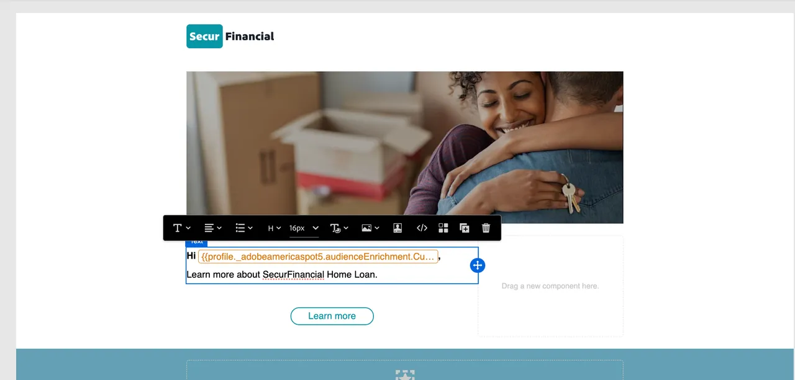

# Bygg en resa med en federerad publik

Federerade målgrupper kan användas på resor inom Adobe Journey Optimizer (AJO). Detta inkluderar att använda frågeattribut från Federated Audience Composition för att personalisera meddelanden.

För att fortsätta med SecurFinancial-berättelsen, särskilt när det gäller återmarknadsföring och personalisering, ordnar vi en resa för kvalificerade kunder. Målet är att skicka ett personaliserat e-postmeddelande baserat på attribut som federerats från SecurFinals datalager.

## Steg

### Bygg en resa med en Läs publik

1. Navigera till portalen **Resor** och klicka på knappen **Skapa resa** .

   

2. Uppdatera resans egenskaper med ett nytt namn. I vårt exempel: **`SecurFinancial - Home Loan Offer`**.

3. Klicka på **Orchestration** och dra sedan rutan **Läs målgrupp** till arbetsytan.

4. Klicka på pennikonen **bredvid rutan Målgrupp till höger på skärmen.**

5. Sök efter målgruppen i sökfältet. I vårt exempel: **`SecureFinancial Customers - No Loans, Good Credit`**. Klicka på **Spara**.

   

6. Lämna alla inställningar som standard på den högra menyn och klicka sedan på **Spara**.

   

### Anpassa e-post

1. Klicka på **Åtgärder**, klicka och dra sedan rutan **E-post** till arbetsytan.

2. Klicka på **E-postkonfiguration** på den högra menyn och välj **E-postmarknadsföring**. Klicka sedan på **Redigera innehåll**.

3. Lägg till en ämnesrad. I vårt exempel: **`Learn more about SecurFinancial Home Loan`**. Klicka sedan på **Redigera e-postbrödtext**.

4. Klicka på knappen **Innehållsmall** i det övre högra hörnet. Sök efter och välj en lämplig mall. I vårt exempel används `SecureFinancial Template`. Klicka sedan på **Bekräfta**.

   

   

5. Granska mallen och klicka på **Använd mall**.

6. Du kommer nu att vara med i e-postprogrammet Designer. Håll muspekaren över makrot `{profile.person.name.firstName}` och klicka på **personaliseringsavataren**.

7. I anpassningsfönstret går du ned till mappsökvägen med den överförda externa målgruppen. I vårt exempel: **`[sandbox] > audienceEnrichment > CustomerAudienceUpload`**

8. Klicka i mappen **läs målgrupp**. Här finns anrikningsattributen från er externa målgrupp.

9. Välj attributet **Förnamn** för uttrycksverktyget. E-postmeddelandet uttrycker dynamiskt kundens förnamnsvärde för att personalisera e-postmeddelandet.

10. Klicka på **Spara**.

11. Nu när personaliseringen av förnamnet har lagts till lägger du till `Hi, ` framför personaliseringsvariabeln. Klicka sedan på **Spara**.

    

12. Klicka på knappen **Bakåt** två gånger för att återgå till arbetsytan. Klicka sedan på **Spara** på menyn **Åtgärd: E-post** till höger.

   

Vi skapade en resa i AJO med en federerad publik och federerade anrikningsattribut.

Nu ska vi titta på hur vi kan [berika en målgrupp](federated-audience-composition.md) i Experience Platform med data från datalagret.
