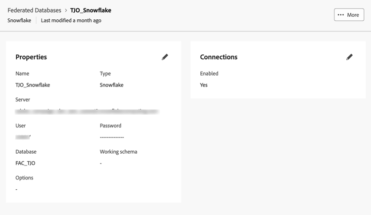

# Data Warehouse

Vi börjar med att konfigurera en anslutning mellan Adobe Experience Platform och din Enterprise Data Warehouse. Vi använder scheman och datamodeller som bygger på hur data ligger i Data Warehouse för att stödja frågeskapande.

För att demonstrera ansluter vi till ett Snowflake-konto. Federated Audience Composition har stöd för en växande lista över anslutningar i molnlagerplatser. Se den [uppdaterade listan över integreringar](https://experienceleague.adobe.com/sv/docs/federated-audience-composition/using/start/access-prerequisites){target="_blank"}.

## Steg

1. Bläddra till avsnittet **FEDERATED DATA** i den vänstra listen.
2. Klicka på knappen **Lägg till federerad databas** i länken **Federerade databaser**.
3. Lägg till ett namn och välj **Snowflake**.
4. Fyll i informationen, klicka på knappen **Testa anslutning** och sedan på knappen **Distribuera funktioner** .

   

   

   

## Skapa ett schema

Så här skapar du scheman i Federated Audience Composition:

### Steg

1. Klicka på **Modeller** i avsnittet **FEDERATED DATA**.
2. Bläddra på fliken **Schema** och klicka på knappen **Skapa schema** .
3. Markera källdatabasen i listan och klicka på fliken **Lägg till tabeller**.
4. Välj tabellerna från den federerade källan. I vårt exempel:
   - FSI_CRM
   - FSI_CRM_CONSENT_PREFERENCE

   

   

När du har markerat tabellerna granskar du kolumnerna i varje tabell och väljer primärnyckeln. **EMAIL** har valts som primärnyckel i båda tabellerna för att stödja affärsärendet.

## Skapa en datamodell

Med datamodeller kan du skapa en länk mellan tabeller. Länken kan skapas mellan tabeller i samma databas, t.ex. tabeller i Snowflake, eller mellan tabeller i olika databaser, t.ex. en länk mellan en tabell i Snowflake och en tabell i Amazon Redshift.

### Steg

1. I avsnittet **FEDERATED DATA** klickar du på **Models** och sedan på **Data Model**.
2. Klicka på knappen **Skapa datamodell** .
3. Ange ett namn för datamodellen.
4. Klicka på **Lägg till scheman** och välj de nya federerade datamodellerna. I det här exemplet väljer vi scheman **FSI_CRM** och **FSI_CRM_CONSENT_PREFERENCE**.
5. Skapa en länk mellan de här tabellerna genom att klicka på **Skapa länkar**.

När du skapar en länk väljer du önskad kardinalitet:

- **1-N**: En förekomst av källtabellen kan ha flera motsvarande förekomster av måltabellen, men en förekomst av måltabellen kan ha högst en motsvarande förekomst av källtabellen.
- **N-1**: En förekomst av måltabellen kan ha flera motsvarande förekomster av källtabellen, men en förekomst av källtabellen kan ha högst en motsvarande förekomst av måltabellen.
- **1-1**: En förekomst av källtabellen kan ha högst en motsvarande förekomst av måltabellen.

Nedan visas en förhandsgranskning av länken som skapats med ovanstående steg. Länken aktiverar en koppling mellan CRM- och medgivandetabellerna, och använder primärnyckeln för **EMAIL** för att utföra en koppling.

Nu är vi redo att [skapa och målgrupp](create-a-federated-audience.md).
