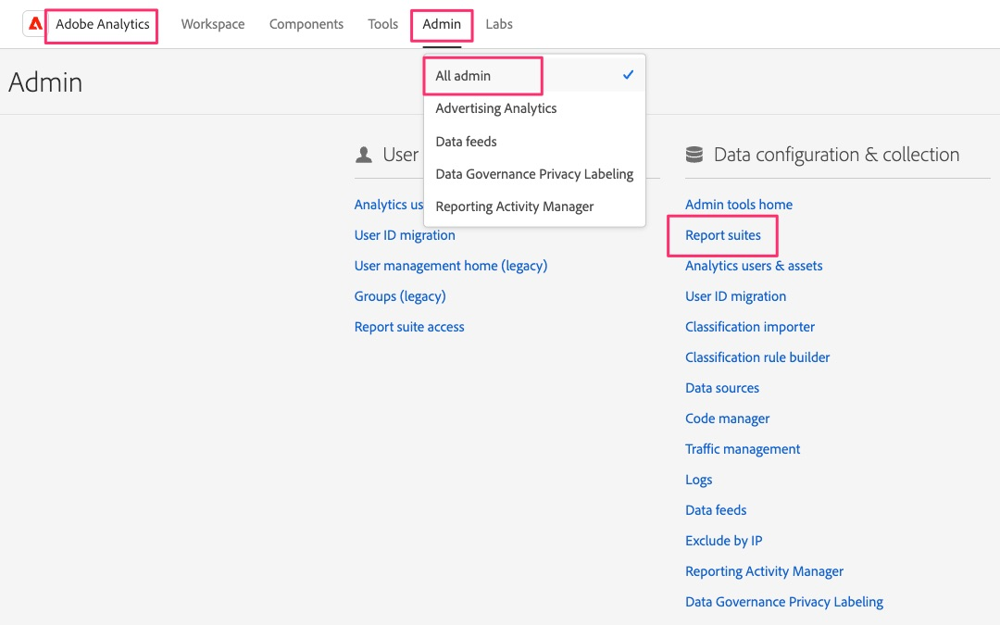

# Skapa en valideringsrapportssvit

Skapa en rapportsvit i Adobe Analytics som du kan använda för att validera SDK-data när du migrerar dina webbplatser från den gamla implementeringen.

Beroende på hur stor och komplex er Analytics-implementering är kan det ta en stund att migrera till SDK för webben. Under den tiden ska du validera ditt arbete och se till att data flödar in i Adobe Analytics-rapporter på rätt sätt. I stället för att överföra dessa data till en rapportsserie tillsammans med produktionsdata, eller till och med till andra utvecklingsdata, är det bäst att skapa en ny rapportsserie som ni kan använda för den här migreringen. I nästa lektion ska vi skapa och konfigurera nya&quot;datastreams&quot; för utveckling, staging och produktion. När vi gör detta måste vi känna till rapportsvitens ID för konfigurationen.

## Skapa den nya rapportsviten

1. Öppna Adobe Analytics och navigera till inställningarna för **rapportsviten** i Admin Console

   .

1. Välj **[!UICONTROL Add Report Suite]**

   

1. Fyll i formuläret för att skapa en ny rapportserie. Även om du kan välja att skapa den nya rapportsviten från en mall, till och med en tom mall, kommer det förmodligen att gå bättre för dig att välja alternativet **Duplicera en befintlig rapportsserie** och välja den rapportsvit som du migrerar till Web SDK. På så sätt kan du ha samma namn och inställningar som när du testar nyligen migrerade data, vilket gör det enklare att validera allt eftersom. Fyll i alla obligatoriska fält och spara din nya utvecklingsrapportsserie för migrering.

   

1. Anteckna din nya rapportsvits-ID, som du behöver i nästa lektion när du skapar datastreams för Web SDK-implementering. Platsens titel kommer att bli bra att komma ihåg, eftersom du kan använda den i Analysis Workspace för att välja en programsvit för migreringsutveckling i Analytics-projektet.

>[!TIP]
>
>En demonstrationsvideo om hur du skapar rapportsviter finns i [Förstå och skapa rapportsviter](https://experienceleague.adobe.com/en/docs/analytics-learn/tutorials/intro-to-analytics/analytics-basics/understanding-and-creating-report-suites){target="_blank"}.

