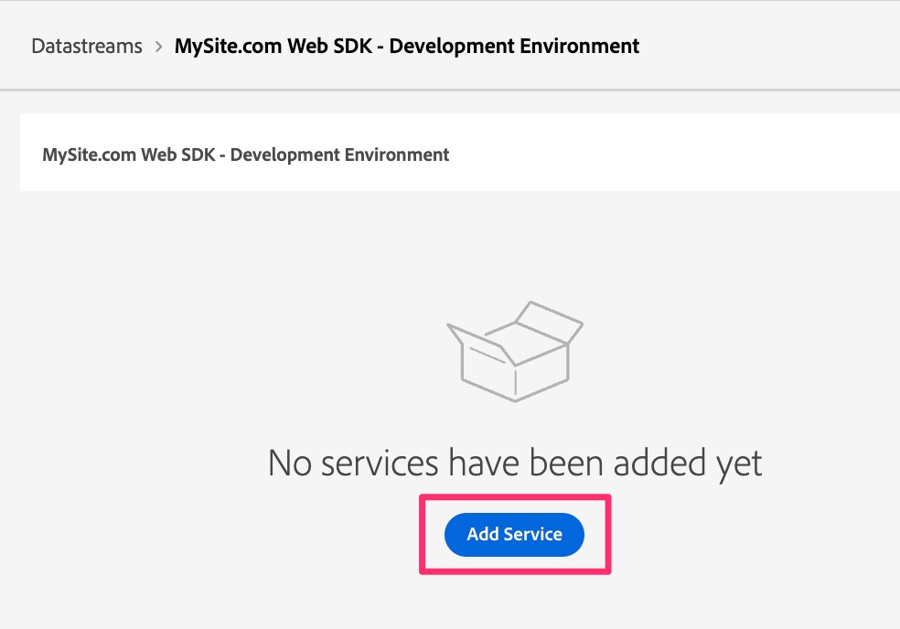

# Skapa och konfigurera ett datastream

Lär dig hur du skapar och konfigurerar en ny datastam så att dina webbplatsdata kan dirigeras till Adobe Analytics.

I den här lektionen får du lära dig hur du skapar och konfigurerar systemet så att dina data flödar från din webbplats till Adobe Edge och sedan slussas vidare därifrån till Adobe Analytics.

## Skapa ett nytt utvecklingsdatastream

1. Öppna gränssnittet Adobe Data Collection
   1. Navigera i webbläsaren till https://experience.adobe.com
   1. Se till att rätt organisation är vald överst på sidan (t.ex. Adobe Production - Tech Marketing Demos i bilden nedan)
   1. Klicka på&quot;nio punkter&quot;, AKA för programväxlaren och välj **Datainsamling**

      

1. Gå till **[!UICONTROL Datastreams]** i den vänstra navigeringen
1. Välj **[!UICONTROL New Datastream]**
1. Ange önskad **[!UICONTROL Name]** och ange en indikator som anger att den kommer att användas för Web SDK-utvecklingsmiljön. Du kan t.ex. namnge detta efter din plats, vilket visas nedan. Observera det, eftersom det här namnet hänvisas till senare när du konfigurerar Web SDK-tillägget i taggegenskapen. Ange en beskrivning om så önskas.

   >[!NOTE]
   >
   >Du behöver bara välja ett schema om du använder funktionen [Dataprep för datainsamling](https://experienceleague.adobe.com/en/docs/platform-learn/data-collection/edge-network/data-prep) som vi inte gör i den här självstudiekursen. Klicka på länken om du vill veta mer.

1. Välj **[!UICONTROL Save]**

   

1. När dataströmmen har sparats visas en ny skärm som talar om att du inte har konfigurerat några tjänster än. Dina data kommer med andra ord att skickas till Edge-servrar, men skickas inte till något program förrän vi lägger till en tjänst. Vi kommer nu att konfigurera datastream för att skicka data till Adobe Analytics. Klicka på **[!UICONTROL Add Service]**.
   
1. Välj **[!UICONTROL Adobe Analytics]** på den nedrullningsbara menyn för tjänster.
1. Ange ID:t (inte titeln, utan rapportsvitens-ID) för den valideringsrapportsvit som du skapade i aktiviteten [Skapa en valideringsrapportsvit](create-a-validation-report-suite.md) i fältet för rapportsvitens-ID. Klicka på **[!UICONTROL Save]**.

## Datastreams för mellanlagring och produktion

Nu vill du **gå igenom samma steg igen** två gånger: en gång för din staging-miljö och en gång för din produktionsmiljö. Nedan följer ett par anteckningar när du konfigurerar dessa två ytterligare datastreams.

### Mellanlagringsdatastream

* När du namnger datastream (och när du lägger till beskrivningen) kan/bör du ha samma namn med skillnaden att lägga till&quot;staging&quot; i stället för&quot;development&quot;.
* Lägg till tjänsten Adobe Analytics, precis som du gjorde tidigare, och ställ in rapportsviten på samma utvecklingsrapportsvit.
* Om du vill ha en renare miljö för att titta på mellanlagringsnummer i dina Adobe Analytics-rapporter kan du skapa en ny rapportserie bara för mellanlagring och sedan se till att du pekar på den rapportsviten i den här datastreams Analytics-tjänst.

### Produktionsdatastream

* När du namnger datastream (och lägger till beskrivningen) kan/bör du ha samma namn som om du lägger till&quot;produktion&quot; i stället för&quot;utveckling&quot;.
* När du väljer rapportsviten att mappa data till kan du mappa datastream till din **aktuella**-produktionsrapportsserie som matas av AppMeasurementets implementering, i stället för att välja en utvecklingsrapportsvit eller till och med en ny rapportsserie. På så sätt kan du ta bort den gamla AppMeasurementet, skicka taggbiblioteken till produktionen när du har testat migreringen och är nöjd med siffrorna. Du matar in nya produktionsdata i samma programserie så att du får kontinuitet mellan gamla och nya implementeringar.
