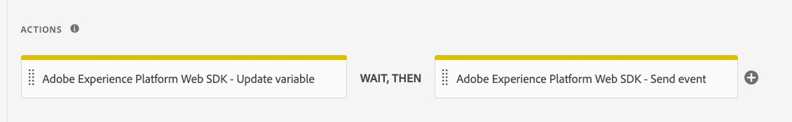

# Ta bort Adobe Analytics-tilläggsobjekt

När felsökningen och valideringen är klar tar du bort alla referenser till Adobe Analytics-tilläggen och tar bort själva tillägget.

## Översikt

När du är säker på att allt i din egendom har migrerats till Web SDK och du har slutfört felsökning och validering (i utvecklingsmiljön) är du redo att ta bort referenserna till Adobe Analytics-tillägget. Hur snabbt du tar bort dessa objekt och hur många gånger du testar medan du gör det är upp till dig. Om du vill vara mer försiktig tar du bort referenser långsamt och testar mellan varje borttagning. Om du är säker på att allt fungerar som det ska och migreras på rätt sätt kan du&quot;rippa bort bandhjälpen&quot; och ta bort alla objekt. Vi skulle fortfarande rekommendera testning i slutet av övningen, förstås.

## Ta bort gamla åtgärder från regler

Vi antar återigen att du redan har testat allt och att det fungerar som det ska. Nu kan du gå in i reglerna en i taget och ta bort de åtgärder som tillhör Adobe Analytics-tillägget.

1. Öppna en av reglerna, t.ex. din standardregel för sidinläsning.
1. Efter att ha gått igenom migreringen för den här regeln har du antagligen fyra (eller fler) åtgärder.

   

1. Du ser att de två första har identifieraren &quot;Adobe Analytics&quot;. Detta är de åtgärder som vi vill ta bort.
1. För musen över den första, som t.ex. åtgärden &quot;Adobe Analytics - Ställ in variabler&quot;, så visas ett X som tillåter borttagning. Klicka på X och se åtgärden försvinna. Ta bort alla Adobe Analytics-åtgärder i regeln, i det här fallet åtgärden Ange variabel och åtgärden Skicka signal.
1. Detta lämnar endast webb-SDK-åtgärder kvar

   

1. Spara i bibliotek
1. Bygg biblioteket och testa webbplatsen för att kontrollera att det inte finns några nya fel och att allt fungerar som det ska
1. Upprepa den här åtgärden för dina andra regler, bygg till ditt utvecklingsbibliotek och testa mellan varje borttagning (eller så ofta du känner dig bekväm). Du kan bara testa i felsökningsprogrammet eller också kontrollera rapporterna i migreringsrapportsviten igen, beroende på din komfort.

## Ta bort tillägg

Nu när du har tagit bort referenserna till ditt Adobe Analytics-tillägg kan du ta bort (eller inaktivera) tillägget samt andra tillägg som använder det eller är beroende av det. Personligen tycker jag om en noggrann strategi, så&quot;inaktivera&quot; är mitt val istället för att avinstallera, åtminstone från början.

1. Välj **Tillägg** i den vänstra listen i användargränssnittet.
1. Kontrollera att fliken **Installerad** är markerad.
1. Markera Adobe Analytics-tillägget.
1. Välj att inaktivera tillägget till höger (eller klicka på de tre punkterna och avinstallera om du vill).

   

1. Gör samma sak med tjänsttillägget Experience Cloud ID, eftersom du inte längre behöver det. Tillägget Web SDK hanterar ID:t så du behöver inte det extra tillägget.
1. Gör på samma sätt för andra tillägg som är kopplade till Adobe Analytics-tillägget, men först efter att du har gjort de nödvändiga migreringsändringarna.
1. Bygg upp ändringarna i utvecklingsmiljön.

