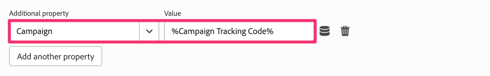

# Migrera ytterligare sidregler

I den här övningen får du lära dig hur du migrerar ytterligare sidbaserade regler till Web SDK-tillägget. Det här liknar den övning du gjorde när du migrerade standardsidans inläsningsregel till Web SDK. Metoderna gäller fortfarande. Den största skillnaden är att med dessa regler kommer du inte att lägga till en Skicka-händelse-åtgärd, eftersom din regel i de flesta fall inte innehåller någon Skicka Beacon-åtgärd för ett Analytics-tillägg.

## Översikt

Låt oss säkerhetskopiera lite och prata om Analytics-implementeringar som de är med Adobe Analytics-taggtillägget (kallas även&quot;AppMeasurement&quot;-implementering, eftersom det är namnet på JavaScript-filen).

Jag antar inte att jag vet exakt hur du implementeras, men i många implementeringar med Experience Platform-taggar finns det ett antal regler som bara aktiveras villkorligt, baserat på något på sidan eller i URL:en. Exempel på detta kan vara:

* Sökresultatregel, som endast aktiveras när en intern sökning har utförts och sökresultatsidan visas
* Regel för kampanjstartsida, som bara utlöses när det finns en spårningskod i URL:en
* Sidtypsregel, endast utlöses för en sida som är en viss typ av sida, t.ex. produktinformationssida, kundvagnssida osv.
* Andra sidor som utlöses villkorligt

Nyckelpunkten här är att alla dessa användningsfall bara utlöser **ibland** på en sida, och vi **förväntar oss också** att standardsidregeln utlöses. Därför vill vi inte inkludera en Skicka signal (AA-tillägg) eller en Skicka-händelse (Web SDK-tillägg) med någon av dessa regler, annars skulle två träffar för samma sidinläsning.

Därför bygger dessa regler upp objektet, men de skickar inte data i. Vi ser bara till att de här reglerna startar **före** som standardregel för sidinläsning, så att när de har skapat objektet skickar åtgärden Skicka Beacon/Skicka händelse på standardsidans inläsningsregel allt i. Nu är det troligt att du känner till allt detta och det är så webbplatsen är konfigurerad. Men om du inte är van vid din egen implementering, eller om du behöver åtgärda implementeringen för att efterlikna den här metoden, är den här övningen särskilt användbar för dig.

## Exempelmigrering av villkorlig regel

Här är ett exempel på hur du migrerar en regel som aktiveras villkorligt. Jag ska använda exemplet ovan på en kampanjlandningssida. Som jag sade ovan följer detta samma mönster som vi redan har arbetat med i vår standardsidregel, förutom att det är ännu enklare eftersom vi bara ställer in variabler och inte skjuter några träffar.

1. Leta reda på villkorsregeln. I det här exemplet hittar vi kodregeln för kampanjspårning och markerar den.

   

1. När regeln öppnas kan vi se att det finns ett villkor för den här regelkörningen baserat på en frågesträngsparameter. Vi behöver inte ändra något om villkoret eftersom vi bara vill uppdatera/migrera åtgärden, inte händelsen eller villkoret.
1. Klicka på åtgärden **Adobe Analytics - Ange variabel**
1. Notera vad som anges i funktionsmakrot. I det här exemplet observerar vi att **event101** har angetts, samt variabeln **Campaign** .

   
   

1. Vi klickade bara här för att göra anteckningen, och vi behöver inte ändra någonting, så nu kan vi bara klicka på **cancel**.
1. Skapa en ny åtgärd genom att klicka på **plustecknet** i åtgärdsavsnittet

   

1. Konfigurera den nya regeln
   1. Välj **Adobe Experience Platform Web SDK** i listrutan Tillägg.
   1. Välj **Uppdatera variabel** i listrutan Åtgärdstyp.
   1. Markera objektet **Analytics** i dataobjektet på den högra panelen

      

1. Ställ nu in event101 och kampanjvariabeln på samma värden som de hade angetts i den befintliga åtgärden.

   
   

1. Nu kan du **Behåll ändringar** och **Spara i bibliotek** och din regel har migrerats till Web SDK.

>[!IMPORTANT]
>
>Precis som standardregeln för sidinläsning har vi lämnat Analytics-tilläggets **Set Variable**-åtgärd i regeln så att vi kan jämföra data när vi validerar migreringen. Glöm inte att komma in igen senare och ta bort Analytics-tilläggets åtgärd när du gör den slutliga rensningen.
