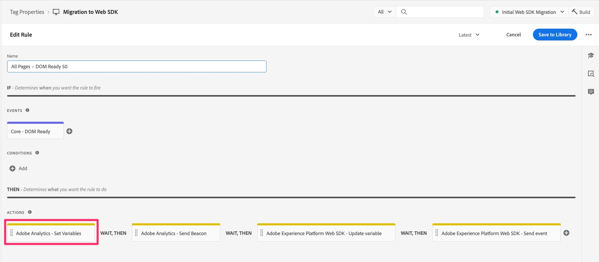

# Migrera egen kod till Web SDK

I den här övningen får du lära dig hur du migrerar anpassad kod från Adobe Analytics-tillägget till Adobe Experience Platform Web SDK-tillägget i Experience Platform Tags.

## Den stora ansvarsfriskrivningen

Jag är säker på att du inte kommer att bli förvånad över att jag kommer att lägga till något liknande i ett dokument som börjar berätta det bästa/enklaste/effektivaste sättet att arbeta med kod. Det finns helt klart många olika sätt att skriva, redigera och hantera kod. I den här övningen ska jag ge dig ett sätt att enkelt ta kod som du har i en befintlig regel och kopiera den, lägga till en ändring och få den att fungera för den migrerade regeln. Om du tänker på ett bättre sätt att göra det är det fantastiskt, och jag välkomnar dig inte bara att använda det, utan även att dela det med oss och dina kollegor i Experience League-communityn (särskilt i communityposten om den här självstudiekursen). Samma sak gäller den nedre halvan av sidan när man arbetar med implementeringsplugins. Jag föreslår en väg här, och sedan gör du det som känns bra för dig. Okej, vi går in på detaljerna.

>[!IMPORTANT]
>
>I samma anda som i det sista stycket är det också viktigt att rekommendera att du tar tillfället i akt under migreringen till Web SDK att ta en god titt på koden och se om den ska uppdateras eller till och med tas bort. I styckena och stegen nedan får du se hur du migrerar din kod, och även om det är enklare att bara flytta över den i ett enda svep så rekommenderar jag inte att du gör en vårrengöring, så att säga.

## Migrering av vilken kod?

Koden som vi ska adressera först i det här avsnittet är koden som du kan ha i fönstret Anpassad kod i alla Adobe Analytics-åtgärder, inklusive **Ange variabel** -åtgärderna. Öppna med andra ord en av reglerna och leta upp den i åtgärdsavsnittet. Om du har en Adobe Analytics - Ange variabler-åtgärd, klickar du för att öppna den.



Bläddra sedan nedåt till höger och nedåt, så ser du knappen&quot;Öppna redigerare&quot; för fönstret Anpassad kod. Klicka för att öppna.


Om du har kod där måste den migreras så att den kan köras och skickas till Adobe Analytics via Web SDK.
Huvudtanken här är att vi ska konvertera&quot;s&quot;-objektet till&quot;innehåll.__adobe.analytics&quot;.

Vi behöver bara lägga till ytterligare kod innan det första anropet till objektet så att det kan förstås och hanteras av Web SDK. Den plats där den nyligen ändrade koden läggs till finns i fönstret Anpassad kod i åtgärden&quot;Adobe Experience Platform Web SDK - Uppdatera variabel&quot;.

Låt oss till exempel säga att du har följande kodblock i det anpassade kodfönstret:

```javascript
const products = window.digitalData.products;
const productIndex = event.element.dataset.productIndex;
const product = products[productIndex];
s.products = [
product.cat3Tag,
product.id,
1,
product.price
].join(";");
```

Koden som du måste inkludera är följande:

```javascript
content.__adobe = content.__adobe || {};
content.__adobe.analytics = content.__adobe.analytics || {};
const s = content.__adobe.analytics;
```

Så här migrerar du den anpassade koden:

1. Kopiera den anpassade koden från fönstret i åtgärden Adobe Analytics Set Variables
1. Stäng kodfönstret och stäng (avbryt utanför) åtgärden.
1. Öppna SDK för webben - Uppdatera variabelåtgärden genom att klicka på den (eller om du inte har någon ännu, lägg till en).

   

1. Markera analysobjektet längst upp i det högra fönstret

   

1. Bläddra nedåt och öppna fönstret Egen kod

   

1. Klistra in koden som du tog över från det anpassade kodfönstret för Analytics
1. Placera nu de nya kodraderna i mitten av den befintliga koden, så att den är ovanför den första omnämnandet av objektet s, som i följande exempel:


Du kan nu spara koden i fönstret Anpassad kod och behålla ändringarna i åtgärden Uppdatera variabler. Du vill också spara regeln och publicera de nya ändringarna i arbetsbiblioteket.

## Hur är det med plugin-program?

Om du har en appMeasurement-implementering av Adobe Analytics med Analytics-tillägget i Experience Platform Tags (tidigare kallat Launch) är det troligt att du använder ett eller flera JavaScript-plugin-program för att ställa in variabler eller för att utföra andra åtgärder. Om dessa JavaScript-funktioner och -anrop finns i ett kodfönster inuti en regel, bör informationen ovan på den här sidan hjälpa dig att migrera koden till Web SDK.
Men det är också troligare att din plugin-programkod finns i kodfönstret i konfigurationen för själva Adobe Analytics-tillägget. Om du vill kontrollera om du har plugin-program och annan kod att migrera öppnar du Analytics-tillägget genom att gå till Datainsamling och Taggar, öppna egenskapen och sedan klicka på **Tillägg** i den vänstra navigeringen.

1. Välj fliken **Installerad** längst upp på sidan och välj sedan ditt Adobe Analytics-tillägg.
1. Klicka sedan på **Konfigurera** till höger på sidan.

   

1. Expandera avsnittet **Konfigurera spåraren med anpassad kod**
1. Klicka för att **öppna redigeraren**

   

Nu kan du se koden som finns där, och du kan ha JavaScript &quot;plug-ins&quot;, dvs. kodfragment som hjälper dig att hämta data som du vill ha och tilldela dem till anpassade dimensioner, osv.

Allt i det här kodfönstret kanske inte betraktas som plugin-program i Adobe Analytics. Detta är viktigt att förstå när du bestämmer hur du ska migrera koden.

### Rekommendation för att migrera kod från tilläggets huvudkodfönster

Tja, än en gång, kanske inte allt i kodfönstret är en officiell plugin som skapats av Adobe Consulting. Det kan vara kod du skrev, vare sig du kallar det ett plugin-program eller inte. Vi rekommenderar två ändringar. De ska använda ett nytt tillägg och även kopiera och klistra in resten av koden på en ny plats.

**Först** finns det ett tillägg i Taggar som kallas **Vanliga SDK-plugin-program för webben**. Det här tillägget är en delmängd av den totala listan över implementeringsplugin-program som finns i Adobe Analytics-dokumentationen. Genom att installera det här tillägget i taggegenskapen installerar du koden för de inkluderade plugin-programmen. Om du sedan vill använda dessa plugin-program hittar du dem när du skapar nya **dataelement**. Mer om det på ett ögonblick.

**För det andra** finns det ett kodfönster i konfigurationen av Web SDK-tillägget där du kan placera all (eller en del) kod, om du vill att den ska köras direkt innan händelserna skickas till Adobe Analytics. Steg för att hitta kodfönstret är:

1. Om du redan har lagt till Web SDK-tillägget i din egenskap går du till **Tillägg** och väljer fliken **Installerad**
1. Markera **Adobe Experience Platform Web SDK-tillägget** och öppna det genom att klicka på **Konfigurera** till höger.

   

1. Bläddra ned till avsnittet **Datainsamling** och klicka för att öppna kodfönstret för **onBeforeEventSend**.

   

Här klistrar du in kod som du vill köra direkt innan händelsen skickas till Analytics från Web SDK. Det är i stort sett vad funktionen doPlugins gjorde i er gamla Analytics-implementering.

Den **goda nyheten** är att den ska köras **när som helst** när du gör en skicka-händelse, så oavsett om det sker vid sidinläsning eller med en anpassad länk ska koden köras, ställa in variablerna osv.

#### Måste jag ändra min kod?

Ja och nej. Ja, du behöver ändra några små saker, men nej, du behöver inte ändra större delen av koden så länge du ändrar dessa små saker:

_**Kodändring 1:**_
När du har klistrat in din plugin-kod (eller tidigare) i kodfönstret i tillägget Web SDK **tar du bort**&quot;doPlugin&quot;-linjerna från koden. Du kommer inte att behöva dem och de kommer att orsaka ett fel eftersom de är en del av appMeasurement.js men inte Web SDK-koden.


_**Kodändring 2:**_
Den andra ändringen du måste göra är att lägga till kod så att objektet&quot;s&quot; definieras, mycket likt det som beskrivs ovan när det gäller koden i regelåtgärder. I det här fallet måste vi definiera koden lite annorlunda genom att lägga till en datanod som redan har definierats i regelåtgärden, men inte här.
Den här definitionen bör placeras högst upp i kodfönstret. Koden som ska kopieras i (när koden placeras i Web SDK-tillägget) är följande:

```javascript
content.data.__adobe = content.data.__adobe || {};
content.data.__adobe.analytics = content.data.__adobe.analytics || {};
const s = content.data.__adobe.analytics;
```

_**Med båda kodändringarna:**_
Här är koden som listas ovan, men med båda ändringarna har vi just diskuterat:


### Steg för att migrera huvudtilläggskoden till Web SDK

Rekommendationen är som sagt TVÅ: att använda det nya tillägget Common Web SDK Plugins och även att kopiera och klistra in koden från tilläggskonfigurationen Analytics i webbtilläggskonfigurationen för SDK. Med detta i åtanke, tillsammans med den viktiga kommentaren längst upp på sidan för att rensa din kod, är detta de rekommenderade stegen på en hög nivå:

1. Kopiera all kod från Analytics-tilläggets konfigurationskodfönster och klistra in den i onBeforeEventSend-fönstret i Web SDK-tilläggets konfiguration (även om vi kopierar över kod som behöver tas bort eller uppdateras, kommer vi att göra några omgångar i koden i det nya fönstret).
1. Gå igenom koden nu i Web SDK-tillägget och sök efter anrop till plugin-program eller funktionsdefinitioner för plugin-program som definieras i **Common Web SDK Plugins** . Du hittar listan med plugin-program i definitionsfönstret för Web SDK-dataelement när du har installerat tillägget plugins. Du kan också hitta det i [dokumentationen för tillägget](https://exchange.adobe.com/apps/ec/108520).
1. För varje plugin-program som du hittar i det nya tillägget för plugin-program för Web SDK tar du bort tillägget och anropet till det från koden. Se sedan till att du kompenserar för borttagningen genom att skapa ett dataelement och sedan anropa det dataelementet i rätt regel för att ange variabler, osv.
1. Gå sedan igenom koden för att se om det finns några anrop till funktioner som definierats i filen appMeasurement.js. **Kodändring 1** ovan är ett exempel på detta, och du kan ta bort doPlugins-kod nu, om du inte redan gjort det. För andra instanser är detta tydligast när du har ett anrop till en funktion som inte är definierad någonstans i koden. Du kan även kontakta Adobe kundsupport eller dina kollegor i Experience League Community för att kontrollera att så är fallet med koden.
1. Ta sedan en steg igenom koden för att uppdatera eller ta bort gammal kod som inte längre gäller för dina analysbehov, vilket rekommenderas högst upp på sidan.
1. Gör **Kodändring 2** som visas ovan och lägg till de extra raderna så att inga referenser till objektet inte orsakar fel i koden.
1. Sist men inte minst: testa, testa och testa några till. Efter det testar du igen. Se till att koden ger de resultat du förväntar dig både i felsökningsprogrammet för Experience Platform och i rapporterna i Adobe Analytics.

>[!NOTE]
>
>Två sista funderingar om stegen ovan.
>För det första kanske du tycker att det skulle vara enklare att bara lämna all plugin-kod där istället för att ta bort den och använda det nya tillägget Common Web SDK Plugins. Detta är sant och bra, men genom att använda tillägget får du fördelarna med att använda ett användargränssnitt, definiera ett återanvändbart dataelement och automatiskt ta emot koduppdateringar i framtiden. Det är antagligen värt att byta.
>
>För det andra, när du talar om att&quot;göra bytet&quot;, kan du nu även bestämma dig för att uppdatera ALL din anpassade kod så att den inte refererar till det gamla&quot;s&quot;-objektet alls, vilket är en typ av tillägg till steg 5 ovan. Detta är förstås helt godtagbart och en bra idé. Den här självstudiekursen för migrering gör det bara lite enklare att migrera din anpassade kod om du har en massa av den och inte har resurser att uppdatera allt just nu. Du bestämmer.

Vi avslutar den här lektionen som vi började den, med en bekräftelse på att det finns många sätt att skriva kod, och i det här dokumentet får du några steg att följa om du vill göra det på det här sättet. Huvudsaken är att koden fungerar och ger dig de resultat du förväntar dig, så känn dig fri att göra det som du vill, och nämnde jag att du borde testa?
