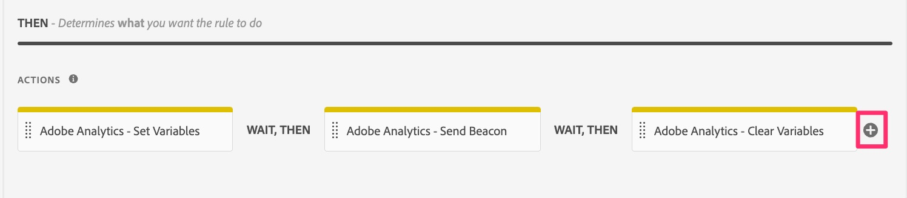

# Migrera anpassade länkregler

I den här övningen får du lära dig hur du migrerar regler som skickar i anpassade länkträffar (till skillnad från sidvyer).

## Översikt

När du skickar in ett anpassat länkträff med Analytics-tillägget eller AppMeasurement-koden, och konfigurerar åtgärden **Skicka fyr**, väljer du även om du ska skicka en sidvyträff eller ett anpassat länkträff. Om du väljer ett anpassat länkträff, frågar den dig om det är **Länknamn** och **Länktyp** för det träffen. Om du inte skickar några andra variabeldata förutom länknamnet och typen, behöver du inte ha någon ytterligare åtgärd som ställer in variabler (props, eVars och events).
När du migrerar regler som är anpassade länkregler får du därför **ett av de två** följande scenarierna i reglerna:

1. Den befintliga regeln innehåller en **Adobe Analytics - Ange variabler** -åtgärd som anger props, eVars, events osv. och innehåller sedan en **Adobe Analytics - skicka Beacon** -åtgärd som anger träffen till en anpassad länkträff (A.K.A. och s.tl()-träff), anger länkens namn och typ och skickar data.
   1. I det här fallet kommer den förmodligen även att innehålla en slutgiltig åtgärd som kallas **Adobe Analytics - Rensa variabler**, för att &quot;nollställa&quot; värdet från variablerna efter att data har skickats till Adobe-servrar.
1. Den befintliga regeln innehåller bara åtgärden **Adobe Analytics - skicka fyr** som anger träffen till en anpassad länkträff, anger länkens namn och typ och skickar data.

### En viktig ändring

Orsaken till att detta är viktigt när du migrerar din Adobe Analytics-implementering till Web SDK är följande:
Inställningen för länkens namn och typ, som krävs för att träffen ska vara en anpassad länkträff, finns INTE i åtgärden&quot;Skicka Beacon-ekvivalent&quot; (skicka-händelse). I stället finns inställningen för länknamnet och typen i åtgärden Ange variabelmotsvarighet (uppdateringsvariabel).
Resultatet av detta är att du, oavsett om du har scenario 1 eller scenario 2 ovan, måste få både en Update-variabelåtgärd och en Send-händelseåtgärd.

Nedan visas en visuell representation av den här skillnaden i implementeringar.

## Migreringssteg

Öppna regeln för anpassad länk och se om den liknar scenario 1 eller scenario 2 ovan.
**Om din regel liknar scenario 1:**

1. Öppna åtgärden Ange variabler och skriv ned alla variabler (props, eVars, events, etc.) som ställs in i den åtgärden (i bilden ovan ställs event10 in).
1. Öppna åtgärden Skicka signal, kontrollera att den är inställd på att skicka en s.tl()-träff. Skriv ned värdena för Länktyp och Länknamn.
1. Klicka på plusikonen i avsnittet Åtgärder i den anpassade länkregeln för att lägga till en annan regel.

   

1. Konfigurera åtgärden
   1. Ange **tillägget** till Adobe Experience Platform Web SDK
   1. Ange att variabeln **Åtgärdstyp** ska uppdateras
   1. Markera objektet **Analys**
   1. Ange dina utkast, eVars och händelser från åtgärden Ange variabler i Analytics (i det här exemplet event10)

      

   1. I samma regel bläddrar du nedåt till listrutan **Additional property** (Ytterligare egenskap) och lägger till fältet **Link name** (Länknamn) med det värde som du hämtade från regeln Send Beacon. I bilden nedan är exemplet att ange namnet till strängvärdet &quot;menu click&quot;.
   1. Lägg även till fältet **Länktyp** från samma nedrullningsbara meny, där&quot;o&quot; läggs till som värde (om länktypen i åtgärden Skicka Beacon var&quot;Egen länk&quot;). Då skickas länktypen &quot;other&quot; som motsvarar en anpassad länk. Om länktypen var en nedladdningslänk väljer du d för värdet i det nya länktypsfältet och om länktypen var en avslutningslänk väljer du e för värdet i det här nya länktypsfältet.

      

1. Under de ytterligare egenskaperna visas en kryssruta med namnet **Rensa befintligt värde**. Om din befintliga regel har åtgärden **Adobe Analytics - Rensa variabler** (som visas ovan i steg 3) behöver du bara markera den här kryssrutan, och du behöver inte lägga till en åtgärd för att rensa variabler för Web SDK.

   

1. Lägg till ytterligare en åtgärd genom att klicka på plusikonen.
1. Konfigurera åtgärden Skicka händelse
   1. Ange **tillägget** till Adobe Experience Platform Web SDK
   1. Ställ in händelsen **Åtgärdstyp** på Skickat
   1. Klicka på dataelementsikonen och välj dataelementet **Datavariabel för sidvisning**

   

1. **Behåll ändringar**, **Spara i bibliotek** så kan du **skapa** biblioteket från samma sida, eftersom vi redan har ställt in ett arbetsbibliotek.

## Dra en viktig avslutning av migreringen

* I den här lektionen lärde du dig att migrera anpassade länkregler.
* I [Migrera din standardsidinläsningsregel](migrate-your-default-page-load-rule.md) lärde du dig att migrera regler som både anger variabler och skickar i en analysfyr.
* I lektionen [Migrera ytterligare sidlinjaler](migrate-additional-page-rules.md) lärde du dig att migrera dina regler som anger variabler, men som inte skickar en fyr till Adobe Analytics.

Som du kan föreställa dig kan samma metoder användas i många olika regler för att migrera Analytics-tillägget till Web SDK.
I de flesta fall **uppdaterar du åtgärderna** i reglerna. Du ändrar inte händelsen eller villkoren som den utlöses på. Du ändrar bara vad som händer i åtgärdsavsnittet när reglerna utlöses.
De flesta, om inte alla, av era regler hamnar i dessa kategorier. Om du har en regel som inte gör det bör du överväga samma paradigm för att migrera åtgärden, inte vad som utlöste regeln.
