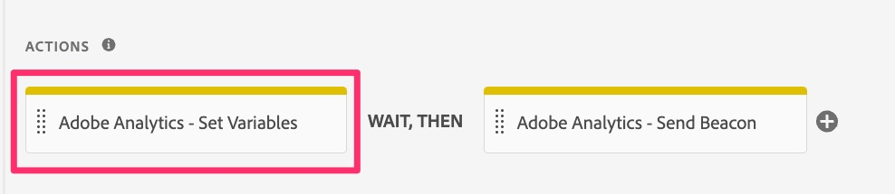
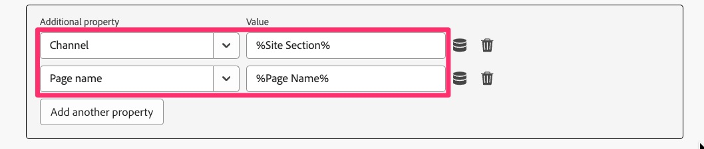
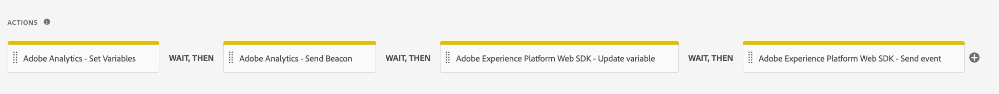

# Migrera standardregel för sidinläsning

I den här övningen får du lära dig hur du migrerar en standardregel för sidinläsning i Adobe Experience Cloud Tags från Analytics-tillägget till Web SDK-tillägget.

## Översikt

Vi backar upp lite. Det är troligt att du har en regel i Taggar som utlöses på varje sida - en som ställer in en eller flera standardvariabler och sedan utlöser en fyr, eller en träff, till Adobe Analytics. Den här regeln använder för närvarande&quot;åtgärder&quot; i Adobe Analytics-tillägget för att göra dessa saker. När vi migrerar vår implementering till Web SDK måste vi kunna ta bort alla referenser (som åtgärderna) till Analytics-tillägget och ersätta dem med åtgärder som tillhör Web SDK. I stegen nedan antar vi ovanstående, dvs. att du har en standardregel för sidinläsning som båda anger variabler och skickar i en spårningssignal till Analytics.

## Migrera åtgärden Ange variabler

I den här aktiviteten skapar vi en Web SDK-åtgärd som motsvarar åtgärden **Ange variabler** i Adobe Analytics-tillägget.

1. Gå till skärmen **[!UICONTROL Rules]** när du är i användargränssnittet för datainsamling och i din egenskap genom att markera den i den vänstra navigeringen.
1. Välj regeln som är **Analysens standardinläsningsregel**. Om du inte vet vilken regel som är din standardlastregel, kan du tala med någon som har kunskap om reglerna och vad som finns i dem. Vi söker återigen efter en regel som kan köras på varje sida, ställer in vissa standardvariabler (t.ex. sidnamn) och skickar sedan en signal till Analytics. Vi kommer att ändra på den här regeln. Min heter&quot;Alla sidor - DOM Ready 50&quot;, men din kan heta vad som helst.

   

1. För att kunna migrera de aktuella åtgärderna från Analytics-tillägget till Web SDK-tillägget måste vi veta vilka variabler som ställs in. Klicka därför på åtgärden **Adobe Analytics - Ange variabler** så att du ser vilka variabler som ställs in (t.ex. PageName, props, eVars, events).

   
   1. Observera vilka variabler som anges i den regeln
      

1. Överst på sidan ändrar du alternativknappen till **Ange JSON** så visas en kodvy över de variabler som har angetts. Den här kodvyn och gränssnittsvyn är utbytbara, och när du anger något i ett gränssnitt uppdateras det även i det andra användargränssnittet.

   

1. Kopiera dessa data till Urklipp eller spara dem i en fil för användning direkt, eftersom du i nästa steg ska klistra in koden i en ny Web SDK-åtgärd.
1. Avbryt från åtgärden Ange variabler i Analytics så att du är tillbaka på regeln.

   >[!IMPORTANT]
   >
   >Du kan välja mellan följande i det här steget:
   >1. I stället för att lägga till en ny åtgärd kan du bara ändra de befintliga åtgärderna, som när de sparas direkt klipper över data till nya Web SDK-rapportsviten och inte längre visas i den aktuella Analytics-rapportsviten.
   >1. Du kan skapa en ny åtgärd för att skicka data till Analytics via Web SDK och låta Analytics-åtgärden vara på plats nu. Detta ger er möjlighet att jämföra data i nya Web SDK-rapportsviten med den aktuella Analytics-rapportsviten. **Det här är det vi ska göra i den här självstudien.** Tänk på att den här metoden kommer att resultera i dubbla träffar medan du jämför data, vilket också resulterar i en kostnad för de extra serveranropen, tills du tar bort det gamla Analytics-tilläggets åtgärder. Det är tydligt att du inte vill behålla Analytics-tilläggets åtgärder där för evigt, utan bara tillräckligt länge för att verifiera att data flödar korrekt i det nya Web SDK-tilläggets rapportserie.

1. Klicka på plusknappen **plus** för att lägga till en ny Web SDK-åtgärd.

   

1. Välj **Adobe Experience Platform Web SDK** i listrutan Tillägg.
1. Välj **Uppdatera variabel** i listrutan Åtgärdstyp.
1. Se till att **dataelementet** som listas högst upp på den högra panelen verkligen är ditt nya variabeldataelement.
1. Markera objektet **Analytics** i dataobjektet på den högra panelen
   
1. Ändra nu alternativknappen till **Ange JSON eller dataelement** och klistra in koden som du kopierade i föregående steg från Ange variabler i det här kodfönstret. Kom ihåg att det vi visar här i självstudiekursen bara är exempel. Du kopierar och klistrar in dina egna variabler.

   
Det här JSON-kopieringsverktyget har gjorts särskilt för att göra migreringen enklare, och jag är säker på att du kan se hur enkelt det är i stället för att behöva göra omfattande anteckningar från den gamla åtgärden och använda dem i den nya åtgärden.

1. Du kan när som helst växla alternativknappen fram och tillbaka för att se värdena i antingen kodversionen (visas ovan) eller gränssnittsversionen för att se attributen. Markera alternativknappen **Ange enskilda attribut** om du vill se attributen ifyllda.

   
   

1. Klicka på **Behåll ändringar/Spara när du kan se att variablerna är korrekt.**

## Migrera åtgärden Skicka Beacon

I den här aktiviteten skapar vi en Web SDK-motsvarighet till Analytics-åtgärden &quot;Skicka signal&quot;, som kallas **Skicka händelse**.

1. Gå tillbaka till standardsidlinjalen som du just var med om.
1. Klicka på plusknappen **plus** i åtgärdsavsnittet för att lägga till ytterligare en åtgärd. Detta blir vår **Skicka-händelse**-åtgärd.

   

1. Om du vill konfigurera åtgärden väljer du **Adobe Experience Platform Web SDK** i listrutan Tillägg.
1. Välj **Skicka händelse** från åtgärdstypen.
1. På den högra panelen markerar du dataelementikonen bredvid objektet **Data** .

   

1. Markera datavariabeln i sidvyn (eller något annat dataelement av typen&quot;data&quot;) och klicka sedan på knappen **Markera** .

   

1. Klicka på **Behåll ändringar/Spara**.
1. Nu ska du se alla fyra åtgärderna (två gamla och två nya) i regeln

   

## Ska jag ta bort åtgärder för Analytics-tillägget?

Bra fråga. Svaret är huruvida du vill validera dina nya åtgärder innan du tar bort de gamla. Som jag nämnde ovan, om du lämnar både Analytics- och Web SDK-åtgärder som skickar data i (Skicka Beacon och Skicka Event), som vi har valt att göra i den här självstudiekursen, så kommer du att ha samma data i två rapportsviter (det vill säga produktionsrapportsviten från Analytics-tillägget och din nya valideringsrapportsserie från Web SDK-tillägget). Detta leder till att serveranropen dubbleras till Analytics, och det är en kostnad som är kopplad till det. Men så många kunder väljer att göra det, så att de kan validera de nya uppgifterna innan de stänger av gamla data. Vi kommer att ha en övning i slutet av den här självstudiekursen som visar hur du rensar upp det gamla materialet när du är nöjd med valideringen, men om du vill göra det nu för att spara serveranrop och inte bekymra dig om validering, kan du hoppa över till slutet av självstudiekursen eller bara ta bort Analytics-tilläggets åtgärder från reglerna när du går vidare.
