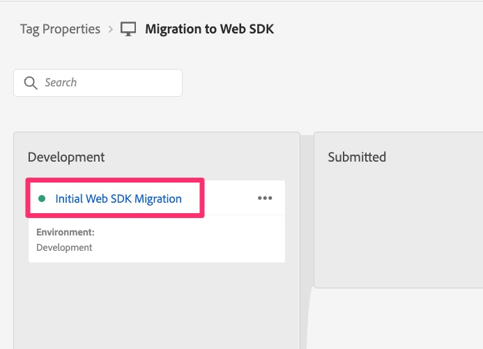

# Publish övergången till staging och produktion

När all utveckling har slutförts för migreringen och validerats kan du bygga vidare till staging och sedan publicera till produktion när det är klart.

## Översikt

Detta är det sista huvudsteget i migreringen, och det är att flytta biblioteket som du har använt för att utveckla och testa migreringen till din testmiljö för sluttestning där och sedan till produktionsmiljön.

Om du går tillbaka till [Skapa och konfigurera en datastream](create-and-configure-the-analytics-datastream.md) -lektion ser du i slutet av lektionen att vi har pekat på mellanlagringsdatastream för att skicka analysdata till samma utvecklingsrapportsvit (eller alternativt till en ny mellanlagringsrapportsserie). Där kommer du också att påminnas om att vi har pekat på produktionsdatastream för att skicka data till den befintliga produktionsrapportsviten som du har använt.
Det här är bara bra information att ha när vi nu flyttar det migrerade biblioteket längs publiceringsvägen till staging och produktion.

## Publicera till miljöer för staging och produktion

Här följer de steg som kommer att föra vårt bibliotek vidare till staging- och produktionsmiljöer:

1. I tagggränssnittet väljer du Publiceringsflöde i den vänstra navigeringen
1. Du bör se ditt migreringsbibliotek under Development (namnet är det du valde i början av den här migreringsprocessen)

   

1. Om du är säker på att du redan har lagt till varje enskild ändring i biblioteket kan du flytta biblioteket framåt under de tre punkterna och hoppa över nästa steg. Om du inte är säker följer du de följande fem stegen.
1. Klicka på biblioteksnamnet för att gå till biblioteksinformationen
1. Kontrollera att du är i rätt bibliotek via namnet
1. Välj Lägg till alla ändrade resurser längst ned på sidan
1. Klicka sedan på Spara och bygg till utveckling för att lägga till alla ändringar i biblioteket som står i kö

   

1. Detta tar dig sedan tillbaka till publiceringsflödet och om bygget slutförs utan fel visas en grön punkt bredvid biblioteket.
1. Du kan sedan flytta ditt bibliotek framåt i publiceringsprocessen utifrån dina behov. Du kan ställa in den för godkännande, flytta den direkt till mellanlagring för att testa och godkänna den där, eller till och med flytta den för godkännande eller publicering direkt i produktionen. Återigen beror detta på organisationens publiceringsbehov.

   

Grattis! Nu finns er Analytics-implementering helt och hållet på Web SDK!

Jag ska lägga till en viktig kommentar här som vi hade i början av den här självstudiekursen:

>[!IMPORTANT]
>
>Det är viktigt att komma ihåg att ett av de viktigaste skälen till att du migrerar din implementering är att förbereda dig för att använda Adobe Experience Platform-program som Customer Journey Analytics, Real-Time CDP eller Journey Optimizer (se #3 ovan). Om du använder webbplatsdata för det här ändamålet kommer du att behöva utföra ytterligare steg som inte ingår i den här självstudiekursen, men den här självstudiekursen kommer säkert att vara en förutsättning för den fortsatta implementeringen. Slutför därför den här självstudiekursen och fortsätt sedan med att utföra de steg som krävs för att skicka samma webbplatsdata till Experience Platform.

Lycka till på resan framåt med analyser och andra innehålls- och marknadsföringssatsningar!
