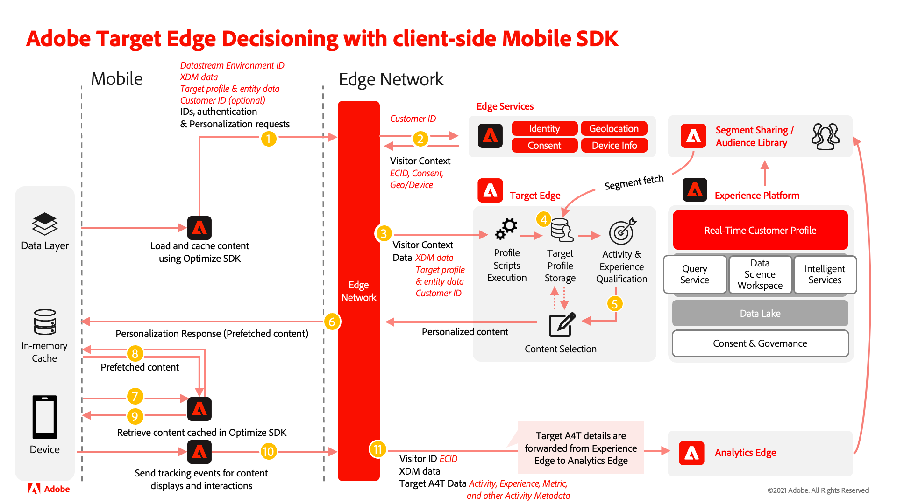

# Jämförelse av Target-tillägget med Offer Decisioning- och Target-tillägget

Tillägget Offer Decisioning och Target skiljer sig från Adobe Target-tillägget för mobilappar. Följande tabeller är en referens som hjälper dig att utvärdera områden av implementeringen som du kan behöva fokusera på under migreringsprocessen.

När du har granskat informationen nedan och utvärderat din nuvarande implementering av det tekniska måltillägget bör du förstå följande:

- Vilka Target-funktioner som stöds av Offer Decisioning och Target
- Vilka Adobe Target-tilläggsfunktioner som har motsvarigheter Offer Decisioning och Target
- Hur målinställningarna tillämpas med Offer Decisioning och Target
- Hur data flödar med Offer Decisioning- och Target-tillägget

## Operativa skillnader

| | Måltillägg | Offer Decisioning och Target |
|---|---|---|
| Process | Ändringar i en Target-implementering kan följa en process som har en annan inriktning eller QA-krav än andra program som Analytics. | Ändringar av en implementering av Offer Decisioning- och Target-tillägg bör omfatta alla program längre fram i kedjan, och QA- och publiceringsprocessen bör anpassas därefter. |
| Collaboration | Data som är specifika för Target kan skickas direkt i Target-anropen. Om rapportkällan för Target är Adobe Analytics (A4T) kan data som är specifika för Target också skickas till Adobe Analytics när lämpliga spårningsmetoder i tillägget Target anropas för visning av målinnehåll och interaktion. | Data som skickas i Offer Decisioning- och Target-tilläggsanrop kan vidarebefordras till både Target och Analytics om Target-rapportkällan är Adobe Analytics (A4T), Adobe Analytics är aktiverat i dataströmmen och lämpliga spårningsmetoder i Offer Decisioning- och Target-tillägget anropas när Target-innehåll visas och interagerar med det. |

## Grundläggande skillnader

| | Måltillägg | Offer Decisioning och Target |
|---|---|---|
| Beroenden | Endast SDK med Mobile Core | Använder Mobile Core och Edge Network SDK |
| Biblioteksfunktioner | Stöder endast hämtning av innehåll från Adobe Target | Stöd för hämtning av innehåll från Adobe Target och beslut om erbjudanden |
| Begäranden | Målsamtal är i stort sett oberoende av andra nätverksanrop | Målnätverksanrop köas tillsammans med nätverksanrop för andra Edge-baserade lösningar som Messaging i Edge SDK och utförs seriellt. |
| Edge Network | Använder målservervärdet eller Adobe Experience Cloud Edge Network med klientkoden (clientcode.tt.omtrdc.net), som båda anges i [målkonfigurationen](https://developer.adobe.com/client-sdks/solution/adobe-target/#configure-the-target-extension-in-the-data-collection-ui) i användargränssnittet för datainsamling | Använder den Edge-nätverksdomän som anges i Adobe Experience Platform [Edge Network-konfiguration](https://developer.adobe.com/client-sdks/edge/edge-network/#configure-the-edge-network-extension-in-data-collection-ui) i användargränssnittet för datainsamling. |
| Grundläggande terminologi | mbox, TargetParameters | DecisionScope, Map (Android)/Dictionary (iOS) för Target-parametrar |
| Standardinnehåll | Tillåter att klientsidans standardinnehåll skickas i TargetRequest, som returneras om nätverksanropet misslyckas eller resulterar i fel. | Det går inte att skicka standardinnehåll på klientsidan. Returnerar inte något innehåll om nätverksanropet misslyckas eller resulterar i fel. |
| Målparametrar | Tillåter att globala TargetParameters skickas per begäran och olika TargetParameters per mbox | Tillåter att globala TargetParameters skickas endast per begäran |

## Jämförelse av funktioner

| Funktion | Måltillägg | Offer Decisioning- och Target-tillägg (Target via Edge) |
|---|---|---|
| Förhämtningsläge | Stöds | Stöds |
| Körningsläge | Stöds | Stöds inte |
| Egna parametrar | Stöds | Stöds* |
| Profilparametrar | Stöds | Stöds* |
| Enhetsparametrar | Stöds | Stöds* |
| Målgrupper | Stöds | Stöds |
| Real-Time CDP målgrupper | Stöds inte | Stöds |
| Real-Time CDP-attribut | Stöds inte | Stöds |
| Livscykelstatistik | Stöds | Stöds via datainsamlingsregler |
| thirdPartyId (mbox3rdPartyId) | Stöds | Stöds via Identity Map och Target Third Party ID Namespace i datastream |
| Meddelanden (visa, klicka) | Stöds | Stöds |
| Svarstoken | Stöds | Stöds |
| Förhandsvisning av mobiler (QA-läge) | Stöds | Begränsad support med Assurance |

>[!IMPORTANT]
>
> \* Parametrar som skickas i en begäran gäller alla scope i begäran. Om du behöver ange olika parametrar för olika omfattningar måste du göra ytterligare förfrågningar.

## Anteckningsbara bildtexter

>[!NOTE]
>
>Ha konfigurationen och inställningarna för måltilläggets taggar på plats även efter att du har migrerat programkoden till Offer Decisioning- och måltilläggen. Detta gör att Target fortsätter att fungera för kunder som ännu inte har uppdaterat appen till den nya versionen.
>
>Om du använder Analytics for Target-integrering (A4T) måste du också migrera din Analytics-implementering med Edge Bridge-tillägget samtidigt som du migrerar din Target-implementering till Offer Decisioning- och Target-tillägget.

>[!IMPORTANT]
>
> Ha inställningarna för måltillägget på plats även efter att du har migrerat programkoden till Offer Decisioning- och måltillägget. Detta gör att Target fortsätter att fungera för användare som ännu inte har uppdaterat sin app.

## Systemdiagram för Offer Decisioning- och Target-tillägg

Följande diagram bör hjälpa dig att förstå dataflödet med Offer Decisioning- och Target-tilläggen.

>[!NOTE]
>
>Vi vill hjälpa dig att lyckas med din migrering av mobilmål från Target-tillägget till Offer Decisioning- och Target-tillägget. Om du stöter på problem med din migrering eller om du känner att det saknas viktig information i den här guiden kan du meddela oss genom att publicera [den här communitydiskussionen](https://experienceleaguecommunities.adobe.com/t5/adobe-experience-platform-data/tutorial-discussion-migrate-adobe-target-to-mobile-sdk-on-edge/m-p/747484#M625).
