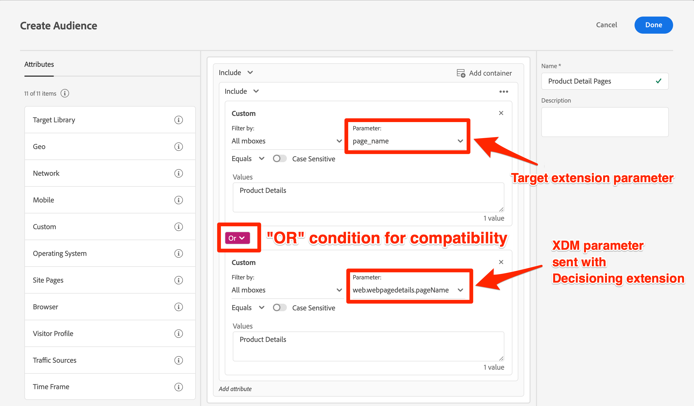

# Uppdatera målgrupper och profilskript för att bestämma kompatibiliteten för mobiltillägg


När du har slutfört de tekniska uppdateringarna för att migrera Target till beslutstillägget kan du behöva uppdatera några av dina målgrupper, profilskript och aktiviteter för att säkerställa en smidig övergång.

>[!INFO]
>
>Om du migrerar alla dina mbox-parametrar till objektet `data.__adobe.target` behöver du inte uppdatera dina målgrupper, profilskript och aktiviteter enligt nedan.


Om du migrerar mbox-parametrar till `xdm`-objektet bör du:

* Uppdatera målgrupper som använder mbox-parametrar
* Uppdatera profilskript som använder mbox-parametrar
* Uppdatera alla erbjudanden och aktiviteter med hjälp av ersättare för mbox-parametertoken (till exempel `${mbox.parameter_name}`)

## Justera målgrupper

Om du migrerar mbox-parametrar till `xdm`-objektet bör målgrupper som använder anpassade mbox-parametrar uppdateras så att de använder de nya XDM-parameternamnen. En anpassad parameter för `page_name` skulle till exempel troligen mappas till `web.webpagedetails.pageName`.

Ett sätt att säkerställa kompatibilitet med både Target-tillägget och Decisioning-tillägget är att uppdatera alla relevanta målgrupper så att `OR`-villkoren används, vilket visas nedan:

{zoomable="yes"}

## Redigera profilskript

Om du migrerar mbox-parametrar till objektet `xdm` ska profilskript uppdateras för att referera till de nya XDM-parameternamnen, ungefär som målgrupper. Förutom ändringen av mbox-parameternamn finns det ingen skillnad i hur profilskript fungerar mellan en Target- och Decisioning-implementering.

Ett sätt att säkerställa kompatibilitet är att använda `OR`-villkor i din profilskriptkod.

Exempel på profilskript:

```Javascript
if(mbox.param('pageName') == 'Product Details'){
  return true
}
```

Uppdaterat profilskript för kompatibiliteten med Platform Web SDK:

```Javascript
if((mbox.param('pageName') == 'Product Details') || (mbox.param('web.webPageDetails.pageName') =='Product Details')){
  return true
}
```

Mer information och bästa praxis finns i den dedikerade dokumentationen om [profilskript](https://experienceleague.adobe.com/en/docs/target/using/audiences/visitor-profiles/profile-parameters).

## Uppdatera parametertoken för dynamiskt innehåll

Om du migrerar mbox-parametrar till objektet `xdm`, och om du har erbjudanden, rekommendationer eller aktiviteter som använder [dynamisk innehållsersättning](https://experienceleague.adobe.com/en/docs/target/using/experiences/offers/passing-profile-attributes-to-the-html-offer), kan de behöva uppdateras för att ta hänsyn till de nya XDM-parameternamnen.

Beroende på hur du använder tokenersättning för mbox-parametrar kan du eventuellt förbättra din befintliga konfiguration så att den tar hänsyn till både gamla och nya parameternamn. I situationer där anpassad JavaScript-kod inte är möjlig, t.ex. i JSON-erbjudanden, bör du skapa kopior och göra uppdateringar när migreringen är klar och publicerad på produktionsplatsen.

Exempel på JSON-erbjudande:

```JSON
{
  "pageName" : "${mbox.page_name}",
  "layoutVariation" : "grid"
}
```

Exempel på JSON-erbjudande med XDM-objektparameternamn:

```JSON
{
  "pageName" : "${mbox.web.webPagedDetails.pageName}",
  "layoutVariation" : "grid"
}
```

Om du väljer att göra justeringar efter migreringen för att ta hänsyn till de nya parameternamnen för XDM-mbox ska du se till att pausa alla aktiviteter som påverkas under migreringshändelsen för att förhindra aktivitetsvisningsfel för besökarna.


Läs sedan om hur du [validerar målimplementeringen](validate.md).

>[!NOTE]
>
>Vi strävar efter att hjälpa dig att lyckas med din migrering av mobilmål från måltillägget till beslutstillägget. Om du stöter på problem med din migrering eller om du känner att det saknas viktig information i den här guiden kan du meddela oss genom att publicera [den här communitydiskussionen](https://experienceleaguecommunities.adobe.com/t5/adobe-experience-platform-data/tutorial-discussion-migrate-target-from-at-js-to-web-sdk/m-p/575587#M463).
