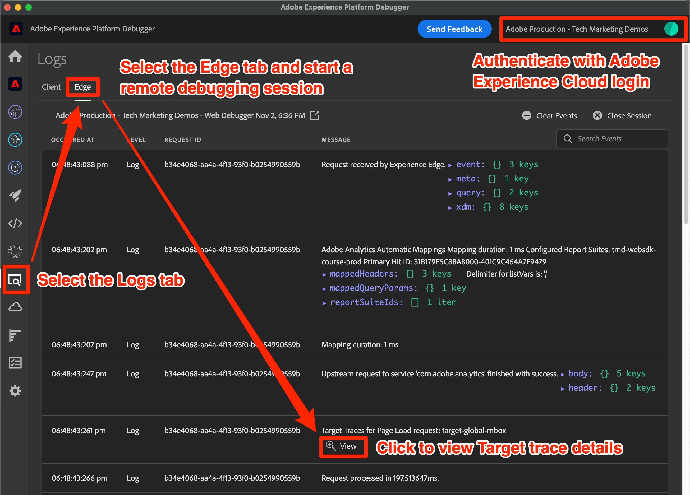
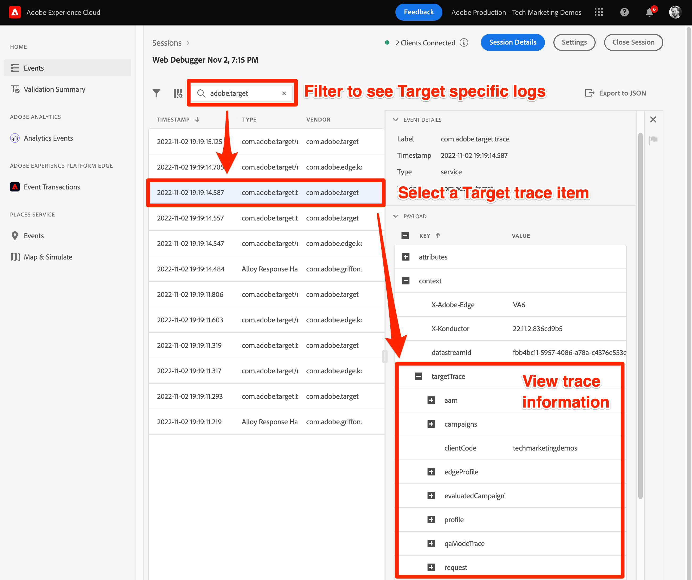
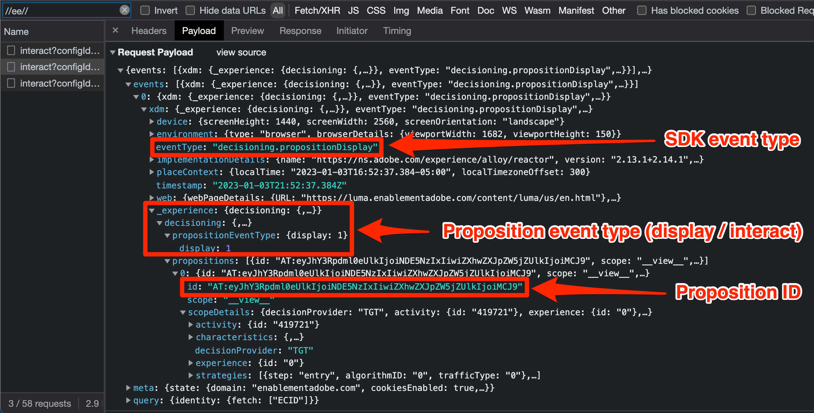

# Felsök mål med Platform Web SDK

Verifiera Target-aktiviteter och felsöka Web SDK för att felsöka problem med implementering, innehållsleverans och målgruppskvalifikation. På den här sidan i migreringsguiden förklaras skillnaderna mellan felsökning med at.js och Platform Web SDK.

Tabellen nedan sammanfattar funktioner och stöd för testning och felsökning.

| Funktion eller verktyg | support för at.js | Stöd för Platform Web SDK |
| --- | --- | --- |
| URL för aktivitets-QA | Ja | Ja |
| `mboxDisable` URL-parameter | Ja | Se informationen nedan för att [inaktivera Target-funktion](#disable-target-functionality) |
| `mboxDebug` URL-parameter | Ja | Använd `alloy_debug` parameter för liknande felsökningsinformation |
| `mboxTrace` URL-parameter | Ja | Använda webbläsartillägget Experience Platform Debugger |
| Adobe Experience Platform Debugger-tillägg | Ja | Ja |
| `alloy_debug` URL-parameter | Ej tillämpligt | Ja |
| Adobe Experience Platform Assurance | Ej tillämpligt | Ja |

## Webbläsartillägg för Adobe Experience Platform Debugger

Adobe Experience Platform Debugger-tillägget för Chrome och Firefox undersöker dina webbsidor och hjälper dig att validera dina Adobe Experience Cloud-implementeringar.

Du kan köra Platform Debugger på valfri webbsida och tillägget har tillgång till publika data. Om du vill få åtkomst till icke-offentliga data med tillägget, till exempel målspårningsinformation, måste du autentisera till Experience Cloud via **[!UICONTROL Logga in]** länk.

### Hämta och installera Adobe Experience Platform Debugger

Adobe Experience Platform Debugger kan installeras i webbläsarna Google Chrome och Mozilla Firefox. Följ lämplig länk nedan för att installera tillägget i den webbläsare du föredrar:

- [Krom](https://chrome.google.com/webstore/detail/adobe-experience-platform/bfnnokhpnncpkdmbokanobigaccjkpob)
- [Firefox](https://addons.mozilla.org/en-US/firefox/addon/adobe-experience-platform-dbg/)

När du har installerat Chrome-tillägget eller Firefox-tillägget visas en ikon () läggs till i tilläggsfältet. Med den här ikonen öppnar du tillägget.

Mer information om [Adobe Experience Platform Debugger-tillägg](https://experienceleague.adobe.com/docs/experience-platform/debugger/home.html) och felsöka alla webbprogram i Adobe.

## Förhandsgranska målaktiviteter med QA-URL:er

I både at.js och Platform Web SDK kan du förhandsgranska Target-aktiviteter med hjälp av Target QA-URL:er, och båda implementeringsmetoderna har stöd för samma QA-funktioner.

Ange QA-URL:er genom att instruera at.js eller Platform Web SDK att skriva en specifik cookie till din webbläsare med namnet `at_qa_mode`. Denna cookie används för att framtvinga kvalificering för en viss aktivitet och upplevelse.

>[!CAUTION]
>
>Funktionen för mål-QA-läge stöds av Platform Web SDK version 2.13.0 eller senare. Mål-QA-läget är aktiverat baserat på `xdm.web.webPageDetails.URL` värde som skickas i `sendEvent` ring. Om du ändrar det här värdet, till exempel tar bort alla tecken, kan det medföra att mål-QA-läget inte fungerar som det ska.

Se den dedikerade guiden för mer information om [Målaktivitet QA](https://experienceleague.adobe.com/docs/target/using/activities/activity-qa/activity-qa.html).

## Implementering av felsökningsmål

Tabellen nedan visar skillnaderna mellan felsökningsmetoderna at.js och Platform Web SDK:

| at.js, funktion | SDK-motsvarighet för plattform |
| --- | --- |
| **Inaktivera Mbox** - inaktivera Target från att hämta och återge för att kontrollera om sidan har brutits utan Target-interaktioner  Läs in sida med URL-parameter: `mboxDisable=true` | Ingen direkt motsvarighet. Du kan blockera alla Platform Web SDK-begäranden med webbläsarens utvecklarverktyg. |
| **Mbox Debug** - loggar varje at.js-åtgärd i webbläsarens konsol för att hjälpa till att felsöka återgivningsproblem  Läs in sida med URL-parameter: `mboxDebug=true` | **Tillåt felsökning** - loggar detaljerade SDK-åtgärder, inklusive men inte begränsat till Target-personaliseringsåtgärder.  Läs in sida med URL-parameter: `alloy_debug=true`    Eller kör `alloy("setDebug", { "enabled": true });` i utvecklarkonsolen |
| **Målspårning** - med en mbox trace-token som genereras i målgränssnittet, finns ett trace-objekt med information som deltar i beslutsprocessen under `window.___target_trace` -objekt.  Läs in sida med URL-parameter: `mboxTrace=window&authorization={TOKEN}` | Använd Adobe Experience Platform felsökningstillägg eller Platform Assurance. |

>[!NOTE]
>
>Alla felsökningsfunktionerna i at.js ovan är tillgängliga med de förbättrade funktionerna i Adobe Experience Platform Debugger.

### Inaktivera Target-funktioner

Platform Web SDK har för närvarande ingen funktion för att selektivt undertrycka målsvar. Det är dock möjligt att inaktivera begäran om Platform Web SDK med webbläsarens utvecklarverktyg, olika webbläsartillägg eller tredjepartsprogram. Så här blockerar du till exempel Platform Web SDK med Google Chrome:

1. Högerklicka var som helst på sidan och välj **Inspect**
1. Välj **Nätverk** tab
1. Filtrera efter sträng `//ee//` för att endast visa Platform Web SDK-anrop
1. Läs in sidan igen
1. Högerklicka på en av de filtrerade nätverksförfrågningarna och välj **Blockera begäransdomän**
1. Läs in sidan igen och observera att nätverksbegäran har blockerats
1. När du är klar med felsökningen högerklickar du på den blockerade nätverksbegäran och väljer **Ta bort blockering** eller stänga panelen Utvecklingsverktyg

### Visa felsökningsloggning

Felsökningsloggning för at.js med `mboxDebug=true` URL-parametern visar detaljerad information om varje Target-begäran, svar och försök att återge innehållet på sidan. SDK för plattformen har liknande felsökningsloggning med `alloy_debug=true` URL-parameter.

| Loggad information | at.js (`mboxDebug=true`) | Platform Web SDK (`alloy_debug=true`) |
| --- | --- | --- |
| Loggningsprefix för filtrering | `AT:` | `[alloy]` |
| Information om sidinläsningsbegäran | Ja | Ja |
| Mbox eller scope request details | Ja | Ja |
| Status för förfrågan | Ja | Ja |
| Svarsinformation | Ja | Ja |
| Återgivningsstatus | Slutförda och fel | Endast fel |
| Återgivningsinformation | Ja | Ja |

>[!NOTE]
>
>Felsökningsloggar för at.js och Platform Web SDK ger en liknande detaljnivå med det anmärkningsvärda undantaget att Web SDK bara meddelar om återgivningsfel på grund av ogiltiga väljare. Felsökningsloggningen bekräftar för närvarande inte att återgivningen lyckades.

### Visa målspår

Målspår innehåller detaljerad information om aktivitetskvalifikationer och besökarens Target-profil. Eftersom målspårningar innehåller information som inte är allmänt tillgänglig, krävs en verifieringstoken för att kunna visas, eller också måste du autentisera dem i webbläsartilläggsfönstret i Adobe Experience Platform Debugger.

| Målspårningsmetod | at.js | Platform Web SDK |
| --- | --- | --- |
| `mboxTrace` URL-parameter | Ja | Nej |
| Webbläsartillägg för Adobe Experience Platform Debugger | Ja | Ja |
| Adobe Experience Platform Assurance | Nej | Ja |

Så här visar du spårningar för Platform Web SDK Target med Adobe Experience Platform Debugger:

1. Navigera till en sida på din webbplats som har Target implementerat med Platform Web SDK
1. Öppna Adobe Experience Platform Debugger-tillägget genom att klicka på ikonen () i webbläsarens navigeringsfält
1. Välj **[!UICONTROL Logga in]** link
1. Autentisera med din Adobe Experience Cloud-inloggning
1. Välj **[!UICONTROL Loggar]** till vänster
1. Välj **[!UICONTROL Edge]** överst
1. Du kan även ge felsökningssessionen ett namn och klicka på **[!UICONTROL Anslut]** knapp
1. Läs in sidan igen så fylls loggen i med detaljerad information om gränsnätverkets interaktioner
1. Fokusera på loggposterna som börjar med &quot;Målspår&quot; i beskrivningen och välj **[!UICONTROL Visa]** för att se information om målspårning

Efter markering **[!UICONTROL Visa]** visas en övertäckning som gör att du kan se följande information om begäran:

- Matchade aktiviteter
- Oöverträffade aktiviteter
- Information om förfrågan
- Ögonblicksbild av profil

Se den dedikerade guiden om [felsöka leverans av målinnehåll](https://experienceleague.adobe.com/docs/target/using/activities/troubleshoot-activities/content-trouble.html) för mer information om målspår.

### Felsök med Assurance

Målspårningsinformationen kan visas både i webbläsartillägget Adobe Experience Platform Debugger och i Assurance-programmet (tidigare kallat Project Griffon). Så här visar du målspår i Assurance:

1. Öppna webbläsartillägget Adobe Experience Platform Debugger och anslut en fjärrfelsökningssession enligt ovan
1. Markera länken med ditt sessionsnamn ovanför felsökningsloggen
1. Platform Assurance läser in och visar detaljerad loggning för alla Adobe-program som konfigurerats i dataströmmen för din implementering
1. Filtrera loggen efter `adobe.target`
1. Välj en loggpost med typen `com.adobe.target.trace`
1. Expandera informationen om nyttolasten och visa informationen under `context > targetTrace`

## Undersök nätverksbegäran och svar

Nyttolasten och svaret på begäran för Platform Web SDK `sendEvent` Anrop skiljer sig från at.js. Med hjälp av konturen nedan kan du förstå hur begäran och svaret är upplagda samtidigt som du undersöker nätverksanropen med webbläsarens utvecklingsverktyg.

### Nyttolast för innehållsbegäran

- Profil, entitet och andra icke-mbox-parametrar skickas i händelsearrayen under `data.__adobe.target`
- Beslutsomfattningarna finns i händelsearrayen under `query.personalization.decisionScopes`
- XDM-data som mappas till mbox-parametrar längre ned finns i händelsearrayen under `xdm`

### Innehållssvarets brödtext

- Platform Web SDK returnerar åtgärder för alla Adobe-program under `handle` object
- The `personalization:decisions` åtgärd innebär ett svar från mål eller offer decisioning
- Målförslag presenteras som en array, där vart och ett har ett unikt förslags-ID som prefix med `AT:`
- Beslutsomfattandet och aktivitetsinformationen finns i förslagsarrayen
- Erbjudandeinformationen finns i `items` array under `data`
- Svarstoken finns i `items` array under `meta`

### Sprid händelsens nyttolast

- Målspecifika SDK-händelser är antingen `decisioning.propositionDisplay` för ett intryck eller `decisioning.propositionInteract` för en interaktion, till exempel ett klick
- Information om händelsen proposition finns i arrayen events under `xdm._experience.decisioning`
- Förslags-ID för visnings- eller interaktionshändelsen ska matcha förslags-ID för innehållet som returneras från Target

Grattis, du har kommit till slutet av självstudiekursen! Lycka till med att migrera din Adobe Target-implementering till Web SDK!

>[!NOTE]
>
>Vi vill hjälpa dig att lyckas med målmigreringen från at.js till Web SDK. Om du stöter på problem med din migrering eller känner att det saknas viktig information i den här guiden ber vi dig att meddela oss genom att publicera i [den här communitydiskussionen](https://experienceleaguecommunities.adobe.com/t5/adobe-experience-platform-launch/tutorial-discussion-implement-adobe-experience-cloud-with-web/td-p/444996).
