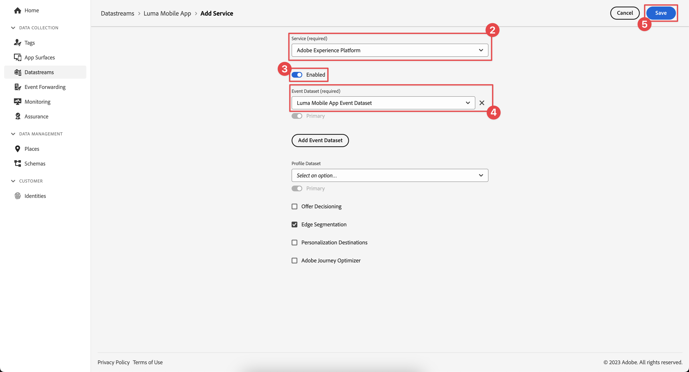

# Skapa ett datastream

Lär dig hur du skapar ett datastream i Experience Platform.

En datastream är en konfiguration på serversidan på Platform Edge Network. Datastream säkerställer att inkommande data till Platform Edge Network dirigeras till Adobe Experience Cloud-program och -tjänster på rätt sätt. Mer information finns i [dokumentation](https://experienceleague.adobe.com/docs/experience-platform/edge/fundamentals/datastreams.html) eller [video](https://experienceleague.adobe.com/docs/platform-learn/data-collection/edge-network/configure-datastreams.html).

## Förutsättningar

Om du vill skapa en datastream måste din organisation ha etablerats för den här funktionen i gränssnittet för datainsamling (tidigare [!UICONTROL Starta]) och du måste ha användarbehörighet för att hantera och visa datastölar.

## Utbildningsmål

I den här lektionen kommer du att:

* Ta reda på när en datastream ska användas.
* Skapa en datastream.
* Konfigurera en datastream.

## Skapa ett datastream

Datastreams kan skapas i [!UICONTROL Datainsamling] -gränssnittet med [!UICONTROL Datastream] konfigurationsverktyg. Så här skapar du ett datastream:

1. Se till att du är i rätt Experience Platform-sandlåda, eftersom datastreams definieras på en sandlådenivå.
1. Välj **[!UICONTROL Datastreams]** till vänster.
1. Välj **[!UICONTROL Ny datastream]**.

   

1. Ange en **[!UICONTROL Namn]**, till exempel `Luma Mobile App` och **[!UICONTROL Beskrivning]**, till exempel `Datastream for Luma Mobile App`.

   >[!NOTE]
   >
   >Sista påminnelsen: Om du går igenom den här självstudiekursen med flera personer i en och samma sandlåda eller använder ett delat konto bör du överväga att lägga till eller föregå en identifiering som en del av namngivningskonventionerna. Använd till exempel `Luma Mobile App Event Dataset - Joe Smith` istället för `Luma Mobile App Event Dataset`. Se även anteckningen i [Ökning](overview.md).

1. Välj schemat som du skapade i föregående lektion från **Händelseschema** lista.
1. Välj **[!UICONTROL Spara]**.

   

## Lägg till tjänster

När du går igenom (valfritt) [Analyser](analytics.md) och [Experience Platform](platform.md) lektioner i den här självstudiekursen lägger du till tjänster i din datastam för att säkerställa att datastream vidarebefordras till de konfigurerade tjänsterna när Platform Mobile SDK skickar data till Edge Network.

### Adobe Analytics

1. Välj **[!UICONTROL Lägg till tjänst]**.

1. Lägg till **[!UICONTROL Adobe Analytics]** från [!UICONTROL Tjänst] lista,

1. Ange namnet på den rapportwebbplats som du vill använda i **[!UICONTROL Report Suite-ID]**.

1. Aktivera tjänsten genom att växla **[!UICONTROL Aktiverad]** på.

1. Välj **[!UICONTROL Spara]**.

   

### Adobe Experience Platform

Du kanske också vill aktivera tjänsten Adobe Experience Platform.

>[!IMPORTANT]
>
>Du kan bara aktivera Adobe Experience Platform-tjänsten när du har skapat en händelsedatamängd. Om du inte redan har en händelsedatamängd skapad följer du instruktionerna [här](platform.md).

1. Klicka  **[!UICONTROL Lägg till tjänst]** för att lägga till en annan tjänst.

1. Välj **[!UICONTROL Adobe Experience Platform]** från [!UICONTROL Tjänst] lista.

1. Aktivera tjänsten genom att växla **[!UICONTROL Aktiverad]** på.

1. Välj **[!UICONTROL Händelsedatauppsättning]** som du skapade som en del av [Skapa en datauppsättning](platform.md#create-a-dataset) instruktioner, till exempel **Luma Mobile App Event-datauppsättning**

1. Välj **[!UICONTROL Spara]**.

   
1. Den slutliga konfigurationen bör se ut ungefär så här.

   

>[!NOTE]
>
>Genom att aktivera varje tjänst som din organisation använder ser du till att data som samlas in i mobilappen kan användas överallt. Mer information om datastream-inställningar finns i dokumentationen [här](https://experienceleague.adobe.com/docs/experience-platform/edge/fundamentals/datastreams.html#adobe-experience-platform-settings).

När du implementerar Platform Mobile SDK i din egen app bör du skapa tre datastreams som kan kopplas till dina tre taggmiljöer (utveckling, scen och produktion). Om du använder Platform Mobile SDK med plattformsbaserade program som Adobe Real-time Customer Data Platform eller Adobe Journey Optimizer måste du se till att skapa dessa datastölar i rätt sandlåda.

>[!SUCCESS]
>
>Du har nu ett datastream att använda för resten av självstudiekursen. Tack för att du lade ned din tid på att lära dig om Adobe Experience Platform Mobile SDK. Om du har frågor, vill dela allmän feedback eller har förslag på framtida innehåll kan du dela dem om detta [Experience League diskussionsinlägg](https://experienceleaguecommunities.adobe.com/t5/adobe-experience-platform-launch/tutorial-discussion-implement-adobe-experience-cloud-in-mobile/td-p/443796)

Nästa: **[Konfigurera en taggegenskap](configure-tags.md)**
