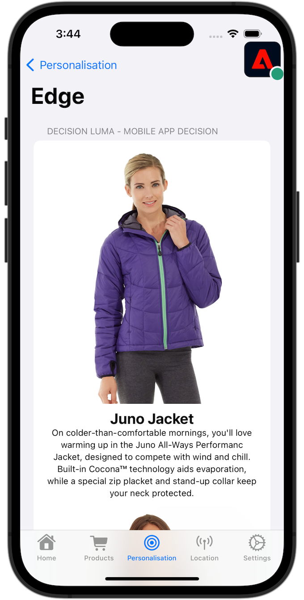

# Journey Optimizer erbjuder

Lär dig hur du visar erbjudanden från Journey Optimizer Decision Management i dina mobilappar med Experience Platform Mobile SDK.

Med Journey Optimizer Decision Management kan ni leverera det bästa erbjudandet och upplevelsen till era kunder via alla kontaktytor vid rätt tidpunkt. När ni väl utformat er målgrupp kan ni inrikta er på personaliserade erbjudanden.

Beslutshantering förenklar personaliseringen med ett centralt bibliotek med marknadsföringserbjudanden och en beslutsmotor som tillämpar regler och begränsningar på komplexa realtidsprofiler som skapats av Adobe Experience Platform. Resultatet blir att ni kan skicka rätt erbjudande till kunderna vid rätt tidpunkt. Se [Om beslutshantering](https://experienceleague.adobe.com/docs/journey-optimizer/using/offer-decisioning/get-started-decision/starting-offer-decisioning.html?lang=en) för mer information.


>[!NOTE]
>
>Den här lektionen är valfri och gäller endast för Journey Optimizer-användare som vill använda beslutsstyrningsfunktionen för att visa erbjudanden i en mobilapp.


## Förutsättningar

* App med SDK:er har installerats och konfigurerats.
* Tillgång till Journey Optimizer - Beslutshantering med rätt behörighet att hantera erbjudanden och beslut enligt beskrivningen [här](https://experienceleague.adobe.com/docs/journey-optimizer/using/access-control/privacy/high-low-permissions.html?lang=en#decisions-permissions).


## Utbildningsmål

I den här lektionen ska du

* Uppdatera Edge-konfigurationen för beslutshantering.
* Uppdatera taggegenskapen med tillägget Journey Optimizer - Decisioning.
* Uppdatera ditt schema för att hämta offerthändelser.
* Validera inställningar i Assurance.
* Skapa ett offertbeslut baserat på erbjudanden från Journey Optimizer - Beslutshantering.
* Uppdatera appen så att den innehåller tillägget Optimizer.
* Implementera erbjudanden från Beslutshantering i appen.


## Inställningar

>[!TIP]
>
>Om du har konfigurerat miljön redan som en del av [Konfigurera A/B-tester med Target](target.md) självstudiekurs, du kan hoppa över [Installera Adobe Journey Optimizer - Decisioning-taggtillägg](#install-adobe-journey-optimizer---decisioning-tags-extension) och [Uppdatera ditt schema](#update-your-schema).

### Uppdatera Edge-konfiguration

För att säkerställa att data som skickas från din mobilapp till Edge Network vidarebefordras till Journey Optimizer - Beslutshantering måste du uppdatera Experience Edge-konfigurationen.

1. I gränssnittet för datainsamling väljer du **[!UICONTROL Datastreams]** och välj till exempel din datastream **[!UICONTROL Mobilappen Luma]**.
1. Välj  for **[!UICONTROL Experience Platform]** och markera  **[!UICONTROL Redigera]** på snabbmenyn.
1. I **[!UICONTROL Datastreams]** >  >  **[!UICONTROL Adobe Experience Platform]** skärm, se **[!UICONTROL Offer decisioning]**, **[!UICONTROL Kantsegmentering]**, **[!UICONTROL Destinationer för anpassning]** och **[!UICONTROL Adobe Journey Optimizer]** är markerade. Se [Adobe Experience Platform-inställningar](https://experienceleague.adobe.com/docs/experience-platform/datastreams/configure.html?lang=en#aep) för mer information.
1. Om du vill spara din datastream-konfiguration väljer du **[!UICONTROL Spara]** .

   


### Installera Journey Optimizer - Decisioning-taggtillägg

1. Navigera till **[!UICONTROL Taggar]** och hitta din mobila taggegenskap och öppna egenskapen.
1. Välj **[!UICONTROL Tillägg]**.
1. Välj **[!UICONTROL Katalog]**.
1. Sök efter **[!UICONTROL Adobe Journey Optimizer - beslut]** tillägg.
1. Installera tillägget. Tillägget kräver ingen ytterligare konfiguration.

   


### Uppdatera ditt schema

1. Navigera till användargränssnittet för datainsamling och välj **[!UICONTROL Scheman]** från den vänstra listen.
1. Välj **[!UICONTROL Bläddra]** i det övre fältet.
1. Välj ditt schema för att öppna det.
1. Välj  **[!UICONTROL Lägg till]** bredvid Fältgrupper.
1. I **[!UICONTROL Lägg till fältgrupper]** dialog,  sök efter `proposition`, markera **[!UICONTROL Experience Event - Proposition Interactions]** och markera **[!UICONTROL Lägg till fältgrupper]**.
   
1. Välj **[!UICONTROL Spara]** för att spara ändringarna i ditt schema.


## Validera inställningar i Assurance

Så här validerar du inställningarna i Assurance:

1. Gå till försäkringsgränssnittet.
1. Välj **[!UICONTROL Konfigurera]** i vänster rand och välj  nästa **[!UICONTROL Validera inställningar]** under **[!UICONTROL ADOBE JOURNEY OPTIMIZER AVGÖRANDE]**.
1. Välj **[!UICONTROL Spara]**.
1. Välj **[!UICONTROL Validera inställningar]** till vänster. Både datastream-konfigurationen och SDK-konfigurationen i ditt program valideras.
   


## Skapa erbjudanden

1. I användargränssnittet för Journey Optimizer väljer du   **[!UICONTROL Erbjudanden]** från **[!UICONTROL BESLUTSHANTERING]** till vänster.
1. I **[!UICONTROL Erbjudanden]** skärm, välja **[!UICONTROL Bläddra]** för att se en lista över erbjudanden.
1. Välj **[!UICONTROL Skapa erbjudande]**.
1. I **[!UICONTROL Nytt erbjudande]** dialogruta, välja **[!UICONTROL Personligt erbjudande]** och klicka **[!UICONTROL Nästa]**.
1. I **[!UICONTROL Information]** steg för **[!UICONTROL Skapa nytt personaliserat erbjudande]**:
   1. Ange en **[!UICONTROL Namn]** för erbjudandet, till exempel `Luma - Juno Jacket`och ange **[!UICONTROL Startdatum och -tid]** och **[!UICONTROL Slutdatum och sluttid]**. Utanför dessa datum väljs inte erbjudandet av beslutsmotorn.
   1. Välj **[!UICONTROL Nästa]**.
      

1. I **[!UICONTROL Lägg till representationer]** steg för **[!UICONTROL Skapa nytt personaliserat erbjudande]**:
   1. Välj  **[!UICONTROL Mobil]** från **[!UICONTROL Kanal]** lista och markera **[!UICONTROL Mobile JSON]** från **[!UICONTROL Placement]** lista.
   1. Välj **[!UICONTROL Egen]** for **[!UICONTROL Innehåll]**.
   1. Välj **[!UICONTROL Lägg till innehåll]**. I **[!UICONTROL Lägg till personalisering]** dialog:
      1. Ange följande JSON:

         ```json
         { 
             "title": "Juno Jacket",
             "text": "On colder-than-comfortable mornings, you'll love warming up in the Juno All-Ways Performanc Jacket, designed to compete with wind and chill. Built-in Cocona&trade; technology aids evaporation, while a special zip placket and stand-up collar keep your neck protected.", 
             "image": "https://luma.enablementadobe.com/content/dam/luma/en/products/women/tops/jackets/wj06-purple_main.jpg" 
         }  
         ```

      1. Välj **[!UICONTROL Spara]**.
         
   1. Välj **[!UICONTROL Nästa]**.
      

1. I **[!UICONTROL Lägg till begränsningar]** steg i **[!UICONTROL Skapa nytt personaliserat erbjudande]**:
   1. Ange **[!UICONTROL Prioritet]** till `10`.
   1. Växla **[!UICONTROL Inkludera fäste]** av.
   1. Välj **[!UICONTROL Nästa]**.
      

1. I **[!UICONTROL Granska]** steg för **[!UICONTROL Skapa nya personaliserade]** erbjudande:
   1. Granska erbjudandet och välj **[!UICONTROL Slutför]**.
   1. I **[!UICONTROL Spara erbjudande]** dialogruta, välja **[!UICONTROL Spara och godkänn]**.

1. Upprepa steg 3-8 för att skapa ytterligare fyra erbjudanden med olika namn och innehåll. Alla andra konfigurationsvärden, till exempel Startdatum och -tid eller Prioritet, liknar det första erbjudandet du skapade. Du kan snabbt skapa dubbletter och redigera erbjudanden.

   1. I Journey Optimizer UI väljer du  **[!UICONTROL Erbjudanden]** Välj Erbjudanden i det övre fältet i den vänstra listen.
   1. Markera raden i erbjudandet som du skapade.
   1. I den högra rutan väljer du  **[!UICONTROL Fler åtgärder]** och på snabbmenyn väljer  **[!UICONTROL Duplicera]**.

      Använd tabellen nedan för att definiera de fyra andra erbjudandena.

      | Namn på erbjudande | Erbjud innehåll i JSON |
      |---|---|
      | Luma - vattenflaskan har fastnat | `{ "title": "Affirm Water Bottle", "text": "You'll stay hydrated with ease with the Affirm Water Bottle by your side or in hand. Measurements on the outside help you keep track of how much you're drinking, while the screw-top lid prevents spills. A metal carabiner clip allows you to attach it to the outside of a backpack or bag for easy access.", "image": "https://luma.enablementadobe.com/content/dam/luma/en/products/gear/fitness-equipment/ug06-lb-0.jpg" }` |
      | Luma - Önskat träningsträd | `{ "title": "Desiree Fitness Tee", "text": "When you're too far to turn back, thank yourself for choosing the Desiree Fitness Tee. Its ultra-lightweight, ultra-breathable fabric wicks sweat away from your body and helps keeps you cool for the distance.", "image": "https://luma.enablementadobe.com/content/dam/luma/en/products/women/tops/tees/ws05-yellow_main.jpg" }` |
      | Luma - Adrienne Trek Jacket | `{ "title": "Adrienne Trek Jacket", "text": "You're ready for a cross-country jog or a coffee on the patio in the Adrienne Trek Jacket. Its style is unique with stand collar and drawstrings, and it fits like a jacket should.", "image": "https://luma.enablementadobe.com/content/dam/luma/en/products/women/tops/jackets/wj08-gray_main.jpg" }` |
      | Luma - Aero Daily Fitness Tee | `{ "title": "Adrienne Trek Jacket", "text": "You're ready for a cross-country jog or a coffee on the patio in the Adrienne Trek Jacket. Its style is unique with stand collar and drawstrings, and it fits like a jacket should.", "image": "https://luma.enablementadobe.com/content/dam/luma/en/products/women/tops/jackets/wj08-gray_main.jpg" }` |

      {style="table-layout:fixed"}

1. Som sista steg måste ni skapa ett reserverbjudande, som är ett erbjudande som skickas till kunderna om de inte är berättigade till andra erbjudanden.
   1. Välj **[!UICONTROL Skapa erbjudande]**.
   1. I **[!UICONTROL Information]** steg för **[!UICONTROL Skapa nytt personaliserat erbjudande]**:
   1. Ange en **[!UICONTROL Namn]** för erbjudandet, till exempel `Luma - Fallback Offer`och ange **[!UICONTROL Startdatum och -tid]** och **[!UICONTROL Slutdatum och sluttid]**.
   1. Välj **[!UICONTROL Nästa]**.

1. I **[!UICONTROL Lägg till representationer]** steg i **[!UICONTROL Skapa nytt personaliserat erbjudande]** skärm:
   1. Välj  **[!UICONTROL Mobil]** från **[!UICONTROL Kanal]** lista och markera **[!UICONTROL Mobile JSON]** från **[!UICONTROL Placement]** lista.
   1. Välj **[!UICONTROL Egen]** for **[!UICONTROL Innehåll]**.
   1. Välj **[!UICONTROL Lägg till innehåll]**. I **[!UICONTROL Lägg till personalisering]** dialog:
      1. Ange följande JSON:

         ```json
         {  
             "title": "Luma",
             "text": "Your store for sports wear and equipment.", 
             "image": "https://luma.enablementadobe.com/content/dam/luma/en/logos/Luma_Logo.png" 
         }  
         ```

      1. Välj **[!UICONTROL Spara]**.
   1. Välj **[!UICONTROL Nästa]**.


1. I **[!UICONTROL Granska]** steg för **[!UICONTROL Skapa nya personaliserade]** erbjudande:
   1. Granska erbjudandet och välj **[!UICONTROL Slutför]**.
   1. I **[!UICONTROL Spara erbjudande]** dialogruta, välja **[!UICONTROL Spara och godkänn]**.

Du bör nu ha följande lista över erbjudanden.


## Skapa en samling

För att kunna presentera ett erbjudande för din mobilappsanvändare måste du definiera en erbjudandesamling som består av ett eller flera av de erbjudanden du har skapat.

1. I användargränssnittet för Journey Optimizer väljer du **[!UICONTROL Erbjudanden]** från den vänstra listen.
1. Välj **[!UICONTROL Samlingar]** i det övre fältet.
1. Välj  **[!UICONTROL Skapa samling]**.
1. I **[!UICONTROL Ny samling]** dialogruta, ange **[!UICONTROL Namn]** för din samling, till exempel `Luma - Mobile App Collection`, markera **[!UICONTROL Skapa statisk samling]** och klicka **[!UICONTROL Nästa]**.
1. I **[!UICONTROL Luma - Mobile App Collection]** markerar du de erbjudanden du vill inkludera i samlingen. I den här självstudiekursen väljer du fem erbjudanden du skapat. Du kan enkelt filtrera listan med hjälp av sökfältet, till exempel genom att skriva **[!UICONTROL Luma]**.
1. Välj **[!UICONTROL Spara]**.

   


## Skapa ett beslut

Det sista steget är att definiera ett beslut, vilket är kombinationen av ett eller flera beslutsomfattningar och ditt reserverbjudande.

Ett beslutsomfång är en kombination av en specifik placering (till exempel HTML i ett e-postmeddelande eller JSON i en mobilapp) och ett eller flera utvärderingskriterier.

Ett utvärderingskriterium är en kombination av

* en erbjudandesamling,
* regler för behörighet: Erbjudandet gäller t.ex. endast en viss målgrupp.
* en rangordningsmetod: när det finns flera erbjudanden att välja mellan, vilken metod använder du för att rangordna dem (t.ex. efter erbjudandeprioritet, med en formel eller en AI-modell).

Se [Viktiga steg för att skapa och hantera erbjudanden](https://experienceleague.adobe.com/docs/journey-optimizer/using/offer-decisioning/get-started-decision/key-steps.html?lang=en) om du bättre vill förstå hur placeringar, regler, rankningar, erbjudanden, representationer, samlingar, beslut och så vidare, interagerar och relaterar till varandra. Den här självstudiekursen är endast inriktad på att använda resultatet av ett beslut snarare än på flexibiliteten i att definiera beslut inom Journey Optimizer - Beslutshantering.

1. I användargränssnittet för Journey Optimizer väljer du **[!UICONTROL Erbjudanden]** från den vänstra listen.
1. Välj **[!UICONTROL Beslut]** i det övre fältet.
1. Välj  **[!UICONTROL Skapa beslut]**.
1. I **[!UICONTROL Information]** steg för **[!UICONTROL Skapa ett nytt offertbeslut]**:
   1. Ange en **[!UICONTROL Namn]** för beslutet, till exempel `Luma - Mobile App Decision`, ange **[!UICONTROL Startdatum och -tid]** och **[!UICONTROL Slutdatum och sluttid]**.
   1. Välj **[!UICONTROL Nästa]**.

1. I **[!UICONTROL Lägg till beslutsomfattningar]** steg för **[!UICONTROL Skapa ett nytt offertbeslut]**:
   1. Välj **[!UICONTROL Mobile JSON]** från **[!UICONTROL Placement]** lista.
   1. I **[!UICONTROL Utvärderingskriterier]** platta, markera  **[!UICONTROL Lägg till]**.
      1. I **[!UICONTROL Lägg till erbjudandesamling]** väljer du din erbjudandesamling. Till exempel: **[!UICONTROL Luma - Mobile App Collection]**.
      1. Välj **[!UICONTROL Lägg till]**.
         
   1. Se till att **[!UICONTROL Ingen]** är markerat för **[!UICONTROL Kvalificering]** och **[!UICONTROL Prioritet]** är markerat som **[!UICONTROL Rankningsmetod]**.
   1. Välj **[!UICONTROL Nästa]**.
      .
1. I **[!UICONTROL Lägg till reserverbjudande]** steg för **[!UICONTROL Skapa ett nytt offertbeslut]**:
   1. Välj ditt reserverbjudande, till exempel **[!UICONTROL Luma - Reserverbjudande]**.
   1. Välj **[!UICONTROL Nästa]**.
1. I **[!UICONTROL Sammanfattning]** steg för **[!UICONTROL Skapa ett nytt offertbeslut]**:
   1. Välj **[!UICONTROL Slutför]**.
   1. I **[!UICONTROL Spara offertbeslut]** dialogruta, välja **[!UICONTROL Spara och aktivera]**.
   1. I **[!UICONTROL Beslut]** kan du se ditt beslut med status **[!UICONTROL Live]**.

Ditt beslut om erbjudandet, som består av en uppsättning erbjudanden, är nu klart att användas. Om du vill använda beslutet i din app måste du i koden hänvisa till beslutsomfånget.

1. I användargränssnittet för Journey Optimizer väljer du **[!UICONTROL Erbjudanden]**.
1. Välj **[!UICONTROL Beslut]** i det övre fältet.
1. Välj t.ex. ditt beslut **[!UICONTROL Luma - beslut om mobilappar]**.
1. I **[!UICONTROL Beslutsomfattningar]** platta, markera  **[!UICONTROL Kopiera]**.
1. Välj **[!UICONTROL Beslutets omfattning]**.
   
1. Använd en textredigerare för att klistra in beslutsomfånget för senare bruk. Beslutsomfånget har följande JSON-format.

   ```json
   {
       "xdm:activityId":"xcore:offer-activity:xxxxxxxxxxxxxxx",
       "xdm:placementId":"xcore:offer-placement:xxxxxxxxxxxxxxx"
   }
   ```

## Implementera erbjudanden i din app

Som tidigare nämnts tillhandahåller installation av ett mobiltaggtillägg bara konfigurationen. Därefter måste du installera och registrera Optimera SDK. Om de här stegen inte är tydliga går du igenom [Installera SDK:er](install-sdks.md) -avsnitt.

>[!NOTE]
>
>Om du har slutfört [Installera SDK:er](install-sdks.md) är SDK redan installerat och du kan hoppa över det här steget.
>

1. I Xcode kontrollerar du att [AEP-optimering](https://github.com/adobe/aepsdk-messaging-ios.git) läggs till i listan över paket i paketberoenden. Se [Swift Package Manager](install-sdks.md#swift-package-manager).
1. Navigera till **[!UICONTROL Luma]** > **[!UICONTROL Luma]** > **[!UICONTROL AppDelegate]** i Xcode Project-navigatorn.
1. Säkerställ `AEPOptimize` är en del av din lista över importer.

   `import AEPOptimize`

1. Säkerställ `Optimize.self` är en del av den array med tillägg som du registrerar.

   ```swift
   let extensions = [
       AEPIdentity.Identity.self,
       Lifecycle.self,
       Signal.self,
       Edge.self,
       AEPEdgeIdentity.Identity.self,
       Consent.self,
       UserProfile.self,
       Places.self,
       Messaging.self,
       Optimize.self,
       Assurance.self
   ]
   ```

1. Navigera till **[!UICONTROL Luma]** > **[!UICONTROL Luma]** > **[!UICONTROL Utils]** > **[!UICONTROL MobileSDK]** i Xcode Project-navigatorn. Hitta `func updatePropositionOD(ecid: String, activityId: String, placementId: String, itemCount: Int) async` funktion. Lägg till följande kod:

   ```swift
   // set up the XDM dictionary, define decision scope and call update proposition API
   Task {  
      let ecid = ["ECID" : ["id" : ecid, "primary" : true] as [String : Any]]
      let identityMap = ["identityMap" : ecid]
      let xdmData = ["xdm" : identityMap]
      let decisionScope = DecisionScope(activityId: activityId, placementId: placementId, itemCount: UInt(itemCount))
      Optimize.clearCachedPropositions()
      Optimize.updatePropositions(for: [decisionScope], withXdm: xdmData)
   }
   ```

   Den här funktionen:

   * ställer in en XDM-ordlista `xdmData`, som innehåller ECID för att identifiera den profil som du måste presentera erbjudandena för.
   * definierar `decisionScope`, ett objekt som baseras på det beslut du har definierat i användargränssnittet för beslutshantering i Journey Optimizer och definieras med hjälp av det kopierade beslutsomfånget från [Skapa ett beslut](#create-a-decision).  Luma-appen använder en konfigurationsfil (`decisions.json`) som hämtar scopeparametrarna, baserat på följande JSON-format:

     ```swift
     "scopes": [
         {
             "name": "name of the scope",
             "activityId": "xcore:offer-activity:xxxxxxxxxxxxxxx",
             "placementId": "xcore:offer-placement:xxxxxxxxxxxxxxx",
             "itemCount": 2
         }
     ]
     ```

     Du kan dock använda vilken implementeringsmetod som helst för att se till att Optimera-API:erna får rätt parametrar (`activityId`, `placementId` och `itemCount`), för att skapa en giltig [`DecisionScope`](https://developer.adobe.com/client-sdks/documentation/adobe-journey-optimizer-decisioning/api-reference/#decisionscope) -objekt för implementeringen.
   * anropar två API:er: [`Optimize.clearCachePropositions`](https://support.apple.com/en-ie/guide/mac-help/mchlp1015/mac)  och [`Optimize.updatePropositions`](https://developer.adobe.com/client-sdks/documentation/adobe-journey-optimizer-decisioning/api-reference/#updatepropositions).  Dessa funktioner rensar alla cachelagrade offerter och uppdaterar propositionerna för den här profilen.

1. Navigera till **[!UICONTROL Luma]** > **[!UICONTROL Luma]** > **[!UICONTROL Vyer]** > **[!UICONTROL Personalisering]** > **[!UICONTROL EdgeOffersView]** i Xcode Project-navigatorn. Hitta `func onPropositionsUpdateOD(activityId: String, placementId: String, itemCount: Int) async` och inspektera koden för den här funktionen. Den viktigaste delen av funktionen är [`Optimize.onPropositionsUpdate`](https://developer.adobe.com/client-sdks/documentation/adobe-journey-optimizer-decisioning/api-reference/#onpropositionsupdate) API-anrop, som

   * hämtar förslagen för den aktuella profilen baserat på beslutsomfånget (som du har definierat i Journey Optimizer - Beslutshantering),
   * hämtar erbjudandet från erbjudandet,
   * frigör innehållet i erbjudandet så att det kan visas korrekt i appen, och
   * utlöser `displayed()` åtgärd för erbjudandet som skickar tillbaka en händelse till Edge Network som talar om att erbjudandet visas.


## Validera med appen

1. Öppna appen på en enhet eller i simulatorn.

1. Gå till **[!UICONTROL Personalisering]** -fliken.

1. Välj **[!UICONTROL Edge Personalization]**.

1. Bläddra högst upp så visas två slumpmässiga erbjudanden från samlingen som du har definierat i **[!UICONTROL BESLUT LUMA - BESLUT OM MOBILAPP]** platta.

   

   Anbuden är slumpmässiga eftersom ni har gett alla erbjudanden samma prioritet och rangordningen för beslutet baseras på prioritet.


## Validera implementering i Assurance

Så här validerar du erbjudandeimplementeringen i Assurance:

1. Gå till försäkringsgränssnittet.
1. Välj **[!UICONTROL Konfigurera]** i vänster rand och välj  nästa **[!UICONTROL Granska och simulera]** under **[!UICONTROL ADOBE JOURNEY OPTIMIZER AVGÖRANDE]**.
1. Välj **[!UICONTROL Spara]**.
1. Välj **[!UICONTROL Granska och simulera]** till vänster. Både datastream-konfigurationen valideras och SDK-inställningen i ditt program.
1. Välj **[!UICONTROL Begäranden]** i det övre fältet. Du ser **[!UICONTROL Erbjudanden]** förfrågningar.
   

1. Du kan utforska **[!UICONTROL Simulera]** och **[!UICONTROL Händelselista]** om du vill ha mer funktionalitet kan du kontrollera hur du har konfigurerat Journey Optimizer Decision Management.

## Nästa steg

Nu bör du ha alla verktyg du behöver för att börja lägga till fler funktioner i implementeringen av Journey Optimizer - Beslutshantering. Exempel:

* tillämpa olika parametrar för erbjudandena (till exempel prioritet, capping)
* samla profilattribut i appen (se [Profil](profile.md)) och använd dessa profilattribut för att bygga målgrupper. Använd sedan dessa målgrupper som en del av reglerna för behörighet i ditt beslut.
* kombinera mer än ett beslutsomfång.

>[!SUCCESS]
>
>Du har aktiverat appen för att visa erbjudanden med tillägget Journey Optimizer - Decisioning för Experience Platform Mobile SDK.<br/>Tack för att du lade ned din tid på att lära dig om Adobe Experience Platform Mobile SDK. Om du har frågor, vill dela allmän feedback eller har förslag på framtida innehåll kan du dela dem om detta [Experience League diskussionsinlägg](https://experienceleaguecommunities.adobe.com/t5/adobe-experience-platform-launch/tutorial-discussion-implement-adobe-experience-cloud-in-mobile/td-p/443796).

Nästa: **[Utför A/B-tester med mål](target.md)**
