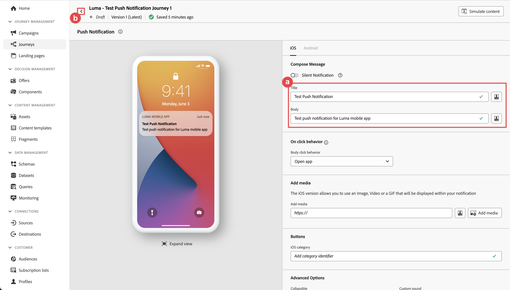

# Adobe Journey Optimizer push-meddelanden

Lär dig skapa push-meddelanden för mobilappar med Platform Mobile SDK och Adobe Journey Optimizer.

Med Journey Optimizer kan ni skapa resor och skicka meddelanden till riktade målgrupper. Innan du skickar push-meddelanden med Journey Optimizer måste du se till att rätt konfigurationer och integreringar finns på plats. Om du vill veta mer om dataflödet för push-meddelanden i Adobe Journey Optimizer går du till [dokumentationen](https://experienceleague.adobe.com/docs/journey-optimizer/using/configuration/configuration-message/push-config/push-gs.html).

>[!NOTE]
>
>Den här lektionen är valfri och gäller endast för Adobe Journey Optimizer-användare som vill skicka push-meddelanden.


## Förutsättningar

* App med SDK:er har installerats och konfigurerats.
* Åtkomst till Adobe Journey Optimizer och tillräcklig behörighet enligt beskrivningen [här](https://experienceleague.adobe.com/docs/journey-optimizer/using/configuration/configuration-message/push-config/push-configuration.html?lang=en). Du behöver även tillräcklig behörighet för följande Adobe Journey Optimizer-funktioner.
   * Skapa en appyta.
   * Skapa en resa
   * Skapa ett meddelande.
   * Skapa meddelandeförinställningar.
* Betalat Apple-utvecklarkonto med tillräcklig behörighet för att skapa certifikat, identifierare och nycklar.
* Fysisk iOS-enhet eller simulator för testning.

## Utbildningsmål

I den här lektionen kommer du att:

* Registrera program-ID med Apple Push Notification service (APN).
* Skapa en **[!UICONTROL Appyta]** i AJO.
* Uppdatera dina **[!UICONTROL schema]** för att inkludera push-meddelandefält.
* Installera och konfigurera **[!UICONTROL Adobe Journey Optimizer]** taggtillägg.
* Uppdatera programmet så att det innehåller AJO-taggtillägget.
* Validera inställningar i Assurance.
* Skicka ett testmeddelande.
* Definiera din egen push-meddelandehändelse, resa och upplevelse i Journey Optimizer.
* Skicka ditt eget push-meddelande inifrån appen.


## Registrera program-ID med APN

Följande steg är inte Adobe Experience Cloud-specifika och har utformats för att vägleda dig genom APN-konfigurationen.

### Skapa en privat nyckel

1. Gå till Apple utvecklarportal **[!UICONTROL Tangenter]**.
1. Om du vill skapa en nyckel väljer du **[!UICONTROL +]**.
   

1. Ange en **[!UICONTROL Nyckelnamn]**.
1. Välj **[!UICONTROL APN]** kryssrutan.
1. Välj **[!UICONTROL Fortsätt]**.
   
1. Granska konfigurationen och välj **[!UICONTROL Registrera]**.
1. Ladda ned `.p8` privat nyckel. Den används i appytskonfigurationen.
1. Anteckna [!UICONTROL Nyckel-ID]. Den används i appytskonfigurationen.
1. Anteckna [!UICONTROL Team-ID]. Den används i appytskonfigurationen.
   

Ytterligare dokumentation kan [hittades här](https://help.apple.com/developer-account/#/devcdfbb56a3).

## Lägg till push-autentiseringsuppgifter för appen i datainsamlingen

1. Från [Gränssnitt för datainsamling](https://experience.adobe.com/data-collection/), markera **[!UICONTROL Appytor]** till vänster.
1. Om du vill skapa en konfiguration väljer du **[!UICONTROL Skapa appytor]**.
   
1. Ange en **[!UICONTROL Namn]** för konfigurationen, till exempel `Luma App Tutorial`  .
1. Från Mobile Application Configuration (Konfigurera mobilprogram) väljer du **[!UICONTROL Apple iOS]**.
1. Ange mobilappens paket-ID i fältet Program-ID (iOS Bundle-ID). Om du följer med i Luma-appen är värdet `com.adobe.luma.tutorial.swiftui`.
1. Aktivera **[!UICONTROL Push-autentiseringsuppgifter]** för att lägga till dina inloggningsuppgifter.
1. Dra och släpp `.p8` **Autentiseringsnyckel för push-meddelanden i Apple** -fil.
1. Ange **[!UICONTROL Nyckel-ID]**, en sträng med 10 tecken som tilldelas när `p8` auth key. Den finns under **[!UICONTROL Tangenter]** tabba in **Certifikat, identifierare och profiler** på Apple Developer Portal.
1. Ange **[!UICONTROL Team-ID]**. Team-ID är ett värde som finns under **medlemskap** eller högst upp på Apple Developer Portal-sidorna.
1. Välj **[!UICONTROL Spara]**.

   

## Installera tillägget Adobe Journey Optimizer-taggar

1. Navigera till **[!UICONTROL Taggar]** > **[!UICONTROL Tillägg]** > **[!UICONTROL Katalog]**,
1. Öppna egenskapen, till exempel **[!UICONTROL Luma Mobile App Tutorial]**.
1. Välj **[!UICONTROL Katalog]**.
1. Sök efter **[!UICONTROL Adobe Journey Optimizer]** tillägg.
1. Installera tillägget.
1. I **[!UICONTROL Installera tillägg]** dialog
   1. Välj en miljö, till exempel **[!UICONTROL Utveckling]**.
   1. Välj **[!UICONTROL AJO Push Tracking Experience, händelsedatauppsättning]** datauppsättning från **[!UICONTROL Händelsedatauppsättning]** listruta.
      
   1. Välj **[!UICONTROL Spara i bibliotek och bygge]**.

>[!NOTE]
>
>Om du inte ser `AJO Push Tracking Experience Event Dataset` som ett alternativ, kontakta kundtjänst.
>

## Implementera Adobe Journey Optimizer i appen

Som tidigare nämnts tillhandahåller installation av ett mobiltaggtillägg bara konfigurationen. Därefter måste du installera och registrera SDK för meddelanden. Om de här stegen inte är tydliga går du igenom [Installera SDK:er](install-sdks.md) -avsnitt.

>[!NOTE]
>
>Om du har slutfört [Installera SDK:er](install-sdks.md) är SDK redan installerat och du kan hoppa till steg 7.
>

1. I Xcode kontrollerar du att [AEP Messaging](https://github.com/adobe/aepsdk-messaging-ios.git) läggs till i listan över paket i paketberoenden. Se [Swift Package Manager](install-sdks.md#swift-package-manager).
1. Navigera till **[!UICONTROL Luma]** > **[!UICONTROL Luma]** > **[!UICONTROL AppDelegate]**.
1. Säkerställ `AEPMessaging` är en del av din lista över importer.

   `import AEPMessaging`

1. Säkerställ `Messaging.self` är en del av den array med tillägg som du registrerar.

   ```swift
   let extensions = [
       AEPIdentity.Identity.self,
       Lifecycle.self,
       Signal.self,
       Edge.self,
       AEPEdgeIdentity.Identity.self,
       Consent.self,
       UserProfile.self,
       Places.self,
       Messaging.self,
       Optimize.self,
       Assurance.self
   ]
   ```

1. Lägg till `MobileCore.setPushIdentifier` till `func application(_ application: UIApplication, didRegisterForRemoteNotificationsWithDeviceToken deviceToken: Data)` funktion.

   ```swift
   // Send push token to Experience Platform
   MobileCore.setPushIdentifier(deviceToken)
   ```

   Den här funktionen hämtar enhetstoken som är unik för den enhet som appen är installerad på. Ställer sedan in token för leverans av push-meddelanden med den konfiguration som du har konfigurerat och som är beroende av Apple Push Notification Service (APNS).

## Validera med Assurance

1. Granska [installationsanvisningar](assurance.md) -avsnitt.
1. Installera appen på den fysiska enheten eller i simulatorn.
1. Starta appen med den URL som skapas av försäkringen.
1. Välj **[!UICONTROL Konfigurera]**.
   
1. Välj  knapp bredvid **[!UICONTROL Push-felsökning]**.
1. Välj **[!UICONTROL Spara]**.
   
1. Välj **[!UICONTROL Push-felsökning]** från vänster navigering.
1. Välj **[!UICONTROL Validera inställningar]** -fliken.
1. Välj din enhet från **[!UICONTROL Klient]** lista.
1. Bekräfta att inga fel visas.
   
1. Välj **[!UICONTROL Skicka testöverföring]** -fliken.
1. (valfritt) Ändra standardinformationen för **[!UICONTROL Titel]** och **[!UICONTROL Brödtext]**
1. Välj  **[!UICONTROL Skicka meddelande om testpush]**.
1. Kontrollera **[!UICONTROL Testresultat]**.
1. Du bör se push-meddelandet i din app.

   


## Skapa ett eget push-meddelande

Om du vill skapa ett eget push-meddelande måste du definiera en händelse i Journey Optimizer som utlöser en resa som tar hand om att skicka ett push-meddelande.

### Definiera en händelse

1. I användargränssnittet för Journey Optimizer väljer du **[!UICONTROL Konfigurationer]** från den vänstra listen.

1. I **[!UICONTROL Kontrollpanel]** väljer du **[!UICONTROL Hantera]** knappen i **[!UICONTROL Händelser]** platta.

1. I **[!UICONTROL Händelser]** skärm, välja **[!UICONTROL Skapa händelse]**.

1. I **[!UICONTROL Redigera händelse1]** ruta:

   1. Retur `LumaTestEvent` som **[!UICONTROL Namn]** av händelsen.
   1. Ange en **[!UICONTROL Beskrivning]**, till exempel `Test event to trigger push notifications in Luma app`.

   1. Välj det händelseschema för mobilappsupplevelsen som du skapade tidigare i [Skapa ett XDM-schema](create-schema.md) från **[!UICONTROL Schema]** lista, till exempel **[!UICONTROL Luma Mobile App Event Schema v.1]**.
   1. Välj  bredvid fältlistan.

      

      I **[!UICONTROL Fält]** kontrollerar du att följande fält är markerade (ovanpå de standardfält som alltid är markerade (_id, id och tidsstämpel)). Du kan växla mellan **[!UICONTROL Markerad]**, **[!UICONTROL Alla]** och **[!UICONTROL Primär]** eller använder  fält.

      * **[!UICONTROL Identifierat program (id)]**,
      * **[!UICONTROL Händelsetyp (eventType)]**,
      * **[!UICONTROL Primär (primär)]**.

      

      Välj sedan **[!UICONTROL OK]**.

   1. Välj  bredvid **[!UICONTROL Händelse-id-villkor]** fält.

      1. I **[!UICONTROL Lägg till ett händelse-id-villkor]** dialogruta, dra och släppa **[!UICONTROL Programidentifierare (id)]** under **[!UICONTROL Program (program)]** till **[!UICONTROL Dra och släpp ett element här]**.
      1. I povern anger du din källidentifierare från Xcode, till exempel `com.adobe.luma.tutorial.swiftui` i fältet intill **[!UICONTROL lika med]**.
      1. Klicka **[!UICONTROL OK]**.
      1. Klicka **[!UICONTROL OK]**.
         

   1. Välj **[!UICONTROL ECID (ECID)]** från **[!UICONTROL Namnutrymme]** lista. Automatiskt **[!UICONTROL Profilidentifierare]** fältet är ifyllt med **[!UICONTROL ID för det första elementet i nyckel-ECID för map identityMap]**.
   1. Välj **[!UICONTROL Spara]**.
      

Du har just skapat en händelsekonfiguration som baseras på det händelseschema för mobilappsupplevelser som du skapade tidigare som en del av den här självstudien. Den här händelsekonfigurationen filtrerar inkommande upplevelsehändelser med hjälp av din mobilappsidentifierare, så du ser till att endast händelser som initieras från din mobilapp utlöser den resa du kommer att bygga i nästa steg.

### Skapa resan

Nästa steg är att skapa den resa som utlöser sändningen av push-meddelandet när du får den rätta händelsen.

1. I användargränssnittet för Journey Optimizer väljer du **[!UICONTROL Resor]** från den vänstra listen.
1. Välj **[!UICONTROL Skapa resa]**.
1. I **[!UICONTROL Reseegenskaper]** panel:

   1. Ange en **[!UICONTROL Namn]** för resan, till exempel `Luma - Test Push Notification Journey`.
   1. Ange en **[!UICONTROL Beskrivning]** för resan, till exempel `Journey for test push notifications in Luma mobile app`.
   1. Säkerställ **[!UICONTROL Tillåt återinträde]** är markerad och inställd **[!UICONTROL Vänteperiod för återinträde]** till **[!UICONTROL 30]** **[!UICONTROL Sekunder]**.
   1. Välj **[!UICONTROL OK]**.
      

1. Tillbaka på arbetsytan, från **[!UICONTROL HÄNDELSER]**, dra och släpp  **[!UICONTROL LumaTestEvent]** på arbetsytan där den läser **[!UICONTROL Välj en anmälningshändelse eller läsmålgruppsaktivitet]**.

   * I Händelser: **[!UICONTROL LumaTestEvent]** panel, ange en **[!UICONTROL Etikett]**, till exempel `Luma Test Event`.

1. Från **[!UICONTROL ÅTGÄRDER]** listruta, dra och släppa  **[!UICONTROL Push]** på  direkt till **[!UICONTROL LumaTestEvent]** aktivitet. I **[!UICONTROL Åtgärder: Skjut]** ruta:

   1. Ange en **[!UICONTROL Etikett]**, till exempel `Luma Test Push Notification`, tillhandahåller **[!UICONTROL Beskrivning]**, till exempel `Test push notification for Luma mobile app`, markera **[!UICONTROL Transactional]** från **[!UICONTROL Kategori]** lista och markera **[!UICONTROL Luma]** från **[!UICONTROL Penselyta]**.
   1. Välj  **[!UICONTROL Redigera innehåll]** för att börja redigera det faktiska push-meddelandet.
      

      I **[!UICONTROL Push-meddelande]** redigerare:

      1. Ange en **[!UICONTROL Titel]**, till exempel `Luma Test Push Notification` och ange **[!UICONTROL Brödtext]**, till exempel `Test push notification for Luma mobile app`.
      1. Om du vill spara och lämna redigeraren väljer du .
         

   1. Om du vill spara och slutföra definitionen för push-meddelanden väljer du **[!UICONTROL OK]**.

1. Resan ska se ut så här nedan. Välj **[!UICONTROL Publicera]** för att publicera och aktivera din resa.
   


## Utlöser push-meddelandet

Du har alla ingredienser på plats för att skicka ett push-meddelande. Det som återstår är hur detta push-meddelande ska utlösas. Det är alltså samma sak som du har sett tidigare: skicka bara en upplevelsehändelse med rätt nyttolast.

Den här gången har den upplevelsehändelse du ska skicka inte skapats för att skapa en enkel XDM-ordlista. Du kommer att använda en struktur som representerar nyttolasten för push-meddelanden. Att definiera en dedikerad datatyp är ett annat sätt att implementera händelsenyttolaster för att skapa upplevelser i ditt program.

1. Navigera till **[!UICONTROL Luma]** > **[!UICONTROL Luma]** > **[!UICONTROL Modell]** > **[!UICONTROL XML]** > **[!UICONTROL TestPushPayload]** och inspektera koden.

   ```swift
   import Foundation
   
   // MARK: - TestPush
   struct TestPushPayload: Codable {
      let application: Application
      let eventType: String
   }
   
   // MARK: - Application
   struct Application: Codable {
      let id: String
   }
   ```

   Koden är en representation av följande enkla nyttolast som du ska skicka för att utlösa testresan för push-meddelanden

   ```json
   {
      "eventType": string,
      "application" : [
          "id": string
      ]
   }
   ```

1. Navigera till **[!UICONTROL Luma]** > **[!UICONTROL Luma]** > **[!UICONTROL Utils]** > **[!UICONTROL MobileSDK]** i Xcode Project navigator och lägg till följande kod i `func sendTestPushEvent(applicationId: String, eventType: String)`:

   ```swift
   Task {
       let testPushPayload = TestPushPayload(
           application: Application(
               id: applicationId
           ),
           eventType: eventType
       )
       // send the final experience event
       await sendExperienceEvent(
           xdm: testPushPayload.asDictionary() ?? [:]
       )
   }
   ```

   Den här koden skapar en `testPushPayload` -instans med de parametrar som har angetts för funktionen (`applicationId` och `eventType`) och sedan anrop `sendExperienceEvent` när nyttolasten konverteras till ett lexikon. Den här koden, som nu även tar hänsyn till asynkrona aspekter av att anropa Adobe Experience Platform SDK genom att använda Swift-modellen för samtidighet baserat på `await` och `async`.

1. Navigera till **[!UICONTROL Luma]** > **[!UICONTROL Luma]** > **[!UICONTROL Vyer]** > **[!UICONTROL Allmänt]** > **[!UICONTROL ConfigView]** i Xcode Project Navigator. I definitionen för knappen Push Notification (Push-meddelande) lägger du till följande kod för att skicka händelsenyttolasten för testpush-meddelanden för att utlösa din resa när användaren trycker på knappen.

   ```swift
   // Setting parameters and calling function to send push notification
   let eventType = "mobileapp.testpush"
   let applicationId = Bundle.main.bundleIdentifier ?? "No bundle id found"
   await MobileSDK.shared.sendTestPushEvent(applicationId: applicationId, eventType: eventType)   
   ```


## Validera med din app

1. Öppna appen på en enhet eller i simulatorn.

1. Gå till **[!UICONTROL Inställningar]** -fliken.

1. Tryck **[!UICONTROL Push-meddelande]**. Push-meddelandet visas i din app.
   


## Implementera i din app

Nu bör du ha alla verktyg du behöver för att börja lägga till push-meddelanden, där det är relevant och tillämpligt, i Luma-appen. Du kan till exempel välkomna användaren när han eller hon loggar in i appen eller när han eller hon närmar sig en viss geografisk plats.

>[!SUCCESS]
>
>Du har nu aktiverat appen för push-meddelanden med Adobe Journey Optimizer och Adobe Journey Optimizer-tillägget för Adobe Experience Platform Mobile SDK.<br/>Tack för att du lade ned din tid på att lära dig om Adobe Experience Platform Mobile SDK. Om du har frågor, vill dela allmän feedback eller har förslag på framtida innehåll kan du dela dem om detta [Experience League diskussionsinlägg](https://experienceleaguecommunities.adobe.com/t5/adobe-experience-platform-launch/tutorial-discussion-implement-adobe-experience-cloud-in-mobile/td-p/443796).

Nästa: **[Meddelanden i appen med Journey Optimizer](journey-optimizer-inapp.md)**

