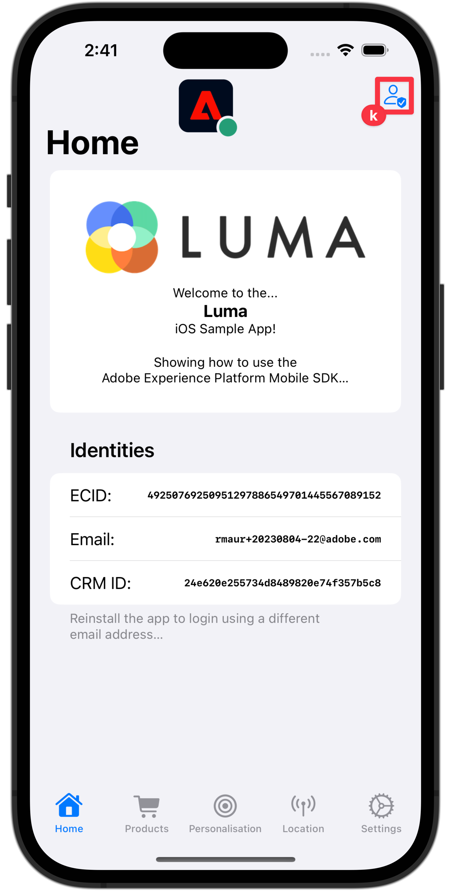

# Profil

Lär dig hur du samlar in profildata i en mobilapp.

Du kan använda profiltillägget för att lagra attribut om användaren på klienten. Den här informationen kan användas senare för att målinrikta och personalisera meddelanden i online- eller offlinescenarier, utan att du behöver ansluta till en server för optimala prestanda. Profiltillägget hanterar CSOP (Client-Side Operation Profile), ger ett sätt att reagera på API:er, uppdatera attribut för användarprofiler och delar attribut för användarprofiler med resten av systemet som en genererad händelse.

Profildata används av andra tillägg för att utföra profilrelaterade åtgärder. Ett exempel är tillägget Regelmotor som förbrukar profildata och kör regler baserat på profildata. Läs mer om [Profiltillägg](https://developer.adobe.com/client-sdks/documentation/profile/) i dokumentationen

>[!IMPORTANT]
>
>Profilfunktionerna som beskrivs i den här lektionen skiljer sig från kundprofilfunktionerna i realtid i Adobe Experience Platform och plattformsbaserade program.


## Förutsättningar

* App med SDK:er har installerats och konfigurerats.
* Profil-SDK importerades.

  ```swift
  import AEPUserProfile
  ```

## Utbildningsmål

I den här lektionen kommer du att:

* Ange eller uppdatera användarattribut.
* Hämta användarattribut.


## Ange och uppdatera

Det skulle vara praktiskt för målgruppsanpassning och/eller personalisering att snabbt veta om en användare har köpt appen tidigare. Låt oss konfigurera det i Luma-appen.

1. Navigera till **[!UICONTROL ProductView]** (in **[!UICONTROL Vyer]** > **[!UICONTROL Produkter]**) i Xcode Luma-appprojektet och hitta `updateUserAttributes` (med knappen Köp):

   ```swift {highlight="8-9"}
   Button {
       Task {
           if ATTrackingManager.trackingAuthorizationStatus == .authorized {
               // Send purchase commerce experience event
               MobileSDK.shared.sendCommerceExperienceEvent(commerceEventType: "purchases", product: product)
               // Update attributes
               MobileSDK.shared.updateUserAttributes(attributeName: "isPaidUser", attributeValue: "yes")
           }
       }
       showPurchaseDialog.toggle()
   } label: {
       Label("", systemImage: "creditcard")
   }
   .alert(isPresented: $showPurchaseDialog, content: {
       Alert(title: Text( "Purchases"), message: Text("The selected item is purchased…"))
   })
   ```

2. Navigera till **[!UICONTROL MobileSDK]** och hitta `updateUserAttributes` funktion. Lägg till följande markerade kod:

   ```swift {highlight="2-4"}
   func updateUserAttributes(attributeName: String, attributeValue: String) {
       var profileMap = [String: Any]()
       profileMap[attributeName] = attributeValue
       UserProfile.updateUserAttributes(attributeDict: profileMap)
   }
   ```

   Den här koden:

   1. Ställer in en tom ordlista med namnet `profileMap`.

   1. Lägger till ett element i ordlistan med `attributeName` (till exempel `isPaidUser`), och `attributeValue` (till exempel `yes`).

   1. Använder `profileMap` ordlista som ett värde för `attributeDict` parametern för `UserProfile.updateUserAttributes` API-anrop.


Ytterligare `updateUserAttributes` dokumentation finns [här](https://developer.adobe.com/client-sdks/documentation/profile/api-reference/#updateuserattribute).

## Hämta

När du har uppdaterat en användares attribut är det tillgängligt för andra Adobe SDK:er, men du kan även hämta attribut explicit.

1. Navigera till **[!UICONTROL HomeView]** (in **[!UICONTROL Vyer]** > **[!UICONTROL Allmänt]**) och hitta `.onAppear` modifierare. Lägg till följande kod:

   ```swift {highlight="3-11"}
   .onAppear {
       // Track view screen
       MobileSDK.shared.sendTrackScreenEvent(stateName: "luma: content: ios: us: en: home")
       // Get attributes
       UserProfile.getUserAttributes(attributeNames: ["isPaidUser"]) { attributes, error in
           if attributes?["isPaidUser"] as! String == "yes" {
               showBadgeForUser = true
           }
           else {
               showBadgeForUser = false
           }
       }
   }
   ```

   Den här koden:

   1. Anropar `UserProfile.getUserAttributes` stängning med `iPaidUser` attributnamn som enskilt element i `attributeNames` array.
   1. Kontrollerar sedan värdet för `isPaidUser` och när `yes`, placerar ett märke på personikonen i det övre högra hörnet.

Ytterligare `getUserAttributes` dokumentation finns [här](https://developer.adobe.com/client-sdks/documentation/profile/api-reference/#getuserattributes).

## Validera med Assurance

1. Granska [installationsanvisningar](assurance.md) -avsnitt.
1. Installera programmet.
1. Starta appen med den URL som skapas av försäkringen.
1. Kör appen för att logga in och interagera med en produkt.

   1. Flytta Assurance-ikonen åt vänster.
   1. Välj **[!UICONTROL Startsida]** i tabbfältet.
   1. Om du vill öppna inloggningsbladet väljer du **[!UICONTROL Inloggning]** -knappen.
   1. Välj **[!UICONTROL A|]** knapp .
   1. Välj **[!UICONTROL Inloggning]**.
   1. Välj **[!UICONTROL Produkter]** i tabbfältet.
   1. Välj en produkt.
   1. Välj **[!UICONTROL Spara senare]**.
   1. Välj **[!UICONTROL Lägg i kundvagnen]**.
   1. Välj **[!UICONTROL Inköp]**.
   1. Återgå till **[!UICONTROL Startsida]** skärm. En uppdaterad inloggningsknapp visas.

         

1. Du borde se en **[!UICONTROL UserProfileUpdate]** och **[!UICONTROL getUserAttributes]** händelser i försäkringsgränssnittet med den uppdaterade `profileMap` värde.
   

>[!SUCCESS]
>
>Du har nu konfigurerat din app för att uppdatera profilattribut i Edge Network och (när den har konfigurerats) med Adobe Experience Platform.<br/>Tack för att du lade ned din tid på att lära dig om Adobe Experience Platform Mobile SDK. Om du har frågor, vill dela allmän feedback eller har förslag på framtida innehåll kan du dela dem om detta [Experience League diskussionsinlägg](https://experienceleaguecommunities.adobe.com/t5/adobe-experience-platform-launch/tutorial-discussion-implement-adobe-experience-cloud-in-mobile/td-p/443796)

Nästa: **[Mappa data till Adobe Analytics](analytics.md)**
