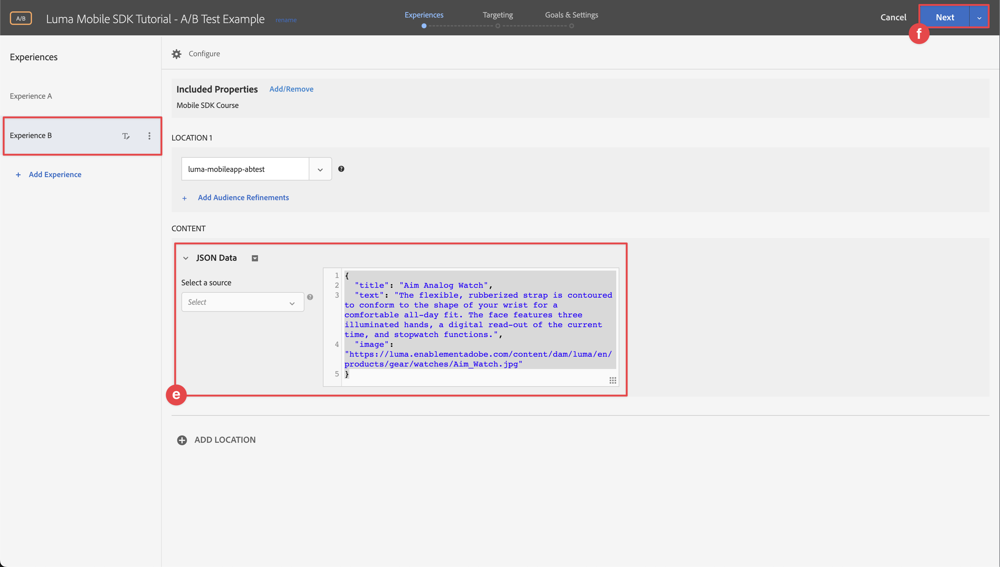

# Utför A/B-tester med mål

Lär dig hur du utför A/B-tester i dina mobilappar med Platform Mobile SDK och Adobe Target.

Target innehåller allt som ni behöver för att skräddarsy och personalisera kundernas upplevelser. Target hjälper er att maximera intäkterna från era webbplatser och mobilsajter, appar, sociala medier och andra digitala kanaler. Fokus i den här självstudiekursen ligger på A/B-testfunktionen i Target. Se [Översikt över A/B-test](https://experienceleague.adobe.com/docs/target/using/activities/abtest/test-ab.html?lang=en) för mer information.

Innan du kan utföra A/B-tester med Target måste du se till att rätt konfigurationer och integreringar finns på plats.

>[!NOTE]
>
>Den här lektionen är valfri och gäller endast för Adobe Target-användare som vill utföra A/B-tester.


## Förutsättningar

* App med SDK:er har installerats och konfigurerats.
* Tillgång till Adobe Target Premium med behörigheter, korrekt konfigurerade roller, arbetsytor och egenskaper enligt beskrivningen [här](https://experienceleague.adobe.com/docs/target/using/administer/manage-users/enterprise/property-channel.html?lang=en).
Du bör även kunna använda Target Standard, men i självstudien används några avancerade begrepp (till exempel Target-egenskaper) som är unika för Target Premium.


## Utbildningsmål

I den här lektionen ska du

* Uppdatera din Edge-konfiguration för Target-integrering.
* Uppdatera taggegenskapen med tillägget Journey Optimizer - Decisioning.
* Uppdatera ditt schema för att hämta förslagshändelser.
* Validera inställningar i Assurance.
* Skapa ett enkelt A/B-test i Target.
* Uppdatera appen så att den innehåller tillägget Optimizer.
* Implementera A/B-testet i din app.
* Validera implementering i Assurance.


## Konfigurera din app

>[!TIP]
>
>Om du redan har konfigurerat ditt program som en del av [Journey Optimizer erbjuder](journey-optimizer-offers.md) självstudiekurs, du kan hoppa över [Installera Adobe Journey Optimizer - Decisioning-taggtillägg](#install-adobe-journey-optimizer---decisioning-tags-extension) och [Uppdatera ditt schema](#update-your-schema).

### Uppdatera Edge-konfiguration

För att säkerställa att data som skickas från din mobilapp till Edge Network vidarebefordras till Adobe Target måste du uppdatera Experience Edge-konfigurationen.

1. I gränssnittet för datainsamling väljer du **[!UICONTROL Datastreams]** och välj till exempel din datastream **[!UICONTROL Mobilappen Luma]**.
1. Välj **[!UICONTROL Lägg till tjänst]** och markera **[!UICONTROL Adobe Target]** från **[!UICONTROL Tjänst]** lista.
1. Ange mål **[!UICONTROL Egenskapstoken]** värde som du vill använda för den här integreringen.

   Du hittar dina egenskaper i målgränssnittet i **[!UICONTROL Administration]** > **[!UICONTROL Egenskaper]**. Välj  för att visa egenskapstoken för den egenskap som du vill använda. Egenskapstoken har ett format som `"at_property": "xxxxxxxx-xxxx-xxxxx-xxxx-xxxxxxxxxxxx"`; du får bara ange värdet `xxxxxxxx-xxxx-xxxxx-xxxx-xxxxxxxxxxxx`.

1. Välj **[!UICONTROL Spara]**.

   


### Installera Adobe Journey Optimizer - Decisioning-taggtillägg

1. Navigera till **[!UICONTROL Taggar]** och hitta din mobila taggegenskap och öppna egenskapen.
1. Välj **[!UICONTROL Tillägg]**.
1. Välj **[!UICONTROL Katalog]**.
1. Sök efter **[!UICONTROL Adobe Journey Optimizer - beslut]** tillägg.
1. Installera tillägget. Tillägget kräver ingen ytterligare konfiguration.

   


### Uppdatera ditt schema

1. Navigera till användargränssnittet för datainsamling och välj Scheman i den vänstra listen.
1. Välj **[!UICONTROL Bläddra]** i det övre fältet.
1. Välj ditt schema för att öppna det.
1. Välj  **[!UICONTROL Lägg till]** nästa **[!UICONTROL Fältgrupper]**.
1. I dialogrutan Lägg till fältgrupper söker du efter `proposition`, markera **[!UICONTROL Experience Event - Proposition Interactions]** och markera **[!UICONTROL Lägg till fältgrupper]**.
   
1. om du vill spara ändringarna i ditt schema väljer du **[!UICONTROL Spara]** .


### Validera inställningar i Assurance

Så här validerar du inställningarna i Assurance:

1. Gå till försäkringsgränssnittet.
1. Välj **[!UICONTROL Konfigurera]** i vänster rand och välj  nästa **[!UICONTROL Validera inställningar]** under **[!UICONTROL ADOBE JOURNEY OPTIMIZER AVGÖRANDE]**.
1. Välj **[!UICONTROL Spara]**.
1. Välj **[!UICONTROL Validera inställningar]** till vänster. Både datastream-konfigurationen valideras och SDK-inställningen i ditt program.
   

## Skapa ett A/B-test

1. I målgränssnittet väljer du **[!UICONTROL Verksamhet]** i det övre fältet.
1. Välj **[!UICONTROL Skapa aktivitet]** och **[!UICONTROL A/B-test]** på snabbmenyn.
1. I **[!UICONTROL Skapa A/B-testaktivitet]** dialogruta, välja **[!UICONTROL Mobil]** som **[!UICONTROL Typ]** väljer du en arbetsyta på **[!UICONTROL Välj arbetsyta]** och välj din egenskap i listan **[!UICONTROL Välj egenskap]** lista.
1. Välj **[!UICONTROL Skapa]**.
   

1. I **[!UICONTROL Namnlös aktivitet]** på skärmen **[!UICONTROL Erfarenheter]** steg:

   1. Retur `luma-mobileapp-abtest` in **[!UICONTROL Välj plats]** under **[!UICONTROL PLATS 1]**.
   1. Välj  nästa **[!UICONTROL Standardinnehåll]** och markera **[!UICONTROL Skapa JSON-erbjudande]** på snabbmenyn.
   1. Kopiera följande JSON till **[!UICONTROL Ange ett giltigt JSON-objekt]**.

      ```json
      { 
          "title": "Luma Anaolog Watch",
          "text": "Designed to stand up to your active lifestyle, this women's Luma Analog Watch features a tasteful brushed chrome finish and a stainless steel, water-resistant construction for lasting durability.", 
          "image": "https://luma.enablementadobe.com/content/dam/luma/en/products/gear/watches/Luma_Analog_Watch.jpg" 
      }
      ```

   1. Välj **[!UICONTROL + Lägg till upplevelse]**.

      

   1. Upprepa steg b och c för upplevelsen Experience B, men använd i stället följande JSON:

      ```json
      { 
          "title": "Aim Analog Watch",
          "text": "The flexible, rubberized strap is contoured to conform to the shape of your wrist for a comfortable all-day fit. The face features three illuminated hands, a digital read-out of the current time, and stopwatch functions.", 
          "image": "https://luma.enablementadobe.com/content/dam/luma/en/products/gear/watches/Aim_Watch.jpg" 
      }
      ```

   1. Välj **[!UICONTROL Nästa]**.

      

1. I **[!UICONTROL Målinriktning]** Granska konfigurationen av A/B-testet. Som standard fördelas båda erbjudandena jämnt över alla besökare. Välj **[!UICONTROL Nästa]** för att fortsätta.

   

1. I **[!UICONTROL Mål och inställningar]** steg:

   1. Byt namn på din namnlösa aktivitet, till exempel till `Luma Mobile SDK Tutorial - A/B Test Example`.
   1. Ange en **[!UICONTROL Syfte]** för A/B-testet, till exempel `A/B Test for Luma mobile app tutorial`.
   1. Välj **[!UICONTROL Konvertering]**, **[!UICONTROL Klickad på mbox]** i **[!UICONTROL Målmått]** > **[!UICONTROL MIN PRIMÄRA MÅL]** och ange platsens (mbox) namn, till exempel `luma-mobileapp-abtest`.
   1. Välj **[!UICONTROL Spara och stäng]**.

      

1. Tillbaka i **[!UICONTROL Alla aktiviteter]** skärm:

   1. Välj  i din aktivitet.
   1. Välj  **[!UICONTROL Aktivera]** för att aktivera A/B-testet.

   


## Implementera mål i din app

Som tidigare nämnts tillhandahåller installation av ett mobiltaggtillägg bara konfigurationen. Därefter måste du installera och registrera Optimera SDK. Om de här stegen inte är tydliga går du igenom [Installera SDK:er](install-sdks.md) -avsnitt.

>[!NOTE]
>
>Om du har slutfört [Installera SDK:er](install-sdks.md) är SDK redan installerat och du kan hoppa över det här steget.
>

1. I Xcode kontrollerar du att [AEP-optimering](https://github.com/adobe/aepsdk-messaging-ios.git) läggs till i listan över paket i paketberoenden. Se [Swift Package Manager](install-sdks.md#swift-package-manager).
1. Navigera till **[!UICONTROL Luma]** > **[!UICONTROL Luma]** > **[!UICONTROL AppDelegate]** i Xcode Project-navigatorn.
1. Säkerställ `AEPOptimize` är en del av din lista över importer.

   `import AEPOptimize`

1. Säkerställ `Optimize.self` är en del av den array med tillägg som du registrerar.

   ```swift
   let extensions = [
       AEPIdentity.Identity.self,
       Lifecycle.self,
       Signal.self,
       Edge.self,
       AEPEdgeIdentity.Identity.self,
       Consent.self,
       UserProfile.self,
       Places.self,
       Messaging.self,
       Optimize.self,
       Assurance.self
   ]
   ```

1. Navigera till **[!UICONTROL Luma]** > **[!UICONTROL Luma]** > **[!UICONTROL Utils]** > **[!UICONTROL MobileSDK]** i Xcode Project-navigatorn. Hitta ` func updatePropositionAT(ecid: String, location: String) async` funktion. Lägg till följande kod:

   ```swift
   Task {
       let ecid = ["ECID" : ["id" : ecid, "primary" : true] as [String : Any]]
       let identityMap = ["identityMap" : ecid]
       let xdmData = ["xdm" : identityMap]
       let decisionScope = DecisionScope(name: location)
       Optimize.clearCachedPropositions()
       Optimize.updatePropositions(for: [decisionScope], withXdm: xdmData)
   }
   ```

   Den här funktionen

   * ställer in en XDM-ordlista `xdmData`som innehåller ECID för att identifiera den profil som du måste presentera A/B-testet för, och
   * definierar en `decisionScope`, en array med platser där A/B-testet ska presenteras.

   Sedan anropar funktionen två API:er: [`Optimize.clearCachePropositions`](https://support.apple.com/en-ie/guide/mac-help/mchlp1015/mac)  och [`Optimize.updatePropositions`](https://developer.adobe.com/client-sdks/documentation/adobe-journey-optimizer-decisioning/api-reference/#updatepropositions). Dessa funktioner rensar alla cachelagrade offerter och uppdaterar propositionerna för den här profilen.

1. Navigera till **[!UICONTROL Luma]** > **[!UICONTROL Luma]** > **[!UICONTROL Vyer]** > **[!UICONTROL Personalisering]** > **[!UICONTROL TargetOffersView]** i Xcode Project-navigatorn. Hitta `func getPropositionAT(location: String) async` och inspektera koden för den här funktionen. Den viktigaste delen av funktionen är  [`Optimize.getPropositions`](https://developer.adobe.com/client-sdks/documentation/adobe-journey-optimizer-decisioning/api-reference/#getpropositions) API-anrop, som
   * hämtar förslagen för den aktuella profilen baserat på beslutsomfånget (som är den plats du har definierat i A/B-testet) och
   * ångrar resultatet i innehåll som kan visas på rätt sätt i programmet.

1. Fortfarande i **[!UICONTROL TargetOffersView]**, hittar du`unc updatePropositions(location: String) async` och lägga till följande kod:

   ```swift
       Task {
           await self.updatePropositionAT(
               ecid: currentEcid,
               location: location
           )
       }
       try? await Task.sleep(seconds: 2.0)
       Task {
           await self.getPropositionAT(
               location: location
           )
       }
   ```

   Med den här koden kan du uppdatera förslagen och sedan hämta resultaten med de funktioner som beskrivs i steg 5 och 6.


## Validera med appen

1. Öppna appen på en enhet eller i simulatorn.

1. Gå till **[!UICONTROL Personalisering]** -fliken.

1. Välj **[!UICONTROL Edge Personalization]**.

1. Bläddra nedåt och se ett av de två erbjudanden som du har definierat i A/B-testet som visas i **[!UICONTROL MÅL]** platta.

   


## Validera implementering i Assurance

Så här validerar du A/B-testet i Assurance:

1. Gå till försäkringsgränssnittet.
1. Välj **[!UICONTROL Konfigurera]** i vänster rand och välj  nästa **[!UICONTROL Granska och simulera]** under **[!UICONTROL ADOBE JOURNEY OPTIMIZER AVGÖRANDE]**.
1. Välj **[!UICONTROL Spara]**.
1. Välj **[!UICONTROL Granska och simulera]** till vänster. Både datastream-konfigurationen valideras och SDK-inställningen i ditt program.
1. Välj **[!UICONTROL Begäranden]** i det övre fältet. Du ser **[!UICONTROL Mål]** förfrågningar.
   

1. Du kan utforska flikarna Simulera och Händelselista för ytterligare funktionalitet som kontrollerar konfigurationen för Target-erbjudanden.

## Nästa steg

Nu bör du ha alla verktyg för att börja lägga till fler A/B-tester eller andra Target-aktiviteter (som Experience Targeting, Multivariate Test), där det är relevant och tillämpligt, i Luma-appen.

>[!SUCCESS]
>
>Du har aktiverat appen för A/B-tester och visat resultatet av ett A/B-test med Adobe Target och tillägget Adobe Journey Optimizer - Decisioning för Adobe Experience Platform Mobile SDK.<br/>Tack för att du lade ned din tid på att lära dig om Adobe Experience Platform Mobile SDK. Om du har frågor, vill dela allmän feedback eller har förslag på framtida innehåll kan du dela dem om detta [Experience League diskussionsinlägg](https://experienceleaguecommunities.adobe.com/t5/adobe-experience-platform-launch/tutorial-discussion-implement-adobe-experience-cloud-in-mobile/td-p/443796).

Nästa: **[Slutsats och nästa steg](conclusion.md)**
