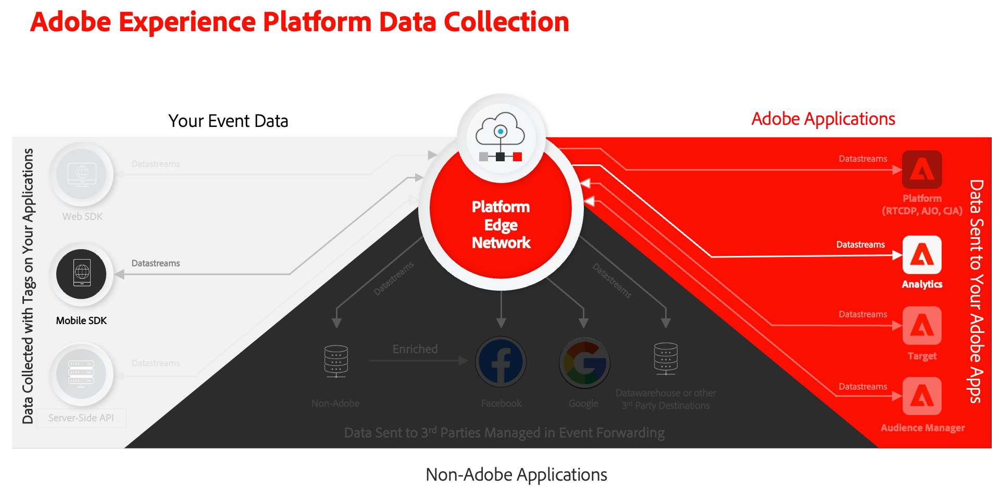

# Samla in och mappa analysdata

Lär dig hur du mappar mobildata till Adobe Analytics.

[Händelsens](events.md)-data som du har samlat in och skickat till Platform Edge Network i tidigare lektioner vidarebefordras till de tjänster som har konfigurerats i ditt datalager, inklusive Adobe Analytics. Du mappar data till rätt variabler i rapportsviten.

{zoomable="yes"}

## Förhandskrav

* Understanding of ExperienceEvent tracking.
* XDM-data har skickats i exempelappen.
* En Adobe Analytics rapportserie som du kan använda för den här lektionen.

## Utbildningsmål

I den här lektionen kommer du att:

* Konfigurera dataströmmen med Adobe Analytics-tjänsten.
* Förstå automatisk mappning av analysvariabler.
* Ställ in bearbetningsregler för att mappa XDM-data till analysvariabler.

## Lägg till Adobe Analytics datastream-tjänst

Om du vill skicka XDM-data från Edge Network till Adobe Analytics konfigurerar du Adobe Analytics-tjänsten till den datastream som du konfigurerade som en del av [Skapa en datastream](create-datastream.md).

1. I användargränssnittet för datainsamling väljer du **[!UICONTROL Datastreams]** och ditt datastream.

1. Välj sedan  **[!UICONTROL Add Service]**.

1. Lägg till **[!UICONTROL Adobe Analytics]** från listan [!UICONTROL Service],

1. Ange namnet på rapportsviten från Adobe Analytics som du vill använda i **[!UICONTROL Report Suite ID]**.

1. Aktivera tjänsten genom att aktivera **[!UICONTROL Enabled]**.

1. Välj **[!UICONTROL Save]**.

   {zoomable="yes"}


## Automatisk mappning

Många av XDM-standardfälten mappas automatiskt till analysvariabler. Se den [fullständiga listan](https://experienceleague.adobe.com/sv/docs/analytics/implementation/aep-edge/xdm-var-mapping).

### Exempel 1 - s.products

Ett bra exempel är variabeln [products](https://experienceleague.adobe.com/sv/docs/analytics/implementation/vars/page-vars/products) som inte kan fyllas med bearbetningsregler. Med en XDM-implementering skickas alla nödvändiga data i `productListItems` och `s.products` fylls i automatiskt via Analytics-mappning.

Det här objektet:

```swift
"productListItems": [
    [
      "name":  "Yoga Mat",
      "SKU": "5829",
      "priceTotal": "49.99",
      "quantity": 1
    ],
    [
      "name":  "Water Bottle",
      "SKU": "9841",
      "priceTotal": "30.00",
      "quantity": 3
    ]
]
```

resulterar i

```
s.products = ";5829;1;49.99,9841;3;30.00"
```

>[!NOTE]
>
>Om både `productListItems[].SKU` och `productListItems[].name` innehåller data används värdet i `productListItems[].SKU`. Mer information finns i [Variabelmappning för analys i Adobe Experience Edge](https://experienceleague.adobe.com/sv/docs/analytics/implementation/aep-edge/xdm-var-mapping).


### Exempel 2 - scAdd

Om du tittar närmare på alla händelser finns det två fält: `value` (obligatoriskt) och `id` (valfritt). Fältet `value` används för att öka antalet händelser. Fältet `id` används för serialisering.

Det här objektet:

```swift
"commerce" : {
  "productListAdds" : {
    "value" : 1
  }
}
```

resulterar i

```
s.events = "scAdd"
```

Det här objektet:

```swift
"commerce" : {
  "productListAdds" : {
    "value" : 1,
    "id": "321435"
  }
}
```

resulterar i

```
s.events = "scAdd:321435"
```

## Validera med Assurance

Med [Assurance](assurance.md) kan du bekräfta att du skickar en upplevelsehändelse, att XDM-data är korrekta och att analysmappningen sker som förväntat.

1. Granska avsnittet [installationsanvisningar](assurance.md#connecting-to-a-session) för att ansluta simulatorn eller enheten till Assurance.

1. Skicka en **[!UICONTROL productListAdds]**-händelse (lägg till en produkt i korgen).

1. Visa ExperienceEvent-träffen.

   {zoomable="yes"}

1. Granska XDM-delen av JSON.

   ```json
   "xdm" : {
     "productListItems" : [ {
       "SKU" : "LLWS05.1-XS",
       "name" : "Desiree Fitness Tee",
       "priceTotal" : 24
     } ],
   "timestamp" : "2023-08-04T12:53:37.662Z",
   "eventType" : "commerce.productListAdds",
   "commerce" : {
     "productListAdds" : {
       "value" : 1
     }
   }
   // ...
   ```

1. Granska **[!UICONTROL analytics.mapping]**-händelsen.

   {zoomable="yes"}

Observera följande i Analytics-mappningen:

* **[!UICONTROL events]** fylls i med `scAdd` baserat på `commerce.productListAdds`.
* **[!UICONTROL pl]** (produktvariabel) har ett sammanfogat värde som baseras på `productListItems`.
* Det finns annan intressant information i den här händelsen, inklusive alla kontextdata.


## Mappa med kontextdata

XDM-data som vidarebefordras till Analytics konverteras till [kontextdata](https://github.com/Adobe-Marketing-Cloud/mobile-services/blob/master/docs/ios/getting-started/proc-rules.md?lang=en), inklusive både standardfält och anpassade fält.

Kontextens datanyckel konstrueras enligt den här syntaxen:

```
a.x.[xdm path]
```

Exempel:

```
// Standard Field
a.x.commerce.saveforlaters.value

// Custom Field
a.x._techmarketingdemos.appinformation.appstatedetails.screenname
```

>[!NOTE]
>
>Anpassade fält placeras under din Experience Cloud Org-identifierare.
>
>Klientorganisationens namn `_techmarketingdemos` har ersatts med din organisations unika värde.


Om du vill mappa dessa XDM-kontextdata till analysdata i rapportsviten kan du:

### Använd en fältgrupp

* Lägg till fältgruppen **[!UICONTROL Adobe Analytics ExperienceEvent Full Extension]** i ditt schema.

  {zoomable="yes"}

* Bygg XDM-nyttolaster i appen, i enlighet med fältgruppen Adobe Analytics ExperienceEvent Full Extension, i likhet med vad du har gjort i lektionen [Spåra händelsedata](events.md) , eller
* Skapa regler i taggegenskapen som använder regelåtgärder för att bifoga eller ändra data till fältgruppen Adobe Analytics ExperienceEvent Full Extension. Mer information finns i [Bifoga data till SDK-händelser](https://developer.adobe.com/client-sdks/documentation/user-guides/attach-data/) eller [Ändra data i SDK-händelser](https://developer.adobe.com/client-sdks/documentation/user-guides/attach-data/).


### Merchandising eVars

Om du använder [marknadsföringsvariabler](https://experienceleague.adobe.com/sv/docs/analytics/admin/admin-tools/manage-report-suites/edit-report-suite/conversion-variables/merchandising-evars) i Analytics-konfigurationen måste du utöka din XDM-nyttolast som du definierade i [Spåra händelsedata](events.md) för att kunna hämta försäljningsinformationen. Exempel på en försäljningsvariabel är `evar1` där du vill fånga färgerna för produkter, som `&&products = ...;evar1=red;event10=50,...;evar1=blue;event10=60`

* I JSON:

  ```json
  {
    "productListItems": [
        {
            "SKU": "LLWS05.1-XS",
            "name": "Desiree Fitness Tee",
            "priceTotal": 24,
            "_experience": {
                "analytics": {
                    "events1to100": {
                        "event10": {
                            "value": 50
                        }
                    },
                    "customDimensions": {
                        "eVars": {
                            "eVar1": "red",
                        }
                    }
                }
            }
        }
    ],
    "eventType": "commerce.productListAdds",
    "commerce": {
        "productListAdds": {
            "value": 1
        }
    }
  }
  ```

* I kod:

  ```swift
  var xdmData: [String: Any] = [
    "productListItems": [
      [
        "name":  productName,
        "SKU": sku,
        "priceTotal": priceString,
        "_experience" : [
          "analytics": [
            "events1to100": [
              "event10": [
                "value:": value
              ]
            ],
            "customDimensions": [
              "eVars": [
                "eVar1": color
              ]
            ]
          ]
        ]
      ]
    ],
    "eventType": "commerce.productViews",
    "commerce": [
      "productViews": [
        "value": 1
      ]
    ]
  ]
  ```


### Använd bearbetningsregler

Så här ser en bearbetningsregel ut när den här informationen används:

* Du **[!UICONTROL Overwrite value of]** (1) **[!UICONTROL App Screen Name (eVar2)]** (2) med värdet **[!UICONTROL a.x._techmarketingdemo.appinformation.appstatedetails.screenname]** (3) if **[!UICONTROL a.x._techmarketingdemo.appinformation.appstatedetails.screenname]** (4) **[!UICONTROL is set]** (5).

* Du **[!UICONTROL Set event]** (6) **[!UICONTROL Add to Wishlist (Event 3)]** (7) till **[!UICONTROL a.x.commerce.saveForLaters.value(Context)]** (8) om **[!UICONTROL a.x.commerce.saveForLaters.value(Context)]** (9) **[!UICONTROL is set]** (10).

{zoomable="yes"}

>[!IMPORTANT]
>
>
>Vissa av de automatiskt mappade variablerna kanske inte är tillgängliga för användning i bearbetningsregler.
>
>
>Första gången du mappar till en bearbetningsregel visas inte kontextdatavariablerna från XDM-objektet. Om du vill åtgärda det väljer du ett värde, Spara och återgå till att redigera. Alla XDM-variabler ska nu visas.


Se [Mappa contextData-variabler till utkast och eVars med bearbetningsregler](https://experienceleague.adobe.com/sv/docs/analytics-learn/tutorials/implementation/implementation-basics/map-contextdata-variables-into-props-and-evars-with-processing-rules).

>[!TIP]
>
>Till skillnad från tidigare mobilappsimplementeringar finns det ingen skillnad mellan en sida-/skärmvy och andra händelser. I stället kan du öka måttet **[!UICONTROL Page View]** genom att ställa in dimensionen **[!UICONTROL Page Name]** i en bearbetningsregel. Eftersom du samlar in det anpassade fältet `screenName` i självstudiekursen rekommenderar vi att du mappar skärmnamnet till **[!UICONTROL Page Name]** i en bearbetningsregel.

## Migrera från mobiltillägget Analytics

Om du har utvecklat ditt mobilprogram med [Adobe Analytics-mobiltillägget](https://developer.adobe.com/client-sdks/solution/adobe-analytics/#add-analytics-to-your-application) har du troligen använt API-anropen [`MobileCore.trackAction`](https://developer.adobe.com/client-sdks/home/base/mobile-core/api-reference/#trackaction) och [`MobileCore.trackState`](https://developer.adobe.com/client-sdks/home/base/mobile-core/api-reference/#trackstate) .

Om du bestämmer dig för att migrera för att använda den rekommenderade Edge Network finns det alternativ:

* Implementera [Edge Network-tillägget](configure-tags.md#extension-configuration) och använd [`Edge.sendEvent`](https://developer.adobe.com/client-sdks/edge/edge-network/api-reference/#sendevent)-API:erna, som i lektionen om hur du [spårar händelsedata](events.md). Den här självstudiekursen fokuserar på den här implementeringen.
* Implementera [Edge Bridge-tillägget](https://developer.adobe.com/client-sdks/solution/adobe-analytics/migrate-to-edge-network/#implement-the-edge-bridge-extension) och fortsätt använda dina [`MobileCore.trackAction`](https://developer.adobe.com/client-sdks/home/base/mobile-core/api-reference/#trackaction) - och [`MobileCore.trackState`](https://developer.adobe.com/client-sdks/home/base/mobile-core/api-reference/#trackstate) API-anrop. Se [Implementera Edge Bridge-tillägget](https://developer.adobe.com/client-sdks/solution/adobe-analytics/migrate-to-edge-network/#implement-the-edge-bridge-extension) om du vill ha mer information och en separat självstudiekurs.


>[!SUCCESS]
>
>Du har konfigurerat din app för att mappa dina Experience Edge XDM-objekt till Adobe Analytics-variabler genom att aktivera Adobe Analytics-tjänsten i din datastam. Och med bearbetningsregler där det är tillämpligt.<br/> Tack för att du har lagt ned din tid på att lära dig om Adobe Experience Platform Mobile SDK. Om du har frågor, vill dela allmän feedback eller har förslag på framtida innehåll kan du dela dem i det här [Experience League Community-diskussionsinlägget](https://experienceleaguecommunities.adobe.com:443/t5/adobe-experience-platform-data/tutorial-discussion-implement-adobe-experience-cloud-in-mobile/td-p/443796).

Nästa: **[Skicka data till Experience Platform](platform.md)**
