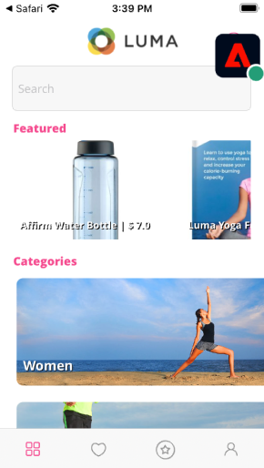

# Säkerhet

Lär dig hur du konfigurerar Adobe Experience Platform Assurance i en mobilapp.

Assurance, som formellt kallas Project Griffon, är utformat för att hjälpa er att inspektera, verifiera, simulera och validera hur ni samlar in data eller levererar upplevelser i er mobilapp.

Med Assurance kan du inspektera SDK-råhändelser som genererats av Adobe Experience Platform Mobile SDK. Alla händelser som samlas in av SDK är tillgängliga för inspektion. SDK-händelser läses in i en listvy, sorterade efter tid. Varje händelse har en detaljerad vy som ger mer information. Det finns även ytterligare vyer för att bläddra bland SDK-konfigurationer, dataelement, delade lägen och SDK-tilläggsversioner. Läs mer om [Säkerhet](https://aep-sdks.gitbook.io/docs/foundation-extensions/adobe-experience-platform-assurance) i produktdokumentationen.


## Förutsättningar

* Exempelappen med SDK:er installerade och konfigurerade har skapats och körts.

## Utbildningsmål

I den här lektionen kommer du att:

* Bekräfta att din organisation har åtkomst (och begär det om du inte har det).
* Ange din bas-URL.
* Lägg till nödvändig iOS-specifik kod.
* Anslut till en session.

## Bekräfta åtkomst

Bekräfta att din organisation har åtkomst till Assurance genom att utföra följande steg:

1. Besök [https://experience.adobe.com/#/assurance](https://experience.adobe.com/griffon){target="_blank"}
1. Logga in med dina Adobe ID-uppgifter för Experience Cloud.
1. Om du kommer till **[!UICONTROL Sessioner]** så får du åtkomst. Om du kommer till betaåtkomstsidan väljer du **[!UICONTROL Registrera]**.

## Implementera

Förutom det allmänna [SDK-installation](install-sdks.md) När du är klar med den tidigare lektionen behöver iOS även följande tillägg. Lägg till följande kod i `AppDelegate.swift` fil:

```swift
func application(_ app: UIApplication, open url: URL, options: [UIApplication.OpenURLOptionsKey: Any] = [:]) -> Bool {
    Assurance.startSession(url: url)
    return true
}
```

I exemplet Luma för den här kursen används iOS 12.0. Om du följer med i ditt eget scenbaserade program med iOS 13 och senare använder du `UISceneDelegate's scene(_:openURLContexts:)` metod enligt följande:

```swift
func scene(_ scene: UIScene, openURLContexts URLContexts: Set<UIOpenURLContext>) {
    // Called when the app in background is opened with a deep link.
    if let deepLinkURL = URLContexts.first?.url {
        Assurance.startSession(url: deepLinkURL)
    }
}
```

Mer information finns [här](https://aep-sdks.gitbook.io/docs/foundation-extensions/adobe-experience-platform-assurance#implement-aep-assurance-session-start-apis-ios-only){target="_blank"}.

## Konfigurera en bas-URL

1. Öppna XCode och välj projektnamnet.
1. Navigera till **Info** -fliken.
1. Bläddra nedåt till **URL-typer** och väljer **+** för att lägga till en ny.
1. Ange **Identifierare** och **URL-scheman** till&quot;lumadeeplink&quot;.
1. Bygg och kör appen.


Mer information om URL-scheman i iOS finns i [Apple dokumentation](https://developer.apple.com/documentation/xcode/defining-a-custom-url-scheme-for-your-app){target="_blank"}.

Assurance fungerar genom att öppna en URL, antingen via webbläsare eller QR-kod, som börjar med den bas-URL som öppnar programmet och som innehåller ytterligare parametrar. Dessa unika parametrar används för att ansluta sessionen.

## Ansluta till en session

1. Navigera till [Försäkringsgränssnitt](https://experience.adobe.com/griffon){target="_blank"}.
1. Välj **[!UICONTROL Skapa session]**.
1. Ange **[!UICONTROL Sessionsnamn]** som `Luma App QA` och **[!UICONTROL Bas-URL]** `lumadeeplink://default`
1. Välj **[!UICONTROL Nästa]**.
   
1. **[!UICONTROL Skanna QR-kod]** om du använder en fysisk enhet. Om du använder simulatorn **[!UICONTROL Kopiera länk]** och öppna den med Safari i simulatorn.
   
1. När appen läses in visas en modal som ber dig ange din PIN-kod från föregående steg.
   
1. Om anslutningen lyckades visas händelser i webbgränssnittet för försäkringen och en flytande säkerhetsikon i appen.
   * Löpande säkerhetsikon.
      
   * Experience Cloud event som kommer igenom i webbgränssnittet.
      

Om du stöter på några problem kan du läsa [teknisk](https://aep-sdks.gitbook.io/docs/foundation-extensions/adobe-experience-platform-assurance){target="_blank"} and [general documentation](https://aep-sdks.gitbook.io/docs/beta/project-griffon){target="_blank"}.

Nästa: **[Godkännande](consent.md)**

>[!NOTE]
>
>Tack för att du lade ned din tid på att lära dig om Adobe Experience Platform Mobile SDK. Om du har frågor, vill dela allmän feedback eller har förslag på framtida innehåll kan du dela med dig av dem om detta [Experience League diskussionsinlägg](https://experienceleaguecommunities.adobe.com/t5/adobe-experience-platform-launch/tutorial-discussion-implement-adobe-experience-cloud-in-mobile/td-p/443796)
