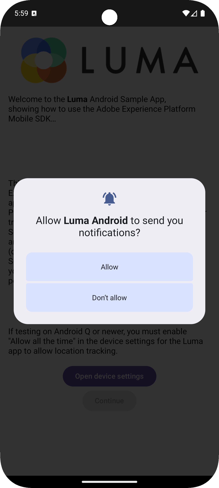

# Konfigurera Assurance

Lär dig konfigurera Adobe Experience Platform Assurance i en mobilapp.

Assurance, som formellt kallas Project Griffon, är utformat för att hjälpa er att inspektera, verifiera, simulera och validera hur ni samlar in data eller levererar upplevelser i er mobilapp.

Med Assurance kan du inspektera SDK råa-händelser som genererats av Adobe Experience Platform Mobile SDK. Alla evenemang som samlas in av SDK kan granskas. SDK-händelser läses in i en listvy, sorterade efter tid. Varje händelse har en detaljerad vy som ger mer information. Det finns även ytterligare vyer för att bläddra bland SDK-konfigurationer, dataelement, delade lägen och SDK-tilläggsversioner. Läs mer om [Assurance](https://experienceleague.adobe.com/en/docs/experience-platform/assurance/home) i produktdokumentationen.


## Förhandskrav

* Appen har konfigurerats med SDK:er installerade och konfigurerade.

## Utbildningsmål

I den här lektionen kommer du att:

* Bekräfta att din organisation har åtkomst (och begär det om du inte har det).
* Ange din bas-URL.
* Lägg till nödvändig iOS-specifik kod.
* Anslut till en session.

## Bekräfta åtkomst

Bekräfta att din organisation har tillgång till Assurance. Som användare bör du läggas till i profilen för Adobe Experience Platform. Mer information finns i [Användaråtkomst](https://experienceleague.adobe.com/en/docs/experience-platform/assurance/user-access) i handboken för Assurance.

## Implementera

Så här implementerar du Assurance i din app:

>[!BEGINTABS]

>[!TAB iOS]

Utöver den allmänna [SDK-installationen](install-sdks.md) behöver iOS även följande extra kod för att starta Assurance-sessionen för din app.

1. Navigera till **[!DNL Luma]** > **[!DNL Luma]** > **[!UICONTROL SceneDelegate]** i Xcode projektnavigerare.

1. Lägg till följande kod i `func scene(_ scene: UIScene, openURLContexts URLContexts: Set<UIOpenURLContext>`:

   ```swift
   // Called when the app in background is opened with a deep link.
   if let deepLinkURL = URLContexts.first?.url {
       // Start the Assurance session
       Assurance.startSession(url: deepLinkURL)
   }
   ```

   Den här koden startar en säkringssession när appen finns i bakgrunden och öppnas med en djuplänk.

>[!TAB Android]

Utöver den allmänna [SDK-installationen](install-sdks.md) behöver Android även följande extra kod för att starta Assurance-sessionen för din app.

1. I Android Studio går du till **[!UICONTROL Android]** > **[!UICONTROL app]** > **[!UICONTROL kotlin+java]** > **[!UICONTROL com.adobe.luma.tutorial.android]** i vyn **[!UICONTROL LumaApplication]**.

1. Lägg till följande kod i `fun handleDeeplink(deeplink: String?)`:

   ```kotlin
   // Called when the app in background is opened with a deep link.
   if (deeplink.isNullOrEmpty()) {
      Log.w("Luma", "Deeplink is null or empty")
      return
   }
   
   Log.i("Luma", "Handling deeplink: $deeplink")
   Assurance.startSession(deeplink)
   ```

   Den här koden startar en säkringssession när appen finns i bakgrunden och öppnas med en djuplänk.

>[!ENDTABS]


Mer information finns i [Assurance API-referens](https://developer.adobe.com/client-sdks/documentation/platform-assurance-sdk/api-reference/){target="_blank"}.


## Definiera en källidentifierare

Du måste ange en unik källidentifierare för ditt program.

>[!BEGINTABS]

>[!TAB iOS]

1. Öppna projektet i Xcode.
1. Välj **[!DNL Luma]** i projektnavigatorn.
1. Välj målet **[!DNL Luma]**.
1. Välj fliken **Signering och funktioner**.
1. Definiera en **[!UICONTROL Bundle Identifier]**.

Se till att du använder en _unik_-paketidentifierare och ersätt `com.adobe.luma.tutorial.swiftui`-paketidentifieraren, eftersom varje paketidentifierare måste vara unik. Vanligtvis använder du ett omvänt DNS-format för paket-ID-strängar, som `com.organization.brand.uniqueidentifier`. I den färdiga versionen av den här självstudien används till exempel `com.adobe.luma.tutorial.swiftui`.

{zoomable="yes"}

>[!TAB Android]

1. Öppna projektet i Android Studio.
1. Välj **[!UICONTROL build.gradle.kts (Module :app)]** i navigatorn.
1. Se till att du använder en _unik_-källidentifierare och ersätt `com.adobe.luma.tutorial.android`-värdet för `namespace` i `android`
1. Se till att du använder samma _unika_-källidentifierare och ersätt `com.adobe.luma.tutorial.android` för `applicationId` i `defaultConfig` i `android`

Vanligtvis använder du ett omvänt DNS-format för paket-ID-strängar, som `com.organization.brand.uniqueidentifier`. I den färdiga versionen av den här självstudien används till exempel `com.adobe.luma.tutorial.android`.

{zoomable="yes"}{zoomable="yes"}

>[!ENDTABS]


## Konfigurera en bas-URL

Du måste konfigurera en bas-URL för att säkerställa att djuplänkningen fungerar.

>[!BEGINTABS]

>[!TAB iOS]

1. Gå till projektet i Xcode.
1. Välj **[!DNL Luma]** i projektnavigatorn.
1. Välj målet **[!DNL Luma]**.
1. Välj fliken **Info**.
1. Om du vill lägga till en bas-URL rullar du ned till **URL-typer** och väljer knappen **+** .
1. Ange **Identifieraren** till valfri källidentifierare och ange ett **URL-schema** som du väljer.

   {zoomable="yes"}

Se till att du använder en _unik_-paketidentifierare och ersätt `com.adobe.luma.tutorial.swiftui`-paketidentifieraren, eftersom varje paketidentifierare måste vara unik. Vanligtvis använder du ett omvänt DNS-format för paket-ID-strängar, som `com.organization.brand.uniqueidentifier`. Du kan använda samma källidentifierare som du har använt på [Definiera källidentifierare](#define-bundle-identifier).<br/>Använd på liknande sätt ett unikt URL-schema och ersätt den redan tillhandahållna `lumatutorialswiftui` med ditt unika URL-schema.

Mer information om URL-scheman i iOS finns i [Apple dokumentation](https://developer.apple.com/documentation/xcode/defining-a-custom-url-scheme-for-your-app){target="_blank"}.

Assurance fungerar genom att öppna en URL-adress, antingen via en webbläsare eller QR-kod. Den URL:en börjar med den bas-URL som öppnar appen och innehåller ytterligare parametrar. Dessa unika parametrar används för att ansluta sessionen. I exempelappen är den djupa länken `lumatutorialswiftui://`.

>[!TAB Android]

1. Gå till **[!UICONTROL Android]**-vyn för ditt projekt i Android Studio.
1. Välj **[!UICONTROL app]** > **[!UICONTROL manifests]** > **[!UICONTROL AndroidManifest.xml]** i navigatorn.
1. Kontrollera att XML-elementet **[!UICONTROL manifest]** > **[!UICONTROL application]** > **[!UICONTROL activity]** ser ut så här:

   ```xml
   <activity
      android:name=".MainActivity"
      android:exported="true"
      android:theme="@style/Theme.LumaAndroid">
      <intent-filter>
            <action android:name="android.intent.action.MAIN" />
            <category android:name="android.intent.category.LAUNCHER" />
      </intent-filter>
      <intent-filter
            android:label="@string/app_name">
            <action android:name="android.intent.action.VIEW" />
            <category android:name="android.intent.category.DEFAULT" />
            <category android:name="android.intent.category.BROWSABLE" />
            <data android:scheme="lumatutorialandroid"
               android:host="default" />
      </intent-filter>
   </activity>
   ```

Se till att du anger `android:scheme` (till exempel. `lumatutorialandroid`) och `android:host` (till exempel `default`) för att definiera bas-URL:en.

Mer information om djupa länkar i Android finns i [Skapa djupa länkar till appinnehåll](https://developer.apple.com/documentation/xcode/defining-a-custom-url-scheme-for-your-app){target="_blank"}.

Assurance fungerar genom att öppna en URL-adress, antingen via en webbläsare eller QR-kod. Den URL:en börjar med bas-URL:en, som öppnar programmet och innehåller ytterligare parametrar. Dessa unika parametrar används för att ansluta sessionen.  I exempelappen är den djupa länken `lumatutorialandroid://default`.

>[!ENDTABS]


## Ansluta till en session

Nu kan du använda Assurance för att ansluta till en session.

>[!BEGINTABS]

>[!TAB iOS]

I Xcode:

1. Bygg eller återskapa och kör appen i simulatorn eller på en fysisk enhet från Xcode med .

   Om du vill kan du *rensa* ditt bygge, särskilt när oväntade resultat visas. Välj **[!UICONTROL Clean Build Folder…]** på Xcode **[!UICONTROL Product]**-menyn.


1. Välj **[!UICONTROL Allow "Luma App" to use your location]** i dialogrutan **[!UICONTROL Allow While Using App]**.

   

1. Välj **[!UICONTROL "Luma App" Would Like to Send You Notifications]** i dialogrutan **[!UICONTROL Allow]**.

   

1. Välj **[!UICONTROL Continue…]** om du vill att appen ska kunna spåra din aktivitet.

   

1. Välj **[!UICONTROL Allow "Luma App" to track your activity across other companies' apps and websites]** i dialogrutan **[!UICONTROL Allow]**.

   

1. Välj **[!UICONTROL Continue]**.


I webbläsaren:

1. Gå till användargränssnittet för datainsamling.
1. Välj **[!UICONTROL Assurance]** i den vänstra listen.
1. Välj **[!UICONTROL Create New Session]** och alternativet **[!UICONTROL Deep link connect]**.
1. Välj **[!UICONTROL Start]**.
1. Ange en **[!UICONTROL Session Name]** som `Luma Mobile App Session` och **[!UICONTROL Base URL]**, som är de URL-scheman som du angav i Xcode, följt av `://` Till exempel: `lumatutorialswiftui://`
1. Välj **[!UICONTROL Next]**.
   {zoomable="yes"}
1. I dialogrutan **[!UICONTROL Create New Session]** modal:

   Om du använder en fysisk enhet:

   * Välj **[!UICONTROL Scan QR Code]**.  Om du vill öppna appen använder du kameran på den fysiska enheten för att skanna QR-koden och trycka på länken.

     {zoomable="yes"}

   Om du använder en simulator:

   1. Välj **[!UICONTROL Copy Link]**.
   1. Kopiera den djupa länken med  och använd den djupa länken för att öppna appen med Safari i simulatorn.
      {zoomable="yes"}

1. När appen läses in visas en modal dialogruta där du ombeds ange den PIN-kod som visas i steg 7.

   

   Ange PIN-koden och välj **[!UICONTROL Connect]**.


1. Om anslutningen lyckades ser du:
   * En Assurance-ikon visas ovanpå din app.

     

   * Experience Cloud-uppdateringar som kommer igenom i Assurance användargränssnitt, som visar:

      1. Experience Events kommer från appen.
      1. Information om en markerad händelse.
      1. Enheten och tidslinjen.

         {zoomable="yes"}

1. Välj **[!UICONTROL Continue]** om du vill gå till hemskärmen.

>[!TAB Android]

I Android Studio:

1. Bygg eller återskapa och kör appen i simulatorn eller på en fysisk enhet från Android Studio med .

   Om du vill kan du *rensa* ditt bygge, särskilt när oväntade resultat visas. Välj **[!UICONTROL Clean Project]** på menyn Android Studio **[!UICONTROL Build]**.


1. Välj **[!UICONTROL Allow Luma Android to send you notifications]** i dialogrutan **[!UICONTROL Allow]**.

   

1. Välj **[!UICONTROL Show permission dialog]**.

   

1. I **[!UICONTROL Allow Luma Android to access this device's location?]**..

   

   * Välj **[!UICONTROL Precise]**.
   * Välj **[!UICONTROL While using the app]**.

1. Välj **[!UICONTROL Open device settings]** på introduktionsappens skärm.

1. Välj **[!UICONTROL Location permission]** på skärmen **[!UICONTROL Allow all the time]**. Välj sedan **[!UICONTROL ←]** för att återgå till introduktionsappskärmen.

   

1. Välj **[!UICONTROL Continue]** om du vill gå till hemskärmen.


I webbläsaren:

1. Gå till användargränssnittet för datainsamling.
1. Välj **[!UICONTROL Assurance]** i den vänstra listen.
1. Välj **[!UICONTROL Create New Session]** och alternativet **[!UICONTROL Deep link connect]**.
1. Välj **[!UICONTROL Start]**.
1. Ange en **[!UICONTROL Session Name]**, till exempel `Luma Mobile App Session` och **[!UICONTROL Base URL]**, som är `android:scheme` och `android:host` som du definierade i **[!UICONTROL AndroidManifest.xml]** i Android Studio, avgränsade med `://` till exempel: `lumatutorialandroid://default`
1. Välj **[!UICONTROL Next]**.
   {zoomable="yes"}

1. I dialogrutan **[!UICONTROL Create New Session]** modal:

   Om du använder en fysisk enhet:

   * Välj **[!UICONTROL Scan QR Code]**.  Om du vill öppna appen använder du kameran på den fysiska enheten för att skanna QR-koden och trycka på länken.

     {zoomable="yes"}

   Om du använder en simulator:

   1. Välj **[!UICONTROL Copy Link]**.
   1. Kopiera den djupa länken med  och använd den djupa länken för att öppna appen med Chrome i simulatorn.

   {zoomable="yes"}

   Välj **Fortsätt** när du uppmanas i Chrome att **fortsätta till Luma Android**.

1. När appen läses in visas en modal dialogruta där du ombeds ange den PIN-kod som visas i steg 7.

   

   Ange PIN-koden och välj **[!UICONTROL Connect]**.


1. Om anslutningen lyckades ser du:
   * En Assurance-ikon visas ovanpå din app.

     

   * Experience Cloud-uppdateringar som kommer igenom i Assurance användargränssnitt, som visar:

      1. Experience Events kommer från appen.
      1. Information om en markerad händelse.
      1. Enheten och tidslinjen.

         {zoomable="yes"}

>[!ENDTABS]

Om du stöter på några problem kan du läsa den [tekniska](https://developer.adobe.com/client-sdks/documentation/platform-assurance-sdk/){target="_blank"} och [allmänna dokumentationen](https://experienceleague.adobe.com/en/docs/experience-platform/assurance/home){target="_blank"}.


## Verifiera tillägg

Så här kontrollerar du om ditt program använder de senaste tilläggen:

1. Välj **[!UICONTROL Configure]**.

1. Välj  för  **[!UICONTROL Extension Versions]**.

1. Välj **[!UICONTROL Save]**.

   {zoomable="yes"}

1. Välj  **[!UICONTROL Extension Versions]** om du vill se en översikt över de senaste tillägg som är tillgängliga och de tillägg som används i din version av programmet.

>[!BEGINTABS]

>[!TAB iOS]

{zoomable="yes"}

Om du vill uppdatera tilläggsversionerna (till exempel **[!UICONTROL Messaging]** och **[!UICONTROL Optimize]**) väljer du paketet (tillägget) från **[!UICONTROL Package Dependencies]** (till exempel **[!UICONTROL AEPMessaging]**) och väljer **[!UICONTROL Update Package]** på snabbmenyn. Xcode uppdaterar paketberoendena.

>[!TAB Android]

{zoomable="yes"}

Om du ser föråldrade tillägg läser du [Android Studio-dokumentationen](https://developer.android.com/build/agp-upgrade-assistant) om hur du uppdaterar dina beroendemoduler för ditt projekt.


>[!ENDTABS]

>[!NOTE]
>
>När du har uppdaterat dina tillägg (paket) i utvecklingsmiljön stänger och tar du bort den aktuella sessionen och upprepar alla steg från [Ansluta till en session](#connecting-to-a-session) och [Verifiera tillägg](#verify-extensions) för att se till att Assurance rapporterar korrekt tillägg i en ny Assurance-session.
>


>[!SUCCESS]
>
>Du har nu konfigurerat appen så att den använder Assurance för resten av självstudiekursen.
>
>Tack för att du har lagt ned din tid på att lära dig om Adobe Experience Platform Mobile SDK. Om du har frågor, vill dela allmän feedback eller har förslag på framtida innehåll kan du dela dem i det här [Experience League Community-diskussionsinlägget](https://experienceleaguecommunities.adobe.com/t5/adobe-experience-platform-data/tutorial-discussion-implement-adobe-experience-cloud-in-mobile/td-p/443796)


Nästa: **[Implementera samtycke](consent.md)**
