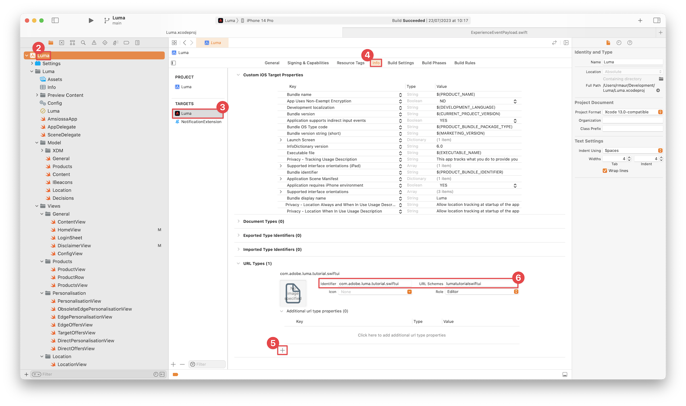

# Ställ in försäkring

Lär dig hur du konfigurerar Adobe Experience Platform Assurance i en mobilapp.

Assurance, som formellt kallas Project Griffon, är utformat för att hjälpa er att inspektera, verifiera, simulera och validera hur ni samlar in data eller levererar upplevelser i er mobilapp.

Med Assurance kan du inspektera SDK-råhändelser som genererats av Adobe Experience Platform Mobile SDK. Alla händelser som samlas in av SDK är tillgängliga för inspektion. SDK-händelser läses in i en listvy, sorterade efter tid. Varje händelse har en detaljerad vy som ger mer information. Det finns även ytterligare vyer för att bläddra bland SDK-konfigurationer, dataelement, delade lägen och SDK-tilläggsversioner. Läs mer om [försäkringen](https://experienceleague.adobe.com/docs/experience-platform/assurance/home.html) i produktdokumentationen.


## Förhandskrav

* Appen har konfigurerats med SDK:er installerade och konfigurerade.

## Utbildningsmål

I den här lektionen kommer du att:

* Bekräfta att din organisation har åtkomst (och begär det om du inte har det).
* Ange din bas-URL.
* Lägg till nödvändig iOS-specifik kod.
* Anslut till en session.

## Bekräfta åtkomst

Bekräfta att din organisation har åtkomst till Assurance. Som användare bör du läggas till i profilen för Adobe Experience Platform. Mer information finns i [Användaråtkomst](https://experienceleague.adobe.com/docs/experience-platform/assurance/user-access.html?lang=en) i kontrollguiden.

## Implementera

Utöver den allmänna [SDK-installationen](install-sdks.md) som du slutförde i den tidigare lektionen behöver iOS även följande tillägg för att starta Assurance-sessionen för din app.

1. Navigera till **[!DNL Luma]** > **[!DNL Luma]** > **[!UICONTROL SceneDelegate]** i Xcode projektnavigerare.

1. Lägg till följande kod i `func scene(_ scene: UIScene, openURLContexts URLContexts: Set<UIOpenURLContext>`:

   ```swift
   // Called when the app in background is opened with a deep link.
   if let deepLinkURL = URLContexts.first?.url {
       // Start the Assurance session
       Assurance.startSession(url: deepLinkURL)
   }
   ```

   Den här koden startar en säkringssession när appen finns i bakgrunden och öppnas med en djuplänk.

Mer information finns [här](https://developer.adobe.com/client-sdks/documentation/platform-assurance-sdk/api-reference/){target="_blank"}.


## Definiera källidentifierare

Du måste ange en unik källidentifierare för ditt program.

1. Öppna projektet i Xcode.
1. Välj **[!DNL Luma]** i projektnavigatorn.
1. Välj målet **[!DNL Luma]**.
1. Välj fliken **Signering och funktioner**.
1. Definiera en **[!UICONTROL Bundle Identifier]**.

   >[!IMPORTANT]
   >
   >Se till att du använder en _unik_-paketidentifierare och ersätt `com.adobe.luma.tutorial.swiftui`-paketidentifieraren, eftersom varje paketidentifierare måste vara unik. Vanligtvis använder du ett omvänt DNS-format för paket-ID-strängar, som `com.organization.brand.uniqueidentifier`. I den färdiga versionen av den här självstudien används till exempel `com.adobe.luma.tutorial.swiftui`.


   {zoomable="yes"}


## Konfigurera en bas-URL

1. Gå till projektet i Xcode.
1. Välj **[!DNL Luma]** i projektnavigatorn.
1. Välj målet **[!DNL Luma]**.
1. Välj fliken **Info**.
1. Om du vill lägga till en bas-URL rullar du ned till **URL-typer** och väljer knappen **+** .
1. Ange **Identifierare** till den paketidentifierare du vill använda och ange ett **URL-schema** som du väljer.

   

   >[!IMPORTANT]
   >
   >Se till att du använder en _unik_-paketidentifierare och ersätt `com.adobe.luma.tutorial.swiftui`-paketidentifieraren, eftersom varje paketidentifierare måste vara unik. Vanligtvis använder du ett omvänt DNS-format för paket-ID-strängar, som `com.organization.brand.uniqueidentifier`. Du kan använda samma källidentifierare som du har använt på [Definiera källidentifierare](#define-bundle-identifier).<br/>Använd på liknande sätt ett unikt URL-schema och ersätt den redan tillhandahållna `lumatutorialswiftui` med ditt unika URL-schema.

Mer information om URL-scheman i iOS finns i [Apple dokumentation](https://developer.apple.com/documentation/xcode/defining-a-custom-url-scheme-for-your-app){target="_blank"}.

Assurance fungerar genom att öppna en URL, antingen via webbläsaren eller QR-koden. Den URL:en börjar med den bas-URL som öppnar appen och innehåller ytterligare parametrar. Dessa unika parametrar används för att ansluta sessionen.


## Ansluta till en session

I Xcode:

1. Bygg eller återskapa och kör appen i simulatorn eller på en fysisk enhet från Xcode med .

   >[!TIP]
   >
   >Om du vill kan du rensa ditt bygge, särskilt när du ser oväntade resultat. Om du vill göra det väljer du **[!UICONTROL Clean Build Folder…]** på Xcode **[!UICONTROL Product]**-menyn.


1. Välj **[!UICONTROL Allow While Using App]** i dialogrutan **[!UICONTROL Allow "Luma App" to use your location]**.

   

1. Välj **[!UICONTROL Allow]** i dialogrutan **[!UICONTROL "Luma App" Would Like to Send You Notifications]**.

   

1. Välj **[!UICONTROL Continue…]** om du vill att appen ska kunna spåra din aktivitet.

   

1. Välj **[!UICONTROL Allow]** i dialogrutan **[!UICONTROL Allow "Luma App" to track your activity across other companies' apps and websites]**.

   


I webbläsaren:

1. Gå till användargränssnittet för datainsamling.
1. Välj **[!UICONTROL Assurance]** i den vänstra listen.
1. Välj **[!UICONTROL Create Session]**.
1. Välj **[!UICONTROL Start]**.
1. Ange en **[!UICONTROL Session Name]** som `Luma Mobile App Session` och **[!UICONTROL Base URL]**, som är de URL-scheman som du angav i Xcode, följt av `://` Till exempel: `lumatutorialswiftui://`
1. Välj **[!UICONTROL Next]**.
   
1. I dialogrutan **[!UICONTROL Create New Session]** modal:

   Om du använder en fysisk enhet:

   * Välj **[!UICONTROL Scan QR Code]**.  Om du vill öppna appen använder du kameran på den fysiska enheten för att skanna QR-koden och trycka på länken.

     

   Om du använder en simulator:

   1. Välj **[!UICONTROL Copy Link]**.
   1. Kopiera den djupa länken med  och använd den djupa länken för att öppna appen med Safari i simulatorn.

      

1. När appen läses in visas en modal dialogruta där du ombeds ange den PIN-kod som visas i steg 7.

   

   Ange PIN-koden och välj **[!UICONTROL Connect]**.


1. Om anslutningen lyckades ser du:
   * En säkerhetsikon visas ovanpå din app.

     

   * Uppdateringar från Experience Cloud i försäkringsgränssnittet som visar:

      1. Experience Events kommer från appen.
      1. Information om en markerad händelse.
      1. Enheten och tidslinjen.

         

Om du stöter på några problem kan du läsa [teknisk](https://developer.adobe.com/client-sdks/documentation/platform-assurance-sdk/){target="_blank"} och [allmän dokumentation](https://experienceleague.adobe.com/docs/experience-platform/assurance/home.html){target="_blank"}.


## Verifiera tillägg

Så här kontrollerar du om ditt program använder de senaste tilläggen:

1. Välj **[!UICONTROL Configure]**.

1. Välj  för  **[!UICONTROL Extension Versions]**.

1. Välj **[!UICONTROL Save]**.

   

1. Välj  **[!UICONTROL Extension Versions]** om du vill se en översikt över de senaste tillägg som är tillgängliga och de tillägg som används i din version av programmet.

   

1. Om du vill uppdatera tilläggsversionerna (till exempel **[!UICONTROL Messaging]** och **[!UICONTROL Optimize]**) väljer du paketet (tillägget) från **[!UICONTROL Package Dependencies]** (till exempel **[!UICONTROL AEPMessaging]**) och väljer **[!UICONTROL Update Package]** på snabbmenyn. Xcode uppdaterar paketberoendena.


>[!NOTE]
>
>När du har uppdaterat dina tillägg (paket) i Xcode stänger du och tar bort den aktuella sessionen och upprepar alla steg från [Ansluta till en session](#connecting-to-a-session) och [Verifiera tillägg](#verify-extensions) för att säkerställa att Assurance rapporterar rätt tillägg i en ny Assurance-session.


>[!SUCCESS]
>
>Du har nu konfigurerat din app att använda Assurance för resten av självstudiekursen.
>
>Tack för att du lade ned din tid på att lära dig om Adobe Experience Platform Mobile SDK. Om du har frågor, vill dela allmän feedback eller har förslag på framtida innehåll kan du dela dem i det här [Experience League-diskussionsinlägget](https://experienceleaguecommunities.adobe.com/t5/adobe-experience-platform-data/tutorial-discussion-implement-adobe-experience-cloud-in-mobile/td-p/443796)


Nästa: **[Implementera samtycke](consent.md)**
