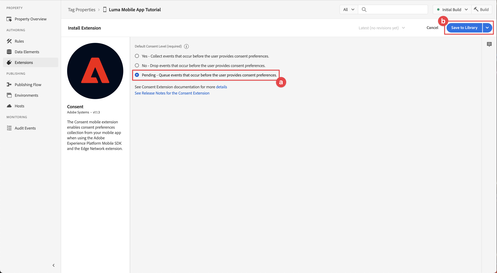

# Konfigurera en taggegenskap

Lär dig konfigurera en taggegenskap i [!UICONTROL Datainsamling] gränssnitt.

Taggar i Adobe Experience Platform är nästa generation av tagghanteringsfunktioner från Adobe. Taggar ger kunderna ett enkelt sätt att driftsätta och hantera de analyser, marknadsförings- och annonstaggar som behövs för att skapa relevanta kundupplevelser. Läs mer om [Taggar](https://experienceleague.adobe.com/docs/experience-platform/tags/home.html?lang=sv) i produktdokumentationen.

## Förutsättningar

Du måste ha behörighet att skapa en taggegenskap för att kunna slutföra lektionen. Det är också praktiskt att ha en grundläggande förståelse för taggar.

>[!NOTE]
>
> Platforma launchen (klientsidan) är nu [Taggar](https://experienceleague.adobe.com/docs/experience-platform/tags/home.html?lang=en)

## Utbildningsmål

I den här lektionen kommer du att:

* Installera och konfigurera mobiltaggtilläggen.
* Generera installationsanvisningar för SDK.

## Inledande konfiguration

1. Skapa en ny mobil taggegenskap i datainsamlingsgränssnittet:
   1. Välj **[!UICONTROL Taggar]** i den vänstra navigeringen.
   1. Välj **[!UICONTROL Ny egenskap]**
      .
   1. För **[!UICONTROL Namn]**, ange `Luma Mobile App Tutorial`.
   1. För **[!UICONTROL Plattform]**, markera **[!UICONTROL Mobil]**.
   1. Välj  **[!UICONTROL Spara]**.

      

      >[!NOTE]
      >
      > Standardinställningar för samtycke för de kantbaserade SDK-implementeringarna för mobiler, som den du gör i den här lektionen, kommer från [!UICONTROL Godkänn tillägg] och inte [!UICONTROL Integritet] inställning i taggegenskapskonfigurationen. Du lägger till och konfigurerar tillägget för samtycke senare i den här lektionen. Mer information finns på [dokumentationen](https://developer.adobe.com/client-sdks/edge/consent-for-edge-network/).

1. Öppna den nya egenskapen.
1. Skapa ett bibliotek:

   1. Gå till **[!UICONTROL Publiceringsflöde]** i den vänstra navigeringen.
   1. Välj **[!UICONTROL Lägg till bibliotek]**.

      

   1. För **[!UICONTROL Namn]**, ange `Initial Build`.
   1. För **[!UICONTROL Miljö]**, markera **[!UICONTROL Utveckling]**.
   1. Välj   **[!UICONTROL Lägg till alla ändrade resurser]**.
   1. Välj **[!UICONTROL Spara och bygg till utveckling]**.

      

   1. Äntligen väljer du **[!UICONTROL Inledande bygge]** som ditt arbetsbibliotek från **[!UICONTROL Välj ett arbetsbibliotek]** -menyn.
      
1. Kontrollera tillägg:

   1. Se till att **[!UICONTROL Inledande bygge]** är markerat som standardbibliotek.

   1. Välj **[!UICONTROL Tillägg]** till vänster.

   1. Välj **[!UICONTROL Installerad]** -fliken.

      The [!UICONTROL Mobile Core] och [!UICONTROL Profil] tillägg bör vara förinstallerade.

      

## Tilläggskonfiguration

1. Se till att du är **[!UICONTROL Tillägg]** i din mobilappsegenskap.

1. Välj **[!UICONTROL Katalog]**.

   

1. Använd  **[!UICONTROL Sök]** fält för att hitta **Identitet** tillägg.

   1. Sök efter `Identity`.

   2. Välj **[!UICONTROL Identitet]** tillägg.

   3. Välj **[!UICONTROL Installera]**.

      

   Det här tillägget kräver ingen ytterligare konfiguration.

1. Använd  **[!UICONTROL Sök]** fält för att hitta och installera **AEP Assurance** tillägg.

   Det här tillägget kräver ingen ytterligare konfiguration.

1. Använd  **[!UICONTROL Sök]** fält för att hitta och installera **Godkännande** tillägg. På konfigurationsskärmen:

   1. Välj **[!UICONTROL Väntande]**. I den här självstudiekursen hanterar du samtycke ytterligare i programmet. Läs mer om tillägget för samtycke i [dokumentationen](https://developer.adobe.com/client-sdks/documentation/consent-for-edge-network/).
   1. Välj **[!UICONTROL Spara i bibliotek]**.

      

1. Använd  **[!UICONTROL Sök]** fält för att hitta och installera **Adobe Experience Platform Edge Network** tillägg.

   1. I **[!UICONTROL Datastreams]** välj **[!UICONTROL Datastream]** som du skapade i [föregående steg](create-datastream.md) för varje miljö, till exempel **[!DNL Luma Mobile App]**.

   1. Om den inte redan är ifylld anger du **[!UICONTROL Edge Network-domän]** inom **[!UICONTROL Domänkonfiguration]**. Edge Network-domänen är namnet på din organisation, följt av `data.adobedc.net`, till exempel `techmarketingdemos.data.adobedc.net`.

   1. Från **[!UICONTROL Spara i bibliotek]** meny, välja **[!UICONTROL Spara i bibliotek och bygge]**.

      

Ditt bibliotek är byggt för de nya tilläggen och konfigurationerna. Ett lyckat bygge indikeras av en ● i **[!UICONTROL Inledande bygge]** -knappen.

## Generera installationsanvisningar för SDK

1. Välj **[!UICONTROL Miljö]** från den vänstra listen.

1. Välj **[!UICONTROL Utveckling]** installationsikon  .

   

1. I **[!UICONTROL Instruktioner för mobilinstallation]** väljer du **[!UICONTROL iOS]** -fliken.

1. Du kan kopiera  instruktionerna för att konfigurera projektet med CocoaPods. CocoaPods används för att hantera SDK-versioner och -nedladdningar. Läs mer i [CocoaPods-dokumentation](https://cocoapods.org/). Om du använder Android™ som utvecklingsplattform är Gradle verktyget för att hantera SDK-version, hämtningsbara filer och beroenden. Läs mer i [Dokumentation för grafik](https://gradle.org/)

   Installationsanvisningarna ger dig en bra startpunkt för implementeringen. Ytterligare information finns [här](https://developer.adobe.com/client-sdks/documentation/getting-started/get-the-sdk/).

   >[!INFO]
   >
   >För resten av kursen ska du **not** Använd instruktionerna för CocoaPods, men använd i stället en SPM-baserad konfiguration (Swift Package Manager).
   >

1. Välj **[!UICONTROL Swift]** flik nedan **[!UICONTROL Lägg till initieringskod]**. Det här kodblocket visar hur du importerar de SDK:er som krävs och registrerar tilläggen vid start. Detta beskrivs mer ingående i [Installera SDK:er](install-sdks.md).

1. Kopiera  den **[!UICONTROL Miljöfil-ID]** och lagra dem där du behöver dem senare. Detta unika ID pekar på din utvecklingsmiljö. Varje miljö (produktion, mellanlagring, utveckling) har ett eget unikt ID-värde.

   

>[!NOTE]
>
>Installationsanvisningarna ska betraktas som en startpunkt och inte som slutgiltig dokumentation. De senaste SDK-versionerna och kodexemplen finns i den officiella [dokumentation](https://developer.adobe.com/client-sdks/home/).

## Arkitektur för mobila taggar

Om du är bekant med webbversionen av taggar, tidigare Launch, är det viktigt att förstå skillnaderna på mobilen.

* På webben återges en taggegenskap i JavaScript som sedan (vanligtvis) finns i molnet. JavaScript-filen refereras direkt på webbplatsen.

* I en mobil taggegenskap återges regler och konfigurationer i JSON-filer som lagras i molnet. JSON-filerna hämtas och läses av tillägget Mobile Core i mobilappen. Tillägg är separata SDK:er som fungerar tillsammans. Om du lägger till ett tillägg i taggegenskapen måste du även uppdatera appen. Om du ändrar en tilläggsinställning eller skapar en regel återspeglas dessa ändringar i appen när du har publicerat det uppdaterade taggbiblioteket. Tack vare den flexibiliteten kan du ändra inställningar (som Adobe Analytics Report Suite-id) eller till och med ändra appens beteende (med dataelement och regler, som du kommer att se i senare lektioner) utan att behöva ändra koden i appen och skicka appbutiken igen.

>[!SUCCESS]
>
>Du har nu en mobil taggegenskap att använda i resten av den här självstudien.
>
>Tack för att du lade ned din tid på att lära dig om Adobe Experience Platform Mobile SDK. Om du har frågor, vill dela allmän feedback eller har förslag på framtida innehåll kan du dela dem om detta [Experience League diskussionsinlägg](https://experienceleaguecommunities.adobe.com/t5/adobe-experience-platform-data/tutorial-discussion-implement-adobe-experience-cloud-in-mobile/td-p/443796)

Nästa: **[Installera SDK:er](install-sdks.md)**
