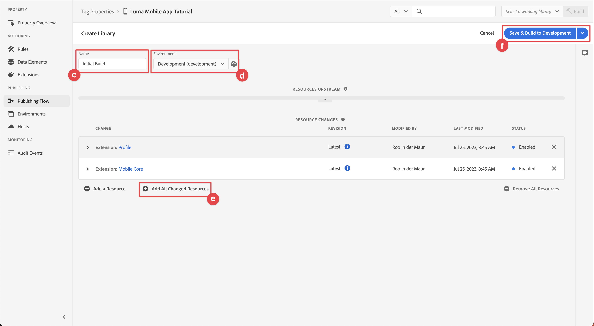

# Konfigurera en taggegenskap

Lär dig hur du konfigurerar en taggegenskap i [!UICONTROL Data Collection]-gränssnittet.

Taggar i Adobe Experience Platform är nästa generation av tagghanteringsfunktioner från Adobe. Taggar ger kunderna ett enkelt sätt att driftsätta och hantera de analyser, marknadsförings- och annonstaggar som behövs för att skapa relevanta kundupplevelser. Läs mer om [Taggar](https://experienceleague.adobe.com/sv/docs/experience-platform/tags/home) i produktdokumentationen.

## Förhandskrav

Du måste ha behörighet att skapa en taggegenskap för att kunna slutföra lektionen. Det är också praktiskt att ha en grundläggande förståelse för taggar.

>[!NOTE]
>
> Platform Launch (klientsidan) är nu [Taggar](https://experienceleague.adobe.com/sv/docs/experience-platform/tags/home)

## Utbildningsmål

I den här lektionen kommer du att:

* Installera och konfigurera mobiltaggtilläggen.
* Skapa installationsanvisningar för SDK.

## Inledande konfiguration

1. Skapa en ny mobil taggegenskap i datainsamlingsgränssnittet:
   1. Välj **[!UICONTROL Tags]** i den vänstra navigeringen.
   1. Välj **[!UICONTROL New Property]**
      {zoomable="yes"}.
   1. Ange **[!UICONTROL Name]** för `Luma Mobile App Tutorial`.
   1. För **[!UICONTROL Platform]** väljer du **[!UICONTROL Mobile]**.
   1. Välj **[!UICONTROL Save]**.

      {zoomable="yes"}

      >[!NOTE]
      >
      > Standardinställningar för samtycke för de kantbaserade implementeringarna av Mobile SDK, som den du gör i den här lektionen, kommer från [!UICONTROL Consent extension] och inte från inställningen [!UICONTROL Privacy] i taggegenskapskonfigurationen. Du lägger till och konfigurerar tillägget för samtycke senare i den här lektionen. Mer information finns i [dokumentationen](https://developer.adobe.com/client-sdks/edge/consent-for-edge-network/).

1. Öppna den nya egenskapen.
1. Skapa ett bibliotek:

   1. Gå till **[!UICONTROL Publishing Flow]** i den vänstra navigeringen.
   1. Välj **[!UICONTROL Add Library]**.

      {zoomable="yes"}

   1. Ange **[!UICONTROL Name]** för `Initial Build`.
   1. För **[!UICONTROL Environment]** väljer du **[!UICONTROL Development (development)]**.
   1. Välj  **[!UICONTROL Add All Changed Resources]**.
   1. Välj **[!UICONTROL Save and Build to Development]**.

      {zoomable="yes"}

   1. Välj slutligen **[!UICONTROL Initial Build]** som ditt arbetsbibliotek på menyn **[!UICONTROL Select a working library]**.
      {zoomable="yes"}
1. Kontrollera tillägg:

   1. Kontrollera att **[!UICONTROL Initial Build]** är valt som standardbibliotek.

   1. Välj **[!UICONTROL Extensions]** i den vänstra listen.

   1. Klicka på fliken **[!UICONTROL Installed]**.  

      Tilläggen [!UICONTROL Mobile Core] och [!UICONTROL Profile] bör vara förinstallerade.

      {zoomable="yes"}

## Tilläggskonfiguration

1. Kontrollera att du är i **[!UICONTROL Extensions]** i din mobilappsegenskap.

1. Välj **[!UICONTROL Catalog]**.

   {zoomable="yes"}

1. Använd fältet  **[!UICONTROL Search]** för att hitta tillägget **Identitet**.

   1. Sök efter `Identity`.

   2. Välj tillägget **[!UICONTROL Identity]**.

   3. Välj **[!UICONTROL Install]**.

      {zoomable="yes"}

   Det här tillägget kräver ingen ytterligare konfiguration.

1. Använd fältet  **[!UICONTROL Search]** för att hitta och installera tillägget **AEP Assurance**.

   Det här tillägget kräver ingen ytterligare konfiguration.

1. Använd fältet  **[!UICONTROL Search]** för att hitta och installera tillägget **Samtycke**. På konfigurationsskärmen:

   1. Välj **[!UICONTROL Pending]**.  I den här självstudiekursen hanterar du samtycke ytterligare i programmet. Läs mer om tillägget för samtycke i [dokumentationen](https://developer.adobe.com/client-sdks/documentation/consent-for-edge-network/).
   1. Välj **[!UICONTROL Save to Library]**.

      {zoomable="yes"}

1. Använd fältet  **[!UICONTROL Search]** för att hitta och installera tillägget **Adobe Experience Platform Edge Network**.

   1. I **[!UICONTROL Datastreams]** väljer du **[!UICONTROL Datastream]** som du skapade i [föregående steg](create-datastream.md) för varje miljö, till exempel **[!DNL Luma Mobile App]**.

   1. Om den inte redan är ifylld anger du **[!UICONTROL Edge Network domain]** i **[!UICONTROL Domain Configuration]**. Edge Network-domänen är namnet på din organisation följt av `data.adobedc.net`, till exempel `techmarketingdemos.data.adobedc.net`.

   1. Välj **[!UICONTROL Save to Library]** på menyn **[!UICONTROL Save to Library and Build]**.

      {zoomable="yes"}

Ditt bibliotek är byggt för de nya tilläggen och konfigurationerna. En ● i knappen **[!UICONTROL Initial Build]** indikerade att bygget lyckades.

## Generera installationsanvisningar för SDK

Taggar innehåller instruktioner och kodfragment för att installera Adobe Experience Platform Mobile SDK i din app.

>[!BEGINTABS]

>[!TAB iOS]

1. Välj **[!UICONTROL Environments]** i den vänstra listen.

1. Välj installationsikonen **[!UICONTROL Development]**  .

   {zoomable="yes"}

1. Välj fliken **[!UICONTROL Mobile Install Instructions]** i dialogrutan **[!UICONTROL iOS]**.

1. Du kan kopiera  instruktionerna för att konfigurera ditt projekt med CocoaPods. CocoaPods används för att hantera SDK-versioner och nedladdningar. Mer information finns i dokumentationen för [CocoaPods](https://cocoapods.org/).

   [Installationsanvisningarna](https://developer.adobe.com/client-sdks/documentation/getting-started/get-the-sdk/) är en bra startpunkt för implementeringen.

   För resten av den här självstudiekursen använder du **inte** instruktionerna för CocoaPods. Använd i stället den SPM-baserade (Swift Package Manager)-installationen.

1. Välj fliken **[!UICONTROL Swift]** under **[!UICONTROL Add Initialization Code]**. Det här kodblocket visar hur du importerar de SDK:er som krävs och registrerar tilläggen vid start. Den här importen och registreringen beskrivs mer ingående i [Installera SDK](install-sdks.md).

1. Kopiera  **[!UICONTROL Environment File ID]** och lagra den på en plats som du behöver senare. Detta unika ID pekar på din utvecklingsmiljö. Varje miljö (produktion, mellanlagring, utveckling) har ett eget unikt ID-värde.

   {zoomable="yes"}

>[!TAB Android]

1. Välj **[!UICONTROL Environments]** i den vänstra listen.
1. Välj installationsikonen **[!UICONTROL Development]**  .

   {zoomable="yes"}

1. Välj fliken **[!UICONTROL Mobile Install Instructions]** i dialogrutan **[!UICONTROL Android]**.
1. Du kan kopiera  instruktionerna för att konfigurera projektet med Gradle. Gradle används för att hantera SDK versioner och nedladdningar. Mer information finns i dokumentationen för [Gradle](https://gradle.org/)

   [Installationsanvisningarna](https://developer.adobe.com/client-sdks/documentation/getting-started/get-the-sdk/) är en bra startpunkt för implementeringen.

1. Det här kodblocket visar hur du importerar de SDK:er som krävs och registrerar tilläggen vid start. Den här importen och registreringen beskrivs mer ingående i [Installera SDK](install-sdks.md).

1. Kopiera  **[!UICONTROL Environment File ID]** och lagra den på en plats som du behöver senare. Detta unika ID pekar på din utvecklingsmiljö. Varje miljö (produktion, mellanlagring, utveckling) har ett eget unikt ID-värde.

   {zoomable="yes"}

>[!ENDTABS]

>[!NOTE]
>
>Installationsanvisningarna ska betraktas som en startpunkt och inte som slutgiltig dokumentation. De senaste SDK-versionerna och kodexemplen finns i den officiella [dokumentationen](https://developer.adobe.com/client-sdks/home/).

## Arkitektur för mobila taggar

Om du är bekant med webbversionen av taggar, tidigare Launch, är det viktigt att förstå skillnaderna på mobilen.

* På webben återges en taggegenskap i JavaScript som sedan (vanligtvis) lagras i molnet. Det finns en referens till den JavaScript-filen direkt på webbplatsen.

* I en mobil taggegenskap återges regler och konfigurationer i JSON-filer som lagras i molnet. JSON-filerna hämtas och läses av tillägget Mobile Core i mobilappen. Tillägg är separata SDK:er som fungerar tillsammans. Om du lägger till ett tillägg i taggegenskapen måste du även uppdatera appen. Om du ändrar en tilläggsinställning eller skapar en regel återspeglas dessa ändringar i appen när du har publicerat det uppdaterade taggbiblioteket. Tack vare den flexibiliteten kan du ändra inställningar (som Adobe Analytics Report Suite-id). Eller ändra till och med appens beteende (med dataelement och regler, som du ser i de senare lektionerna) utan att behöva ändra koden i appen och sedan skicka den till appbutiken igen.

>[!SUCCESS]
>
>Du har nu en mobil taggegenskap att använda i resten av den här självstudien.
>
>Tack för att du har lagt ned din tid på att lära dig om Adobe Experience Platform Mobile SDK. Om du har frågor, vill dela allmän feedback eller har förslag på framtida innehåll kan du dela dem i det här [Experience League Community-diskussionsinlägget](https://experienceleaguecommunities.adobe.com/t5/adobe-experience-platform-data/tutorial-discussion-implement-adobe-experience-cloud-in-mobile/td-p/443796)

Nästa: **[Installera SDK](install-sdks.md)**
