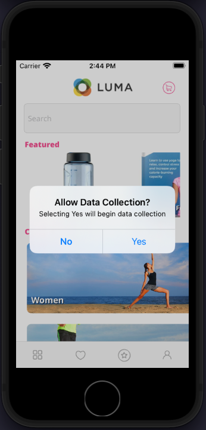

# Godkännande

Lär dig hur du implementerar samtycke i en mobilapp.

>[!INFO]
>
> Den här självstudiekursen kommer att ersättas med en ny självstudiekurs om hur du använder en ny exempelapp i slutet av november 2023

Med mobiltillägget Adobe Experience Platform Consent kan du samla in medgivandeinställningar från din mobilapp när du använder Adobe Experience Platform Mobile SDK och Edge Network-tillägget. Läs mer om [Godkänn tillägg](https://developer.adobe.com/client-sdks/documentation/consent-for-edge-network/), i dokumentationen.

## Förutsättningar

* App med SDK:er har installerats och konfigurerats.

## Utbildningsmål

I den här lektionen kommer du att:

* Fråga användaren om samtycke.
* Uppdatera tillägget baserat på användarens svar.
* Lär dig hur du får det aktuella tillståndet för samtycke.

## Be om samtycke

Om du följde självstudiekursen från början kommer du ihåg att ange **[!UICONTROL Standardnivå för samtycke]** till &quot;Väntar&quot;. För att kunna börja samla in data måste du få användarens samtycke. I den här självstudiekursen får du ditt medgivande genom att helt enkelt fråga med en varning i en app i verkligheten som du vill använda för att få ditt medgivande i din region.

1. Du vill bara fråga användaren en gång. Ett enkelt sätt att hantera det är att använda `UserDefaults`.
1. Navigera till `Home.swift`.
1. Lägg till följande kod i `viewDidLoad()`.

   ```swift
   let defaults = UserDefaults.standard
   let consentKey = "askForConsentYet"
   let hidePopUp = defaults.bool(forKey: consentKey)
   ```

1. Om användaren inte har sett varningen tidigare, visa den och uppdatera medgivandet baserat på deras svar. Lägg till följande kod i `viewDidLoad()`.

   ```swift
   if(hidePopUp == false){
       //Consent Alert
       let alert = UIAlertController(title: "Allow Data Collection?", message: "Selecting Yes will begin data collection", preferredStyle: .alert)
       alert.addAction(UIAlertAction(title: "Yes", style: .default, handler: { action in
           //Update Consent -> "yes"
           let collectConsent = ["collect": ["val": "y"]]
           let currentConsents = ["consents": collectConsent]
           Consent.update(with: currentConsents)
           defaults.set(true, forKey: consentKey)
       }))
       alert.addAction(UIAlertAction(title: "No", style: .cancel, handler: { action in
           //Update Consent -> "no"
           let collectConsent = ["collect": ["val": "n"]]
           let currentConsents = ["consents": collectConsent]
           Consent.update(with: currentConsents)
           defaults.set(true, forKey: consentKey)
       }))
       self.present(alert, animated: true)
   }
   ```


## Hämta aktuellt medgivandetillstånd

Tillägget för mobilen Consent inaktiverar/väntar automatiskt på/tillåter spårning baserat på det aktuella medgivandevärdet. Du kan även komma åt det aktuella medgivandetillståndet själv:

1. Navigera till `Home.swift`.
1. Lägg till följande kod i `viewDidLoad()`.

```swift
Consent.getConsents{ consents, error in
    guard error == nil, let consents = consents else { return }
    guard let jsonData = try? JSONSerialization.data(withJSONObject: consents, options: .prettyPrinted) else { return }
    guard let jsonStr = String(data: jsonData, encoding: .utf8) else { return }
    print("Consent getConsents: ",jsonStr)
}
```

I exemplet ovan skriver du bara ut medgivandestatus till konsolen. I ett verkligt scenario kan du använda det för att ändra vilka menyer eller alternativ som visas för användaren.

## Validera med Assurance

1. Granska [Säkerhet](assurance.md) lektion.
1. Installera programmet.
1. Starta programmet med den Assurance-genererade URL:en.
1. Om du har lagt till ovanstående kod korrekt uppmanas du att ge ditt medgivande. Välj **Ja**.
   
1. Du borde se en **[!UICONTROL Inställningar för samtycke har uppdaterats]** -händelse i Assurance-gränssnittet.
   

Nästa: **[Samla in livscykeldata](lifecycle-data.md)**

>[!NOTE]
>
>Tack för att du lade ned din tid på att lära dig om Adobe Experience Platform Mobile SDK. Om du har frågor, vill dela allmän feedback eller har förslag på framtida innehåll kan du dela dem om detta [Experience League diskussionsinlägg](https://experienceleaguecommunities.adobe.com/t5/adobe-experience-platform-data/tutorial-discussion-implement-adobe-experience-cloud-in-mobile/td-p/443796)