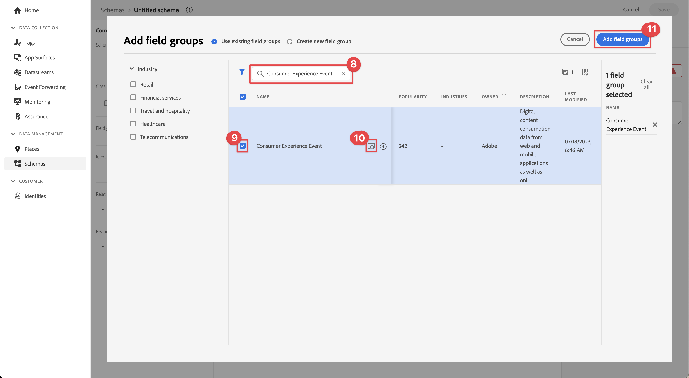
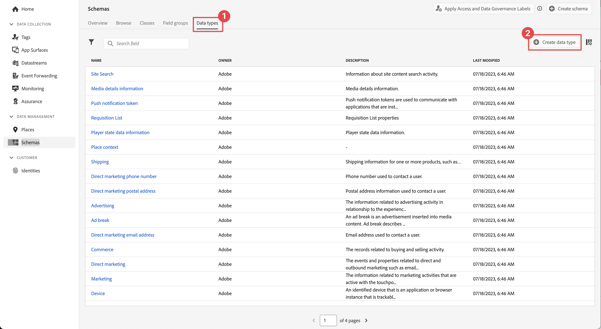

# Skapa ett XDM-schema

Lär dig hur du skapar ett XDM-schema för mobilappshändelser.

Standardisering och interoperabilitet är viktiga begrepp bakom Adobe Experience Platform. Experience Data Model (XDM), som drivs av Adobe, är ett försök att standardisera kundupplevelsedata och definiera scheman för kundupplevelsehantering.

## Vad är XDM-scheman?

XDM är en öppet dokumenterad specifikation som utformats för att förbättra möjligheterna med digitala upplevelser. Det innehåller gemensamma strukturer och definitioner som gör att alla program kan kommunicera med plattformstjänster. Genom att följa XDM-standarder kan alla kundupplevelsedata införlivas i en gemensam representation som kan ge insikter på ett snabbare och mer integrerat sätt. Ni får värdefulla insikter från kundåtgärder, kan definiera kundmålgrupper genom segment och använda kundattribut i personaliseringssyfte.

Experience Platform använder scheman för att beskriva datastrukturen på ett konsekvent och återanvändbart sätt. Genom att definiera data på ett enhetligt sätt i olika system blir det enklare att behålla sin betydelse och därmed få värde av data.

Innan data kan hämtas in till Platform måste ett schema sättas samman för att beskriva datastrukturen och tillhandahålla begränsningar för den typ av data som kan finnas i varje fält. Scheman består av en basklass och noll eller flera schemafältgrupper.

Mer information om schemakompositionsmodellen, inklusive designprinciper och bästa praxis, finns i [grunderna för schemakomposition](https://experienceleague.adobe.com/docs/experience-platform/xdm/schema/composition.html?lang=sv-SE) eller i spellistan [Modellera dina kundupplevelsedata med XDM](https://experienceleague.adobe.com/sv/playlists/experience-platform-model-your-customer-experience-data-with-xdm).

>[!TIP]
>
>Om du känner till SDR (Analytics Solution Design Reference) kan du se ett schema som en mer robust SDR. Mer information finns i [Skapa och underhåll ett SDR-dokument ](https://experienceleague.adobe.com/docs/analytics-learn/tutorials/implementation/implementation-basics/creating-and-maintaining-an-sdr.html?lang=sv-SE).

## Förhandskrav

Du måste ha behörighet att skapa ett Experience Platform-schema för att kunna slutföra lektionen.

## Utbildningsmål

I den här lektionen kommer du att:

* Skapa ett schema i datainsamlingsgränssnittet
* Lägg till en standardfältgrupp i schemat
* Skapa och lägg till en anpassad fältgrupp i schemat

## Navigera till scheman

1. Logga in på Adobe Experience Cloud.

1. Se till att du är i sandlådan Experience Platform som du använder för den här självstudiekursen.

1. Öppna appväljaren  (längst upp till höger),

1. Välj **[!UICONTROL Data Collection]** på menyn.

   

   >[!NOTE]
   >
   > Kunder som använder plattformsbaserade program som Real-Time CDP bör använda en utvecklingssandlåda för den här självstudiekursen. Andra kunder använder standardproduktionssandlådan.

1. Välj **[!UICONTROL Schemas]** under **[!UICONTROL Data Management]** i den vänstra listen.

   

Du finns nu på huvudschemasidan och visas med en lista över befintliga scheman. Du kan även se flikar som motsvarar grundstenarna i ett schema:

* **Fältgrupper** är återanvändbara komponenter som definierar ett eller flera fält för att hämta specifika data, till exempel personuppgifter, hotellinställningar eller adress.
* **Klasser** definierar beteendeaspekterna för de data som schemat innehåller. Till exempel: `XDM ExperienceEvent` hämtar tidsserier, händelsedata och `XDM Individual Profile` hämtar attributdata om en individ.
* **Datatyper** används som referensfälttyper i klasser eller fältgrupper på samma sätt som grundläggande litteralfält.

Ovanstående beskrivningar är en översikt på hög nivå. Mer information finns i videon [Schemabyggande block](https://experienceleague.adobe.com/docs/platform-learn/tutorials/schemas/schema-building-blocks.html?lang=sv-SE) eller i [Grundläggande om schemakomposition](https://experienceleague.adobe.com/docs/experience-platform/xdm/schema/composition.html?lang=sv-SE) i produktdokumentationen.

I den här självstudiekursen använder du fältgruppen Consumer Experience Event och skapar en anpassad som demonstrerar processen.

>[!NOTE]
>
>Adobe fortsätter att lägga till fler standardfältgrupper och de bör användas när det är möjligt, eftersom dessa fält är underförstådda av Experience Platform tjänster och ger större enhetlighet när de används i olika plattformskomponenter. Att använda standardfältgrupper ger påtagliga fördelar som automatisk mappning i Analytics och AI-funktioner i Platform.

## Luma app schema architecture

I ett verkligt scenario kan schemats designprocess se ut så här:

* Samla verksamhetskrav.
* Hitta färdiga fältgrupper som täcker så många krav som möjligt.
* Skapa anpassade fältgrupper för eventuella luckor.

I utbildningssyfte använder du fördefinierade och anpassade fältgrupper.

* **Consumer Experience Event**: Fördefinierad fältgrupp med många vanliga fält.
* **Programinformation**: Anpassad fältgrupp som utformats för att efterlikna koncept i TrackState/TrackAction Analytics.

<!--Later in the tutorial, you can [update the schema](lifecycle-data.md) to include the **[!UICONTROL AEP Mobile Lifecycle Details]** field group.-->

## Skapa ett schema

1. Välj **[!UICONTROL Create Schema]**.

1. Välj **[!UICONTROL Experience Event]** under **[!UICONTROL Select a base class for this schema]** i steget **[!UICONTROL Select a class]** i guiden **[!UICONTROL Create schema]**.

1. Välj **[!UICONTROL Next]**.

   

1. I steget **[!UICONTROL Name and review]** i guiden **[!UICONTROL Create schema]** anger du en **[!UICONTROL Schema display name]**, till exempel `Luma Mobile Event Schema` och en [!UICONTROL Description], till exempel `Schema for Luma mobile app experience events`.

   >[!NOTE]
   >
   >Om du går igenom den här självstudiekursen med flera personer i en och samma sandlåda, eller om du använder ett delat konto, bör du överväga att lägga till eller föregå en identifiering som en del av namnkonventionen. Använd till exempel `Luma Mobile App Event Schema - Joe Smith` i stället för `Luma Mobile App Event Schema`. Se även anteckningen i [Översikt](overview.md).

1. Välj **[!UICONTROL Finish]** om du vill avsluta guiden.

   

1. Välj  **Lägg till** intill **[!UICONTROL Field groups]**.

   

1. Sök efter `Consumer Experience Event`.

1. Välj  om du vill förhandsgranska fälten och/eller läsa beskrivningen för mer information innan du väljer en fältgrupp.

1. Välj **Consumer Experience Event**.

1. Välj **[!UICONTROL Add field groups]**.

   

   Du kommer tillbaka till huvudfönstret för schemakomposition där du kan se alla tillgängliga fält.

1. Välj **[!UICONTROL Save]**.

>[!NOTE]
>
>Tänk på att du inte behöver använda alla fält i en grupp. Du kan även ta bort fält för att se till att schemat är kortfattat och begripligt. Om det är till hjälp kan du tänka dig ett schema som ett tomt datalager. I appen fyller du i relevanta värden vid rätt tidpunkt.

Fältgruppen [!UICONTROL Consumer Experience Event] har datatypen [!UICONTROL Web information] som beskriver händelser som sidvy och länkklick. Just nu finns det ingen paritet för mobilappar med den här funktionen, så du kommer att skapa en egen.

## Skapa en anpassad datatyp

Börja med att skapa en anpassad datatyp som beskriver de två händelserna:

* Skärmvy
* Appinteraktion

1. Klicka på fliken **[!UICONTROL Data types]**.  

1. Välj **[!UICONTROL Create data type]**.

   

1. Ange **[!UICONTROL Display name]** och **[!UICONTROL Description]**, till exempel `App Information` och `Custom data type describing "Screen Views" & "App Actions"`

   

   >[!TIP]
   >
   > Använd alltid läsbara, beskrivande [!UICONTROL display names] för dina anpassade fält, eftersom detta gör dem mer tillgängliga för marknadsförare när fälten visas i underordnade tjänster som segmentbyggaren.

1. Om du vill lägga till ett fält väljer du knappen  .

1. Det här fältet är ett behållarobjekt för programinteraktion, så ange en **[!UICONTROL Field name]** `appInteraction`, **[!UICONTROL Display name]** `App Interaction` och välj `Object` i listan **[!UICONTROL Type]**.

1. Välj **[!UICONTROL Apply]**.

   

1. Om du vill mäta hur ofta en åtgärd har inträffat lägger du till ett fält genom att markera knappen  bredvid det **[!UICONTROL appInteraction]** objekt du skapade.

1. Ge den en kamelcase **[!UICONTROL Field name]** `appAction`, **[!UICONTROL Display name]** av `App Action` och **[!UICONTROL Type]** `Measure`.

   Det här steget motsvarar ett lyckat evenemang i Adobe Analytics.

1. Välj **[!UICONTROL Apply]**.

   

1. Lägg till ett fält som beskriver typen av interaktion genom att markera knappen  bredvid objektet **[!UICONTROL appInteraction]**.

1. Ge den en **[!UICONTROL Field name]** `name`, **[!UICONTROL Display name]** av `Name` och **[!UICONTROL Type]** `String`.

   Det här steget motsvarar en dimension i Adobe Analytics.

   

1. Rulla till nederkanten av den högra listen och välj **[!UICONTROL Apply]**.

1. Om du vill skapa ett `appStateDetails`-objekt som innehåller ett **[!UICONTROL Measure]**-fält med namnet `screenView` och två **[!UICONTROL String]**-fält med namnen `screenName` och `screenType` följer du samma steg som när du skapade **[!UICONTROL appInteraction]**-objektet.

1. Välj **[!UICONTROL Save]**.

   

## Lägga till en anpassad fältgrupp

Lägg nu till en anpassad fältgrupp med din anpassade datatyp:

1. Öppna schemat som du skapade tidigare i den här lektionen.

1. Välj  **[!UICONTROL Add]** bredvid **[!UICONTROL Field groups]**.

   

1. Välj **[!UICONTROL Create new field group]**.

1. Ange en **[!UICONTROL Display name]** och **[!UICONTROL Description]**, till exempel `App Interactions` och `Fields for app interactions`.

1. Välj **Lägg till fältgrupper**.

   

1. Välj **[!UICONTROL App Interactions**] på dispositionsskärmen.

1. Lägg till ett fält i schemats rot genom att markera knappen  bredvid schemanamnet.

1. Ange **[!UICONTROL Field name]** av `appInformation`, **[!UICONTROL Display name]** av `App Information` och **[!UICONTROL Type]** av `App Information` i den högra listen.

1. Välj **[!UICONTROL App Interactions]** i listrutan **[!UICONTROL Field Group]** om du vill tilldela fälten till den nya fältgruppen.

1. Välj **[!UICONTROL Apply]**.

1. Välj **[!UICONTROL Save]**.

   

>[!NOTE]
>
>Anpassade fältgrupper placeras alltid under din Experience Cloud-organisationsidentifierare.

>[!SUCCESS]
>
>Nu har du ett schema att använda för resten av självstudiekursen.
>
>Tack för att du lade ned din tid på att lära dig om Adobe Experience Platform Mobile SDK. Om du har frågor, vill dela allmän feedback eller har förslag på framtida innehåll kan du dela dem i det här [Experience League-diskussionsinlägget](https://experienceleaguecommunities.adobe.com/t5/adobe-experience-platform-data/tutorial-discussion-implement-adobe-experience-cloud-in-mobile/td-p/443796).

Nästa: **[Skapa en[!UICONTROL datastream]](create-datastream.md)**
