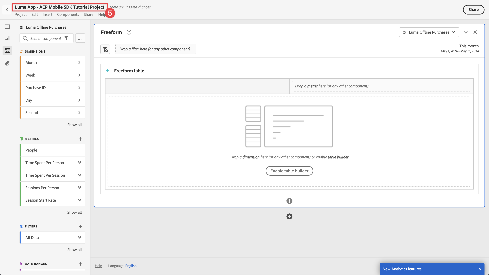
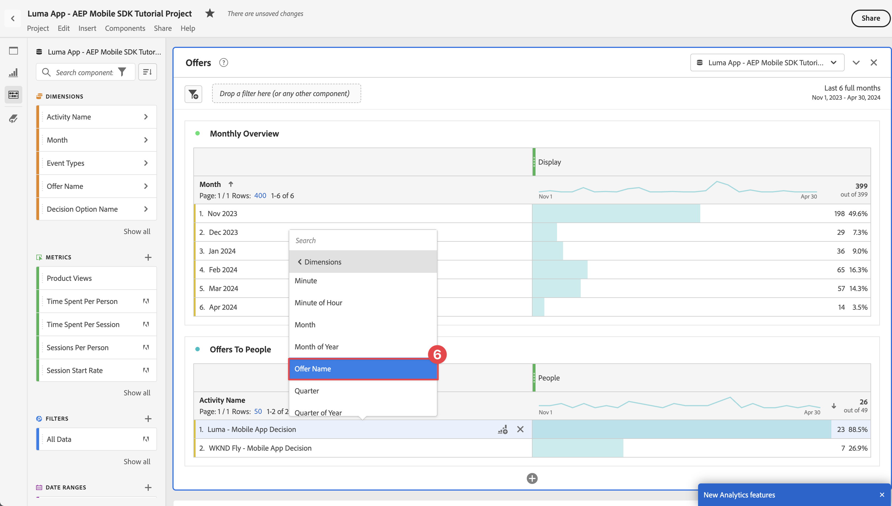

# Rapportera och analysera med Customer Journey Analytics

Lär dig hur du rapporterar och analyserar din mobilappsinteraktion med Customer Journey Analytics.

Händelsedata för mobilappar, som du samlade in och skickade till Platform Edge Network i tidigare lektioner, vidarebefordras till de tjänster som konfigurerats i din datastam. Om du följde lektionen [Skicka data till Experience Platform](platform.md) lagras dessa data nu i en Experience Platform-datauppsättning och är tillgängliga för Customer Journey Analytics att använda för rapportering och analys.

I motsats till Adobe Analytics använder Customer Journey Analytics ** data från datauppsättningar som skapats i Experience Platform. Data skickas inte direkt till Customer Journey Analytics via Adobe Experience Platform Mobile SDK, utan data skickas till datauppsättningar. Anslutningar konfigureras sedan i Customer Journey Analytics för att välja de datauppsättningar du vill använda i dina rapporterings- och analysprojekt.

Den här lektionen i självstudiekursen fokuserar på att rapportera och analysera data som hämtats in från Luma-självstudieversionen. En av de unika funktionerna i Customer Journey Analytics är att kombinera data från olika källor (CRM, butiksadress, lojalitetsprogram, callcenter) och kanaler (webb, mobil, offline) för att få djupgående insikter om kundresor. Denna möjlighet ligger utanför den här lektionens räckvidd. Mer information finns i [Customer Journey Analytics - översikt](https://experienceleague.adobe.com/sv/docs/analytics-platform/using/cja-overview/cja-overview).

## Förhandskrav

Din organisation måste etableras och tillstånd beviljas för Customer Journey Analytics. Du måste ha administratörsåtkomst till Customer Journey Analytics.

## Utbildningsmål

I den här lektionen kommer du att:

- Skapa en anslutning för att definiera de datauppsättningar från Experience Platform som du vill använda i Customer Journey Analytics.
- Skapa en datavy för att förbereda data från datauppsättningar för din rapportering och analys
- Skapa ett projekt för att skapa rapporter och visualiseringar så att ni kan analysera data från mobilappen.

Sekvensen är avsiktlig. Anslutningar använder datauppsättningar, och datavyer använder anslutningar.

## Skapa en anslutning

En anslutning i Customer Journey Analytics definierar de datauppsättningar (och de data i dessa datauppsättningar) från Experience Platform som du vill använda för rapportering och analys.

1. Navigera till Customer Journey Analytics-gränssnittet med Apps-menyn  i det övre högra hörnet.

1. Välj **[!UICONTROL Connections]** i den övre menyraden.

1. Se till att du väljer fliken **[!UICONTROL List]** i anslutningsgränssnittet. En lista över befintliga anslutningar visas.

1. Välj **[!UICONTROL Create new connection]**.

1. På skärmen **[!UICONTROL Connections]** > **[!UICONTROL Untitled connection]** i **[!UICONTROL Connection settings]**

   1. Ange en **[!UICONTROL Connection name]**, till exempel `Luma App - AEP Mobile SDK Tutorial Connection`.
   2. Ange en **[!UICONTROL Connection description]**, till exempel `Connection for the Luma app used in the AEP Mobile SDK tutorial`.

      I **[!UICONTROL Data settings]**:

   3. Välj den sandlåda som du har använt för att samla in mobilappsdata, till exempel **[!UICONTROL Mobile and Web SDK Courses]**.
   4. Välj **[!UICONTROL less than 1 million]** från **[!UICONTROL Average number of daily events]**.

   5. Välj **[!UICONTROL Add datasets]** för att välja de datauppsättningar från Experience Platform som du vill använda i Customer Journey Analytics.

      {zoomable="yes"}

   6. **[!UICONTROL Add datasets]** steg i guiden **[!UICONTROL Select datasets]**

      1. Välj följande datauppsättningar:

         - **[!UICONTROL Luma Mobile App Event Dataset]**, datauppsättningen som du skapade som en del av avsnittet [Skapa en datauppsättning](platform.md#create-a-dataset) i Experience Platform-lektionen.
         - **[!UICONTROL ODE DecisionEvents - *sandlådenamn *]beslut**
         - **[!UICONTROL AJO Push Tracking Event Datasets]**

      1. Välj **[!UICONTROL Next]**.

         {zoomable="yes"}

   7. I **[!UICONTROL Add datasets]**-guiden, **[!UICONTROL Datasets settings]**-steget, måste du definiera informationen för varje händelsedatamängd.
      1. Se följande tabeller för rätt inställningar:

         | Datauppsättning | Person-ID Konstant | Tidsstämpel ¥ | ③ för datakälltyp | Importera alla nya ④ | Fyll i alla befintliga ⑤ |
         |---|---|---|---|---|---|
         | Luma Mobile App Event-datauppsättning | identityMap | tidsstämpel | Mobilappsdata | enable | enable |
         | ODE-beslutshändelser - *sandlådenamn*-beslut | identityMap | tidsstämpel | Mobilappsdata | enable | enable |
         | AJO Push Tracking Experience, händelsedatauppsättning | identityMap | tidsstämpel | Mobilappsdata | enable | enable |

      1. Välj **[!UICONTROL Add datasets]**.

         {zoomable="yes"}

1. Gå tillbaka till **[!UICONTROL Connections]** > **[!UICONTROL Luma App - AEP Mobile SDK Tutorial Connection]** och välj **[!UICONTROL Save]** för att spara anslutningen.

   {zoomable="yes"}

Du har nu definierat din anslutning och Customer Journey Analytics lägger till data från datauppsättningarna i sin egen interna databas. Datainsamlingen kan ta en stund, beroende på mängden data. Förvänta dig ett par timmar innan data visas i Customer Journey Analytics för din självstudieapp.

Så här visar du anslutningsstatus:

1. Välj **[!UICONTROL Connections]** i Customer Journey Analytics huvudgränssnitt.
1. Välj namnet på anslutningen, till exempel **[!UICONTROL Luma App - AEP Mobile SDK Tutorial Connection]**.

I **[!UICONTROL Connections]** > **[!UICONTROL Luma App - AEP Mobile SDK Tutorial Connection]** ser du:

1. Information om totalt antal poster som lagts till, poster som hoppats över och poster som tagits bort. Se till att du väljer **[!UICONTROL All datasets]** och väljer en lämplig tidsperiod för att visa information om anslutningen. Du kan använda  för att öppna en dialogruta och välja tidsperioden.
1. Information för enskilda datauppsättningar om poster som lagts till, poster som hoppats över, poster som tagits bort med mera.

   {zoomable="yes"}

## Skapa en datavy

När posterna har lagts till från datauppsättningarna till Customer Journey Analytics kan du skapa en datavy som definierar vilka komponenter av data som du vill rapportera om.

En datavy är en behållare som är specifik för Customer Journey Analytics och som gör att du kan avgöra hur data från en anslutning ska tolkas. Du kan konfigurera standard- och schemafält från alla datauppsättningar som du har definierat i din anslutning som komponenter (mått, mått) i Analysis Workspace.

Datavyn i Customer Journey Analytics är mycket flexibel när det gäller att konfigurera och definiera data från anslutningen. I den här självstudiekursen använder du bara de funktioner som krävs för din rapportering och analys. Mer information finns i [Datavyer](https://experienceleague.adobe.com/sv/docs/analytics-platform/using/cja-dataviews/data-views).

Så här skapar du en datavy:

1. Navigera till Customer Journey Analytics-gränssnittet med Apps-menyn  i det övre högra hörnet.

1. Välj **[!UICONTROL Data views]** i den övre menyraden.
1. Välj **[!UICONTROL Create new data view]**.
1. Kontrollera att fliken **[!UICONTROL Data views >]** är markerad i **[!UICONTROL Configure]**.

   1. Välj din anslutning i listrutan Anslutning för inställningar, till exempel **[!UICONTROL Luma App - AEP Mobile SDK Tutorial Connection]**.
   1. Ange ett namn för datavyn, till exempel: `Luma App - AEP Mobile SDK Tutorial Data view`.
   1. Välj **[!UICONTROL Save and continue]**.

      {zoomable="yes"}

1. På fliken **[!UICONTROL Components]** i **[!UICONTROL Luma App - AEP Mobile SDK Tutorial Data view]** kan du definiera de mått och dimensioner som du vill använda när du rapporterar i din mobilapp. Som standard är ett antal standardmått och -mått (som gemensamt kallas för komponenter) redan konfigurerade för datavyn. Men datavyn kräver fler komponenter.  Så här lägger du till ett schemafält från ett tidigare definierat schema eller ett schema som är utanför rutan (se [Skapa ett schema](create-schema.md) -lektion) som en komponent (mått eller mått):

   1. Hitta schemafältet:

      - sök efter komponenten med sökfältet  ***[!UICONTROL Search schema fields]***. till exempel `productListAdd`, eller

        {zoomable="yes"}

      - gå ned till schemafältet i  **[!UICONTROL Event datasets]** .  Till exempel  **[!UICONTROL Event datasets]**   **[!UICONTROL commerce]**   **[!UICONTROL productListAdds]** 

        {zoomable="yes"}

   1. Dra det specifika schemafältet från rutan Schemafält och släpp det i listan **[!UICONTROL METRICS]** eller **[!UICONTROL DIMENSIONS]** i rutan [!UICONTROL Included components].

      {zoomable="yes"}

   1. Du kan konfigurera inställningarna för en komponent. Markera komponenten och konfigurera inställningarna i den högra rutan.  Du kan till exempel byta namn på **[!UICONTROL commerce.productListAdds]** till `Product Add To Lists` med fältet **[!UICONTROL COMPONENT SETTINGS]** > **[!UICONTROL Component name]** i den högra rutan.

      {zoomable="yes"}

      Eller konfigurera **[!UICONTROL INCLUDE EXCLUDE VALUES]**.

      {zoomable="yes"}

   1. Nu när du förstår hur du lägger till fält i datavyn och konfigurerar den resulterande komponenten kan du använda tabellerna nedan för att visa en lista med schemafält som ska läggas till som mått. Använd kolumnvärdet **Schemasökväg** från tabellen nedan för att söka efter eller gå till det specifika schemafältet. När mätvärden och dimensioner har lagts till kontrollerar du kolumnvärdet **Komponentinställningar** i tabellen om det krävs särskilda inställningar för en komponent, som **[!UICONTROL Component name]** eller **[!UICONTROL INCLUDE EXCLUDE VALUES]**.

      **METRICS**

      | Komponentnamn | Datauppsättning | Datatyp för schema | Schema Path | Komponentinställningar |
      |---|---|---|---|---|
      | Avvisa | AJO Push Tracking Experience, händelsedatauppsättning för Luma-mobilappshändelse | Heltal | _experience.decisioning. propositionEventType.dismiss | Komponentnamn: `Dismiss` |
      | Avbeställ | AJO Push Tracking Experience, händelsedatauppsättning för Luma-mobilappshändelse | Heltal | _experience.decisioning. propositionEventType.unsubscribe | Komponentnamn: `Unsubscribe` |
      | Utlösare | AJO Push Tracking Experience, händelsedatauppsättning för Luma-mobilappshändelse | Heltal | _experience.decisioning. propositionEventType.trigger | Komponentnamn: `Trigger` |
      | Visa | AJO Push Tracking Experience, händelsedatauppsättning för Luma-mobilappshändelse | Heltal | _experience.decisioning. propositionEventType.display | Komponentnamn: `Display` |
      | Skicka | AJO Push Tracking Experience, händelsedatauppsättning för Luma-mobilappshändelse | Heltal | _experience.decisioning. propositionEventType.send | Komponentnamn: `Send` |
      | Interagera | AJO Push Tracking Experience, händelsedatauppsättning för Luma-mobilappshändelse | Heltal | _experience.decisioning. propositionEventType.interact | Komponentnamn: `Interact` |
      | Platshändelser | AJO Push Tracking Experience Event Dataset, Luma Mobile App Event Dataset, ODE DecisionEvents - beslut för mobil- och webbsdk-kurser | Sträng | Händelsetyp | Komponentnamn: `Location Events`  {zoomable="yes"} |
      | Produktvyer | Luma Mobile App Event-datauppsättning | Dubbel | commerce.productViews.value | Komponentnamn: `Product Views` |
      | Lägg till produkt i listor | Luma Mobile App Event-datauppsättning | Dubbel | commerce.productListAdds.value | Komponentnamn: `Product Add To Lists` |
      | Inköp | Luma Mobile App Event-datauppsättning | Dubbel | commerce.purchases.value | Komponentnamn: `Purchases` |
      | Spara för senare | Luma Mobile App Event-datauppsättning | Dubbel | commerce.saveForLaters.value | Komponentnamn: `Save For Laters` |
      | Appinteraktioner | Luma Mobile App Event-datauppsättning | Dubbel | _techmarketingdemos.appInformation. appInteraction.appAction.value | Komponentnamn: `App Interactions` |
      | Skärmvyer | Luma Mobile App Event-datauppsättning | Dubbel | _techmarketingdemos.appInformation. appStateDetails.screenView.value | Komponentnamn: `Screen Views` |

      {style="table-layout:auto"}

      >[!NOTE]
      >
      >Observera hur schemafältet för mätvärdet för platshändelser använder **[!UICONTROL INCLUDE EXCLUDE VALUES]** för att räkna händelsetyper som innehåller `location`.

      Datavykonfigurationen för **[!UICONTROL METRICS]** ska matcha nedan efter att du har lagt till alla schemafält från tabellen ovan som en måttkomponent:

      {zoomable="yes"}

      **DIMENSIONER**

      | Komponentnamn | Datauppsättning | Datatyp för schema | Schema Path | Komponentinställningar |
      |---|---|---|---|---|
      | Ort | AJO Push Tracking Experience, händelsedatauppsättning för Luma-mobilappshändelse | Sträng | placeContext.geo.city | Komponentnamn: `City` |
      | Händelsetyper | AJO Push Tracking Experience Event Dataset, Luma Mobile App Event Dataset, ODE DecisionEvents - beslut för mobil- och webbsdk-kurser | Sträng | eventType | Komponentnamn: `Event Types` |
      | Namn på beslutsalternativ | AJO Push Tracking Experience Event Dataset, Luma Mobile App Event Dataset, ODE DecisionEvents - beslut för mobil- och webbsdk-kurser | Sträng | _experience.decisioning. propositioner.items.name | Komponentnamn: `Decision Option Name` |
      | Namn på appinteraktion | Luma Mobile App Event-datauppsättning | Sträng | _techmarketingdemos.appInformation. appInteraction.name | Komponentnamn: `App Interaction Name` |
      | Skärmnamn | Luma Mobile App Event-datauppsättning | Sträng | _techmarketingdemos.appInformation. appStateDetails.screenName | Komponentnamn: `Screen Name` |
      | Aktivitetsnamn | ODE-beslutEvenemang - beslut om mobil- och webbsdk-kurser | Sträng | _experience.decisioning. propositionDetails.activity.name | Komponentnamn: `Activity Name` |
      | Namn på erbjudande | ODE-beslutEvenemang - beslut om mobil- och webbsdk-kurser | Sträng | _experience.decisioning. propositionDetails.selections.name | Komponentnamn: `Offer Name` |

      {style="table-layout:auto"}

      Datavykonfigurationen för **[!UICONTROL DIMENSIONS]** ska matcha nedan efter att du har lagt till alla schemafält från tabellen ovan som en dimensionskomponent:

      {zoomable="yes"}

   1. Välj **[!UICONTROL Save and continue]**.

1. På fliken **[!UICONTROL Settings]** i **[!UICONTROL Luma App - AEP Mobile SDK Tutorial Data view]** kan du konfigurera filter och sessionsinställningar. I den här självstudiekursen behövs ingen ytterligare konfiguration.

   - Välj **[!UICONTROL Save and finish]**.

Du har definierat datavyn och allt finns på plats för att börja skapa rapporter och visualiseringar.

## Skapa ett projekt

Workspace-projekt används i Customer Journey Analytics för att skapa rapporter och visualiseringar. Det finns många möjligheter att skapa omfattande rapporter och engagerande visualiseringar, men detta ligger utanför kursens räckvidd. Mer information finns i [Workspace-översikt](https://experienceleague.adobe.com/sv/docs/customer-journey-analytics-learn/tutorials/analysis-workspace/workspace-projects/analysis-workspace-overview) och [Skapa ett nytt projekt](https://experienceleague.adobe.com/sv/docs/customer-journey-analytics-learn/tutorials/analysis-workspace/workspace-projects/build-a-new-project).

I det här avsnittet av lektionen skapar du ett projekt som visar rapporter och visualiseringar om:

- Appanvändning: använda informationen om skärm- och appinteraktioner.
- Commerce: använda e-handelshändelser, som produktvyn, för att lägga till i kundvagn och inköp.
- Erbjudanden: använda erbjudanden som visas i appen.
- Lagra besök: använda (simulerade) geofence-händelser från appen.

Så här skapar du ditt projekt:

1. Navigera till Customer Journey Analytics-gränssnittet med Apps-menyn  i det övre högra hörnet.

1. Välj **[!UICONTROL Workspace]** i den övre menyraden.

1. Välj **[!UICONTROL Create project]**.

   1. Välj **[!UICONTROL Blank Workspace project]** i popup-dialogrutan.

   1. Välj **[!UICONTROL Create]**.

      {zoomable="yes"}

1. Du får gränssnittet **[!UICONTROL New project]**. I det här gränssnittet kan du skapa rapporter och visualiseringar.

1. Välj namnet på projektet (**[!UICONTROL New project]**) och ange ett eget namn för projektet. Exempel: `Luma App - AEP Mobile SDK Tutorial Project`.
   {zoomable="yes"}

1. Spara projektet genom att välja **[!UICONTROL Project]** > **[!UICONTROL Save]**.
   {zoomable="yes"}

1. Ignorera alla andra fält i dialogrutan **[!UICONTROL Save]** och välj **[!UICONTROL Save]**.
   {zoomable="yes"}

>[!IMPORTANT]
>
>   Kom ihåg att spara projektet regelbundet, annars försvinner ändringarna. Du kan snabbt spara ditt projekt med **[!UICONTROL ctrl + s]** (Windows) eller **[!UICONTROL ⌘ (cmd) + s]** (macOS).

Du har nu konfigurerat ditt projekt. En friformstabell tillhandahålls som standard. Innan du lägger till komponenter bör du kontrollera att du använder rätt datavy och tidsperiod på frihandspanelen.

1. Välj datavyn i listrutan. Exempel: **[!UICONTROL Luma App - AEP Mobile SDK Tutorial Data view]**. Om du inte kan se datavyn i listan väljer du **[!UICONTROL Show all]** längst ned i listrutan.
   {zoomable="yes"}

1. Om du vill definiera lämplig tidsperiod för panelen väljer du standardförinställningen **[!UICONTROL This month]**, anger ett anpassat start- och slutdatum eller använder en **[!UICONTROL Preset]** (till exempel **[!UICONTROL Last 6 full months]**) och väljer **[!UICONTROL Apply]**.
   {zoomable="yes"}

### Appanvändning

Nu kan du rapportera hur appen används. Du har lagt till den nödvändiga koden i appen för att registrera appinteraktioner och vilka skärmar som används i appen (se lektionen [Spåra händelser](events.md)) och du vill nu rapportera om dessa data.

#### Skärmnamn

Så här rapporterar du skärmar som visas i appen:

1. Byt namn på panelen **[!UICONTROL Freeform]** till `App Usage`.

1. Byt namn på **[!UICONTROL Freeform table]** till `Screen Names`.

1. Välj **[!UICONTROL Show all]** under listan **[!UICONTROL METRICS]**.

1. Dra och släpp **[!UICONTROL Screen Views]**-komponenten på [!UICONTROL _Släpp ett **mått**&#x200B;här (eller någon annan komponent_)].
   {zoomable="yes"}
I frihandstabellen visas nu skärmvyer för varje dag under den valda tidsperioden. Du vill dock visa antalet skärmvyer för var och en av de olika skärmar som används i programmet.

1. Om du vill visa listan **[!UICONTROL DIMENSIONS]** med komponenter väljer du  för att ta bort filtret  **[!UICONTROL Metrics]** från komponenterna.
   {zoomable="yes"}

1. Välj **[!UICONTROL Show all]** under listan **[!UICONTROL DIMENSIONS]**.

1. Dra och släpp **[!UICONTROL Screen Name]**-komponenten på **[!UICONTROL Day]**-rubriken. Åtgärden visar  **[!UICONTROL Replace]** för att ange att dimensionen ska ersättas.
   {zoomable="yes"}

Din första Freeform-tabell i din rapport är klar.

{zoomable="yes"}

>[!NOTE]
>
>Spara projektet innan du fortsätter.

#### Appinteraktioner

Därefter ska du skapa en Freeform-tabell som visar hur användarna interagerade med appen.

1. Välj  och lägg till en ny friformstabell från popup-fönstret .
   {zoomable="yes"}

1. Byt namn på **[!UICONTROL Freeform table (2)]** till `App Interactions`.

1. Dra och släpp måttet **[!UICONTROL App Interactions]** på [!UICONTROL _Släpp ett **mått**&#x200B;här (eller någon annan komponent_)].

1. Dra och släpp dimensionen **[!UICONTROL App Interaction Name]** på rubriken **[!UICONTROL Day]** om du vill ersätta den här dimensionen.

Din andra rapport är nu klar och visar appinteraktioner.
{zoomable="yes"}

Informationen är begränsad huvudsakligen eftersom du implementerade `MobileSDK.shared.sendAppInteractionEvent(actionName: "<actionName>")` API-anrop endast på inloggningsskärmen. Om du lägger till det här API-anropet på fler skärmar i din app blir den här rapporten mer informativ.

>[!NOTE]
>
>Spara projektet innan du fortsätter.

### Commerce

Nu vill du rapportera om e-handelshändelser som inträffar i appen på en separat panel.

#### Commerce Events

1. Välj  utanför den aktuella [!UICONTROL App Usage]-panelen om du vill skapa en ny panel.
   {zoomable="yes"}

1. Se till att du väljer lämplig tidsperiod.

1. Välj  **[!UICONTROL Freeform table]** om du vill skapa en ny friformstabell.
   {zoomable="yes"}

1. Byt namn på **[!UICONTROL Panel]** till `Commerce`.

1. Byt namn på **[!UICONTROL Freeform table]** till `Commerce Events`.

1. Dra och släpp **[!UICONTROL Product Views]**-måttet på för att [!UICONTROL _släppa ett **mått**&#x200B;här (eller någon annan komponent_)].

1. Dra och släpp måttet **[!UICONTROL Product Add To Lists]** till höger om kolumnen **[!UICONTROL Product Views]** för att infoga den här kolumnen i frihandstabellen. Kontrollera att **[!UICONTROL + Add]** (i blått) visas när du infogar kolumnen.
   {zoomable="yes"}

1. Upprepa föregående steg om du vill lägga till måtten **[!UICONTROL Save For Laters]** och **[!UICONTROL Purchases]** i frihandstabellen.

1. Dra och släpp dimensionen **[!UICONTROL Month]** ovanpå dimensionen **[!UICONTROL Day]** om du vill ändra rapporteringen från dag till månad.

Din Commerce Events-rapport är klar.

{zoomable="yes"}

>[!NOTE]
>
>Spara projektet innan du fortsätter.

#### Utfall

Därefter ska du skapa en utfallsvisualisering för e-handelstratten som visar hur många användare som har visat produkter som har lagt till de här produkterna i kundvagnen, och därefter hur många användare som har sparat produkterna senare.

1. Välj  på panelen **[!UICONTROL Commerce]** och välj  på popup-panelen (som representerar utfallsvisualiseringen).

1. Välj **[!UICONTROL Product Views]** i listrutan [!UICONTROL *Lägg till kontaktyta*].
   {zoomable="yes"}
Du kan också dra och släppa **[!UICONTROL Products View]** -dimensionen under **[!UICONTROL All people]** -dimensionen i **[!UICONTROL Fallout]** -visualiseringen.

1. Upprepa ovanstående steg för dimensionerna **[!UICONTROL Product Add To Lists]** och **[!UICONTROL Purchases]**.

Din rapport om utfallsvisualisering är klar.
{zoomable="yes"}

>[!NOTE]
>
>Spara projektet innan du fortsätter.

### Erbjudanden

Du vill rapportera hur många erbjudanden och vilka erbjudanden som visas för appanvändarna.

#### Månadsöversikt

1. Välj  utanför den aktuella Commerce-panelen om du vill skapa en ny panel.

1. Byt namn på **[!UICONTROL Panel]** till `Offers`.

1. Se till att du väljer lämplig period.

1. Välj  Frihandstabell om du vill skapa en ny frihandstabell.

1. Byt namn på **[!UICONTROL Freeform table]** till `Monthly Overview`.

1. Dra och släpp måttet **[!UICONTROL Display]** till [!UICONTROL _Släpp ett **mått**&#x200B;här (eller någon annan komponent_)].

1. Dra och släpp dimensionen **[!UICONTROL Month]** i kolumnen **[!UICONTROL Day]** för att ersätta dimensionen.

Din månatliga översikt över erbjudanden är klar.

{zoomable="yes"}

>[!NOTE]
>
>Spara projektet innan du fortsätter.

#### Erbjudanden till människor

Du vill också ha en rapport som visar vilka erbjudanden som visades i vilka nummer appanvändarna fick.

1. Välj  på panelen **[!UICONTROL Offers]** och  på popup-menyn för att lägga till en ny friformstabell.

1. Byt namn på **[!UICONTROL Freeform table (2)]** till `People`.

1. Dra och släpp måttet **[!UICONTROL People]** till [!UICONTROL _Släpp ett **mått**&#x200B;här (eller någon annan komponent_)].

1. Dra och släpp **[!UICONTROL Activity Name]** i kolumnen **[!UICONTROL Day]** för att ersätta dimensionen.

1. Högerklicka på raden för att identifiera ett eller flera av de erbjudandebeslut som du definierade i lektionen [Skapa och visa erbjudanden med Beslutshantering](journey-optimizer-offers.md). Exempel: **[!UICONTROL Luma - Mobile App Decision]**.

1. Välj **[!UICONTROL Breakdown]** > **[!UICONTROL Dimensions]** > **[!UICONTROL Offer Name]** på snabbmenyn. Det här valet kommer att dela upp dimensionen Aktivitetsnamn i Erbjudandenamn.
   {zoomable="yes"}

Rapporten om erbjudanden till människor är klar.

{zoomable="yes"}

>[!NOTE]
>
>Spara projektet innan du fortsätter.

### Butiksbesök

Slutligen vill ni rapportera om butiksbesök.

1. Välj  utanför den aktuella panelen Erbjudanden om du vill skapa en ny panel.

1. Byt namn på **[!UICONTROL Panel]** till `Store Visits`.

1. Se till att du väljer lämplig period.

1. Välj  Frihandstabell om du vill skapa en ny frihandstabell.

1. Byt namn på **[!UICONTROL Freeform table]** till `Store Entries / Exits Across Cities`.

1. Dra och släpp måttet **[!UICONTROL Location Events]** till [!UICONTROL _Släpp ett **mått**&#x200B;här (eller någon annan komponent_)]. Rapporten visar nu en daglig översikt över alla platshändelser som inträffade i appen. Kom ihåg hur du specifikt konfigurerade den här dimensionen som en del av din [datavy](#create-a-data-view).

1. Dra och släpp dimensionen **[!UICONTROL City]** på kolumnrubriken **[!UICONTROL Day]** för att ersätta dimensionen. Rapporten visar nu städerna för platshändelserna.

1. Om du vill ta bort geopositioneringshändelser utan associerade städer väljer du  och **[!UICONTROL Search]** på popup-menyn **[!UICONTROL Include "No value"]** och sedan **[!UICONTROL Apply]**.

   {zoomable="yes"}

   Den här åtgärden tar bort raden **[!UICONTROL No value]** från rapporten.

1. Markera alla rader i tabellen, högerklicka och välj Brytning > Dimension > Händelsetyper på snabbmenyn.

Dina Store-besöksrapporter har slutförts. Nu finns det en rapport som visar att användare befinner sig i och utanför närheten av dina butiksplatser (som du definierade de här platserna i lektionen [Platser](places.md)).

{zoomable="yes"}

Observera att du kan använda beacons om du verkligen vill rapportera om personer som fysiskt besöker din butik. Men förhoppningsvis har ni lyckats fånga upp begreppet rapportering av geolokaliseringsdata.

## Nästa steg

Nu bör du ha en grundläggande förståelse för hur du kan rapportera och visualisera om användningen av mobilappar, interaktioner med mera med Customer Journey Analytics.

>[!SUCCESS]
>
>
>Tack för att du har lagt ned din tid på att lära dig om Adobe Experience Platform Mobile SDK. Om du har frågor, vill dela allmän feedback eller har förslag på framtida innehåll kan du dela dem i det här [Experience League Community-diskussionsinlägget](https://experienceleaguecommunities.adobe.com/t5/adobe-experience-platform-data/tutorial-discussion-implement-adobe-experience-cloud-in-mobile/td-p/443796).

Nästa: **[Slutsats och nästa steg](conclusion.md)**
