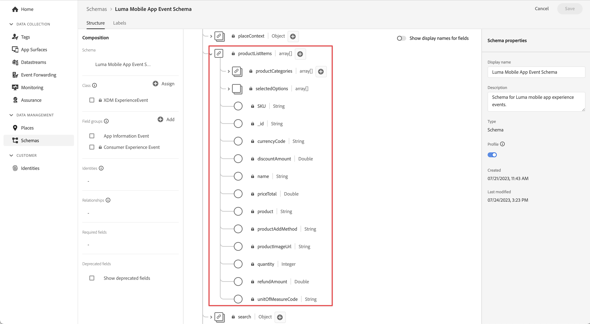

# Spåra händelsedata

Lär dig spåra händelser i en mobilapp.

Edge Network-tillägget innehåller ett API för att skicka upplevelsehändelser till Platform Edge Network. En upplevelsehändelse är ett objekt som innehåller data som överensstämmer med XDM ExperienceEvent-schemadefinitionen. De här händelserna fångar mer enkelt vad andra gör i mobilappen. När Platform Edge Network har tagit emot data kan dessa data vidarebefordras till program och tjänster som har konfigurerats i datastream, som Adobe Analytics och Experience Platform. Läs mer om [Experience Events](https://developer.adobe.com/client-sdks/documentation/getting-started/track-events/) i produktdokumentationen.

## Förhandskrav

* Alla paketberoenden är konfigurerade i Xcode-projektet.
* Registrerade tillägg i **[!UICONTROL AppDelegate]**.
* MobileCore-tillägget har konfigurerats för att använda din utveckling `appId`.
* Importerade SDK:er.
* Programmet har skapats och körts med ändringarna ovan.

## Utbildningsmål

I den här lektionen ska du

* Lär dig strukturera XDM-data baserat på ett schema.
* Skicka en XDM-händelse baserad på en standardfältgrupp.
* Skicka en XDM-händelse baserad på en anpassad fältgrupp.
* Skicka en XDM-köphändelse.
* Validera med Assurance.

## Skapa en upplevelsehändelse

Adobe Experience Platform Edge-tillägget kan skicka händelser som följer ett tidigare definierat XDM-schema till Adobe Experience Platform Edge Network.

Processen går så här..

1. Identifiera den mobilappsinteraktion du försöker spåra.

1. Granska ditt schema och identifiera rätt händelse.

1. Granska ditt schema och identifiera eventuella ytterligare fält som ska användas för att beskriva händelsen.

1. Skapa och fyll i dataobjektet.

1. Skapa och skicka-händelse.

1. Validera.


### Standardfältgrupper

För standardfältgrupperna ser processen ut så här:

* Identifiera de händelser som du försöker samla in i ditt schema. I det här exemplet spårar du händelser för e-handelsupplevelser, till exempel en produktvyhändelse (**[!UICONTROL productViews]**).

  {zoomable="yes"}

* Om du vill skapa ett objekt som innehåller händelsedata för upplevelsen i din app använder du kod som:

>[!BEGINTABS]

>[!TAB iOS]

```swift
var xdmData: [String: Any] = [
    "eventType": "commerce.productViews",
    "commerce": [
        "productViews": [
        "value": 1
        ]
    ]
]
```

I koden:

* `eventType`: Beskriver händelsen som inträffade, använd ett [känt värde](https://github.com/adobe/xdm/blob/master/docs/reference/classes/experienceevent.schema.md#xdmeventtype-known-values) när det är möjligt.

* `commerce.productViews.value`: händelsens numeriska eller booleska värde. Om det är ett booleskt värde (eller &quot;Räknare&quot; i Adobe Analytics) är värdet alltid 1. Om det är en numerisk händelse eller valutakändelse kan värdet vara > 1.

>[!TAB Android]

```kotlin
val xdmData = mapOf(
    "eventType" to "commerce.productViews",
    "commerce" to mapOf(
        "productViews" to mapOf(
        "value": 1
        )
    )
)
```

I koden:

* `eventType`: Beskriver händelsen som inträffade, använd ett [känt värde](https://github.com/adobe/xdm/blob/master/docs/reference/classes/experienceevent.schema.md#xdmeventtype-known-values) när det är möjligt.

* `commerce.productViews.value`: händelsens numeriska eller booleska värde. Om det är ett booleskt värde (eller &quot;Räknare&quot; i Adobe Analytics) är värdet alltid 1. Om det är en numerisk händelse eller valutakändelse kan värdet vara > 1.

>[!ENDTABS]


* Identifiera eventuella ytterligare data som är associerade med händelsen för e-handelsproduktvyn i ditt schema. I det här exemplet inkluderar du **[!UICONTROL productListItems]**, som är en standarduppsättning med fält som används med alla e-handelsrelaterade händelser:

  {zoomable="yes"}
   * Observera att **[!UICONTROL productListItems]** är en matris så att flera produkter kan anges.

* Om du vill lägga till dessa data expanderar du objektet `xdmData` så att det innehåller ytterligare data:

>[!BEGINTABS]

>[!TAB iOS]

```swift
var xdmData: [String: Any] = [
    "eventType": "commerce.productViews",
    "commerce": [
        "productViews": [
            "value": 1
        ]
    ],
    "productListItems": [
        [
            "name":  productName,
            "SKU": sku,
            "priceTotal": priceString,
            "quantity": 1
        ]
    ]
]
```

>[!TAB Android]

```kotlin
val xdmData = mapOf(
    "eventType" to "commerce.productViews",
    "commerce" to mapOf(
        "productViews" to mapOf(
        "value": 1
        )
    ),
    "productListItems" to mapOf(
        "name": productName,
        "SKU": sku,
        "priceTotal", priceString,
        "quantity", 1
    )
)
```

>[!ENDTABS]

* Du kan nu använda den här datastrukturen för att skapa en `ExperienceEvent`:

>[!BEGINTABS]

>[!TAB iOS]

```swift
let productViewEvent = ExperienceEvent(xdm: xdmData)
```

>[!TAB Android]

```kotlin
val productViewEvent = ExperienceEvent.Builder().setXdmSchema(xdmData).build()
```

>[!ENDTABS]

* Och skicka händelsen och data till Platform Edge Network med API:t `sendEvent`:

>[!BEGINTABS]

>[!TAB iOS]

```swift
Edge.sendEvent(experienceEvent: productViewEvent)
```

>[!TAB Android]

```kotlin
Edge.sendEvent(productViewEvent, null)
```

>[!ENDTABS]


API:t [`Edge.sendEvent`](https://developer.adobe.com/client-sdks/documentation/edge-network/api-reference/#sendevent) är AEP Mobile SDK som motsvarar API-anropen [`MobileCore.trackAction`](https://developer.adobe.com/client-sdks/documentation/mobile-core/api-reference/#trackaction) och [`MobileCore.trackState`](https://developer.adobe.com/client-sdks/documentation/mobile-core/api-reference/#trackstate). Mer information finns i [Migrera från mobiltillägget Analytics till Adobe Experience Platform Edge Network](https://developer.adobe.com/client-sdks/documentation/adobe-analytics/migrate-to-edge-network/).

Du kommer nu att implementera den här koden i ditt projekt.
Du har olika affärsproduktrelaterade åtgärder i din app och du vill skicka händelser baserat på de åtgärder som användaren har utfört:

* vy: inträffar när en användare tittar på en viss produkt,
* lägg till i kundvagn: när en användare trycker  i en produktinformationsskärm,
* spara för senare: när en användare trycker  /  i en produktinformationsskärm,
* köp: när en användare trycker  i en produktinformationsskärm.

Om du vill implementera sändning av e-handelsrelaterade upplevelsehändelser på ett återanvändbart sätt använder du en dedikerad funktion:

>[!BEGINTABS]

>[!TAB iOS]

1. Navigera till **[!DNL Luma]** > **[!DNL Luma]** > **[!DNL Utils]** > **[!UICONTROL MobileSDK]** i Xcode Project navigator och lägg till följande i funktionen `func sendCommerceExperienceEvent(commerceEventType: String, product: Product)`.

   ```swift
   // Set up a data dictionary, create an experience event and send the event.
   let xdmData: [String: Any] = [
       "eventType": "commerce." + commerceEventType,
       "commerce": [
           commerceEventType: [
               "value": 1
           ]
       ],
       "productListItems": [
           [
               "name": product.name,
               "priceTotal": product.price,
               "SKU": product.sku
           ]
       ]
   ]
   
   let commerceExperienceEvent = ExperienceEvent(xdm: xdmData)
   Edge.sendEvent(experienceEvent: commerceExperienceEvent)
   ```

   Den här funktionen tar händelsetypen och produkten för upplevelseupplevelsen som parametrar och

   * ställer in XDM-nyttolasten som en ordlista med hjälp av funktionens parametrar,
   * ställer in en upplevelsehändelse med hjälp av ordlistan,
   * skickar upplevelsehändelsen med API:t [`Edge.sendEvent`](https://developer.adobe.com/client-sdks/documentation/edge-network/api-reference/#sendevent).

1. Navigera till **[!DNL Luma]** > **[!DNL Luma]** > **[!DNL Views]** > **[!DNL Products]** > **[!UICONTROL ProductView]** i Xcode Project navigator och lägg till olika anrop till funktionen `sendCommerceExperienceEvent`:

   1. Vid modifieraren `.task`, inom stängningen av `ATTrackingManager.trackingAuthorizationStatus`. Den här `.task`-modifieraren anropas när produktvyn initieras och visas, så du vill skicka en produktvyhändelse vid det tillfället.

      ```swift
      // Send productViews commerce experience event
      MobileSDK.shared.sendCommerceExperienceEvent(commerceEventType: "productViews", product: product)
      ```

   1. För varje knapp (,  och ) i verktygsfältet lägger du till det relevanta samtalet i `ATTrackingManager.trackingAuthorizationStatus == .authorized`-stängningen:

      1. För :

         ```swift
         // Send saveForLater commerce experience event
         MobileSDK.shared.sendCommerceExperienceEvent(commerceEventType: "saveForLaters", product: product)
         ```

      1. För :

         ```swift
         // Send productListAdds commerce experience event
         MobileSDK.shared.sendCommerceExperienceEvent(commerceEventType: "productListAdds", product: product)
         ```

      1. För :

         ```swift
         // Send purchase commerce experience event
         MobileSDK.shared.sendCommerceExperienceEvent(commerceEventType: "purchases", product: product)
         ```

>[!TAB Android]

1. Navigera till **[!UICONTROL Android]**  > **[!UICONTROL app]** > **[!UICONTROL kotlin+java]** > **[!UICONTROL com.adobe.luma.tutorial.android]** > **[!UICONTROL models]** > **[!UICONTROL MobileSDK]** i Android Studio-navigatorn och lägg till följande i funktionen `func sendCommerceExperienceEvent(commerceEventType: String, product: Product)`.

   ```kotlin
   // Set up a data map, create an experience event and send the event.
   val xdmData = mapOf(
       "eventType" to "commerce.$commerceEventType",
       "commerce" to mapOf(commerceEventType to mapOf("value" to 1)),
       "productListItems" to listOf(
           mapOf(
               "name" to product.name,
               "priceTotal" to product.price,
               "SKU" to product.sku
           )
       )
   )
   val commerceExperienceEvent = ExperienceEvent.Builder().setXdmSchema(xdmData).build()
   Edge.sendEvent(commerceExperienceEvent, null)
   ```

   Den här funktionen tar händelsetypen och produkten för upplevelseupplevelsen som parametrar och

   * ställer in XDM-nyttolasten som en karta med hjälp av funktionens parametrar,
   * ställer in en upplevelsehändelse med hjälp av kartan,
   * skickar upplevelsehändelsen med API:t [`Edge.sendEvent`](https://developer.adobe.com/client-sdks/documentation/edge-network/api-reference/#sendevent).

1. Navigera till **[!UICONTROL app]** > **[!UICONTROL kotlin+java]** > **[!UICONTROL com.adobe.luma.tutorial.android]** > **[!UICONTROL views]** > **[!UICONTROL ProductView.kt]** i Android Studio-navigatorn och lägg till olika anrop till funktionen `sendCommerceExperienceEvent`:

   1. Vid den sammansatta funktionen `LaunchedEffect(Unit)` vill du skicka en produktvyhändelse när en produkt visas.

      ```kotlin
      // Send productViews commerce experience event
      MobileSDK.shared.sendCommerceExperienceEvent("productViews", product)
      ```

   1. För varje knapp (,  och ) i verktygsfältet lägger du till det relevanta anropet i `scope.launch` i `if (MobileSDK.shared.trackingEnabled == TrackingStatus.AUTHORIZED)  statement`:

      1. För :

         ```kotlin
         // Send saveForLater commerce experience event
         MobileSDK.shared.sendCommerceExperienceEvent("saveForLaters", product)
         ```

      1. För :

         ```kotlin
         // Send productListAdds commerce experience event
         MobileSDK.shared.sendCommerceExperienceEvent("productListAdds", product)
         ```

      1. För :

         ```kotlin
         // Send purchase commerce experience event
         MobileSDK.shared.sendCommerceExperienceEvent("purchases", product)
         ```

>[!ENDTABS]

>[!TIP]
>
>Om du utvecklar för Android™ använder du karta (`java.util.Map`) som grundgränssnitt för att skapa din XDM-nyttolast.


### Anpassade fältgrupper

Tänk dig att du vill spåra skärmvisningar och interaktioner i själva appen. Kom ihåg att du har definierat en anpassad fältgrupp för den här typen av händelser.

* Identifiera de händelser du försöker samla in i ditt schema.
  {zoomable="yes"}

* Börja konstruera objektet.

  >[!NOTE]
  >
  >* Standardfältgrupper börjar alltid i objektroten.
  >
  >* Anpassade fältgrupper börjar alltid under ett objekt som är unikt för din Experience Cloud-organisation, `_techmarketingdemos` i det här exemplet.

* För programinteraktionshändelsen skapar du ett objekt som:

>[!BEGINTABS]

>[!TAB iOS]

```swift
let xdmData: [String: Any] = [
    "eventType": "application.interaction",
    "_techmarketingdemos": [
    "appInformation": [
        "appInteraction": [
            "name": "login",
            "appAction": [
                "value": 1
                ]
            ]
        ]
    ]
]
```

>[!TAB Android]

```kotlin
val xdmData = mapOf(
    "eventType" to "application.interaction",
    "_techmarketingdemos" to mapOf(
        "appInformation" to mapOf(
            "appInteraction" to mapOf(
                "name" to "login",
                "appAction" to mapOf("value" to 1)
            )
        )
    )
)
```

>[!ENDTABS]

* För händelsen skärmspårning skapar du ett objekt som:

>[!BEGINTABS]

>[!TAB iOS]

```swift
var xdmData: [String: Any] = [
    "eventType": "application.scene",
    "_techmarketingdemos": [
        "appInformation": [
            "appStateDetails": [
                "screenType": "App",
                "screenName": "luma: content: ios: us: en: login",
                "screenView": [
                    "value": 1
                ]
            ]
        ] 
    ]
]
```

>[!TAB Android]

```kotlin
val xdmData = mapOf(
    "eventType" to "application.scene",
    tenant.value to mapOf(
        "appInformation" to mapOf(
            "appStateDetails" to mapOf(
                "screenType" to "App",
                "screenName" to stateName,
                "screenView" to mapOf("value" to 1)
            )
        )
    )
)
```

>[!ENDTABS]


* Du kan nu använda den här datastrukturen för att skapa en `ExperienceEvent`.

>[!BEGINTABS]

>[!TAB iOS]

```swift
let event = ExperienceEvent(xdm: xdmData)
```

>[!TAB Android]

```kotlin
val event = ExperienceEvent(xdmData)
```

>[!ENDTABS]


* Skicka evenemanget och data till Platform Edge Network.

>[!BEGINTABS]

>[!TAB iOS]

```swift
Edge.sendEvent(experienceEvent: event)
```

>[!TAB Android]

```kotlin
Edge.sendEvent(event, null)
```

>[!ENDTABS]

Implementera koden i projektet igen.

>[!BEGINTABS]

>[!TAB iOS]

1. För enkelhetens skull definierar du två funktioner i **[!UICONTROL MobileSDK]**. Navigera till **[!DNL Luma]** > **[!DNL Luma]** > **[!DNL Utils]** > **[!UICONTROL MobileSDK]** i Xcode Project-navigatorn.

   * Ett för appinteraktioner. Lägg till den här koden i funktionen `func sendAppInteractionEvent(actionName: String)`:

     ```swift
     // Set up a data dictionary, create an experience event and send the event.
     let xdmData: [String: Any] = [
         "eventType": "application.interaction",
         tenant : [
             "appInformation": [
                 "appInteraction": [
                     "name": actionName,
                     "appAction": [
                         "value": 1
                     ]
                 ]
             ]
         ]
     ]
     let appInteractionEvent = ExperienceEvent(xdm: xdmData)
     Edge.sendEvent(experienceEvent: appInteractionEvent)
     ```

     Den här funktionen använder åtgärdsnamnet som en parameter och

      * ställer in XDM-nyttolasten som en ordlista med hjälp av parametern från funktionen,
      * ställer in en upplevelsehändelse med hjälp av ordlistan,
      * skickar upplevelsehändelsen med API:t [`Edge.sendEvent`](https://developer.adobe.com/client-sdks/documentation/edge-network/api-reference/#sendevent).


   * Och en för skärmspårning. Lägg till den här koden i funktionen `func sendTrackScreenEvent(stateName: String) `:

     ```swift
     // Set up a data dictionary, create an experience event and send the event.
     let xdmData: [String: Any] = [
         "eventType": "application.scene",
         tenant : [
             "appInformation": [
                 "appStateDetails": [
                     "screenType": "App",
                     "screenName": stateName,
                     "screenView": [
                         "value": 1
                     ]
                 ]
             ]
         ]
     ]
     let trackScreenEvent = ExperienceEvent(xdm: xdmData)
     Edge.sendEvent(experienceEvent: trackScreenEvent)
     ```

     Den här funktionen använder lägesnamnet som en parameter och

      * ställer in XDM-nyttolasten som en ordlista med hjälp av parametern från funktionen,
      * ställer in en upplevelsehändelse med hjälp av ordlistan,
      * skickar upplevelsehändelsen med API:t [`Edge.sendEvent`](https://developer.adobe.com/client-sdks/documentation/edge-network/api-reference/#sendevent).

1. Navigera till **[!DNL Luma]** > **[!DNL Luma]** > **[!DNL Views]** > **[!DNL General]** > **[!UICONTROL LoginSheet]**.

   1. Lägg till följande markerade kod i avslutningsknappen Inloggning:

      ```swift
      // Send app interaction event
      MobileSDK.shared.sendAppInteractionEvent(actionName: "login")
      ```

   1. Lägg till följande markerade kod i modifieraren `onAppear`:

      ```swift
      // Send track screen event
      MobileSDK.shared.sendTrackScreenEvent(stateName: "luma: content: ios: us: en: login")
      ```

>[!TAB Android]

1. För enkelhetens skull definierar du två funktioner i **[!UICONTROL MobileSDK]**. Navigera till **[!UICONTROL Android]**  **[!DNL app]** > **[!DNL kotlin+java]** > **[!DNL com.adobe.luma.tutorial.android]** > **[!UICONTROL models]** > **[!UICONTROL MobileSDK]** i Android Studio-navigatorn.

   * Ett för appinteraktioner. Lägg till den här koden i funktionen `fun sendAppInteractionEvent(actionName: String)`:

     ```kotlin
     // Set up a data map, create an experience event and send the event.
     val xdmData = mapOf(
         "eventType" to "application.interaction",
         tenant.value to mapOf(
             "appInformation" to mapOf(
                 "appInteraction" to mapOf(
                     "name" to actionName,
                     "appAction" to mapOf("value" to 1)
                 )
             )
         )
     )
     val appInteractionEvent = ExperienceEvent.Builder().setXdmSchema(xdmData).build()
     Edge.sendEvent(appInteractionEvent, null)
     ```

     Den här funktionen använder åtgärdsnamnet som en parameter och

      * ställer in XDM-nyttolasten som en karta med parametern från funktionen,
      * ställer in en upplevelsehändelse med hjälp av kartan,
      * skickar upplevelsehändelsen med API:t [`Edge.sendEvent`](https://developer.adobe.com/client-sdks/documentation/edge-network/api-reference/#sendevent).


   * Och en för skärmspårning. Lägg till den här koden i funktionen `fun sendTrackScreenEvent(stateName: String)`:

     ```kotlin
     // Set up a data map, create an experience event and send the event.
     val xdmData = mapOf(
         "eventType" to "application.scene",
         tenant.value to mapOf(
             "appInformation" to mapOf(
                 "appStateDetails" to mapOf(
                     "screenType" to "App",
                     "screenName" to stateName,
                     "screenView" to mapOf("value" to 1)
                 )
             )
         )
     )
     val trackScreenEvent = ExperienceEvent.Builder().setXdmSchema(xdmData).build()
     Edge.sendEvent(trackScreenEvent, null)
     ```

     Den här funktionen använder lägesnamnet som en parameter och

      * ställer in XDM-nyttolasten som en karta med parametern från funktionen,
      * ställer in en upplevelsehändelse med hjälp av kartan,
      * skickar upplevelsehändelsen med API:t [`Edge.sendEvent`](https://developer.adobe.com/client-sdks/documentation/edge-network/api-reference/#sendevent).

1. Navigera till **[!UICONTROL Android]** **[!DNL app]**>**[!DNL kotlin+java]**>**[!DNL com.adobe.luma.tutorial.android]**>**[!UICONTROL views]**>**[!UICONTROL LoginSheet.kt]**

   1. Lägg till följande markerade kod i händelsen **[!UICONTROL Button]** **[!UICONTROL onClick]**:

      ```kotlin
      // Send app interaction event
      MobileSDK.shared.sendAppInteractionEvent("login")
      ```

   1. Lägg till följande markerade kod i den sammansatta funktionen `LaunchedEffect(Unit)`:

      ```kotlin
      // Send track screen event
      MobileSDK.shared.sendTrackScreenEvent("luma: content: android: us: en: login")
      ```

>[!ENDTABS]


## Validering

1. Granska avsnittet [installationsanvisningar](assurance.md#connecting-to-a-session) för att ansluta simulatorn eller enheten till Assurance.

   1. Flytta ikonen Assurance åt vänster.
   1. Välj **[!UICONTROL Home]** i flikfältet och kontrollera att du ser en **[!UICONTROL ECID]**, **[!UICONTROL Email]** och **[!UICONTROL CRM ID]** på hemskärmen.
   1. Välj **[!DNL Products]** i flikfältet.
   1. Välj en produkt.
   1. Välj  (iOS) eller  (Android).
   1. Välj .
   1. Välj .

>[!BEGINTABS]

>[!TAB iOS]


>[!TAB Android]


>[!ENDTABS]

1. I Assurance UI söker du efter **[!UICONTROL hitReceived]**-händelserna från **[!UICONTROL com.adobe.edge.konductor]**-leverantören.
1. Markera händelsen och granska XDM-data i objektet **[!UICONTROL messages]**. Du kan också använda  **[!UICONTROL Copy Raw Event]** och en text- eller kodredigerare som du föredrar för att klistra in och inspektera händelsen.

   {zoomable="yes"}


## Nästa steg

Nu bör du ha alla verktyg du behöver för att börja lägga till datainsamling i appen. Du kan lägga till mer information om hur användaren interagerar med dina produkter i appen och du kan lägga till fler appinteraktioner och skärmsspårningsanrop till appen:

* Implementera beställning, utcheckning, tom varukorg och andra funktioner i appen och lägg till relevanta händelser för e-handelsupplevelser i den här funktionen.
* Upprepa anropet till `sendAppInteractionEvent` med rätt parameter för att spåra andra appinteraktioner av användaren.
* Upprepa anropet till `sendTrackScreenEvent` med rätt parameter för att spåra skärmar som visas av användaren i appen.

>[!TIP]
>
>Granska den [färdiga appen](https://github.com/Adobe-Marketing-Cloud/Luma-iOS-Mobile-App) för fler exempel.


## Skicka händelser till Analytics och Platform

Nu när du har samlat in händelserna och skickat dem till Platform Edge Network skickas de till de program och tjänster som konfigurerats i [datastream](create-datastream.md). I senare lektioner mappar du dessa data till [Adobe Analytics](analytics.md), [Adobe Experience Platform](platform.md) och andra Adobe Experience Cloud-lösningar (som [Adobe Target](target.md) och Adobe Journey Optimizer).

>[!SUCCESS]
>
>Du har nu konfigurerat din app för att spåra händelser inom handel, appinteraktion och skärmspårning till Adobe Experience Platform Edge Network. Och till alla tjänster som du har definierat i din datastream.
>
>Tack för att du har lagt ned din tid på att lära dig om Adobe Experience Platform Mobile SDK. Om du har frågor, vill dela allmän feedback eller har förslag på framtida innehåll kan du dela dem i det här [Experience League Community-diskussionsinlägget](https://experienceleaguecommunities.adobe.com/t5/adobe-experience-platform-data/tutorial-discussion-implement-adobe-experience-cloud-in-mobile/td-p/443796).

Nästa: **[Hantera WebViews](web-views.md)**
