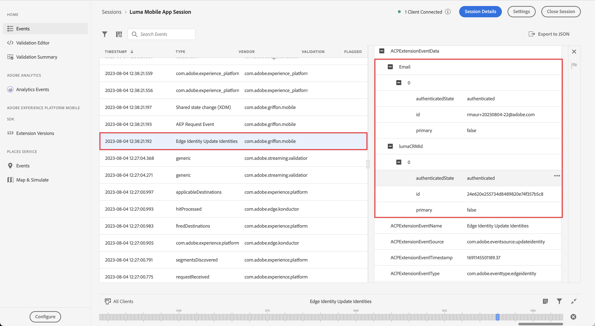

# Samla in identitetsdata

Lär dig hur du samlar in identitetsdata i en mobilapp.

Adobe Experience Platform identitetstjänst hjälper er att få en bättre bild av era kunder och deras beteenden genom att överbrygga identiteter mellan olika enheter och system, så att ni kan leverera slagkraftiga, personliga digitala upplevelser i realtid. Identitetsfält och namnutrymmen är den kombination som förenar olika datakällor för att skapa en 360-graders kundprofil i realtid.

Läs mer om [Identitetstillägg](https://developer.adobe.com/client-sdks/documentation/identity-for-edge-network/) och [identitetstjänst](https://experienceleague.adobe.com/docs/experience-platform/identity/home.html?lang=sv) i dokumentationen.

## Förutsättningar

* App med SDK:er har installerats och konfigurerats.

## Utbildningsmål

I den här lektionen kommer du att:

* Konfigurera ett anpassat ID-namnutrymme.
* Uppdatera identiteter.
* Validera identitetsdiagrammet.
* Hämta ECID och andra identiteter.


## Konfigurera ett anpassat ID-namnutrymme

Identitetsnamnutrymmen är komponenter i [Identitetstjänst](https://experienceleague.adobe.com/docs/experience-platform/identity/home.html?lang=en) som fungerar som indikatorer för det sammanhang som en identitet hör till. De skiljer till exempel på värdet `name@email.com` som e-postadress eller `443522` som ett numeriskt CRM-ID.

>[!NOTE]
>
>Mobile SDK genererar en unik identitet i sitt eget namnutrymme med namnet Experience Cloud ID (ECID) när programmet installeras. Detta ECID lagras i beständigt minne på den mobila enheten och skickas med varje träff. ECID tas bort när användaren avinstallerar programmet eller när användaren ställer in den globala sekretessstatusen för Mobile SDK på avanmälan. I exempelappen Luma bör du ta bort och installera om appen för att skapa en ny profil med ett eget unikt ECID.


Så här skapar du ett nytt identitetsnamnutrymme:

1. I gränssnittet för datainsamling väljer du **[!UICONTROL Identiteter]** från vänster-rälsnavigering.
1. Välj **[!UICONTROL Skapa namnutrymme för identitet]**.
1. Ange en **[!UICONTROL Visningsnamn]** av `Luma CRM ID` och **[!UICONTROL Identitetssymbol]** värde för `lumaCRMId`.
1. Välj **[!UICONTROL Enhetsoberoende ID]**.
1. Välj **[!UICONTROL Skapa]**.

   


## Uppdatera identiteter

Du vill uppdatera både standardidentiteten (e-post) och den anpassade identiteten (Luma CRM ID) när användaren loggar in i programmet.

1. Navigera till **[!DNL Luma]** > **[!DNL Luma]** > **[!DNL Utils]** > **[!UICONTROL MobileSDK]** i Xcode Project navigator och hitta `func updateIdentities(emailAddress: String, crmId: String)` funktionsimplementering. Lägg till följande kod i funktionen.

   ```swift
   // Set up identity map, add identities to map and update identities
   let identityMap: IdentityMap = IdentityMap()
   
   let emailIdentity = IdentityItem(id: emailAddress, authenticatedState: AuthenticatedState.authenticated)
   let crmIdentity = IdentityItem(id: crmId, authenticatedState: AuthenticatedState.authenticated)
   identityMap.add(item:emailIdentity, withNamespace: "Email")
   identityMap.add(item: crmIdentity, withNamespace: "lumaCRMId")
   
   Identity.updateIdentities(with: identityMap)
   ```

   Den här koden:

   1. Skapar en tom `IdentityMap` -objekt.

      ```swift
      let identityMap: IdentityMap = IdentityMap()
      ```

   1. Inställningar `IdentityItem` objekt för e-post och CRM-ID.

      ```swift
      let emailIdentity = IdentityItem(id: emailAddress, authenticatedState: AuthenticatedState.authenticated)
      let crmIdentity = IdentityItem(id: crmId, authenticatedState: AuthenticatedState.authenticated)
      ```

   1. Lägger till dessa `IdentityItem` objekt till `IdentityMap` -objekt.

      ```swift
      identityMap.add(item:emailIdentity, withNamespace: "Email")
      identityMap.add(item: crmIdentity, withNamespace: "lumaCRMId")
      ```

   1. Skickar `IdentityItem` objektet som en del av `Identity.updateIdentities` API-anrop till Edge Network.

      ```swift
      Identity.updateIdentities(with: identityMap) 
      ```

1. Navigera till **[!DNL Luma]** > **[!DNL Luma]** > **[!DNL Views]** > **[!DNL General]** > **[!UICONTROL LoginSheet]** i Xcode Project navigator och hitta koden som ska köras när du väljer **[!UICONTROL Inloggning]** -knappen. Lägg till följande kod:

   ```swift
   // Update identities
   MobileSDK.shared.updateIdentities(emailAddress: currentEmailId, crmId: currentCRMId)                             
   ```


>[!NOTE]
>
>Du kan skicka flera identiteter i en enda `updateIdentities` ring. Du kan också ändra identiteter som du tidigare skickat.


## Ta bort en identitet

Du kan använda [`Identity.removeIdentity`](https://developer.adobe.com/client-sdks/documentation/identity-for-edge-network/api-reference/#removeidentity) API för att ta bort identiteten från den lagrade identitetskartan på klientsidan. Identitetstillägget slutar skicka identifieraren till Edge Network. Om du använder detta API tas inte identifieraren bort från serversidans identitetsdiagram. Se [Visa identitetsdiagram](https://experienceleague.adobe.com/docs/platform-learn/tutorials/identities/view-identity-graphs.html?lang=en) om du vill ha mer information om identitetsdiagram.

1. Navigera till **[!DNL Luma]** > **[!DNL Luma]** > **[!DNL Utils]** > **[!UICONTROL MobileSDK]** i Xcode Project navigator och lägg till följande kod i `func removeIdentities(emailAddress: String, crmId: String)` funktion:

   ```swift
   // Remove identities and reset email and CRM Id to their defaults
   Identity.removeIdentity(item: IdentityItem(id: emailAddress), withNamespace: "Email")
   Identity.removeIdentity(item: IdentityItem(id: crmId), withNamespace: "lumaCRMId")
   currentEmailId = "testUser@gmail.com"
   currentCRMId = "112ca06ed53d3db37e4cea49cc45b71e"
   ```

1. Navigera till **[!DNL Luma]** > **[!DNL Luma]** > **[!DNL Views]** > **[!DNL General]** > **[!UICONTROL LoginSheet]** i Xcode Project navigator och hitta koden som ska köras när du väljer **[!UICONTROL Utloggning]** -knappen. Lägg till följande kod:

   ```swift
   // Remove identities
   MobileSDK.shared.removeIdentities(emailAddress: currentEmailId, crmId: currentCRMId)                  
   ```


## Validera med Assurance

1. Granska [installationsanvisningar](assurance.md#connecting-to-a-session) för att ansluta simulatorn eller enheten till Assurance.
1. I Luma-appen
   1. Välj **[!UICONTROL Startsida]** och flytta Assurance-ikonen till vänster.
   1. Markera  ikonen längst upp till höger.

      

   1. Ange en e-postadress och ett CRM-ID, eller
   1. Välj  till slumpmässigt generera en **[!UICONTROL E-post]** och **[!UICONTROL CRM-ID]**.
   1. Välj **[!UICONTROL Inloggning]**.

      


1. Leta i webbgränssnittet för Assurance efter **[!UICONTROL Edge Identity Update Identities]** -händelsen från **[!UICONTROL com.adobe.griffon.mobile]** leverantör.
1. Markera händelsen och granska data i **[!UICONTROL ACPExtensionEventData]** -objekt. Du bör se de identiteter som du har uppdaterat.
   

## Validera med identitetsdiagram

När du är klar med stegen i [Experience Platform lektion](platform.md)kan du bekräfta identitetsfångsten i visningsprogrammet för plattformsidentitetsdiagram:

1. Välj **[!UICONTROL Identiteter]** i användargränssnittet för datainsamling.
1. Välj **[!UICONTROL Identitetsdiagram]** i det övre fältet.
1. Retur `Luma CRM ID` som **[!UICONTROL Namnutrymme för identitet]** och ditt CRM-ID (till exempel `24e620e255734d8489820e74f357b5c8`) som **[!UICONTROL Identitetsvärde]**.
1. Du ser **[!UICONTROL Identiteter]** listas.

   

>[!INFO]
>
>Det finns ingen kod i programmet för att återställa ECID, vilket betyder att du bara kan återställa ECID (och effektivt skapa en ny profil med ett nytt ECID) genom en avinstallation och ominstallation av programmet. Information om hur du implementerar återställning av identifierare finns i [`Identity.resetIdentities`](https://developer.adobe.com/client-sdks/documentation/mobile-core/identity/api-reference/#resetidentities) och [`MobileCore.resetIdentities`](https://developer.adobe.com/client-sdks/documentation/mobile-core/api-reference/#resetidentities) API-anrop. Tänk dock på detta när du använder en push-meddelandeidentifierare (se [Skicka push-meddelanden](journey-optimizer-push.md)) blir den identifieraren en annan &#39;klisteristidentifierare&#39; på enheten.


>[!SUCCESS]
>
>Du har nu konfigurerat din app för att uppdatera identiteter i Edge Network och (när den har konfigurerats) med Adobe Experience Platform.
>
>Tack för att du lade ned din tid på att lära dig om Adobe Experience Platform Mobile SDK. Om du har frågor, vill dela allmän feedback eller har förslag på framtida innehåll kan du dela dem om detta [Experience League diskussionsinlägg](https://experienceleaguecommunities.adobe.com/t5/adobe-experience-platform-data/tutorial-discussion-implement-adobe-experience-cloud-in-mobile/td-p/443796)

Nästa: **[Samla in profildata](profile.md)**
