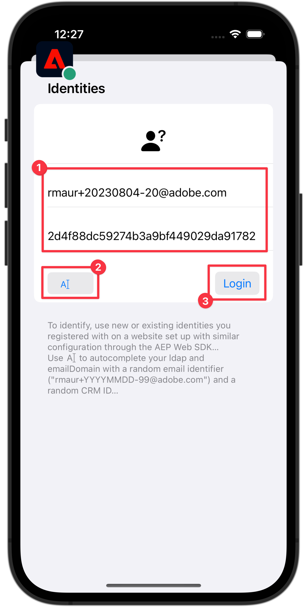

# Samla in identitetsdata

Lär dig hur du samlar in identitetsdata i en mobilapp.

Adobe Experience Platform identitetstjänst hjälper er att få en bättre bild av era kunder och deras beteenden. Tjänsterna överbryggar identiteterna mellan olika enheter och system och gör att ni kan leverera slagkraftiga, personliga digitala upplevelser i realtid. Identitetsfält och namnutrymmen är den kombination som förenar olika datakällor för att skapa en 360-graders kundprofil i realtid.

Läs mer om [identitetstillägget](https://developer.adobe.com/client-sdks/documentation/identity-for-edge-network/) och [identitetstjänsten](https://experienceleague.adobe.com/en/docs/experience-platform/identity/home) i dokumentationen.

## Förhandskrav

* App med SDK:er har installerats och konfigurerats.

## Utbildningsmål

I den här lektionen kommer du att:

* Konfigurera ett anpassat ID-namnutrymme.
* Uppdatera identiteter.
* Validera identitetsdiagrammet.
* Hämta ECID och andra identiteter.


## Konfigurera ett anpassat ID-namnutrymme

Identitetsnamnutrymmen är komponenter i [identitetstjänsten](https://experienceleague.adobe.com/en/docs/experience-platform/identity/home) som fungerar som indikatorer för det sammanhang som en identitet relateras till. De särskiljer till exempel värdet `name@email.com` som en e-postadress eller `443522` som ett numeriskt CRM-ID.

>[!NOTE]
>
>Mobile SDK genererar en unik identitet i sitt eget namnutrymme med namnet Experience Cloud ID (ECID) när appen installeras. Detta ECID lagras i beständigt minne på den mobila enheten och skickas med varje träff. ECID tas bort när användaren avinstallerar programmet eller när användaren anger Mobile SDK globala sekretessstatus som avanmälan. I exempelappen Luma bör du ta bort och installera om appen för att skapa en ny profil med ett eget unikt ECID.


Så här skapar du ett nytt identitetsnamnutrymme:

1. I gränssnittet för datainsamling väljer du **[!UICONTROL Identities]** i navigeringen till vänster.
1. Välj **[!UICONTROL Create identity namespace]**.
1. Ange **[!UICONTROL Display name]** av `Luma CRM ID` och **[!UICONTROL Identity symbol]** värdet `lumaCRMId`.
1. Välj **[!UICONTROL Cross-device ID]**.
1. Välj **[!UICONTROL Create]**.

   {zoomable="yes"}


## Uppdatera identiteter

Du vill uppdatera både standardidentiteten (e-post) och den anpassade identiteten (Luma CRM ID) när användaren loggar in i programmet.

>[!BEGINTABS]

>[!TAB iOS]

1. Navigera till **[!DNL Luma]** > **[!DNL Luma]** > **[!DNL Utils]** > **[!UICONTROL MobileSDK]** i Xcode-projektnavigeraren och hitta `func updateIdentities(emailAddress: String, crmId: String)`-funktionsimplementeringen. Lägg till följande kod i funktionen.

   ```swift
   // Set up identity map, add identities to map and update identities
   let identityMap: IdentityMap = IdentityMap()
   
   let emailIdentity = IdentityItem(id: emailAddress, authenticatedState: AuthenticatedState.authenticated)
   let crmIdentity = IdentityItem(id: crmId, authenticatedState: AuthenticatedState.authenticated)
   identityMap.add(item:emailIdentity, withNamespace: "Email")
   identityMap.add(item: crmIdentity, withNamespace: "lumaCRMId")
   
   Identity.updateIdentities(with: identityMap)
   ```

   Den här koden:

   1. Skapar ett tomt `IdentityMap`-objekt.

      ```swift
      let identityMap: IdentityMap = IdentityMap()
      ```

   1. Ställer in `IdentityItem` objekt för e-post och CRM-ID.

      ```swift
      let emailIdentity = IdentityItem(id: emailAddress, authenticatedState: AuthenticatedState.authenticated)
      let crmIdentity = IdentityItem(id: crmId, authenticatedState: AuthenticatedState.authenticated)
      ```

   1. Lägger till dessa `IdentityItem`-objekt i `IdentityMap`-objektet.

      ```swift
      identityMap.add(item:emailIdentity, withNamespace: "Email")
      identityMap.add(item: crmIdentity, withNamespace: "lumaCRMId")
      ```

   1. Skickar `IdentityItem`-objektet som en del av `Identity.updateIdentities` API-anropet till Edge Network.

      ```swift
      Identity.updateIdentities(with: identityMap) 
      ```

1. Navigera till **[!DNL Luma]** > **[!DNL Luma]** > **[!DNL Views]** > **[!DNL General]** > **[!UICONTROL LoginSheet]** i Xcode-projektnavigeraren och sök efter koden som ska köras när du väljer knappen **[!UICONTROL Login]**. Lägg till följande kod:

   ```swift
   // Update identities
   MobileSDK.shared.updateIdentities(emailAddress: currentEmailId, crmId: currentCRMId)                             
   ```


>[!TAB Android]

1. Navigera till **[!UICONTROL Android]**  > **[!DNL app]** > **[!DNL kotlin+java]** > **[!DNL com.adobe.luma.tutorial.android]** > **[!UICONTROL models]** > **[!UICONTROL MobileSDK]** i Android Studio-navigatören och hitta `fun updateIdentities(emailAddress: String, crmId: String) ` -funktionsimplementeringen. Lägg till följande kod i funktionen.

   ```kotlin
   // Set up identity map, add identities to map and update identities
   val identityMap = IdentityMap()
   
   val emailIdentity = IdentityItem(emailAddress, AuthenticatedState.AUTHENTICATED, true)
   val crmIdentity = IdentityItem(crmId, AuthenticatedState.AUTHENTICATED, true)
   identityMap.addItem(emailIdentity, "Email")
   identityMap.addItem(crmIdentity, "lumaCRMId")
   
   Identity.updateIdentities(identityMap)
   ```

   Den här koden:

   1. Skapar ett tomt `IdentityMap`-objekt.

      ```kotlin
      val identityMap = IdentityMap()
      ```

   1. Ställer in `IdentityItem` objekt för e-post och CRM-ID.

      ```kotlin
      val emailIdentity = IdentityItem(emailAddress, AuthenticatedState.AUTHENTICATED, true)
      val crmIdentity = IdentityItem(crmId, AuthenticatedState.AUTHENTICATED, true)
      ```

   1. Lägger till dessa `IdentityItem`-objekt i `IdentityMap`-objektet.

      ```kotlin
      identityMap.addItem(emailIdentity, "Email")
      identityMap.addItem(crmIdentity, "lumaCRMId")
      ```

   1. Skickar `IdentityItem`-objektet som en del av `Identity.updateIdentities` API-anropet till Edge Network.

      ```kotlin
      Identity.updateIdentities(identityMap)
      ```

1. Navigera till **[!UICONTROL Android]**  > **[!DNL app]** > **[!DNL kotlin+java]** > **[!DNL com.adobe.luma.tutorial.android]** > **[!UICONTROL views]** > **[!UICONTROL LoginSheet.kt]** i Android Studio-navigatorn och leta reda på koden som ska köras när du väljer knappen **[!UICONTROL Login]** . Lägg till följande kod:

   ```kotlin
   // Update identities
   MobileSDK.shared.updateIdentities(
      MobileSDK.shared.currentEmailId.value,
      MobileSDK.shared.currentCRMId.value
   )                             
   ```


>[!ENDTABS]


>[!NOTE]
>
>Du kan skicka flera identiteter i ett enda `updateIdentities`-samtal. Du kan också ändra identiteter som du tidigare skickat.


## Ta bort en identitet

Du kan använda API:t [`Identity.removeIdentity`](https://developer.adobe.com/client-sdks/documentation/identity-for-edge-network/api-reference/#removeidentity) för att ta bort identiteten från den lagrade identitetskartan på klientsidan. Identitetstillägget slutar skicka identifieraren till Edge Network. Om du använder detta API tas inte identifieraren bort från serversidans identitetsdiagram. Mer information om identitetsdiagram finns i [Visa identitetsdiagram](https://experienceleague.adobe.com/en/docs/platform-learn/tutorials/identities/view-identity-graphs).


>[!BEGINTABS]

>[!TAB iOS]

1. Navigera till **[!DNL Luma]** > **[!DNL Luma]** > **[!DNL Utils]** > **[!UICONTROL MobileSDK]** i Xcode Project-navigatorn och lägg till följande kod i funktionen `func removeIdentities(emailAddress: String, crmId: String)`:

   ```swift
   // Remove identities and reset email and CRM Id to their defaults
   Identity.removeIdentity(item: IdentityItem(id: emailAddress), withNamespace: "Email")
   Identity.removeIdentity(item: IdentityItem(id: crmId), withNamespace: "lumaCRMId")
   currentEmailId = "testUser@gmail.com"
   currentCRMId = "b642b4217b34b1e8d3bd915fc65c4452"
   ```

1. Navigera till **[!DNL Luma]** > **[!DNL Luma]** > **[!DNL Views]** > **[!DNL General]** > **[!UICONTROL LoginSheet]** i Xcode-projektnavigeraren och sök efter koden som ska köras när du väljer knappen **[!UICONTROL Logout]**. Lägg till följande kod:

   ```swift
   // Remove identities
   MobileSDK.shared.removeIdentities(emailAddress: currentEmailId, crmId: currentCRMId)                  
   ```

>[!TAB Android]

1. Navigera till **[!UICONTROL Android]**  > **[!DNL app]** > **[!DNL kotlin+java]** > **[!DNL com.adobe.luma.tutorial.android]** > **[!UICONTROL models]** > **[!UICONTROL MobileSDK]** i Android Studio-navigatorn och lägg till följande kod i funktionen `fun removeIdentities(emailAddress: String, crmId: String)`:

   ```kotlin
   // Remove identities and reset email and CRM Id to their defaults
   Identity.removeIdentity(IdentityItem(emailAddress), "Email")
   Identity.removeIdentity(IdentityItem(crmId), "lumaCRMId")
   currentEmailId.value = "testUser@gmail.com"
   currentCRMId.value = "112ca06ed53d3db37e4cea49cc45b71e"
   ```

&#x200B;1. Navigera till **[!DNL app]** > **[!DNL kotlin+java]** > **[!DNL com.adobe.luma.tutorial.android]** > **[!UICONTROL views]** > **[!UICONTROL LoginSheet.kt]** i Android Studio-navigatorn och leta reda på koden som ska köras när du väljer knappen **[!UICONTROL Logout]**. Lägg till följande kod:

```kotlin
// Remove identities
MobileSDK.shared.removeIdentities(
   MobileSDK.shared.currentEmailId.value,
   MobileSDK.shared.currentCRMId.value
)              
```


>[!ENDTABS]

## Validera med Assurance

1. Granska avsnittet [installationsanvisningar](assurance.md#connecting-to-a-session) för att ansluta simulatorn eller enheten till Assurance.
1. I Luma-appen
   1. Markera fliken **[!UICONTROL Home]** och flytta Assurance-ikonen åt vänster.
   1. Välj ikonen  i det övre högra hörnet.

>[!BEGINTABS]

>[!TAB iOS]


>[!TAB Android]


>[!ENDTABS]

På skärmen **[!UICONTROL Identities]**:

1. Ange en e-postadress och ett CRM-ID, eller
1. Välj **[!UICONTROL A |]** (iOS) eller **[!UICONTROL Generate Random Email]** (Android) om du vill generera en slumpmässig **[!UICONTROL Email]** och **[!UICONTROL CRM ID]**.
1. Välj **[!UICONTROL Login]**.

>[!BEGINTABS]

>[!TAB iOS]



>[!TAB Android]


>[!ENDTABS]

I Assurance:

1. Kontrollera Assurance webbgränssnitt för händelsen **[!UICONTROL Edge Identity Update Identities]** från leverantören **[!UICONTROL com.adobe.griffon.mobile]**.
1. Markera händelsen och granska data i objektet **[!UICONTROL ACPExtensionEventData]**. Du bör se de identiteter som du har uppdaterat.
   {zoomable="yes"}

## Validera med identitetsdiagram

När du har slutfört stegen i [Experience Platform-lektionen](platform.md) kan du bekräfta identitetsfångsten i visningsprogrammet för Experience Platform-identitetsdiagram:

1. Välj **[!UICONTROL Identities]** i användargränssnittet för datainsamling.
1. Välj **[!UICONTROL Identity Graph]** i det övre fältet.
1. Ange `Luma CRM ID` som **[!UICONTROL Identity namespace]** och ditt CRM-ID (till exempel `24e620e255734d8489820e74f357b5c8`) som **[!UICONTROL Identity value]**.
1. **[!UICONTROL Identities]** visas.

   {zoomable="yes"}

>[!INFO]
>
>Det finns ingen kod i programmet som kan återställa ECID. Du kan bara återställa ECID (och effektivt skapa en ny profil med ett nytt ECID) genom en avinstallation och en ominstallation av programmet. Information om hur du implementerar återställningen av identifierare finns i API-anropen för [`Identity.resetIdentities`](https://developer.adobe.com/client-sdks/documentation/mobile-core/identity/api-reference/#resetidentities) och [`MobileCore.resetIdentities`](https://developer.adobe.com/client-sdks/documentation/mobile-core/api-reference/#resetidentities). Tänk på att när du använder en identifierare för push-meddelanden (se [Skicka push-meddelanden](journey-optimizer-push.md)) blir den identifieraren en annan profilidentifierare för push-meddelanden på enheten.


>[!SUCCESS]
>
>Du har nu konfigurerat din app för att uppdatera identiteter i Edge Network och (när du konfigurerar den) med Adobe Experience Platform.
>
>Tack för att du har lagt ned din tid på att lära dig om Adobe Experience Platform Mobile SDK. Om du har frågor, vill dela allmän feedback eller har förslag på framtida innehåll kan du dela dem i det här [Experience League Community-diskussionsinlägget](https://experienceleaguecommunities.adobe.com/t5/adobe-experience-platform-data/tutorial-discussion-implement-adobe-experience-cloud-in-mobile/td-p/443796)

Nästa: **[Samla in profildata](profile.md)**
