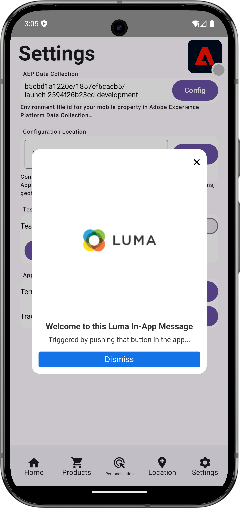

# Skapa och skicka meddelanden i appen

Lär dig skapa meddelanden i appen för mobilappar med Experience Platform Mobile SDK och Journey Optimizer.

Med Journey Optimizer kan ni skapa kampanjer för att skicka meddelanden i appen till riktade målgrupper. Kampanjer i Journey Optimizer används för att leverera engångsinnehåll till en viss målgrupp via olika kanaler. Med kampanjer utförs åtgärder samtidigt, antingen omedelbart eller baserat på ett angivet schema. När du använder resor (se lektionen [Journey Optimizer push-meddelanden](journey-optimizer-push.md)) utförs åtgärder i sekvens.

{zoomable="yes"}

Innan du skickar meddelanden i appen med Journey Optimizer måste du se till att rätt konfigurationer och integreringar finns på plats. Mer information om dataflödet för meddelanden i programmet i Journey Optimizer finns i [dokumentationen](https://experienceleague.adobe.com/sv/docs/journey-optimizer/using/in-app/inapp-configuration).

>[!NOTE]
>
>Den här lektionen är valfri och gäller endast för Journey Optimizer-användare som vill skicka meddelanden i appen.


## Förhandskrav

* App med SDK:er har installerats och konfigurerats.
* Konfigurera appen för Adobe Experience Platform.
* Åtkomst till Journey Optimizer och [tillräcklig behörighet för push-meddelanden](https://experienceleague.adobe.com/sv/docs/journey-optimizer/using/push/push-config/push-configuration). Du behöver även tillräcklig behörighet för följande Journey Optimizer-funktioner.
   * Hantera kampanjer.
* Fysisk iOS-enhet eller simulator för testning.


## Utbildningsmål

I den här lektionen ska du

* Skapa en kanalkonfiguration i Journey Optimizer.
* Installera och konfigurera taggtillägget för Journey Optimizer.
* Uppdatera appen för att registrera Journey Optimizer-taggtillägget.
* Validera konfigurationen i Assurance.
* Definiera er egen kampanj och upplevelse av meddelanden i appen i Journey Optimizer.
* Skicka ditt eget meddelande i appen inifrån appen.

## Inställningar

>[!TIP]
>
>Om du redan har konfigurerat din miljö som en del av [Journey Optimizer push messaging](journey-optimizer-push.md) -lektionen kanske du redan har utfört några av stegen i det här installationsavsnittet.


### Skapa en kanalkonfiguration

Till att börja med måste du skapa en kanalkonfiguration som gör att du kan skicka meddelanden från Journey Optimizer i appmeddelanden.

1. Öppna menyn **[!UICONTROL Channels]** > **[!UICONTROL General settings]** > **[!UICONTROL Channel configurations]** i Journey Optimizer-gränssnittet och välj sedan **[!UICONTROL Create channel configuration]**.

1. Ange ett namn och en beskrivning (valfritt) för konfigurationen. Till exempel `LumaInAppMessaging` och `Channel for in-app messaging`.

   >[!NOTE]
   >
   > Namn måste börja med en bokstav (A-Z). Det får bara innehålla alfanumeriska tecken. Du kan också använda understreck `_`, punkt `.` och bindestreck `-`.

1. Om du vill tilldela anpassade eller grundläggande dataanvändningsetiketter till konfigurationen kan du välja **[!UICONTROL Manage access]**. [Läs mer om OLAC (Object Level Access Control)](https://experienceleague.adobe.com/sv/docs/journey-optimizer/using/access-control/object-based-access).

1. Välj kanalen **Meddelanden i appen**.

1. Välj **[!UICONTROL Marketing action]** om du vill associera medgivandeprinciper med de meddelanden som använder den här konfigurationen. Alla profiler för samtycke som är kopplade till marknadsföringsåtgärden används för att ta hänsyn till kundernas önskemål. [Läs mer om marknadsföringsåtgärder](https://experienceleague.adobe.com/sv/docs/journey-optimizer/using/privacy/consent/consent#surface-marketing-actions). Till exempel: Push Targeting.

1. Välj den plattform som du vill definiera inställningarna för. Med den här inställningen kan du ange målappen för varje plattform och säkerställa enhetlig innehållsleverans på flera plattformar.

   >[!NOTE]
   >
   >För iOS- och Android-plattformar baseras leveransen enbart på program-ID:t. Om båda apparna har samma program-ID levereras innehåll till båda, oavsett vilken plattform som valts i **[!UICONTROL Channel configuration]**.

1. Ange app-id:n för den plattform som du vill ha stöd för.

   {zoomable="yes"}

1. Välj **[!UICONTROL Submit]** om du vill spara ändringarna.

### Uppdatera datastream-konfiguration

Uppdatera Experience Edge-konfigurationen för att se till att data som skickas från din mobilapp till Edge Network vidarebefordras till Journey Optimizer.


1. I användargränssnittet för datainsamling väljer du **[!UICONTROL Datastreams]** och markerar ditt datastream, till exempel **[!DNL Luma Mobile App]**.
1. Välj  för **[!UICONTROL Experience Platform]** och välj  **[!UICONTROL Edit]** på snabbmenyn.
1. Kontrollera att **[!UICONTROL Datastreams]** är markerat på skärmen Mapp **[!UICONTROL Adobe Experience Platform]** > **[!UICONTROL Adobe Journey Optimizer]**. Mer information finns i [Adobe Experience Platform-inställningar](https://experienceleague.adobe.com/sv/docs/experience-platform/datastreams/configure).
1. Välj **[!UICONTROL Save]** om du vill spara dataströmskonfigurationen.


   {zoomable="yes"}


### Installera tillägget Journey Optimizer-taggar

För att din app ska fungera med Journey Optimizer måste du uppdatera din taggegenskap.

1. Navigera till **[!UICONTROL Tags]** > **[!UICONTROL Extensions]** > **[!UICONTROL Catalog]**.
1. Öppna din egenskap, till exempel **[!DNL Luma Mobile App Tutorial]**.
1. Välj **[!UICONTROL Catalog]**.
1. Sök efter tillägget **[!UICONTROL Adobe Journey Optimizer]**.
1. Installera tillägget.

När *endast* använder meddelanden i appen i **[!UICONTROL Install Extension]** eller **[!UICONTROL Configure Extension]** behöver du inte konfigurera någonting. Om du redan har följt lektionen [Push-meddelanden](journey-optimizer-push.md) i självstudiekursen ser du att **[!UICONTROL Development]**-datauppsättningen har valts i listan **[!UICONTROL AJO Push Tracking Experience Event Dataset]** för **[!UICONTROL Event Dataset]** -miljön.


### Implementera Journey Optimizer i appen

Som tidigare nämnts tillhandahåller installation av ett mobiltaggtillägg bara konfigurationen. Därefter måste du installera och registrera Messaging SDK. Om de här stegen inte är tydliga går du igenom avsnittet [Installera SDK](install-sdks.md).

>[!NOTE]
>
>Om du har slutfört avsnittet [Installera SDK:er](install-sdks.md) är SDK redan installerat och du kan hoppa över det här steget.
>

>[!BEGINTABS]

>[!TAB iOS]

1. Kontrollera att [AEP Messaging](https://github.com/adobe/aepsdk-messaging-ios) har lagts till i listan över paket i paketberoenden i Xcode. Se [Hanteraren för wift-paket](install-sdks.md#swift-package-manager).
1. Navigera till **[!DNL Luma]** > **[!DNL Luma]** > **[!UICONTROL AppDelegate]** i Xcode Project-navigatorn.
1. Se till att `AEPMessaging` ingår i din lista över importer.

   `import AEPMessaging`

1. Kontrollera att `Messaging.self` är en del av den array med tillägg som du registrerar.

   ```swift
   let extensions = [
       AEPIdentity.Identity.self,
       Lifecycle.self,
       Signal.self,
       Edge.self,
       AEPEdgeIdentity.Identity.self,
       Consent.self,
       UserProfile.self,
       Places.self,
       Messaging.self,
       Optimize.self,
       Assurance.self
   ]
   ```

>[!TAB Android]

1. I Android Studio kontrollerar du att [aepsdk-messaging-android](https://github.com/adobe/aepsdk-messaging-android) är en del av beroendena i **[!UICONTROL build.gradle.kts]** i **[!UICONTROL Android]**  > **[!UICONTROL Gradle Scripts]**. Se [Gradle](install-sdks.md#gradle).
1. Navigera till **[!UICONTROL Android]**  **[!DNL app]** > **[!DNL kotlin+java]** > **[!UICONTROL com.adobe.luma.tutorial.android]** > **[!UICONTROL LumaApplication]** i projektnavigeraren i Android Studio.
1. Se till att `com.adobe.marketing.mobile.Messaging` ingår i din lista över importer.

   `import import com.adobe.marketing.mobile.Messaging`

1. Kontrollera att `Messaging.EXTENSION` är en del av den array med tillägg som du registrerar.

   ```kotlin
   val extensions = listOf(
       Identity.EXTENSION,
       Lifecycle.EXTENSION,
       Signal.EXTENSION,
       Edge.EXTENSION,
       Consent.EXTENSION,
       UserProfile.EXTENSION,
       Places.EXTENSION,
       Messaging.EXTENSION,
       Optimize.EXTENSION,
       Assurance.EXTENSION
   )
   ```

>[!ENDTABS]

## Validera installationen med Assurance

1. Granska avsnittet [installationsanvisningar](assurance.md#connecting-to-a-session) för att ansluta simulatorn eller enheten till Assurance.
1. I Assurance-gränssnittet väljer du **[!UICONTROL Configure]**.
   {zoomable="yes"}
1. Välj knappen  bredvid **[!UICONTROL In-App Messaging]**.
1. Välj **[!UICONTROL Save]**.
   {zoomable="yes"}
1. Välj **[!UICONTROL In-App Messaging]** i den vänstra navigeringen.
1. Klicka på fliken **[!UICONTROL Validation]**.  Bekräfta att inga fel visas.

   {zoomable="yes"}


## Skapa ett eget meddelande i appen

Om du vill skapa ett eget meddelande i appen måste du definiera en kampanj i Journey Optimizer som utlöser ett meddelande i appen baserat på händelser som inträffar. Dessa händelser kan vara:

* data som skickas till Adobe Experience Platform,
* viktiga spårningshändelser, som åtgärd, eller tillstånd eller insamling av PII-data, via de allmänna API:erna för Mobile Core,
* livscykelhändelser, som start, installation, uppgradering, stängning eller krasch,
* geopositioneringshändelser, som att ange eller avsluta en intressepunkt.

I den här självstudiekursen ska du använda de generiska och tilläggsoberoende API:erna för Mobile Core (se [Generiska API:er för Mobile Core](https://developer.adobe.com/client-sdks/documentation/mobile-core/#mobile-core-generic-apis)) för att underlätta händelsespårning av användarskärmar, åtgärder och PII-data. Händelser som genereras av dessa API:er publiceras till händelsehubben i SDK och kan användas av tillägg. SDK händelsehubb tillhandahåller den grundläggande datastruktur som är knuten till alla SDK-tillägg för mobilplattformen. Händelsehubben upprätthåller en lista över registrerade tillägg och interna moduler, en lista över registrerade händelseavlyssnare och en delad tillståndsdatabas.

SDK händelsehubb publicerar och tar emot händelsedata från registrerade tillägg för att förenkla integreringen med Adobe och tredjepartslösningar. När tillägget Optimera är installerat hanterar händelsehubben alla förfrågningar och interaktioner med erbjudandemotorn Journey Optimizer - Beslutshantering.

1. I Journey Optimizer-gränssnittet väljer du **[!UICONTROL Campaigns]** i den vänstra listen.
1. Välj **[!UICONTROL Create Campaign]**.
1. I dialogrutan **[!UICONTROL Create your campaign]** väljer du  **[!UICONTROL Scheduled - Marketing]** och sedan **[!UICONTROL Confirm]**.
1. På skärmen **[!UICONTROL Campaign - *ÅÅÅ-MM-DD HH:MM:SS UTC+XX:XX*]**:

   1. På fliken **[!UICONTROL Properties]**:

      1. Ange ett namn för kampanjen, till exempel `Luma Mobile In-App Campaign`.
      1. Du kan också lägga till en beskrivning.


   1. Klicka på fliken **[!UICONTROL Action]**.  

      1. Under **[!UICONTROL Show message if]** väljer du  **[!UICONTROL Add action]**. Välj **[!UICONTROL In-app message]** i listrutan.
      1. Välj din konfiguration i listrutan **[!UICONTROL In-app message configuration]**. Exempel: **[!UICONTROL LumaInAppMessaging]**.
      1. Välj  **[!UICONTROL Edit triggers]**.
      1. I dialogrutan **[!UICONTROL In-app message trigger]**:

         1. Välj **[!UICONTROL Application launch]** och välj **[!UICONTROL Track action]** i listrutan.
         1. Välj  **[!UICONTROL Add condition]**.
         1. Välj **[!UICONTROL Action]** och **[!UICONTROL equals]** i listrutorna.
         1. Ange `in-app`.
         1. Välj  **[!UICONTROL Add condition]**.
         1. Välj **[!UICONTROL Context data]** i listrutan och ange `showMessage`.
         1. Välj **[!UICONTROL equals]** i listrutan och ange `true`.

            {zoomable="yes"}
         1. Välj **[!UICONTROL Done]**.

   1. Gå tillbaka till huvudskärmen för kampanjdefinition och välj fliken **[!UICONTROL Content]**.

      1. Aktivera **[!UICONTROL Advanced formatting]**.
      1. Välj **[!UICONTROL Modal]** som **[!UICONTROL Messaging layout]**. Välj **[!UICONTROL Switch layout]** i dialogrutan **[!UICONTROL Change layout]**.
      1. På fliken **[!UICONTROL Content]**.
         1. Ange `https://luma.enablementadobe.com/content/dam/luma/en/logos/Luma_Logo.png` som **[!UICONTROL Media URL]**.
         1. Ange en **[!UICONTROL Header]**, till exempel `Welcome to this Luma In-App Message`, och ange en **[!UICONTROL Body]**, till exempel `Triggered by pushing that button in the app...`.

         {zoomable="yes"}

      1. Välj fliken **[!UICONTROL Settings]**.
         1. Välj **[!UICONTROL Customize size]** i **[!UICONTROL Message]**.
         1. Inaktivera **[!UICONTROL Fit to content]**.
         1. Ange **[!UICONTROL Height]** till **[!UICONTROL 75%]**.

         {zoomable="yes"}

1. Välj **[!UICONTROL Review to activate]**.  Om du vill redigera någon av konfigurationerna för **[!UICONTROL Content]**, **[!UICONTROL Properties]**, **[!UICONTROL Actions]** eller mer väljer du .
1. Välj **[!UICONTROL Review to activate (*på skärmen *kampanjnamn]**)**[!UICONTROL Activate]**.
1. Efter ett tag visas ditt **_kampanjnamn_** med status **[!UICONTROL Live]** i listan **[!UICONTROL Campaigns]**.
   {zoomable="yes"}


## Utlös meddelandet i appen

Du har alla ingredienser på plats för att skicka ett meddelande i appen. Det som återstår är hur du utlöser det här meddelandet i appen i din app.

>[!BEGINTABS]

>[!TAB iOS]

1. Gå till **[!DNL Luma]** > **[!DNL Luma]** > **[!DNL Utils]** > **[!UICONTROL MobileSDK]** i Xcode Project-navigatorn. Hitta funktionen `func sendTrackAction(action: String, data: [String: Any]?)` och lägg till följande kod som anropar funktionen [`MobileCore.track`](https://developer.adobe.com/client-sdks/documentation/mobile-core/api-reference/#trackaction) baserat på parametrarna `action` och `data`.


   ```swift
   // Send trackAction event
   MobileCore.track(action: action, data: data)
   ```

1. Gå till **[!DNL Luma]** > **[!DNL Luma]** > **[!DNL Views]** > **[!DNL General]** > **[!UICONTROL ConfigView]** i Xcode Project Navigator. Sök efter koden för knappen Meddelande i appen och lägg till följande kod:

   ```swift
   // Setting parameters and calling function to send in-app message
   Task {
       MobileSDK.shared.sendTrackAction(action: "in-app", data: ["showMessage": "true"])
   }
   ```

>[!TAB Android]

1. Gå till **[!UICONTROL Android]**  > **[!DNL app]** > **[!DNL kotlin+java]** > **[!DNL com.adobe.luma.tutorial.android]** > **[!DNL models]** > **[!UICONTROL MobileSDK]** i Android Studio-navigatorn. Hitta funktionen `fun sendTrackAction(action: String, data: Map<String, String>?)` och lägg till följande kod som anropar funktionen [`MobileCore.track`](https://developer.adobe.com/client-sdks/documentation/mobile-core/api-reference/#trackaction) baserat på parametrarna `action` och `data`.


   ```kotlin
   // Send trackAction event
   MobileCore.track(action, data)
   ```

1. Gå till **[!UICONTROL Android]**  > **[!DNL app]** > **[!DNL kotlin+java]** > **[!DNL com.adobe.luma.tutorial.androi]** > **[!DNL views]** > **[!UICONTROL ConfigView.kt]** i Android Studio-navigatorn. Hitta koden för hanterarknappen `onInAppMessageClick` och lägg till följande kod:

   ```kotlin
   // Setting parameters and calling function to send in-app message
   MobileSDK.shared.sendTrackAction(
       "in-app",
       mapOf("showMessage" to "true")
   )
   ```

>[!ENDTABS]

## Validera med din app

Du kan validera meddelandena i appen inifrån själva appen.

>[!BEGINTABS]

>[!TAB iOS]

1. Återskapa och kör appen i simulatorn eller på en fysisk enhet från Xcode med .

1. Gå till fliken **[!UICONTROL Settings]**.

1. Tryck på **[!UICONTROL In-App Message]**. Meddelandet visas i appen.

   


>[!TAB Android]

1. Återskapa och kör appen i simulatorn eller på en fysisk enhet från Android Studio med .

1. Gå till fliken **[!UICONTROL Settings]**.

1. Tryck på **[!UICONTROL In-App Message]**. Meddelandet visas i appen.

   


>[!ENDTABS]


## Validera implementering i Assurance

Du kan validera dina meddelanden i appen i Assurance-gränssnittet.

1. Granska avsnittet [installationsanvisningar](assurance.md#connecting-to-a-session) för att ansluta simulatorn eller enheten till Assurance.
1. Välj **[!UICONTROL In-App Messaging]**.
1. Välj **[!UICONTROL Event List]**.
1. Välj en **[!UICONTROL Display message]**-post.
1. Granska raw-händelsen, särskilt `html`, som innehåller den fullständiga layouten och innehållet i meddelandet i appen.
   {zoomable="yes"}


## Nästa steg

Nu bör du ha alla verktyg du behöver för att börja lägga till meddelanden i appen, där det är relevant och tillämpligt. Du kan till exempel marknadsföra produkter baserat på specifika interaktioner som du spårar i din app.

>[!SUCCESS]
>
>Du har aktiverat appen för meddelanden i appen och lagt till en meddelandekampanj i appen med Journey Optimizer och Journey Optimizer-tillägget för Experience Platform Mobile SDK.
>
>Tack för att du har lagt ned din tid på att lära dig om Adobe Experience Platform Mobile SDK. Om du har frågor, vill dela allmän feedback eller har förslag på framtida innehåll kan du dela dem i det här [Experience League Community-diskussionsinlägget](https://experienceleaguecommunities.adobe.com/t5/adobe-experience-platform-data/tutorial-discussion-implement-adobe-experience-cloud-in-mobile/td-p/443796?profile.language=sv).

Nästa: **[Skapa och visa erbjudanden](journey-optimizer-offers.md)**
